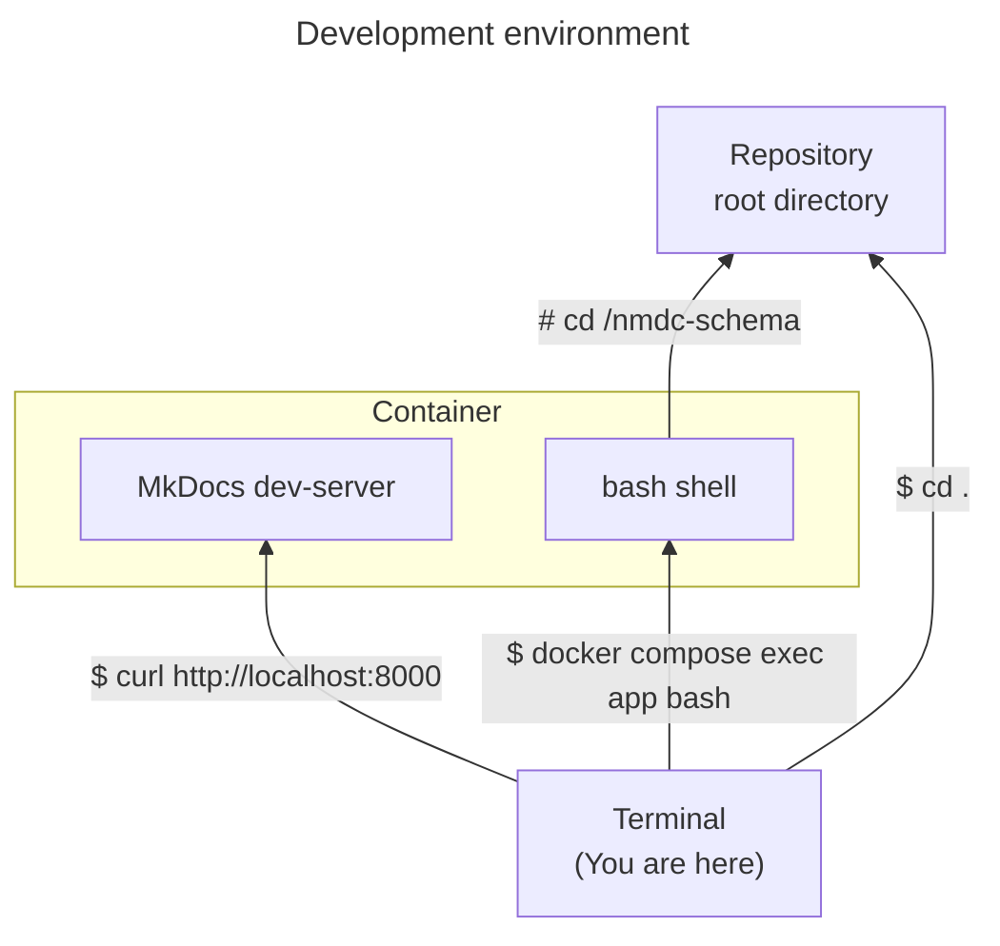

# Development

## Development environment

This repository includes a container-based development environment. That environment consists of a single container—running Linux—in which all the dependencies of this project are present (e.g. [OpenJDK](https://openjdk.org/), [Apache Jena](https://jena.apache.org/), [GNU make](https://www.gnu.org/software/make/manual/make.html), [yq](https://mikefarah.gitbook.io/yq/)).

Here's a diagram showing how a developer can access various parts of the development environment from a terminal running in the host environment (i.e. the environment _hosting_ the container). 



### Usage

Here's how you can instantiate the development environment on your computer.

#### Prerequisites

- [Docker](https://www.docker.com/products/docker-desktop/) is installed on your computer.
  - For example, version 24:
    ```shell
    $ docker --version
    Docker version 24.0.6, build ed223bc
    ```

#### Procedure

1. In the root folder of the repository, run the container.
   ```shell
   docker compose up --detach
   ```
   > The first time you run that, it will take several **minutes** to finish. During that time, Docker will be _building_ a container image. When you run the command in the future, Docker will reuse that container image (unless you append `--build`).
   >
   > **Troubleshooting tip:** If Docker shows an error message saying "port is already allocated"; then change the command to `DOCS_PORT=1234 docker compose up --detach` and re-run it (you can replace `1234` with any other port number between `1024`-`65535`, inclusive). You can try different port numbers until that error message stops appearing.
2. Connect to a bash shell running within the container.
   ```shell
   docker compose exec app bash
   ```
   > You can think of this as "`ssh`-ing" into a Linux system. In this case, the Linux system is a Docker container running on your computer, and you are using something other than `ssh` to communicate with it.
3. (Optional) Explore the container!
   ```shell
   $ whoami
   $ hostname
   $ uname -a
   # ...
   $ yq --version
   $ jena --version
   $ make --version
   $ python --version
   $ poetry --version
   $ ls /nmdc-schema
   ```
   > The root directory of the repository is mounted at `/nmdc-schema` within the container. Changes you make in that directory on your computer will show up within the container, and vice versa. 
4. (Optional) Generate the MkDocs docs.
   ```shell
   $ make gendoc
   ```
5. (Optional) Visit the MkDocs dev-server.
   - In your web browser, visit http://localhost:8000
     > Note: If you customized `DOCS_PORT` earlier, use that port number instead of `8000` here.
6. Use the container as your `nmdc-schema` development environment.
   ```shell
   $ poetry install
   $ make squeaky-clean
   $ poetry shell
   # etc.
   ```
7. (Optional) Done working on this project (e.g. for the day)? Stop the container.
   ```shell
   # (Optional) Disconnect from the container.
   $ exit
   
   # Stop the container.
   docker compose down
   ```
