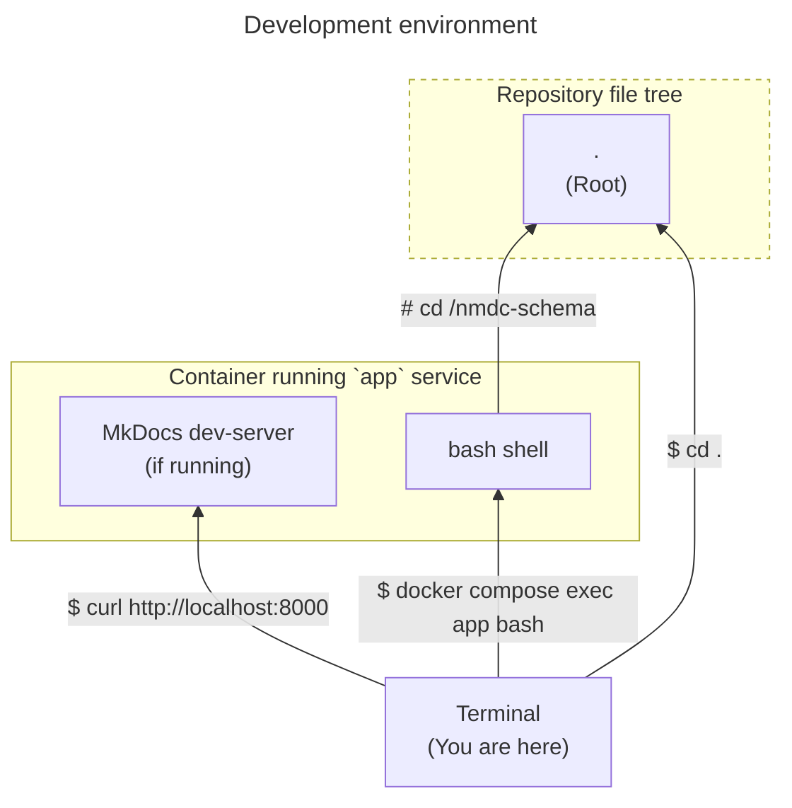

# Development

## Prerequisites

This project pins **Poetry 2.4.1** (CI installs `poetry==2.4.1` in every workflow; use the
same version locally). The `pyproject.toml` uses
[PEP 735 dependency groups](https://peps.python.org/pep-0735/) (`[dependency-groups]`). The
`poetry.lock` content-hash only tracks dependency-group changes from **Poetry 2.3.0 onward**
([poetry#10632](https://github.com/python-poetry/poetry/issues/10632)), so a poetry older than
that (or simply different from the version that wrote the lock) computes a different hash and
reports the lock as "out of sync with pyproject.toml" even when nothing changed. CI now runs
`poetry check`, so an unpinned/mismatched local poetry will also disagree with CI — align on
2.4.1. After editing `pyproject.toml`, run `poetry lock` (not `--regenerate` unless you intend
to bump versions) and commit the lock.

```shell
# Check your version
poetry --version

# Upgrade if needed
pipx upgrade poetry
```

> **Note:** This requirement only applies to developers working on the schema.
> Downstream users who `pip install nmdc-schema` are unaffected.

## Development environment

This repository includes a container-based development environment. That environment consists of a custom container—running Linux—in which all the dependencies of this project are present (e.g. [GNU make](https://www.gnu.org/software/make/manual/make.html), [yq](https://mikefarah.gitbook.io/yq/)).

Here's a diagram showing how a developer can access various parts of the development environment from a terminal running in the host environment (i.e. the environment _hosting_ the container). 


```mermaid
---
title: Development environment
---
graph BT
    host_terminal["Terminal<br>(You are here)"]
    
    subgraph app_container["Container running `app` service"]
        mkdocs_server["MkDocs dev-server<br>(if running)"]
        app_bash["bash shell"]
    end
    
    subgraph repo_file_tree["Repository file tree"]
        repo_root_dir[".<br>(Root)"]
    end
    style repo_file_tree stroke-dasharray: 4
    
    %% Links:
    host_terminal -- "$ curl http://localhost:8000" --> mkdocs_server
    host_terminal -- "$ docker compose exec app bash" --> app_bash
    app_bash -- "# cd /nmdc-schema" --> repo_root_dir
    host_terminal -- "$ cd ." --> repo_root_dir
```

> Note: The container can access the **host environment** using the [special hostname](https://docs.docker.com/desktop/networking/#i-want-to-connect-from-a-container-to-a-service-on-the-host), 
> `host.docker.internal`. In other words, anything you can access via `localhost` from within the host environment—for
> example, a MongoDB server or an SSH tunnel—you can access via `host.docker.internal` from within the container.

### Usage

Here's how you can instantiate the development environment on your computer.

#### Prerequisites

- [Docker](https://www.docker.com/products/docker-desktop/) is installed on your computer.
  - For example, version 24:
    ```shell
    $ docker --version
    Docker version 24.0.6, build ed223bc
    ```

#### Procedure

1. In the root folder of the repository, run the container.
   ```shell
   docker compose up --detach
   ```
   > The first time you run that, it will take several **minutes** to finish. During that time, 
   > Docker will be _building_ the container image for the custom container. 
   > When you run the command in the future, Docker will reuse that container image (unless you append `--build`).
   >
   > **Troubleshooting tip:** If Docker shows an error message saying "port is already allocated"; 
   > then change the command to `DOCS_PORT=1234 docker compose up --detach`
   > and re-run it (you can replace `1234` with any other port number between `1024`-`65535`, inclusive).
   > You can try different port numbers until that error message stops appearing.
2. Connect to a bash shell running within the container running the `app` service.
   ```shell
   docker compose exec app bash
   ```
   > You can think of this as "`ssh`-ing" into a Linux system. In this case, the Linux system is a Docker container 
   > running on your computer, and you are using something other than `ssh` to communicate with it.
3. (Optional) Explore that container!
   ```shell
   $ whoami
   $ hostname
   $ uname -a
   # ...
   $ yq --version
   $ make --version
   $ python --version
   $ poetry --version
   $ ls /nmdc-schema
   ```
   > The root directory of the repository is mounted at `/nmdc-schema` within that container.
   > Changes you make in that directory on your computer will show up in `/nmdc-schema` within that container,
   > and vice versa. 
4. (Optional) Generate the MkDocs docs.
   ```shell
   $ make gendoc
   ```
5. (Optional) Start the MkDocs dev-server.
   ```shell
   $ poetry run mkdocs serve --dev-addr 0.0.0.0:8000
   ```
   > The `0.0.0.0` part is necessary in order to be able to access the MkDocs dev-server
   > [from your Docker host](https://github.com/mkdocs/mkdocs/issues/1239#issuecomment-354491734)
   > (i.e. from outside the container). By default, the MkDocs dev-server only listens for requests coming from the 
   > [same computer](https://github.com/mkdocs/mkdocs/issues/2108) that is running the MkDocs dev-server
   > (i.e. from inside the container).
6. (Optional) Visit the MkDocs dev-server.
   - In your web browser, visit http://localhost:8000
     > Note: If you customized `DOCS_PORT` earlier, use that port number instead of `8000` here.
7. Use the container running the `app` service, as your `nmdc-schema` development environment.
   ```shell
   $ poetry install
   $ make squeaky-clean
   $ poetry shell
   # etc.
   ```
8. (Optional) Done working on this project (e.g. for the day)? Stop the containers.
   ```shell
   docker compose down
   ```

---

## Tips

### Deriving release artifacts

Here's a one-liner you can use to derive release artifacts (which are [stored in the repository](https://github.com/microbiomedata/nmdc-schema/issues/1960)). Maintainers of this repository typically run this command—from the root directory of the repository—immediately before creating a GitHub Release.

> This command runs a Docker container based upon the Docker image specified by the `app` service defined in `docker-compose.yml`, and overrides the container's startup command to be `poetry install && make squeaky-clean all test`.

```shell
docker compose run --rm -it --name nmdc-schema-builder app sh -c 'poetry install && make squeaky-clean all test'
```

> Advanced testing instructions for migrators can be found [here](nmdc_schema/migrators/README.md).
