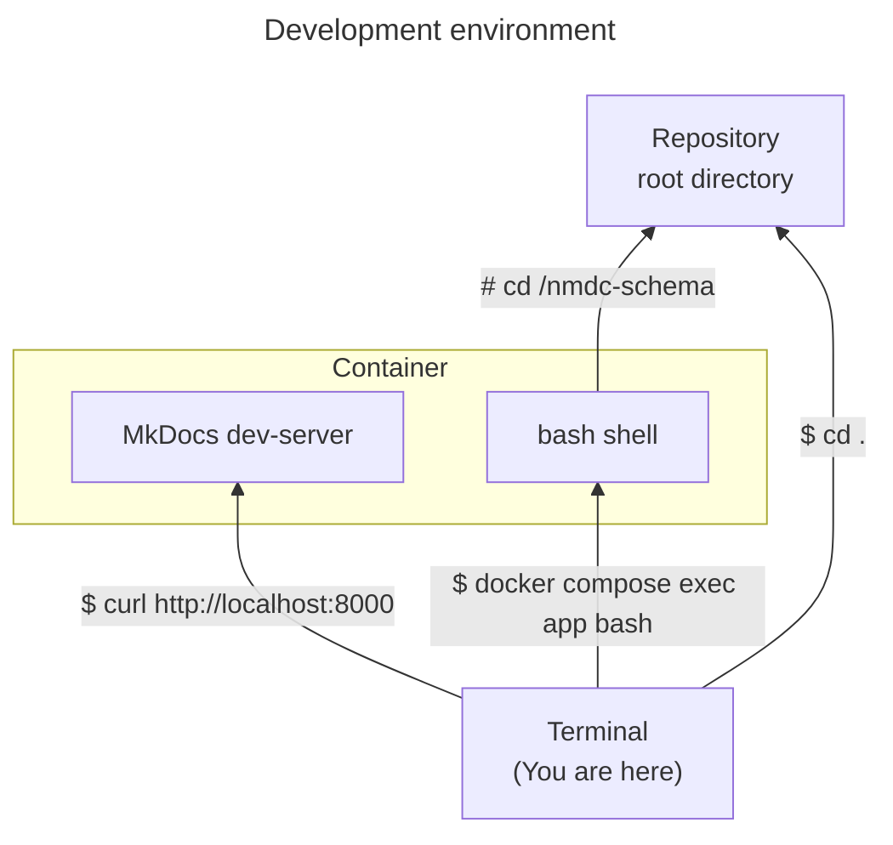

<p align="center">
    
</p>

# National Microbiome Data Collaborative Schema

[](https://github.com/microbiomedata/nmdc-schema/blob/main/LICENSE)
[](https://badge.fury.io/py/nmdc-schema)

The NMDC is a multi-organizational effort to integrate microbiome data across diverse areas in medicine, agriculture,
bioenergy, and the environment. This integrated platform facilitates comprehensive discovery of and access to
multidisciplinary microbiome data in order to unlock new possibilities with microbiome data science.

This repository mainly defines a [LinkML](https://github.com/linkml/linkml) schema for managing metadata from
the [National Microbiome Data Collaborative (NMDC)](https://microbiomedata.org/).

## Repository Contents Overview

Some products that are maintained, and tasks orchestrated within this repository are:

- Maintenance of LinkML YAML that specifies the NMDC Schema
    - [src/schema/nmdc.yaml](src/schema/nmdc.yaml)
    - and various other YAML schemas imported by it,
      like [prov.yaml](src/schema/prov.yaml), [annotation.yaml](src/schema/annotation.yaml), etc. all which you can find
      in the [src/schema](src/schema/) folder
- Makefile targets for converting the schema from it's native LinkML YAML format to other artifact
  like [JSON Schema](project/jsonschema/nmdc.schema.json)
- Build, deployment and distribution of the schema as a PyPI package
- Automatic publishing of refreshed documentation upon change to the schema,
  accessible [here](https://microbiomedata.github.io/nmdc-schema/)

## Background

The NMDC [Introduction to metadata and ontologies](https://microbiomedata.org/introduction-to-metadata-and-ontologies/)
primer provides some the context for this project.

## Maintaining the Schema

**New system requirement: [Mike Farah's GO-based yq](https://github.com/mikefarah/yq)**

Some optional components use the Java-based [ROBOT](http://robot.obolibrary.org/) or Jena arq.
Jena riot is also a part of the MongoDB dumping, repairing and validation workflow, if the user wishes
to generate and validate RDF/TTL.

See [MAINTAINERS.md](MAINTAINERS.md) for instructions on maintaining and updating the schema.

## Makefiles

Makefiles are text files people can use to tell [`make`](https://www.gnu.org/software/make/manual/make.html#Introduction) (a computer program) how it can _make_ things (or—in general—_do_ things). In the world of Makefiles, those _things_ are called _targets_.

This repo contains 2 Makefiles:
- `Makefile`, based on the generic Makefile from the [LinkML cookiecutter](https://github.com/linkml/linkml-project-cookiecutter)
- `project.Makefile`, which contains _targets_ that are specific to this project

Here's an example of using `make` in this repo:

```shell
# Deletes all files in `examples/output`.
make examples-clean
```
> The `examples-clean` _target_ is defined in the `project.Makefile`. In this repo, the `Makefile` `include`s the `project.Makefile`. As a result, `make` has access to the _targets_ defined in both files.

## Data downloads

The NMDC's metadata about biosamples, studies, bioinformatics workflows, etc. can be obtained from our nmdc-runtime API.
Try entering "biosample_set" or "study_set" into the `collection_name` box
at https://api.microbiomedata.org/docs#/metadata/list_from_collection_nmdcschema__collection_name__get

Or use the API programmatically! Note that some collections are large, so the responses are paged.

You can learn about the other available collections at https://microbiomedata.github.io/nmdc-schema/Database/

## Development

This repository includes a container-based development environment. That environment consists of a single container—running Linux—in which all the dependencies of this project are present (e.g. [OpenJDK](https://openjdk.org/), [Apache Jena](https://jena.apache.org/), [GNU make](https://www.gnu.org/software/make/manual/make.html), [yq](https://mikefarah.gitbook.io/yq/)).

Here's a diagram showing how a developer can access various parts of the development environment from a terminal running in the host environment (i.e. the environment _hosting_ the container). 



### Usage

Here's how you can instantiate the development environment on your computer.

#### Prerequisites

- [Docker](https://www.docker.com/products/docker-desktop/) is installed on your computer.
  - For example, version 24:
    ```shell
    $ docker --version
    Docker version 24.0.6, build ed223bc
    ```

#### Procedure

1. In the root folder of the repository, run the container.
   ```shell
   docker compose up --detach
   ```
   > The first time you run that, it will take several **minutes** to finish. During that time, Docker will be _building_ a container image. When you run the command in the future, Docker will reuse that container image (unless you append `--build`).
   >
   > **Troubleshooting tip:** If Docker shows an error message saying "port is already allocated"; then change the command to `DOCS_PORT=1234 docker compose up --detach` and re-run it (you can replace `1234` with any other port number between `1024`-`65535`, inclusive). You can try different port numbers until that error message stops appearing.
2. Connect to a bash shell running within the container.
   ```shell
   docker compose exec app bash
   ```
   > You can think of this as "`ssh`-ing" into a Linux system. In this case, the Linux system is a Docker container running on your computer, and you are using something other than `ssh` to communicate with it.
3. (Optional) Explore the container!
   ```shell
   $ whoami
   $ hostname
   $ uname -a
   # ...
   $ yq --version
   $ jena --version
   $ make --version
   $ python --version
   $ poetry --version
   $ ls /nmdc-schema
   ```
   > The root directory of the repository is mounted at `/nmdc-schema` within the container. Changes you make in that directory on your computer will show up within the container, and vice versa. 
4. (Optional) Generate the MkDocs docs.
   ```shell
   $ make gendoc
   ```
5. (Optional) Visit the MkDocs dev-server.
   - In your web browser, visit http://localhost:8000
     > Note: If you customized `DOCS_PORT` earlier, use that port number instead of `8000` here.
6. Use the container as your `nmdc-schema` development environment.
   ```shell
   $ poetry install
   $ make squeaky-clean
   $ poetry shell
   # etc.
   ```
7. (Optional) Done working on this project (e.g. for the day)? Stop the container.
   ```shell
   # (Optional) Disconnect from the container.
   $ exit
   
   # Stop the container.
   docker compose down
   ```
