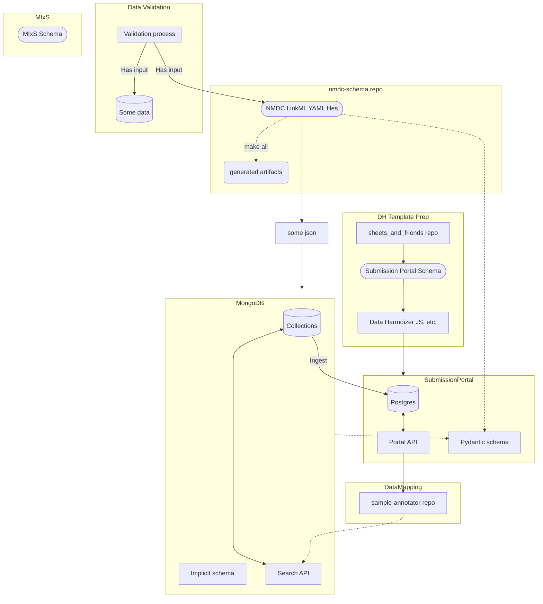

    

# National Microbiome Data Collaborative Schema

The NMDC is a multi-organizational effort to integrate microbiome data across diverse areas in medicine, agriculture, bioenergy, and the environment. This integrated platform facilitates comprehensive discovery of and access to multidisciplinary microbiome data in order to unlock new possibilities with microbiome data science.

This repository mainly defines a [LinkML](https://github.com/linkml/linkml) schema for managing metadata from the [National Microbiome Data Collaborative (NMDC)](https://microbiomedata.org/).

## Repository Contents Overview
Some products that are maintained, and tasks orchestrated within this repository are:

- Maintenance of LinkML YAML that specifies the NMDC Schema
  - [src/schema/nmdc.yaml](src/schema/nmdc.yaml)
  - and various other YAML schemas imported by it, like [prov.yaml](src/schema/prov.yaml), [annotation.yaml](src/schema/annotation.yaml), etc. all which you can find in the [src/schema](src/schema/) folder
- Makefile targets for converting the schema from it's native LinkML YAML format to other artifact like [JSON Schema](jsonschema/nmdc.schema.json)
- Build, deployment and distribution of the schema as a PyPI package
- Automatic publishing of refreshed documentation upon change to the schema, accessible [here](https://microbiomedata.github.io/nmdc-schema/)
## Background

The NMDC [Introduction to metadata and ontologies](https://microbiomedata.org/introduction-to-metadata-and-ontologies/) primer provides some the context for this project.

See also [these slides](https://microbiomedata.github.io/nmdc-schema/schema-slides.html)  describing the schema.

## Maintaining the Schema

See [MAINTAINERS.md](MAINTAINERS.md) for instructions on maintaining and updating the schema.

## NMDC metadata downloads

See https://github.com/microbiomedata/nmdc-runtime/#data-exports

## Ecosystem Diagram

