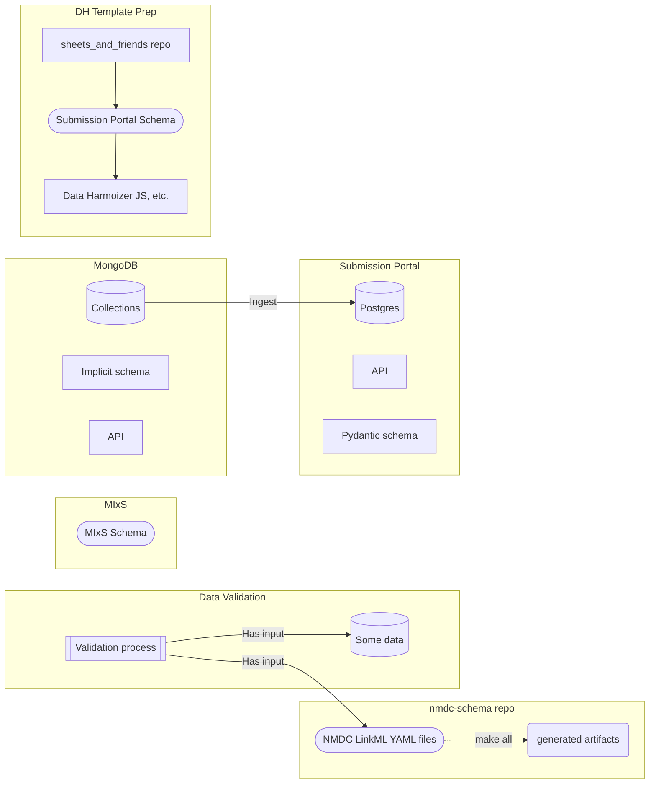

# National Microbiome Data Collaborative Schema

This repository defines a [linkml](https://github.com/linkml/linkml) schema for managing metadata from the [National Microbiome Data Collaborative (NMDC)](https://microbiomedata.org/). The NMDC is a multi-organizational effort to integrate microbiome data across diverse areas in medicine, agriculture, bioenergy, and the environment. This integrated platform facilitates comprehensive discovery of and access to multidisciplinary microbiome data in order to unlock new possibilities with microbiome data science. 

Tasks managed by the repository are:

-   Generating the schema
-   Converting the schema from it's native LinkML/YAML format into other artifacts
    -   [JSON-Schema](jsonschema/nmdc.schema.json)
-   Deploying the schema as a PyPI package
-   Deploying the [documentation](https://microbiomedata.github.io/nmdc-schema/) 

## Background

The NMDC [Introduction to metadata and ontologies](https://microbiomedata.org/introduction-to-metadata-and-ontologies/) primer provides some the context for this project.

See also [these slides](https://microbiomedata.github.io/nmdc-schema/schema-slides.html)  describing the schema.

## Dependencies
In order to make new release of the schema, you must have the following installed on your sytem:
- [poetry](https://python-poetry.org/docs/#installation/)
- [pandoc](https://pandoc.org/installing.html)

## Maintaining the Schema

See [MAINTAINERS.md](MAINTAINERS.md) for instructions on maintaining and updating the schema.

## NMDC metadata downloads

See https://github.com/microbiomedata/nmdc-runtime/#data-exports

----

