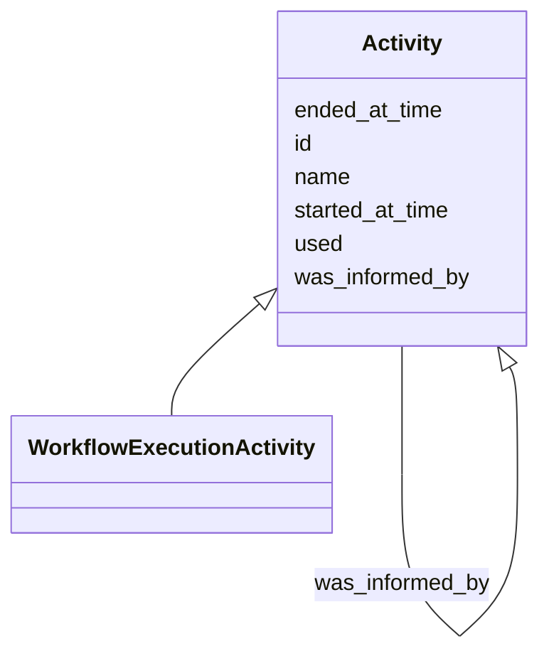

# Class: Activity


_Something that occurs over a period of time and acts upon or with entities; it may include consuming, processing, transforming, modifying, relocating, using, or generating entities._


URI: [nmdc:Activity](https://w3id.org/nmdc/Activity)





## Inheritance
* **Activity**
    * [WorkflowExecutionActivity](WorkflowExecutionActivity.md)


## Slots

| Name | Cardinality and Range | Description | Inheritance |
| ---  | --- | --- | --- |
| [id](id.md) | 1..1 <br/> [Uriorcurie](Uriorcurie.md) | A unique identifier for a thing | direct |
| [name](name.md) | 0..1 <br/> [String](String.md) | A human readable label for an entity | direct |
| [started_at_time](started_at_time.md) | 0..1 <br/> [String](String.md) |  | direct |
| [ended_at_time](ended_at_time.md) | 0..1 <br/> [String](String.md) |  | direct |
| [was_informed_by](was_informed_by.md) | 0..1 <br/> [Activity](Activity.md) |  | direct |
| [used](used.md) | 0..1 <br/> [String](String.md) |  | direct |


## Usages

| used by | used in | type | used |
| ---  | --- | --- | --- |
| [DataObject](DataObject.md) | [was_generated_by](was_generated_by.md) | range | [Activity](Activity.md) |
| [WorkflowExecutionActivity](WorkflowExecutionActivity.md) | [execution_resource](execution_resource.md) | domain | [Activity](Activity.md) |
| [WorkflowExecutionActivity](WorkflowExecutionActivity.md) | [version](version.md) | domain | [Activity](Activity.md) |
| [WorkflowExecutionActivity](WorkflowExecutionActivity.md) | [started_at_time](started_at_time.md) | domain | [Activity](Activity.md) |
| [WorkflowExecutionActivity](WorkflowExecutionActivity.md) | [ended_at_time](ended_at_time.md) | domain | [Activity](Activity.md) |
| [WorkflowExecutionActivity](WorkflowExecutionActivity.md) | [was_informed_by](was_informed_by.md) | domain | [Activity](Activity.md) |
| [WorkflowExecutionActivity](WorkflowExecutionActivity.md) | [was_informed_by](was_informed_by.md) | range | [Activity](Activity.md) |
| [WorkflowExecutionActivity](WorkflowExecutionActivity.md) | [used](used.md) | domain | [Activity](Activity.md) |
| [MetagenomeAssembly](MetagenomeAssembly.md) | [execution_resource](execution_resource.md) | domain | [Activity](Activity.md) |
| [MetagenomeAssembly](MetagenomeAssembly.md) | [version](version.md) | domain | [Activity](Activity.md) |
| [MetagenomeAssembly](MetagenomeAssembly.md) | [started_at_time](started_at_time.md) | domain | [Activity](Activity.md) |
| [MetagenomeAssembly](MetagenomeAssembly.md) | [ended_at_time](ended_at_time.md) | domain | [Activity](Activity.md) |
| [MetagenomeAssembly](MetagenomeAssembly.md) | [was_informed_by](was_informed_by.md) | domain | [Activity](Activity.md) |
| [MetagenomeAssembly](MetagenomeAssembly.md) | [was_informed_by](was_informed_by.md) | range | [Activity](Activity.md) |
| [MetagenomeAssembly](MetagenomeAssembly.md) | [used](used.md) | domain | [Activity](Activity.md) |
| [MetatranscriptomeAssembly](MetatranscriptomeAssembly.md) | [execution_resource](execution_resource.md) | domain | [Activity](Activity.md) |
| [MetatranscriptomeAssembly](MetatranscriptomeAssembly.md) | [version](version.md) | domain | [Activity](Activity.md) |
| [MetatranscriptomeAssembly](MetatranscriptomeAssembly.md) | [started_at_time](started_at_time.md) | domain | [Activity](Activity.md) |
| [MetatranscriptomeAssembly](MetatranscriptomeAssembly.md) | [ended_at_time](ended_at_time.md) | domain | [Activity](Activity.md) |
| [MetatranscriptomeAssembly](MetatranscriptomeAssembly.md) | [was_informed_by](was_informed_by.md) | domain | [Activity](Activity.md) |
| [MetatranscriptomeAssembly](MetatranscriptomeAssembly.md) | [was_informed_by](was_informed_by.md) | range | [Activity](Activity.md) |
| [MetatranscriptomeAssembly](MetatranscriptomeAssembly.md) | [used](used.md) | domain | [Activity](Activity.md) |
| [MetagenomeAnnotationActivity](MetagenomeAnnotationActivity.md) | [execution_resource](execution_resource.md) | domain | [Activity](Activity.md) |
| [MetagenomeAnnotationActivity](MetagenomeAnnotationActivity.md) | [version](version.md) | domain | [Activity](Activity.md) |
| [MetagenomeAnnotationActivity](MetagenomeAnnotationActivity.md) | [started_at_time](started_at_time.md) | domain | [Activity](Activity.md) |
| [MetagenomeAnnotationActivity](MetagenomeAnnotationActivity.md) | [ended_at_time](ended_at_time.md) | domain | [Activity](Activity.md) |
| [MetagenomeAnnotationActivity](MetagenomeAnnotationActivity.md) | [was_informed_by](was_informed_by.md) | domain | [Activity](Activity.md) |
| [MetagenomeAnnotationActivity](MetagenomeAnnotationActivity.md) | [was_informed_by](was_informed_by.md) | range | [Activity](Activity.md) |
| [MetagenomeAnnotationActivity](MetagenomeAnnotationActivity.md) | [used](used.md) | domain | [Activity](Activity.md) |
| [MetatranscriptomeAnnotationActivity](MetatranscriptomeAnnotationActivity.md) | [execution_resource](execution_resource.md) | domain | [Activity](Activity.md) |
| [MetatranscriptomeAnnotationActivity](MetatranscriptomeAnnotationActivity.md) | [version](version.md) | domain | [Activity](Activity.md) |
| [MetatranscriptomeAnnotationActivity](MetatranscriptomeAnnotationActivity.md) | [started_at_time](started_at_time.md) | domain | [Activity](Activity.md) |
| [MetatranscriptomeAnnotationActivity](MetatranscriptomeAnnotationActivity.md) | [ended_at_time](ended_at_time.md) | domain | [Activity](Activity.md) |
| [MetatranscriptomeAnnotationActivity](MetatranscriptomeAnnotationActivity.md) | [was_informed_by](was_informed_by.md) | domain | [Activity](Activity.md) |
| [MetatranscriptomeAnnotationActivity](MetatranscriptomeAnnotationActivity.md) | [was_informed_by](was_informed_by.md) | range | [Activity](Activity.md) |
| [MetatranscriptomeAnnotationActivity](MetatranscriptomeAnnotationActivity.md) | [used](used.md) | domain | [Activity](Activity.md) |
| [MetatranscriptomeActivity](MetatranscriptomeActivity.md) | [execution_resource](execution_resource.md) | domain | [Activity](Activity.md) |
| [MetatranscriptomeActivity](MetatranscriptomeActivity.md) | [version](version.md) | domain | [Activity](Activity.md) |
| [MetatranscriptomeActivity](MetatranscriptomeActivity.md) | [started_at_time](started_at_time.md) | domain | [Activity](Activity.md) |
| [MetatranscriptomeActivity](MetatranscriptomeActivity.md) | [ended_at_time](ended_at_time.md) | domain | [Activity](Activity.md) |
| [MetatranscriptomeActivity](MetatranscriptomeActivity.md) | [was_informed_by](was_informed_by.md) | domain | [Activity](Activity.md) |
| [MetatranscriptomeActivity](MetatranscriptomeActivity.md) | [was_informed_by](was_informed_by.md) | range | [Activity](Activity.md) |
| [MetatranscriptomeActivity](MetatranscriptomeActivity.md) | [used](used.md) | domain | [Activity](Activity.md) |
| [MagsAnalysisActivity](MagsAnalysisActivity.md) | [execution_resource](execution_resource.md) | domain | [Activity](Activity.md) |
| [MagsAnalysisActivity](MagsAnalysisActivity.md) | [version](version.md) | domain | [Activity](Activity.md) |
| [MagsAnalysisActivity](MagsAnalysisActivity.md) | [started_at_time](started_at_time.md) | domain | [Activity](Activity.md) |
| [MagsAnalysisActivity](MagsAnalysisActivity.md) | [ended_at_time](ended_at_time.md) | domain | [Activity](Activity.md) |
| [MagsAnalysisActivity](MagsAnalysisActivity.md) | [was_informed_by](was_informed_by.md) | domain | [Activity](Activity.md) |
| [MagsAnalysisActivity](MagsAnalysisActivity.md) | [was_informed_by](was_informed_by.md) | range | [Activity](Activity.md) |
| [MagsAnalysisActivity](MagsAnalysisActivity.md) | [used](used.md) | domain | [Activity](Activity.md) |
| [MetagenomeSequencingActivity](MetagenomeSequencingActivity.md) | [execution_resource](execution_resource.md) | domain | [Activity](Activity.md) |
| [MetagenomeSequencingActivity](MetagenomeSequencingActivity.md) | [version](version.md) | domain | [Activity](Activity.md) |
| [MetagenomeSequencingActivity](MetagenomeSequencingActivity.md) | [started_at_time](started_at_time.md) | domain | [Activity](Activity.md) |
| [MetagenomeSequencingActivity](MetagenomeSequencingActivity.md) | [ended_at_time](ended_at_time.md) | domain | [Activity](Activity.md) |
| [MetagenomeSequencingActivity](MetagenomeSequencingActivity.md) | [was_informed_by](was_informed_by.md) | domain | [Activity](Activity.md) |
| [MetagenomeSequencingActivity](MetagenomeSequencingActivity.md) | [was_informed_by](was_informed_by.md) | range | [Activity](Activity.md) |
| [MetagenomeSequencingActivity](MetagenomeSequencingActivity.md) | [used](used.md) | domain | [Activity](Activity.md) |
| [ReadQcAnalysisActivity](ReadQcAnalysisActivity.md) | [version](version.md) | domain | [Activity](Activity.md) |
| [ReadQcAnalysisActivity](ReadQcAnalysisActivity.md) | [execution_resource](execution_resource.md) | domain | [Activity](Activity.md) |
| [ReadQcAnalysisActivity](ReadQcAnalysisActivity.md) | [started_at_time](started_at_time.md) | domain | [Activity](Activity.md) |
| [ReadQcAnalysisActivity](ReadQcAnalysisActivity.md) | [ended_at_time](ended_at_time.md) | domain | [Activity](Activity.md) |
| [ReadQcAnalysisActivity](ReadQcAnalysisActivity.md) | [was_informed_by](was_informed_by.md) | domain | [Activity](Activity.md) |
| [ReadQcAnalysisActivity](ReadQcAnalysisActivity.md) | [was_informed_by](was_informed_by.md) | range | [Activity](Activity.md) |
| [ReadQcAnalysisActivity](ReadQcAnalysisActivity.md) | [used](used.md) | domain | [Activity](Activity.md) |
| [ReadBasedTaxonomyAnalysisActivity](ReadBasedTaxonomyAnalysisActivity.md) | [execution_resource](execution_resource.md) | domain | [Activity](Activity.md) |
| [ReadBasedTaxonomyAnalysisActivity](ReadBasedTaxonomyAnalysisActivity.md) | [version](version.md) | domain | [Activity](Activity.md) |
| [ReadBasedTaxonomyAnalysisActivity](ReadBasedTaxonomyAnalysisActivity.md) | [started_at_time](started_at_time.md) | domain | [Activity](Activity.md) |
| [ReadBasedTaxonomyAnalysisActivity](ReadBasedTaxonomyAnalysisActivity.md) | [ended_at_time](ended_at_time.md) | domain | [Activity](Activity.md) |
| [ReadBasedTaxonomyAnalysisActivity](ReadBasedTaxonomyAnalysisActivity.md) | [was_informed_by](was_informed_by.md) | domain | [Activity](Activity.md) |
| [ReadBasedTaxonomyAnalysisActivity](ReadBasedTaxonomyAnalysisActivity.md) | [was_informed_by](was_informed_by.md) | range | [Activity](Activity.md) |
| [ReadBasedTaxonomyAnalysisActivity](ReadBasedTaxonomyAnalysisActivity.md) | [used](used.md) | domain | [Activity](Activity.md) |
| [MetabolomicsAnalysisActivity](MetabolomicsAnalysisActivity.md) | [execution_resource](execution_resource.md) | domain | [Activity](Activity.md) |
| [MetabolomicsAnalysisActivity](MetabolomicsAnalysisActivity.md) | [version](version.md) | domain | [Activity](Activity.md) |
| [MetabolomicsAnalysisActivity](MetabolomicsAnalysisActivity.md) | [started_at_time](started_at_time.md) | domain | [Activity](Activity.md) |
| [MetabolomicsAnalysisActivity](MetabolomicsAnalysisActivity.md) | [ended_at_time](ended_at_time.md) | domain | [Activity](Activity.md) |
| [MetabolomicsAnalysisActivity](MetabolomicsAnalysisActivity.md) | [was_informed_by](was_informed_by.md) | domain | [Activity](Activity.md) |
| [MetabolomicsAnalysisActivity](MetabolomicsAnalysisActivity.md) | [was_informed_by](was_informed_by.md) | range | [Activity](Activity.md) |
| [MetabolomicsAnalysisActivity](MetabolomicsAnalysisActivity.md) | [used](used.md) | domain | [Activity](Activity.md) |
| [MetaproteomicsAnalysisActivity](MetaproteomicsAnalysisActivity.md) | [execution_resource](execution_resource.md) | domain | [Activity](Activity.md) |
| [MetaproteomicsAnalysisActivity](MetaproteomicsAnalysisActivity.md) | [version](version.md) | domain | [Activity](Activity.md) |
| [MetaproteomicsAnalysisActivity](MetaproteomicsAnalysisActivity.md) | [started_at_time](started_at_time.md) | domain | [Activity](Activity.md) |
| [MetaproteomicsAnalysisActivity](MetaproteomicsAnalysisActivity.md) | [ended_at_time](ended_at_time.md) | domain | [Activity](Activity.md) |
| [MetaproteomicsAnalysisActivity](MetaproteomicsAnalysisActivity.md) | [was_informed_by](was_informed_by.md) | domain | [Activity](Activity.md) |
| [MetaproteomicsAnalysisActivity](MetaproteomicsAnalysisActivity.md) | [was_informed_by](was_informed_by.md) | range | [Activity](Activity.md) |
| [MetaproteomicsAnalysisActivity](MetaproteomicsAnalysisActivity.md) | [used](used.md) | domain | [Activity](Activity.md) |
| [NomAnalysisActivity](NomAnalysisActivity.md) | [execution_resource](execution_resource.md) | domain | [Activity](Activity.md) |
| [NomAnalysisActivity](NomAnalysisActivity.md) | [version](version.md) | domain | [Activity](Activity.md) |
| [NomAnalysisActivity](NomAnalysisActivity.md) | [started_at_time](started_at_time.md) | domain | [Activity](Activity.md) |
| [NomAnalysisActivity](NomAnalysisActivity.md) | [ended_at_time](ended_at_time.md) | domain | [Activity](Activity.md) |
| [NomAnalysisActivity](NomAnalysisActivity.md) | [was_informed_by](was_informed_by.md) | domain | [Activity](Activity.md) |
| [NomAnalysisActivity](NomAnalysisActivity.md) | [was_informed_by](was_informed_by.md) | range | [Activity](Activity.md) |
| [NomAnalysisActivity](NomAnalysisActivity.md) | [used](used.md) | domain | [Activity](Activity.md) |
| [AttributeValue](AttributeValue.md) | [was_generated_by](was_generated_by.md) | range | [Activity](Activity.md) |
| [QuantityValue](QuantityValue.md) | [was_generated_by](was_generated_by.md) | range | [Activity](Activity.md) |
| [ImageValue](ImageValue.md) | [was_generated_by](was_generated_by.md) | range | [Activity](Activity.md) |
| [PersonValue](PersonValue.md) | [was_generated_by](was_generated_by.md) | range | [Activity](Activity.md) |
| [TextValue](TextValue.md) | [was_generated_by](was_generated_by.md) | range | [Activity](Activity.md) |
| [UrlValue](UrlValue.md) | [was_generated_by](was_generated_by.md) | range | [Activity](Activity.md) |
| [TimestampValue](TimestampValue.md) | [was_generated_by](was_generated_by.md) | range | [Activity](Activity.md) |
| [IntegerValue](IntegerValue.md) | [was_generated_by](was_generated_by.md) | range | [Activity](Activity.md) |
| [BooleanValue](BooleanValue.md) | [was_generated_by](was_generated_by.md) | range | [Activity](Activity.md) |
| [ControlledTermValue](ControlledTermValue.md) | [was_generated_by](was_generated_by.md) | range | [Activity](Activity.md) |
| [ControlledIdentifiedTermValue](ControlledIdentifiedTermValue.md) | [was_generated_by](was_generated_by.md) | range | [Activity](Activity.md) |
| [GeolocationValue](GeolocationValue.md) | [was_generated_by](was_generated_by.md) | range | [Activity](Activity.md) |
| [Activity](Activity.md) | [started_at_time](started_at_time.md) | domain | [Activity](Activity.md) |
| [Activity](Activity.md) | [ended_at_time](ended_at_time.md) | domain | [Activity](Activity.md) |
| [Activity](Activity.md) | [was_informed_by](was_informed_by.md) | domain | [Activity](Activity.md) |
| [Activity](Activity.md) | [was_informed_by](was_informed_by.md) | range | [Activity](Activity.md) |
| [Activity](Activity.md) | [used](used.md) | domain | [Activity](Activity.md) |


## Comments

* to be replaced with PlannedProcess in the monterey-schema

## Identifier and Mapping Information


### Schema Source


* from schema: https://w3id.org/nmdc/nmdc


## Mappings

| Mapping Type | Mapped Value |
| ---  | ---  |
| self | nmdc:Activity |
| native | nmdc:Activity |
| undefined | prov:Activity |


## LinkML Source

<!-- TODO: investigate https://stackoverflow.com/questions/37606292/how-to-create-tabbed-code-blocks-in-mkdocs-or-sphinx -->

### Direct

<details>
```yaml
name: Activity
description: Something that occurs over a period of time and acts upon or with entities;
  it may include consuming, processing, transforming, modifying, relocating, using,
  or generating entities.
notes:
- removed was_associated_with because we are trying to avoid instantiating id-less
  Agents
comments:
- to be replaced with PlannedProcess in the monterey-schema
from_schema: https://w3id.org/nmdc/nmdc
mappings:
- prov:Activity
slots:
- id
- name
- started_at_time
- ended_at_time
- was_informed_by
- used
slot_usage:
  id:
    name: id
    domain_of:
    - Biosample
    - Study
    - NamedThing
    - Activity
    required: true
    structured_pattern:
      syntax: '{id_nmdc_prefix}:act-{id_shoulder}-{id_blade}{id_version}{id_locus}'
      interpolated: true

```
</details>

### Induced

<details>
```yaml
name: Activity
description: Something that occurs over a period of time and acts upon or with entities;
  it may include consuming, processing, transforming, modifying, relocating, using,
  or generating entities.
notes:
- removed was_associated_with because we are trying to avoid instantiating id-less
  Agents
comments:
- to be replaced with PlannedProcess in the monterey-schema
from_schema: https://w3id.org/nmdc/nmdc
mappings:
- prov:Activity
slot_usage:
  id:
    name: id
    domain_of:
    - Biosample
    - Study
    - NamedThing
    - Activity
    required: true
    structured_pattern:
      syntax: '{id_nmdc_prefix}:act-{id_shoulder}-{id_blade}{id_version}{id_locus}'
      interpolated: true
attributes:
  id:
    name: id
    description: A unique identifier for a thing. Must be either a CURIE shorthand
      for a URI or a complete URI
    from_schema: https://w3id.org/nmdc/nmdc
    rank: 1000
    identifier: true
    alias: id
    owner: Activity
    domain_of:
    - Biosample
    - Study
    - NamedThing
    - Activity
    range: uriorcurie
    required: true
    pattern: ^[a-zA-Z0-9][a-zA-Z0-9_\.]+:[a-zA-Z0-9_][a-zA-Z0-9_\-\/\.,]*$
    structured_pattern:
      syntax: '{id_nmdc_prefix}:act-{id_shoulder}-{id_blade}{id_version}{id_locus}'
      interpolated: true
  name:
    name: name
    description: A human readable label for an entity
    from_schema: https://w3id.org/nmdc/nmdc
    rank: 1000
    alias: name
    owner: Activity
    domain_of:
    - Protocol
    - QualityControlReport
    - NamedThing
    - PersonValue
    - Activity
    range: string
  started_at_time:
    name: started_at_time
    notes:
    - 'The regex for ISO-8601 format was taken from here: https://www.myintervals.com/blog/2009/05/20/iso-8601-date-validation-that-doesnt-suck/
      It may not be complete, but it is good enough for now.'
    from_schema: https://w3id.org/nmdc/nmdc
    mappings:
    - prov:startedAtTime
    rank: 1000
    domain: Activity
    alias: started_at_time
    owner: Activity
    domain_of:
    - Activity
    range: string
    pattern: ^([\+-]?\d{4}(?!\d{2}\b))((-?)((0[1-9]|1[0-2])(\3([12]\d|0[1-9]|3[01]))?|W([0-4]\d|5[0-2])(-?[1-7])?|(00[1-9]|0[1-9]\d|[12]\d{2}|3([0-5]\d|6[1-6])))([T\s]((([01]\d|2[0-3])((:?)[0-5]\d)?|24\:?00)([\.,]\d+(?!:))?)?(\17[0-5]\d([\.,]\d+)?)?([zZ]|([\+-])([01]\d|2[0-3]):?([0-5]\d)?)?)?)?$
  ended_at_time:
    name: ended_at_time
    notes:
    - 'The regex for ISO-8601 format was taken from here: https://www.myintervals.com/blog/2009/05/20/iso-8601-date-validation-that-doesnt-suck/
      It may not be complete, but it is good enough for now.'
    from_schema: https://w3id.org/nmdc/nmdc
    mappings:
    - prov:endedAtTime
    rank: 1000
    domain: Activity
    alias: ended_at_time
    owner: Activity
    domain_of:
    - Activity
    range: string
    pattern: ^([\+-]?\d{4}(?!\d{2}\b))((-?)((0[1-9]|1[0-2])(\3([12]\d|0[1-9]|3[01]))?|W([0-4]\d|5[0-2])(-?[1-7])?|(00[1-9]|0[1-9]\d|[12]\d{2}|3([0-5]\d|6[1-6])))([T\s]((([01]\d|2[0-3])((:?)[0-5]\d)?|24\:?00)([\.,]\d+(?!:))?)?(\17[0-5]\d([\.,]\d+)?)?([zZ]|([\+-])([01]\d|2[0-3]):?([0-5]\d)?)?)?)?$
  was_informed_by:
    name: was_informed_by
    from_schema: https://w3id.org/nmdc/nmdc
    mappings:
    - prov:wasInformedBy
    rank: 1000
    domain: Activity
    alias: was_informed_by
    owner: Activity
    domain_of:
    - Activity
    range: Activity
  used:
    name: used
    from_schema: https://w3id.org/nmdc/nmdc
    mappings:
    - prov:used
    rank: 1000
    domain: Activity
    alias: used
    owner: Activity
    domain_of:
    - Activity
    range: string

```
</details>