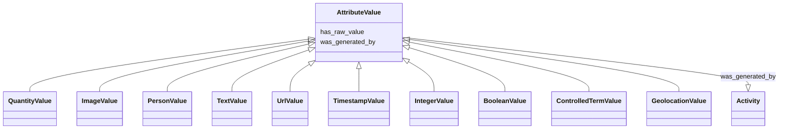

# Class: AttributeValue


_The value for any value of a attribute for a sample. This object can hold both the un-normalized atomic value and the structured value_


URI: [nmdc:AttributeValue](https://w3id.org/nmdc/AttributeValue)





## Inheritance
* **AttributeValue**
    * [QuantityValue](QuantityValue.md)
    * [ImageValue](ImageValue.md)
    * [PersonValue](PersonValue.md)
    * [TextValue](TextValue.md)
    * [UrlValue](UrlValue.md)
    * [TimestampValue](TimestampValue.md)
    * [IntegerValue](IntegerValue.md)
    * [BooleanValue](BooleanValue.md)
    * [ControlledTermValue](ControlledTermValue.md)
    * [GeolocationValue](GeolocationValue.md)


## Slots

| Name | Cardinality and Range | Description | Inheritance |
| ---  | --- | --- | --- |
| [has_raw_value](has_raw_value.md) | 0..1 <br/> [String](String.md) | The value that was specified for an annotation in raw form, i | direct |
| [was_generated_by](was_generated_by.md) | 0..1 <br/> [Activity](Activity.md) |  | direct |


## Usages

| used by | used in | type | used |
| ---  | --- | --- | --- |
| [AttributeValue](AttributeValue.md) | [has_raw_value](has_raw_value.md) | domain | [AttributeValue](AttributeValue.md) |
| [QuantityValue](QuantityValue.md) | [has_raw_value](has_raw_value.md) | domain | [AttributeValue](AttributeValue.md) |
| [ImageValue](ImageValue.md) | [has_raw_value](has_raw_value.md) | domain | [AttributeValue](AttributeValue.md) |
| [PersonValue](PersonValue.md) | [has_raw_value](has_raw_value.md) | domain | [AttributeValue](AttributeValue.md) |
| [TextValue](TextValue.md) | [has_raw_value](has_raw_value.md) | domain | [AttributeValue](AttributeValue.md) |
| [UrlValue](UrlValue.md) | [has_raw_value](has_raw_value.md) | domain | [AttributeValue](AttributeValue.md) |
| [TimestampValue](TimestampValue.md) | [has_raw_value](has_raw_value.md) | domain | [AttributeValue](AttributeValue.md) |
| [IntegerValue](IntegerValue.md) | [has_raw_value](has_raw_value.md) | domain | [AttributeValue](AttributeValue.md) |
| [BooleanValue](BooleanValue.md) | [has_raw_value](has_raw_value.md) | domain | [AttributeValue](AttributeValue.md) |
| [ControlledTermValue](ControlledTermValue.md) | [has_raw_value](has_raw_value.md) | domain | [AttributeValue](AttributeValue.md) |
| [ControlledIdentifiedTermValue](ControlledIdentifiedTermValue.md) | [has_raw_value](has_raw_value.md) | domain | [AttributeValue](AttributeValue.md) |
| [GeolocationValue](GeolocationValue.md) | [has_raw_value](has_raw_value.md) | domain | [AttributeValue](AttributeValue.md) |


## Identifier and Mapping Information


### Schema Source


* from schema: https://w3id.org/nmdc/nmdc


## Mappings

| Mapping Type | Mapped Value |
| ---  | ---  |
| self | nmdc:AttributeValue |
| native | nmdc:AttributeValue |


## LinkML Source

<!-- TODO: investigate https://stackoverflow.com/questions/37606292/how-to-create-tabbed-code-blocks-in-mkdocs-or-sphinx -->

### Direct

<details>
```yaml
name: AttributeValue
description: The value for any value of a attribute for a sample. This object can
  hold both the un-normalized atomic value and the structured value
from_schema: https://w3id.org/nmdc/nmdc
slots:
- has_raw_value
- was_generated_by
slot_usage:
  type:
    name: type
    description: An optional string that specified the type of object.

```
</details>

### Induced

<details>
```yaml
name: AttributeValue
description: The value for any value of a attribute for a sample. This object can
  hold both the un-normalized atomic value and the structured value
from_schema: https://w3id.org/nmdc/nmdc
slot_usage:
  type:
    name: type
    description: An optional string that specified the type of object.
attributes:
  has_raw_value:
    name: has_raw_value
    description: The value that was specified for an annotation in raw form, i.e.
      a string. E.g. "2 cm" or "2-4 cm"
    from_schema: https://w3id.org/nmdc/nmdc
    rank: 1000
    domain: AttributeValue
    multivalued: false
    alias: has_raw_value
    owner: AttributeValue
    domain_of:
    - AttributeValue
    - QuantityValue
    range: string
  was_generated_by:
    name: was_generated_by
    from_schema: https://w3id.org/nmdc/nmdc
    mappings:
    - prov:wasGeneratedBy
    rank: 1000
    alias: was_generated_by
    owner: AttributeValue
    domain_of:
    - DataObject
    - AttributeValue
    - FunctionalAnnotation
    range: Activity

```
</details>