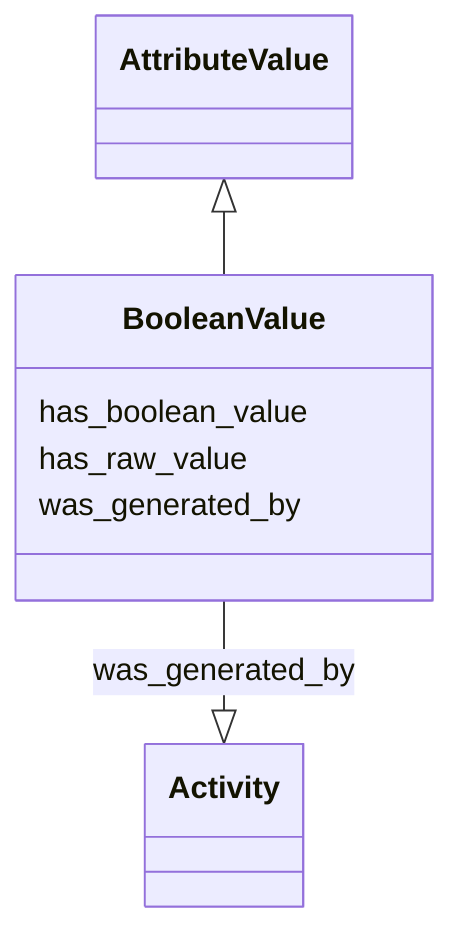

# Class: BooleanValue


_A value that is a boolean_


URI: [nmdc:BooleanValue](https://w3id.org/nmdc/BooleanValue)





## Inheritance
* [AttributeValue](AttributeValue.md)
    * **BooleanValue**


## Slots

| Name | Cardinality and Range | Description | Inheritance |
| ---  | --- | --- | --- |
| [has_boolean_value](has_boolean_value.md) | 0..1 <br/> [Boolean](Boolean.md) | Links a quantity value to a boolean | direct |
| [has_raw_value](has_raw_value.md) | 0..1 <br/> [String](String.md) | The value that was specified for an annotation in raw form, i | [AttributeValue](AttributeValue.md) |
| [was_generated_by](was_generated_by.md) | 0..1 <br/> [Activity](Activity.md) |  | [AttributeValue](AttributeValue.md) |


## Identifier and Mapping Information


### Schema Source


* from schema: https://w3id.org/nmdc/nmdc


## Mappings

| Mapping Type | Mapped Value |
| ---  | ---  |
| self | nmdc:BooleanValue |
| native | nmdc:BooleanValue |


## LinkML Source

<!-- TODO: investigate https://stackoverflow.com/questions/37606292/how-to-create-tabbed-code-blocks-in-mkdocs-or-sphinx -->

### Direct

<details>
```yaml
name: BooleanValue
description: A value that is a boolean
from_schema: https://w3id.org/nmdc/nmdc
is_a: AttributeValue
slots:
- has_boolean_value

```
</details>

### Induced

<details>
```yaml
name: BooleanValue
description: A value that is a boolean
from_schema: https://w3id.org/nmdc/nmdc
is_a: AttributeValue
attributes:
  has_boolean_value:
    name: has_boolean_value
    description: Links a quantity value to a boolean
    from_schema: https://w3id.org/nmdc/nmdc
    rank: 1000
    multivalued: false
    alias: has_boolean_value
    owner: BooleanValue
    domain_of:
    - BooleanValue
    range: boolean
  has_raw_value:
    name: has_raw_value
    description: The value that was specified for an annotation in raw form, i.e.
      a string. E.g. "2 cm" or "2-4 cm"
    from_schema: https://w3id.org/nmdc/nmdc
    rank: 1000
    domain: AttributeValue
    multivalued: false
    alias: has_raw_value
    owner: BooleanValue
    domain_of:
    - AttributeValue
    - QuantityValue
    range: string
  was_generated_by:
    name: was_generated_by
    from_schema: https://w3id.org/nmdc/nmdc
    mappings:
    - prov:wasGeneratedBy
    rank: 1000
    alias: was_generated_by
    owner: BooleanValue
    domain_of:
    - DataObject
    - AttributeValue
    - FunctionalAnnotation
    range: Activity

```
</details>