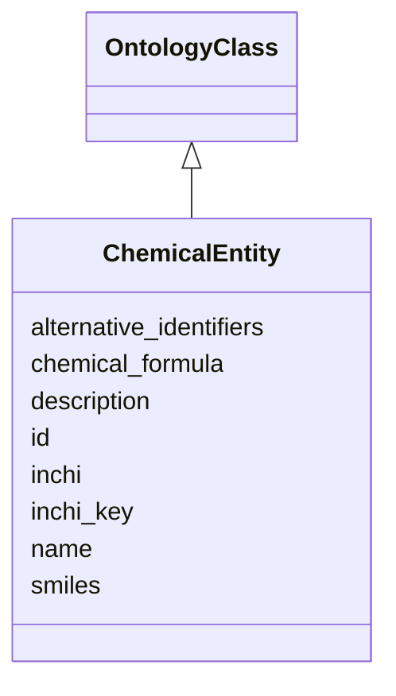

# Class: ChemicalEntity


_An atom or molecule that can be represented with a chemical formula. Include lipids, glycans, natural products, drugs. There may be different terms for distinct acid-base forms, protonation states_


URI: [nmdc:ChemicalEntity](https://w3id.org/nmdc/ChemicalEntity)





## Inheritance
* [NamedThing](NamedThing.md)
    * [OntologyClass](OntologyClass.md)
        * **ChemicalEntity**


## Slots

| Name | Cardinality and Range | Description | Inheritance |
| ---  | --- | --- | --- |
| [chemical_formula](chemical_formula.md) | 0..1 <br/> [String](String.md) | A generic grouping for molecular formulae and empirical formulae | direct |
| [inchi](inchi.md) | 0..1 <br/> [String](String.md) |  | direct |
| [inchi_key](inchi_key.md) | 0..1 <br/> [String](String.md) |  | direct |
| [smiles](smiles.md) | 0..* <br/> [String](String.md) | A string encoding of a molecular graph, no chiral or isotopic information | direct |
| [id](id.md) | 1..1 <br/> [Uriorcurie](Uriorcurie.md) | A unique identifier for a thing | [NamedThing](NamedThing.md) |
| [name](name.md) | 0..1 <br/> [String](String.md) | A human readable label for an entity | [NamedThing](NamedThing.md) |
| [description](description.md) | 0..1 <br/> [String](String.md) | a human-readable description of a thing | [NamedThing](NamedThing.md) |
| [alternative_identifiers](alternative_identifiers.md) | 0..* <br/> [Uriorcurie](Uriorcurie.md) | A list of alternative identifiers for the entity | [NamedThing](NamedThing.md) |


## Usages

| used by | used in | type | used |
| ---  | --- | --- | --- |
| [MetaboliteQuantification](MetaboliteQuantification.md) | [metabolite_quantified](metabolite_quantified.md) | range | [ChemicalEntity](ChemicalEntity.md) |
| [ReactionParticipant](ReactionParticipant.md) | [chemical](chemical.md) | range | [ChemicalEntity](ChemicalEntity.md) |


## Aliases


* metabolite
* chemical substance
* chemical compound
* chemical


## Comments

* As with the parent OntologyClass, we will not assign an nmdc id pattern or typecode to this class.

## See Also

* [https://bioconductor.org/packages/devel/data/annotation/vignettes/metaboliteIDmapping/inst/doc/metaboliteIDmapping.html](https://bioconductor.org/packages/devel/data/annotation/vignettes/metaboliteIDmapping/inst/doc/metaboliteIDmapping.html)

## Identifier and Mapping Information


### Valid ID Prefixes

Instances of this class *should* have identifiers with one of the following prefixes:

* cas

* CHEBI

* CHEMBL.COMPOUND

* DRUGBANK

* HMDB

* KEGG.COMPOUND

* MESH

* PUBCHEM.COMPOUND


### Schema Source


* from schema: https://w3id.org/nmdc/nmdc


## Mappings

| Mapping Type | Mapped Value |
| ---  | ---  |
| self | nmdc:ChemicalEntity |
| native | nmdc:ChemicalEntity |
| exact | biolink:ChemicalSubstance |


## LinkML Source

<!-- TODO: investigate https://stackoverflow.com/questions/37606292/how-to-create-tabbed-code-blocks-in-mkdocs-or-sphinx -->

### Direct

<details>
```yaml
name: ChemicalEntity
id_prefixes:
- cas
- CHEBI
- CHEMBL.COMPOUND
- DRUGBANK
- HMDB
- KEGG.COMPOUND
- MESH
- PUBCHEM.COMPOUND
description: An atom or molecule that can be represented with a chemical formula.
  Include lipids, glycans, natural products, drugs. There may be different terms for
  distinct acid-base forms, protonation states
comments:
- As with the parent OntologyClass, we will not assign an nmdc id pattern or typecode
  to this class.
from_schema: https://w3id.org/nmdc/nmdc
see_also:
- https://bioconductor.org/packages/devel/data/annotation/vignettes/metaboliteIDmapping/inst/doc/metaboliteIDmapping.html
aliases:
- metabolite
- chemical substance
- chemical compound
- chemical
exact_mappings:
- biolink:ChemicalSubstance
is_a: OntologyClass
slots:
- chemical_formula
- inchi
- inchi_key
- smiles

```
</details>

### Induced

<details>
```yaml
name: ChemicalEntity
id_prefixes:
- cas
- CHEBI
- CHEMBL.COMPOUND
- DRUGBANK
- HMDB
- KEGG.COMPOUND
- MESH
- PUBCHEM.COMPOUND
description: An atom or molecule that can be represented with a chemical formula.
  Include lipids, glycans, natural products, drugs. There may be different terms for
  distinct acid-base forms, protonation states
comments:
- As with the parent OntologyClass, we will not assign an nmdc id pattern or typecode
  to this class.
from_schema: https://w3id.org/nmdc/nmdc
see_also:
- https://bioconductor.org/packages/devel/data/annotation/vignettes/metaboliteIDmapping/inst/doc/metaboliteIDmapping.html
aliases:
- metabolite
- chemical substance
- chemical compound
- chemical
exact_mappings:
- biolink:ChemicalSubstance
is_a: OntologyClass
attributes:
  chemical_formula:
    name: chemical_formula
    description: A generic grouping for molecular formulae and empirical formulae
    from_schema: https://w3id.org/nmdc/nmdc
    rank: 1000
    alias: chemical_formula
    owner: ChemicalEntity
    domain_of:
    - ChemicalEntity
    range: string
  inchi:
    name: inchi
    from_schema: https://w3id.org/nmdc/nmdc
    rank: 1000
    alias: inchi
    owner: ChemicalEntity
    domain_of:
    - ChemicalEntity
    range: string
  inchi_key:
    name: inchi_key
    notes:
    - 'key set to false due to rare collisions: Pletnev I, Erin A, McNaught A, Blinov
      K, Tchekhovskoi D, Heller S (2012) InChIKey collision resistance: an experimental
      testing. J Cheminform. 4:12'
    from_schema: https://w3id.org/nmdc/nmdc
    rank: 1000
    alias: inchi_key
    owner: ChemicalEntity
    domain_of:
    - ChemicalEntity
    range: string
  smiles:
    name: smiles
    description: A string encoding of a molecular graph, no chiral or isotopic information.
      There are usually a large number of valid SMILES which represent a given structure.
      For example, CCO, OCC and C(O)C all specify the structure of ethanol.
    from_schema: https://w3id.org/nmdc/nmdc
    rank: 1000
    multivalued: true
    alias: smiles
    owner: ChemicalEntity
    domain_of:
    - ChemicalEntity
    range: string
  id:
    name: id
    description: A unique identifier for a thing. Must be either a CURIE shorthand
      for a URI or a complete URI
    from_schema: https://w3id.org/nmdc/nmdc
    rank: 1000
    identifier: true
    alias: id
    owner: ChemicalEntity
    domain_of:
    - Biosample
    - Study
    - NamedThing
    - Activity
    range: uriorcurie
    required: true
    pattern: ^[a-zA-Z0-9][a-zA-Z0-9_\.]+:[a-zA-Z0-9_][a-zA-Z0-9_\-\/\.,]*$
  name:
    name: name
    description: A human readable label for an entity
    from_schema: https://w3id.org/nmdc/nmdc
    rank: 1000
    alias: name
    owner: ChemicalEntity
    domain_of:
    - Protocol
    - QualityControlReport
    - NamedThing
    - PersonValue
    - Activity
    range: string
  description:
    name: description
    description: a human-readable description of a thing
    from_schema: https://w3id.org/nmdc/nmdc
    rank: 1000
    slot_uri: dcterms:description
    alias: description
    owner: ChemicalEntity
    domain_of:
    - Study
    - NamedThing
    - ImageValue
    range: string
  alternative_identifiers:
    name: alternative_identifiers
    description: A list of alternative identifiers for the entity.
    from_schema: https://w3id.org/nmdc/nmdc
    rank: 1000
    multivalued: true
    alias: alternative_identifiers
    owner: ChemicalEntity
    domain_of:
    - Biosample
    - Study
    - NamedThing
    - MetaboliteQuantification
    range: uriorcurie
    pattern: ^[a-zA-Z0-9][a-zA-Z0-9_\.]+:[a-zA-Z0-9_][a-zA-Z0-9_\-\/\.,]*$

```
</details>