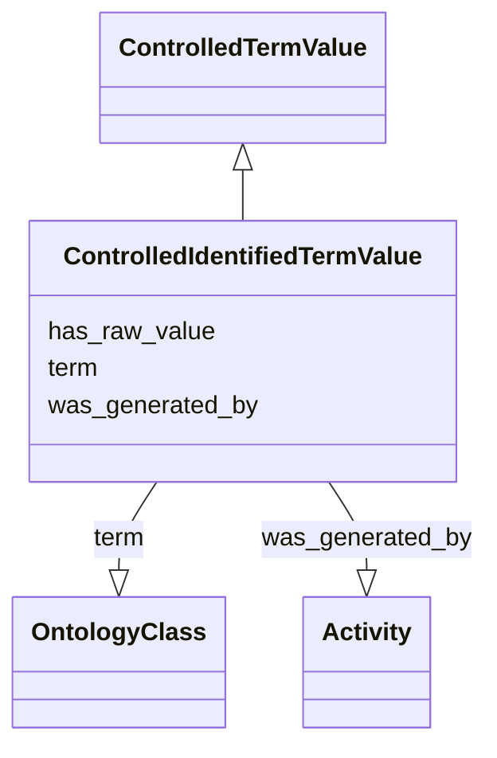

# Class: ControlledIdentifiedTermValue


_A controlled term or class from an ontology, requiring the presence of term with an id_


URI: [nmdc:ControlledIdentifiedTermValue](https://w3id.org/nmdc/ControlledIdentifiedTermValue)





## Inheritance
* [AttributeValue](AttributeValue.md)
    * [ControlledTermValue](ControlledTermValue.md)
        * **ControlledIdentifiedTermValue**


## Slots

| Name | Cardinality and Range | Description | Inheritance |
| ---  | --- | --- | --- |
| [term](term.md) | 1..1 <br/> [OntologyClass](OntologyClass.md) | pointer to an ontology class | [ControlledTermValue](ControlledTermValue.md) |
| [has_raw_value](has_raw_value.md) | 0..1 <br/> [String](String.md) | The value that was specified for an annotation in raw form, i | [AttributeValue](AttributeValue.md) |
| [was_generated_by](was_generated_by.md) | 0..1 <br/> [Activity](Activity.md) |  | [AttributeValue](AttributeValue.md) |


## Usages

| used by | used in | type | used |
| ---  | --- | --- | --- |
| [Biosample](Biosample.md) | [host_taxid](host_taxid.md) | range | [ControlledIdentifiedTermValue](ControlledIdentifiedTermValue.md) |
| [Biosample](Biosample.md) | [env_broad_scale](env_broad_scale.md) | range | [ControlledIdentifiedTermValue](ControlledIdentifiedTermValue.md) |
| [Biosample](Biosample.md) | [env_local_scale](env_local_scale.md) | range | [ControlledIdentifiedTermValue](ControlledIdentifiedTermValue.md) |
| [Biosample](Biosample.md) | [env_medium](env_medium.md) | range | [ControlledIdentifiedTermValue](ControlledIdentifiedTermValue.md) |
| [Biosample](Biosample.md) | [samp_taxon_id](samp_taxon_id.md) | range | [ControlledIdentifiedTermValue](ControlledIdentifiedTermValue.md) |


## Identifier and Mapping Information


### Schema Source


* from schema: https://w3id.org/nmdc/nmdc


## Mappings

| Mapping Type | Mapped Value |
| ---  | ---  |
| self | nmdc:ControlledIdentifiedTermValue |
| native | nmdc:ControlledIdentifiedTermValue |


## LinkML Source

<!-- TODO: investigate https://stackoverflow.com/questions/37606292/how-to-create-tabbed-code-blocks-in-mkdocs-or-sphinx -->

### Direct

<details>
```yaml
name: ControlledIdentifiedTermValue
description: A controlled term or class from an ontology, requiring the presence of
  term with an id
notes:
- To be used for slots like env_broad_scale
from_schema: https://w3id.org/nmdc/nmdc
is_a: ControlledTermValue
slot_usage:
  term:
    name: term
    domain_of:
    - ControlledTermValue
    required: true

```
</details>

### Induced

<details>
```yaml
name: ControlledIdentifiedTermValue
description: A controlled term or class from an ontology, requiring the presence of
  term with an id
notes:
- To be used for slots like env_broad_scale
from_schema: https://w3id.org/nmdc/nmdc
is_a: ControlledTermValue
slot_usage:
  term:
    name: term
    domain_of:
    - ControlledTermValue
    required: true
attributes:
  term:
    name: term
    description: pointer to an ontology class
    from_schema: https://w3id.org/nmdc/nmdc
    rank: 1000
    domain: ControlledTermValue
    alias: term
    owner: ControlledIdentifiedTermValue
    domain_of:
    - ControlledTermValue
    range: OntologyClass
    required: true
    inlined: true
  has_raw_value:
    name: has_raw_value
    description: The value that was specified for an annotation in raw form, i.e.
      a string. E.g. "2 cm" or "2-4 cm"
    from_schema: https://w3id.org/nmdc/nmdc
    rank: 1000
    domain: AttributeValue
    multivalued: false
    alias: has_raw_value
    owner: ControlledIdentifiedTermValue
    domain_of:
    - AttributeValue
    - QuantityValue
    range: string
  was_generated_by:
    name: was_generated_by
    from_schema: https://w3id.org/nmdc/nmdc
    mappings:
    - prov:wasGeneratedBy
    rank: 1000
    alias: was_generated_by
    owner: ControlledIdentifiedTermValue
    domain_of:
    - DataObject
    - AttributeValue
    - FunctionalAnnotation
    range: Activity

```
</details>