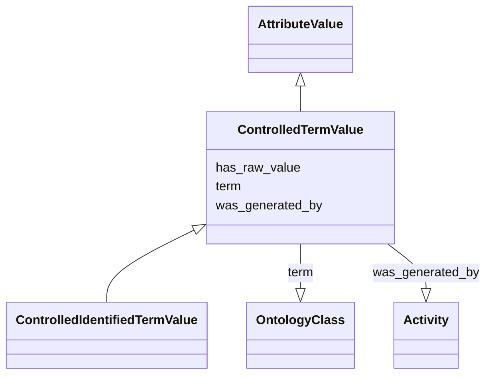

# Class: ControlledTermValue


_A controlled term or class from an ontology_


URI: [nmdc:ControlledTermValue](https://w3id.org/nmdc/ControlledTermValue)





## Inheritance
* [AttributeValue](AttributeValue.md)
    * **ControlledTermValue**
        * [ControlledIdentifiedTermValue](ControlledIdentifiedTermValue.md)


## Slots

| Name | Cardinality and Range | Description | Inheritance |
| ---  | --- | --- | --- |
| [term](term.md) | 0..1 <br/> [OntologyClass](OntologyClass.md) | pointer to an ontology class | direct |
| [has_raw_value](has_raw_value.md) | 0..1 <br/> [String](String.md) | The value that was specified for an annotation in raw form, i | [AttributeValue](AttributeValue.md) |
| [was_generated_by](was_generated_by.md) | 0..1 <br/> [Activity](Activity.md) |  | [AttributeValue](AttributeValue.md) |


## Usages

| used by | used in | type | used |
| ---  | --- | --- | --- |
| [Biosample](Biosample.md) | [chem_administration](chem_administration.md) | range | [ControlledTermValue](ControlledTermValue.md) |
| [Biosample](Biosample.md) | [experimental_factor](experimental_factor.md) | range | [ControlledTermValue](ControlledTermValue.md) |
| [Biosample](Biosample.md) | [growth_facil](growth_facil.md) | range | [ControlledTermValue](ControlledTermValue.md) |
| [Biosample](Biosample.md) | [host_body_product](host_body_product.md) | range | [ControlledTermValue](ControlledTermValue.md) |
| [Biosample](Biosample.md) | [host_body_site](host_body_site.md) | range | [ControlledTermValue](ControlledTermValue.md) |
| [Biosample](Biosample.md) | [host_phenotype](host_phenotype.md) | range | [ControlledTermValue](ControlledTermValue.md) |
| [Biosample](Biosample.md) | [plant_growth_med](plant_growth_med.md) | range | [ControlledTermValue](ControlledTermValue.md) |
| [Biosample](Biosample.md) | [plant_struc](plant_struc.md) | range | [ControlledTermValue](ControlledTermValue.md) |
| [Biosample](Biosample.md) | [samp_mat_process](samp_mat_process.md) | range | [ControlledTermValue](ControlledTermValue.md) |
| [OmicsProcessing](OmicsProcessing.md) | [omics_type](omics_type.md) | range | [ControlledTermValue](ControlledTermValue.md) |
| [ControlledTermValue](ControlledTermValue.md) | [term](term.md) | domain | [ControlledTermValue](ControlledTermValue.md) |
| [ControlledIdentifiedTermValue](ControlledIdentifiedTermValue.md) | [term](term.md) | domain | [ControlledTermValue](ControlledTermValue.md) |


## TODOs

* add fields for ontology, branch

## Identifier and Mapping Information


### Schema Source


* from schema: https://w3id.org/nmdc/nmdc


## Mappings

| Mapping Type | Mapped Value |
| ---  | ---  |
| self | nmdc:ControlledTermValue |
| native | nmdc:ControlledTermValue |


## LinkML Source

<!-- TODO: investigate https://stackoverflow.com/questions/37606292/how-to-create-tabbed-code-blocks-in-mkdocs-or-sphinx -->

### Direct

<details>
```yaml
name: ControlledTermValue
description: A controlled term or class from an ontology
todos:
- add fields for ontology, branch
from_schema: https://w3id.org/nmdc/nmdc
is_a: AttributeValue
slots:
- term

```
</details>

### Induced

<details>
```yaml
name: ControlledTermValue
description: A controlled term or class from an ontology
todos:
- add fields for ontology, branch
from_schema: https://w3id.org/nmdc/nmdc
is_a: AttributeValue
attributes:
  term:
    name: term
    description: pointer to an ontology class
    notes:
    - 'removed ''slot_uri: rdf:type'''
    from_schema: https://w3id.org/nmdc/nmdc
    rank: 1000
    domain: ControlledTermValue
    alias: term
    owner: ControlledTermValue
    domain_of:
    - ControlledTermValue
    range: OntologyClass
    inlined: true
  has_raw_value:
    name: has_raw_value
    description: The value that was specified for an annotation in raw form, i.e.
      a string. E.g. "2 cm" or "2-4 cm"
    from_schema: https://w3id.org/nmdc/nmdc
    rank: 1000
    domain: AttributeValue
    multivalued: false
    alias: has_raw_value
    owner: ControlledTermValue
    domain_of:
    - AttributeValue
    - QuantityValue
    range: string
  was_generated_by:
    name: was_generated_by
    from_schema: https://w3id.org/nmdc/nmdc
    mappings:
    - prov:wasGeneratedBy
    rank: 1000
    alias: was_generated_by
    owner: ControlledTermValue
    domain_of:
    - DataObject
    - AttributeValue
    - FunctionalAnnotation
    range: Activity

```
</details>