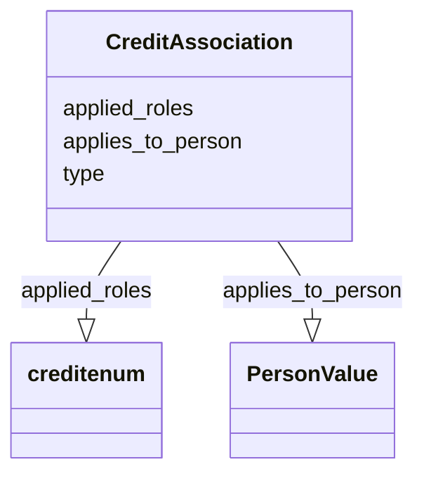

# Class: CreditAssociation


_This class supports binding associated researchers to studies.  There will be at least a slot for a CRediT Contributor Role and for a person value. Specifically see the associated researchers tab on the NMDC_SampleMetadata-V4_CommentsForUpdates  at https://docs.google.com/spreadsheets/d/1INlBo5eoqn2efn4H2P2i8rwRBtnbDVTqXrochJEAPko/edit#gid=0_


URI: [prov:Association](http://www.w3.org/ns/prov#Association)





<!-- no inheritance hierarchy -->


## Slots

| Name | Cardinality and Range | Description | Inheritance |
| ---  | --- | --- | --- |
| [applies_to_person](applies_to_person.md) | 1..1 <br/> [PersonValue](PersonValue.md) |  | direct |
| [applied_roles](applied_roles.md) | 1..* <br/> [CreditEnum](CreditEnum.md) |  | direct |
| [type](type.md) | 0..1 <br/> [String](String.md) | An optional string that specifies the type object | direct |


## Usages

| used by | used in | type | used |
| ---  | --- | --- | --- |
| [Study](Study.md) | [has_credit_associations](has_credit_associations.md) | range | [CreditAssociation](CreditAssociation.md) |
| [CreditAssociation](CreditAssociation.md) | [applies_to_person](applies_to_person.md) | domain | [CreditAssociation](CreditAssociation.md) |
| [CreditAssociation](CreditAssociation.md) | [applied_roles](applied_roles.md) | domain | [CreditAssociation](CreditAssociation.md) |


## Aliases


* study role
* credit table
* associated researchers


## See Also

* [https://casrai.org/credit/](https://casrai.org/credit/)

## Identifier and Mapping Information


### Schema Source


* from schema: https://w3id.org/nmdc/nmdc


## Mappings

| Mapping Type | Mapped Value |
| ---  | ---  |
| self | prov:Association |
| native | nmdc:CreditAssociation |


## LinkML Source

<!-- TODO: investigate https://stackoverflow.com/questions/37606292/how-to-create-tabbed-code-blocks-in-mkdocs-or-sphinx -->

### Direct

<details>
```yaml
name: CreditAssociation
description: This class supports binding associated researchers to studies.  There
  will be at least a slot for a CRediT Contributor Role and for a person value. Specifically
  see the associated researchers tab on the NMDC_SampleMetadata-V4_CommentsForUpdates  at
  https://docs.google.com/spreadsheets/d/1INlBo5eoqn2efn4H2P2i8rwRBtnbDVTqXrochJEAPko/edit#gid=0
from_schema: https://w3id.org/nmdc/nmdc
see_also:
- https://casrai.org/credit/
aliases:
- study role
- credit table
- associated researchers
slots:
- applies_to_person
- applied_roles
- type
class_uri: prov:Association

```
</details>

### Induced

<details>
```yaml
name: CreditAssociation
description: This class supports binding associated researchers to studies.  There
  will be at least a slot for a CRediT Contributor Role and for a person value. Specifically
  see the associated researchers tab on the NMDC_SampleMetadata-V4_CommentsForUpdates  at
  https://docs.google.com/spreadsheets/d/1INlBo5eoqn2efn4H2P2i8rwRBtnbDVTqXrochJEAPko/edit#gid=0
from_schema: https://w3id.org/nmdc/nmdc
see_also:
- https://casrai.org/credit/
aliases:
- study role
- credit table
- associated researchers
attributes:
  applies_to_person:
    name: applies_to_person
    from_schema: https://w3id.org/nmdc/nmdc
    rank: 1000
    domain: CreditAssociation
    alias: applies_to_person
    owner: CreditAssociation
    domain_of:
    - CreditAssociation
    range: PersonValue
    required: true
  applied_roles:
    name: applied_roles
    annotations:
      display_hint:
        tag: display_hint
        value: 'Identify all CRediT roles associated with this contributor. CRediT
          Information: https://info.orcid.org/credit-for-research-contribution ; CRediT:
          https://credit.niso.org/'
    from_schema: https://w3id.org/nmdc/nmdc
    rank: 1000
    domain: CreditAssociation
    multivalued: true
    alias: applied_roles
    owner: CreditAssociation
    domain_of:
    - CreditAssociation
    range: credit enum
    required: true
  type:
    name: type
    description: An optional string that specifies the type object.  This is used
      to allow for searches for different kinds of objects.
    deprecated: Due to confusion about what values are used for this slot, it is best
      not to use this slot. See https://github.com/microbiomedata/nmdc-schema/issues/248.
      MAM removed designates_type and rdf:type slot uri 2022-11-30
    examples:
    - value: nmdc:Biosample
    - value: nmdc:Study
    from_schema: https://w3id.org/nmdc/nmdc
    see_also:
    - https://github.com/microbiomedata/nmdc-schema/issues/1233
    rank: 1000
    alias: type
    owner: CreditAssociation
    domain_of:
    - DataObject
    - Biosample
    - Study
    - OmicsProcessing
    - CreditAssociation
    - WorkflowExecutionActivity
    - MetagenomeAssembly
    - MetagenomeAnnotationActivity
    - MetatranscriptomeAnnotationActivity
    - MetatranscriptomeActivity
    - MagsAnalysisActivity
    - ReadQcAnalysisActivity
    - ReadBasedTaxonomyAnalysisActivity
    - MagBin
    - GenomeFeature
    range: string
class_uri: prov:Association

```
</details>