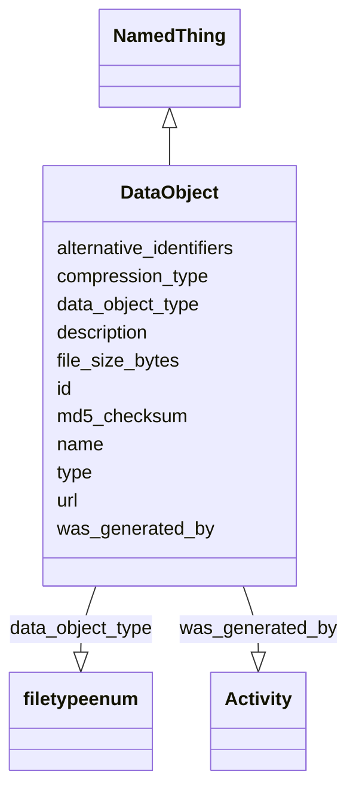

# Class: DataObject


_An object that primarily consists of symbols that represent information.   Files, records, and omics data are examples of data objects._


URI: [nmdc:DataObject](https://w3id.org/nmdc/DataObject)





## Inheritance
* [NamedThing](NamedThing.md)
    * **DataObject**


## Slots

| Name | Cardinality and Range | Description | Inheritance |
| ---  | --- | --- | --- |
| [file_size_bytes](file_size_bytes.md) | 0..1 <br/> [Bytes](Bytes.md) | Size of the file in bytes | direct |
| [md5_checksum](md5_checksum.md) | 0..1 <br/> [String](String.md) | MD5 checksum of file (pre-compressed) | direct |
| [data_object_type](data_object_type.md) | 0..1 <br/> [FileTypeEnum](FileTypeEnum.md) | The type of file represented by the data object | direct |
| [compression_type](compression_type.md) | 0..1 <br/> [String](String.md) | If provided, specifies the compression type | direct |
| [was_generated_by](was_generated_by.md) | 0..1 <br/> [Activity](Activity.md) |  | direct |
| [url](url.md) | 0..1 <br/> [String](String.md) |  | direct |
| [type](type.md) | 0..1 <br/> [String](String.md) | An optional string that specifies the type object | direct |
| [id](id.md) | 1..1 <br/> [Uriorcurie](Uriorcurie.md) | A unique identifier for a thing | [NamedThing](NamedThing.md) |
| [name](name.md) | 1..1 <br/> [String](String.md) | A human readable label for an entity | [NamedThing](NamedThing.md) |
| [description](description.md) | 1..1 <br/> [String](String.md) | a human-readable description of a thing | [NamedThing](NamedThing.md) |
| [alternative_identifiers](alternative_identifiers.md) | 0..* <br/> [Uriorcurie](Uriorcurie.md) | A list of alternative identifiers for the entity | [NamedThing](NamedThing.md) |


## Usages

| used by | used in | type | used |
| ---  | --- | --- | --- |
| [Database](Database.md) | [data_object_set](data_object_set.md) | range | [DataObject](DataObject.md) |
| [DataObject](DataObject.md) | [file_size_bytes](file_size_bytes.md) | domain | [DataObject](DataObject.md) |
| [DataObject](DataObject.md) | [data_object_type](data_object_type.md) | domain | [DataObject](DataObject.md) |
| [OmicsProcessing](OmicsProcessing.md) | [has_output](has_output.md) | range | [DataObject](DataObject.md) |


## Identifier and Mapping Information


### Schema Source


* from schema: https://w3id.org/nmdc/nmdc


## Mappings

| Mapping Type | Mapped Value |
| ---  | ---  |
| self | nmdc:DataObject |
| native | nmdc:DataObject |


## LinkML Source

<!-- TODO: investigate https://stackoverflow.com/questions/37606292/how-to-create-tabbed-code-blocks-in-mkdocs-or-sphinx -->

### Direct

<details>
```yaml
name: DataObject
description: An object that primarily consists of symbols that represent information.   Files,
  records, and omics data are examples of data objects.
in_subset:
- data object subset
from_schema: https://w3id.org/nmdc/nmdc
is_a: NamedThing
slots:
- file_size_bytes
- md5_checksum
- data_object_type
- compression_type
- was_generated_by
- url
- type
slot_usage:
  name:
    name: name
    domain_of:
    - Protocol
    - QualityControlReport
    - NamedThing
    - PersonValue
    - Activity
    required: true
  description:
    name: description
    domain_of:
    - Study
    - NamedThing
    - ImageValue
    required: true
  id:
    name: id
    domain_of:
    - Biosample
    - Study
    - NamedThing
    - Activity
    required: true
    structured_pattern:
      syntax: '{id_nmdc_prefix}:dobj-{id_shoulder}-{id_blade}{id_version}{id_locus}'
      interpolated: true

```
</details>

### Induced

<details>
```yaml
name: DataObject
description: An object that primarily consists of symbols that represent information.   Files,
  records, and omics data are examples of data objects.
in_subset:
- data object subset
from_schema: https://w3id.org/nmdc/nmdc
is_a: NamedThing
slot_usage:
  name:
    name: name
    domain_of:
    - Protocol
    - QualityControlReport
    - NamedThing
    - PersonValue
    - Activity
    required: true
  description:
    name: description
    domain_of:
    - Study
    - NamedThing
    - ImageValue
    required: true
  id:
    name: id
    domain_of:
    - Biosample
    - Study
    - NamedThing
    - Activity
    required: true
    structured_pattern:
      syntax: '{id_nmdc_prefix}:dobj-{id_shoulder}-{id_blade}{id_version}{id_locus}'
      interpolated: true
attributes:
  file_size_bytes:
    name: file_size_bytes
    description: Size of the file in bytes
    from_schema: https://w3id.org/nmdc/nmdc
    rank: 1000
    domain: DataObject
    alias: file_size_bytes
    owner: DataObject
    domain_of:
    - DataObject
    range: bytes
  md5_checksum:
    name: md5_checksum
    description: MD5 checksum of file (pre-compressed)
    from_schema: https://w3id.org/nmdc/nmdc
    rank: 1000
    alias: md5_checksum
    owner: DataObject
    domain_of:
    - DataObject
    range: string
  data_object_type:
    name: data_object_type
    description: The type of file represented by the data object.
    examples:
    - value: FT ICR-MS Analysis Results
    - value: GC-MS Metabolomics Results
    from_schema: https://w3id.org/nmdc/nmdc
    rank: 1000
    domain: DataObject
    alias: data_object_type
    owner: DataObject
    domain_of:
    - DataObject
    range: file type enum
  compression_type:
    name: compression_type
    description: If provided, specifies the compression type
    todos:
    - consider setting the range to an enum
    examples:
    - value: gzip
    from_schema: https://w3id.org/nmdc/nmdc
    rank: 1000
    alias: compression_type
    owner: DataObject
    domain_of:
    - DataObject
    range: string
  was_generated_by:
    name: was_generated_by
    from_schema: https://w3id.org/nmdc/nmdc
    mappings:
    - prov:wasGeneratedBy
    rank: 1000
    alias: was_generated_by
    owner: DataObject
    domain_of:
    - DataObject
    - AttributeValue
    - FunctionalAnnotation
    range: Activity
  url:
    name: url
    notes:
    - See issue 207 - this clashes with the mixs field
    from_schema: https://w3id.org/nmdc/nmdc
    rank: 1000
    alias: url
    owner: DataObject
    domain_of:
    - Protocol
    - DataObject
    - ImageValue
    range: string
  type:
    name: type
    description: An optional string that specifies the type object.  This is used
      to allow for searches for different kinds of objects.
    deprecated: Due to confusion about what values are used for this slot, it is best
      not to use this slot. See https://github.com/microbiomedata/nmdc-schema/issues/248.
      MAM removed designates_type and rdf:type slot uri 2022-11-30
    examples:
    - value: nmdc:Biosample
    - value: nmdc:Study
    from_schema: https://w3id.org/nmdc/nmdc
    see_also:
    - https://github.com/microbiomedata/nmdc-schema/issues/1233
    rank: 1000
    alias: type
    owner: DataObject
    domain_of:
    - DataObject
    - Biosample
    - Study
    - OmicsProcessing
    - CreditAssociation
    - WorkflowExecutionActivity
    - MetagenomeAssembly
    - MetagenomeAnnotationActivity
    - MetatranscriptomeAnnotationActivity
    - MetatranscriptomeActivity
    - MagsAnalysisActivity
    - ReadQcAnalysisActivity
    - ReadBasedTaxonomyAnalysisActivity
    - MagBin
    - GenomeFeature
    range: string
  id:
    name: id
    description: A unique identifier for a thing. Must be either a CURIE shorthand
      for a URI or a complete URI
    from_schema: https://w3id.org/nmdc/nmdc
    rank: 1000
    identifier: true
    alias: id
    owner: DataObject
    domain_of:
    - Biosample
    - Study
    - NamedThing
    - Activity
    range: uriorcurie
    required: true
    pattern: ^[a-zA-Z0-9][a-zA-Z0-9_\.]+:[a-zA-Z0-9_][a-zA-Z0-9_\-\/\.,]*$
    structured_pattern:
      syntax: '{id_nmdc_prefix}:dobj-{id_shoulder}-{id_blade}{id_version}{id_locus}'
      interpolated: true
  name:
    name: name
    description: A human readable label for an entity
    from_schema: https://w3id.org/nmdc/nmdc
    rank: 1000
    alias: name
    owner: DataObject
    domain_of:
    - Protocol
    - QualityControlReport
    - NamedThing
    - PersonValue
    - Activity
    range: string
    required: true
  description:
    name: description
    description: a human-readable description of a thing
    from_schema: https://w3id.org/nmdc/nmdc
    rank: 1000
    slot_uri: dcterms:description
    alias: description
    owner: DataObject
    domain_of:
    - Study
    - NamedThing
    - ImageValue
    range: string
    required: true
  alternative_identifiers:
    name: alternative_identifiers
    description: A list of alternative identifiers for the entity.
    from_schema: https://w3id.org/nmdc/nmdc
    rank: 1000
    multivalued: true
    alias: alternative_identifiers
    owner: DataObject
    domain_of:
    - Biosample
    - Study
    - NamedThing
    - MetaboliteQuantification
    range: uriorcurie
    pattern: ^[a-zA-Z0-9][a-zA-Z0-9_\.]+:[a-zA-Z0-9_][a-zA-Z0-9_\-\/\.,]*$

```
</details>