# Class: Database


_An abstract holder for any set of metadata and data. It does not need to correspond to an actual managed database top level holder class. When translated to JSON-Schema this is the 'root' object. It should contain pointers to other objects of interest. For MongoDB, the lists of objects that Database slots point to correspond to **collections**._


URI: [nmdc:Database](https://w3id.org/nmdc/Database)

```mermaid
 classDiagram
    class Database
      Database : activity_set
        
          Database --|> WorkflowExecutionActivity : activity_set
        
      Database : biosample_set
        
          Database --|> Biosample : biosample_set
        
      Database : collecting_biosamples_from_site_set
        
          Database --|> CollectingBiosamplesFromSite : collecting_biosamples_from_site_set
        
      Database : data_object_set
        
          Database --|> DataObject : data_object_set
        
      Database : extraction_set
        
          Database --|> Extraction : extraction_set
        
      Database : field_research_site_set
        
          Database --|> FieldResearchSite : field_research_site_set
        
      Database : functional_annotation_agg
        
          Database --|> FunctionalAnnotationAggMember : functional_annotation_agg
        
      Database : functional_annotation_set
        
          Database --|> FunctionalAnnotation : functional_annotation_set
        
      Database : genome_feature_set
        
          Database --|> GenomeFeature : genome_feature_set
        
      Database : library_preparation_set
        
          Database --|> LibraryPreparation : library_preparation_set
        
      Database : mags_activity_set
        
          Database --|> MagsAnalysisActivity : mags_activity_set
        
      Database : metabolomics_analysis_activity_set
        
          Database --|> MetabolomicsAnalysisActivity : metabolomics_analysis_activity_set
        
      Database : metagenome_annotation_activity_set
        
          Database --|> MetagenomeAnnotationActivity : metagenome_annotation_activity_set
        
      Database : metagenome_assembly_set
        
          Database --|> MetagenomeAssembly : metagenome_assembly_set
        
      Database : metagenome_sequencing_activity_set
        
          Database --|> MetagenomeSequencingActivity : metagenome_sequencing_activity_set
        
      Database : metaproteomics_analysis_activity_set
        
          Database --|> MetaproteomicsAnalysisActivity : metaproteomics_analysis_activity_set
        
      Database : metatranscriptome_activity_set
        
          Database --|> MetatranscriptomeActivity : metatranscriptome_activity_set
        
      Database : nom_analysis_activity_set
        
          Database --|> NomAnalysisActivity : nom_analysis_activity_set
        
      Database : omics_processing_set
        
          Database --|> OmicsProcessing : omics_processing_set
        
      Database : planned_process_set
        
          Database --|> PlannedProcess : planned_process_set
        
      Database : pooling_set
        
          Database --|> Pooling : pooling_set
        
      Database : processed_sample_set
        
          Database --|> ProcessedSample : processed_sample_set
        
      Database : read_based_taxonomy_analysis_activity_set
        
          Database --|> ReadBasedTaxonomyAnalysisActivity : read_based_taxonomy_analysis_activity_set
        
      Database : read_qc_analysis_activity_set
        
          Database --|> ReadQcAnalysisActivity : read_qc_analysis_activity_set
        
      Database : study_set
        
          Database --|> Study : study_set
        
      
```





<!-- no inheritance hierarchy -->


## Slots

| Name | Cardinality and Range | Description | Inheritance |
| ---  | --- | --- | --- |
| [activity_set](activity_set.md) | 0..* <br/> [WorkflowExecutionActivity](WorkflowExecutionActivity.md) | This property links a database object to the set of workflow activities | direct |
| [biosample_set](biosample_set.md) | 0..* <br/> [Biosample](Biosample.md) | This property links a database object to the set of samples within it | direct |
| [collecting_biosamples_from_site_set](collecting_biosamples_from_site_set.md) | 0..* <br/> [CollectingBiosamplesFromSite](CollectingBiosamplesFromSite.md) |  | direct |
| [data_object_set](data_object_set.md) | 0..* <br/> [DataObject](DataObject.md) | This property links a database object to the set of data objects within it | direct |
| [extraction_set](extraction_set.md) | 0..* <br/> [Extraction](Extraction.md) | This property links a database object to the set of extractions within it | direct |
| [field_research_site_set](field_research_site_set.md) | 0..* <br/> [FieldResearchSite](FieldResearchSite.md) |  | direct |
| [functional_annotation_agg](functional_annotation_agg.md) | 0..* <br/> [FunctionalAnnotationAggMember](FunctionalAnnotationAggMember.md) |  | direct |
| [functional_annotation_set](functional_annotation_set.md) | 0..* <br/> [FunctionalAnnotation](FunctionalAnnotation.md) | This property links a database object to the set of all functional annotation... | direct |
| [genome_feature_set](genome_feature_set.md) | 0..* <br/> [GenomeFeature](GenomeFeature.md) | This property links a database object to the set of all features | direct |
| [library_preparation_set](library_preparation_set.md) | 0..* <br/> [LibraryPreparation](LibraryPreparation.md) | This property links a database object to the set of DNA extractions within it | direct |
| [mags_activity_set](mags_activity_set.md) | 0..* <br/> [MagsAnalysisActivity](MagsAnalysisActivity.md) | This property links a database object to the set of MAGs analysis activities | direct |
| [metabolomics_analysis_activity_set](metabolomics_analysis_activity_set.md) | 0..* <br/> [MetabolomicsAnalysisActivity](MetabolomicsAnalysisActivity.md) | This property links a database object to the set of metabolomics analysis act... | direct |
| [metagenome_annotation_activity_set](metagenome_annotation_activity_set.md) | 0..* <br/> [MetagenomeAnnotationActivity](MetagenomeAnnotationActivity.md) | This property links a database object to the set of metagenome annotation act... | direct |
| [metagenome_assembly_set](metagenome_assembly_set.md) | 0..* <br/> [MetagenomeAssembly](MetagenomeAssembly.md) | This property links a database object to the set of metagenome assembly activ... | direct |
| [metagenome_sequencing_activity_set](metagenome_sequencing_activity_set.md) | 0..* <br/> [MetagenomeSequencingActivity](MetagenomeSequencingActivity.md) | This property links a database object to the set of metagenome sequencing act... | direct |
| [metaproteomics_analysis_activity_set](metaproteomics_analysis_activity_set.md) | 0..* <br/> [MetaproteomicsAnalysisActivity](MetaproteomicsAnalysisActivity.md) | This property links a database object to the set of metaproteomics analysis a... | direct |
| [metatranscriptome_activity_set](metatranscriptome_activity_set.md) | 0..* <br/> [MetatranscriptomeActivity](MetatranscriptomeActivity.md) | This property links a database object to the set of metatranscriptome analysi... | direct |
| [nom_analysis_activity_set](nom_analysis_activity_set.md) | 0..* <br/> [NomAnalysisActivity](NomAnalysisActivity.md) | This property links a database object to the set of natural organic matter (N... | direct |
| [omics_processing_set](omics_processing_set.md) | 0..* <br/> [OmicsProcessing](OmicsProcessing.md) | This property links a database object to the set of omics processings within ... | direct |
| [planned_process_set](planned_process_set.md) | 0..* <br/> [PlannedProcess](PlannedProcess.md) | This property links a database object to the set of planned processes within ... | direct |
| [pooling_set](pooling_set.md) | 0..* <br/> [Pooling](Pooling.md) |  | direct |
| [processed_sample_set](processed_sample_set.md) | 0..* <br/> [ProcessedSample](ProcessedSample.md) | This property links a database object to the set of processed samples within ... | direct |
| [read_based_taxonomy_analysis_activity_set](read_based_taxonomy_analysis_activity_set.md) | 0..* <br/> [ReadBasedTaxonomyAnalysisActivity](ReadBasedTaxonomyAnalysisActivity.md) | This property links a database object to the set of read based analysis activ... | direct |
| [read_qc_analysis_activity_set](read_qc_analysis_activity_set.md) | 0..* <br/> [ReadQcAnalysisActivity](ReadQcAnalysisActivity.md) | This property links a database object to the set of read QC analysis activiti... | direct |
| [study_set](study_set.md) | 0..* <br/> [Study](Study.md) | This property links a database object to the set of studies within it | direct |


## Usages

| used by | used in | type | used |
| ---  | --- | --- | --- |
| [Database](Database.md) | [activity_set](activity_set.md) | domain | [Database](Database.md) |
| [Database](Database.md) | [biosample_set](biosample_set.md) | domain | [Database](Database.md) |
| [Database](Database.md) | [collecting_biosamples_from_site_set](collecting_biosamples_from_site_set.md) | domain | [Database](Database.md) |
| [Database](Database.md) | [data_object_set](data_object_set.md) | domain | [Database](Database.md) |
| [Database](Database.md) | [extraction_set](extraction_set.md) | domain | [Database](Database.md) |
| [Database](Database.md) | [field_research_site_set](field_research_site_set.md) | domain | [Database](Database.md) |
| [Database](Database.md) | [functional_annotation_agg](functional_annotation_agg.md) | domain | [Database](Database.md) |
| [Database](Database.md) | [functional_annotation_set](functional_annotation_set.md) | domain | [Database](Database.md) |
| [Database](Database.md) | [genome_feature_set](genome_feature_set.md) | domain | [Database](Database.md) |
| [Database](Database.md) | [library_preparation_set](library_preparation_set.md) | domain | [Database](Database.md) |
| [Database](Database.md) | [mags_activity_set](mags_activity_set.md) | domain | [Database](Database.md) |
| [Database](Database.md) | [metabolomics_analysis_activity_set](metabolomics_analysis_activity_set.md) | domain | [Database](Database.md) |
| [Database](Database.md) | [metagenome_annotation_activity_set](metagenome_annotation_activity_set.md) | domain | [Database](Database.md) |
| [Database](Database.md) | [metagenome_assembly_set](metagenome_assembly_set.md) | domain | [Database](Database.md) |
| [Database](Database.md) | [metagenome_sequencing_activity_set](metagenome_sequencing_activity_set.md) | domain | [Database](Database.md) |
| [Database](Database.md) | [metaproteomics_analysis_activity_set](metaproteomics_analysis_activity_set.md) | domain | [Database](Database.md) |
| [Database](Database.md) | [metatranscriptome_activity_set](metatranscriptome_activity_set.md) | domain | [Database](Database.md) |
| [Database](Database.md) | [nom_analysis_activity_set](nom_analysis_activity_set.md) | domain | [Database](Database.md) |
| [Database](Database.md) | [omics_processing_set](omics_processing_set.md) | domain | [Database](Database.md) |
| [Database](Database.md) | [planned_process_set](planned_process_set.md) | domain | [Database](Database.md) |
| [Database](Database.md) | [pooling_set](pooling_set.md) | domain | [Database](Database.md) |
| [Database](Database.md) | [processed_sample_set](processed_sample_set.md) | domain | [Database](Database.md) |
| [Database](Database.md) | [read_based_taxonomy_analysis_activity_set](read_based_taxonomy_analysis_activity_set.md) | domain | [Database](Database.md) |
| [Database](Database.md) | [read_qc_analysis_activity_set](read_qc_analysis_activity_set.md) | domain | [Database](Database.md) |
| [Database](Database.md) | [study_set](study_set.md) | domain | [Database](Database.md) |


## Aliases


* NMDC metadata object


## Identifier and Mapping Information


### Schema Source


* from schema: https://w3id.org/nmdc/nmdc


## Mappings

| Mapping Type | Mapped Value |
| ---  | ---  |
| self | nmdc:Database |
| native | nmdc:Database |


## LinkML Source

<!-- TODO: investigate https://stackoverflow.com/questions/37606292/how-to-create-tabbed-code-blocks-in-mkdocs-or-sphinx -->

### Direct

<details>
```yaml
name: Database
description: An abstract holder for any set of metadata and data. It does not need
  to correspond to an actual managed database top level holder class. When translated
  to JSON-Schema this is the 'root' object. It should contain pointers to other objects
  of interest. For MongoDB, the lists of objects that Database slots point to correspond
  to **collections**.
from_schema: https://w3id.org/nmdc/nmdc
aliases:
- NMDC metadata object
slots:
- activity_set
- biosample_set
- collecting_biosamples_from_site_set
- data_object_set
- extraction_set
- field_research_site_set
- functional_annotation_agg
- functional_annotation_set
- genome_feature_set
- library_preparation_set
- mags_activity_set
- metabolomics_analysis_activity_set
- metagenome_annotation_activity_set
- metagenome_assembly_set
- metagenome_sequencing_activity_set
- metaproteomics_analysis_activity_set
- metatranscriptome_activity_set
- nom_analysis_activity_set
- omics_processing_set
- planned_process_set
- pooling_set
- processed_sample_set
- read_based_taxonomy_analysis_activity_set
- read_qc_analysis_activity_set
- study_set
tree_root: true

```
</details>

### Induced

<details>
```yaml
name: Database
description: An abstract holder for any set of metadata and data. It does not need
  to correspond to an actual managed database top level holder class. When translated
  to JSON-Schema this is the 'root' object. It should contain pointers to other objects
  of interest. For MongoDB, the lists of objects that Database slots point to correspond
  to **collections**.
from_schema: https://w3id.org/nmdc/nmdc
aliases:
- NMDC metadata object
attributes:
  activity_set:
    name: activity_set
    description: This property links a database object to the set of workflow activities.
    from_schema: https://w3id.org/nmdc/nmdc
    rank: 1000
    mixins:
    - object_set
    domain: Database
    multivalued: true
    alias: activity_set
    owner: Database
    domain_of:
    - Database
    range: WorkflowExecutionActivity
    inlined_as_list: true
  biosample_set:
    name: biosample_set
    description: This property links a database object to the set of samples within
      it.
    from_schema: https://w3id.org/nmdc/nmdc
    rank: 1000
    mixins:
    - object_set
    domain: Database
    multivalued: true
    alias: biosample_set
    owner: Database
    domain_of:
    - Database
    range: Biosample
    inlined_as_list: true
  collecting_biosamples_from_site_set:
    name: collecting_biosamples_from_site_set
    from_schema: https://w3id.org/nmdc/nmdc
    rank: 1000
    mixins:
    - object_set
    domain: Database
    multivalued: true
    alias: collecting_biosamples_from_site_set
    owner: Database
    domain_of:
    - Database
    range: CollectingBiosamplesFromSite
    inlined_as_list: true
  data_object_set:
    name: data_object_set
    description: This property links a database object to the set of data objects
      within it.
    from_schema: https://w3id.org/nmdc/nmdc
    rank: 1000
    mixins:
    - object_set
    domain: Database
    multivalued: true
    alias: data_object_set
    owner: Database
    domain_of:
    - Database
    range: DataObject
    inlined_as_list: true
  extraction_set:
    name: extraction_set
    description: This property links a database object to the set of extractions within
      it.
    from_schema: https://w3id.org/nmdc/nmdc
    rank: 1000
    mixins:
    - object_set
    domain: Database
    multivalued: true
    alias: extraction_set
    owner: Database
    domain_of:
    - Database
    range: Extraction
    inlined_as_list: true
  field_research_site_set:
    name: field_research_site_set
    from_schema: https://w3id.org/nmdc/nmdc
    rank: 1000
    mixins:
    - object_set
    domain: Database
    multivalued: true
    alias: field_research_site_set
    owner: Database
    domain_of:
    - Database
    range: FieldResearchSite
    inlined_as_list: true
  functional_annotation_agg:
    name: functional_annotation_agg
    from_schema: https://w3id.org/nmdc/nmdc
    rank: 1000
    domain: Database
    multivalued: true
    alias: functional_annotation_agg
    owner: Database
    domain_of:
    - Database
    range: FunctionalAnnotationAggMember
    inlined: true
    inlined_as_list: true
  functional_annotation_set:
    name: functional_annotation_set
    description: This property links a database object to the set of all functional
      annotations
    from_schema: https://w3id.org/nmdc/nmdc
    rank: 1000
    mixins:
    - object_set
    domain: Database
    multivalued: true
    alias: functional_annotation_set
    owner: Database
    domain_of:
    - Database
    range: FunctionalAnnotation
    inlined_as_list: true
  genome_feature_set:
    name: genome_feature_set
    description: This property links a database object to the set of all features
    from_schema: https://w3id.org/nmdc/nmdc
    rank: 1000
    mixins:
    - object_set
    domain: Database
    multivalued: true
    alias: genome_feature_set
    owner: Database
    domain_of:
    - Database
    range: GenomeFeature
    inlined_as_list: true
  library_preparation_set:
    name: library_preparation_set
    description: This property links a database object to the set of DNA extractions
      within it.
    from_schema: https://w3id.org/nmdc/nmdc
    aliases:
    - library_construction_set
    rank: 1000
    mixins:
    - object_set
    domain: Database
    multivalued: true
    alias: library_preparation_set
    owner: Database
    domain_of:
    - Database
    range: LibraryPreparation
    inlined_as_list: true
  mags_activity_set:
    name: mags_activity_set
    description: This property links a database object to the set of MAGs analysis
      activities.
    from_schema: https://w3id.org/nmdc/nmdc
    rank: 1000
    mixins:
    - object_set
    domain: Database
    multivalued: true
    alias: mags_activity_set
    owner: Database
    domain_of:
    - Database
    range: MagsAnalysisActivity
    inlined_as_list: true
  metabolomics_analysis_activity_set:
    name: metabolomics_analysis_activity_set
    description: This property links a database object to the set of metabolomics
      analysis activities.
    from_schema: https://w3id.org/nmdc/nmdc
    rank: 1000
    mixins:
    - object_set
    domain: Database
    multivalued: true
    alias: metabolomics_analysis_activity_set
    owner: Database
    domain_of:
    - Database
    range: MetabolomicsAnalysisActivity
    inlined_as_list: true
  metagenome_annotation_activity_set:
    name: metagenome_annotation_activity_set
    description: This property links a database object to the set of metagenome annotation
      activities.
    from_schema: https://w3id.org/nmdc/nmdc
    rank: 1000
    mixins:
    - object_set
    domain: Database
    multivalued: true
    alias: metagenome_annotation_activity_set
    owner: Database
    domain_of:
    - Database
    range: MetagenomeAnnotationActivity
    inlined_as_list: true
  metagenome_assembly_set:
    name: metagenome_assembly_set
    description: This property links a database object to the set of metagenome assembly
      activities.
    from_schema: https://w3id.org/nmdc/nmdc
    rank: 1000
    mixins:
    - object_set
    domain: Database
    multivalued: true
    alias: metagenome_assembly_set
    owner: Database
    domain_of:
    - Database
    range: MetagenomeAssembly
    inlined_as_list: true
  metagenome_sequencing_activity_set:
    name: metagenome_sequencing_activity_set
    description: This property links a database object to the set of metagenome sequencing
      activities.
    from_schema: https://w3id.org/nmdc/nmdc
    rank: 1000
    mixins:
    - object_set
    domain: Database
    multivalued: true
    alias: metagenome_sequencing_activity_set
    owner: Database
    domain_of:
    - Database
    range: MetagenomeSequencingActivity
    inlined_as_list: true
  metaproteomics_analysis_activity_set:
    name: metaproteomics_analysis_activity_set
    description: This property links a database object to the set of metaproteomics
      analysis activities.
    from_schema: https://w3id.org/nmdc/nmdc
    rank: 1000
    mixins:
    - object_set
    domain: Database
    multivalued: true
    alias: metaproteomics_analysis_activity_set
    owner: Database
    domain_of:
    - Database
    range: MetaproteomicsAnalysisActivity
    inlined_as_list: true
  metatranscriptome_activity_set:
    name: metatranscriptome_activity_set
    description: This property links a database object to the set of metatranscriptome
      analysis activities.
    from_schema: https://w3id.org/nmdc/nmdc
    rank: 1000
    mixins:
    - object_set
    domain: Database
    multivalued: true
    alias: metatranscriptome_activity_set
    owner: Database
    domain_of:
    - Database
    range: MetatranscriptomeActivity
    inlined_as_list: true
  nom_analysis_activity_set:
    name: nom_analysis_activity_set
    description: This property links a database object to the set of natural organic
      matter (NOM) analysis activities.
    from_schema: https://w3id.org/nmdc/nmdc
    rank: 1000
    mixins:
    - object_set
    domain: Database
    multivalued: true
    alias: nom_analysis_activity_set
    owner: Database
    domain_of:
    - Database
    range: NomAnalysisActivity
    inlined_as_list: true
  omics_processing_set:
    name: omics_processing_set
    description: This property links a database object to the set of omics processings
      within it.
    from_schema: https://w3id.org/nmdc/nmdc
    rank: 1000
    mixins:
    - object_set
    domain: Database
    multivalued: true
    alias: omics_processing_set
    owner: Database
    domain_of:
    - Database
    range: OmicsProcessing
    inlined_as_list: true
  planned_process_set:
    name: planned_process_set
    description: This property links a database object to the set of planned processes
      within it.
    comments:
    - PlannedProcess instances aggregated by this slot will require the designated_class
      slot
    from_schema: https://w3id.org/nmdc/nmdc
    rank: 1000
    mixins:
    - object_set
    domain: Database
    multivalued: true
    alias: planned_process_set
    owner: Database
    domain_of:
    - Database
    range: PlannedProcess
    inlined_as_list: true
  pooling_set:
    name: pooling_set
    from_schema: https://w3id.org/nmdc/nmdc
    rank: 1000
    mixins:
    - object_set
    domain: Database
    multivalued: true
    alias: pooling_set
    owner: Database
    domain_of:
    - Database
    range: Pooling
    inlined_as_list: true
  processed_sample_set:
    name: processed_sample_set
    description: This property links a database object to the set of processed samples
      within it.
    from_schema: https://w3id.org/nmdc/nmdc
    rank: 1000
    mixins:
    - object_set
    domain: Database
    multivalued: true
    alias: processed_sample_set
    owner: Database
    domain_of:
    - Database
    range: ProcessedSample
    inlined_as_list: true
  read_based_taxonomy_analysis_activity_set:
    name: read_based_taxonomy_analysis_activity_set
    description: This property links a database object to the set of read based analysis
      activities.
    from_schema: https://w3id.org/nmdc/nmdc
    rank: 1000
    mixins:
    - object_set
    domain: Database
    multivalued: true
    alias: read_based_taxonomy_analysis_activity_set
    owner: Database
    domain_of:
    - Database
    range: ReadBasedTaxonomyAnalysisActivity
    inlined_as_list: true
  read_qc_analysis_activity_set:
    name: read_qc_analysis_activity_set
    description: This property links a database object to the set of read QC analysis
      activities.
    from_schema: https://w3id.org/nmdc/nmdc
    rank: 1000
    mixins:
    - object_set
    domain: Database
    multivalued: true
    alias: read_qc_analysis_activity_set
    owner: Database
    domain_of:
    - Database
    range: ReadQcAnalysisActivity
    inlined_as_list: true
  study_set:
    name: study_set
    description: This property links a database object to the set of studies within
      it.
    from_schema: https://w3id.org/nmdc/nmdc
    rank: 1000
    mixins:
    - object_set
    domain: Database
    multivalued: true
    alias: study_set
    owner: Database
    domain_of:
    - Database
    range: Study
    inlined_as_list: true
tree_root: true

```
</details>