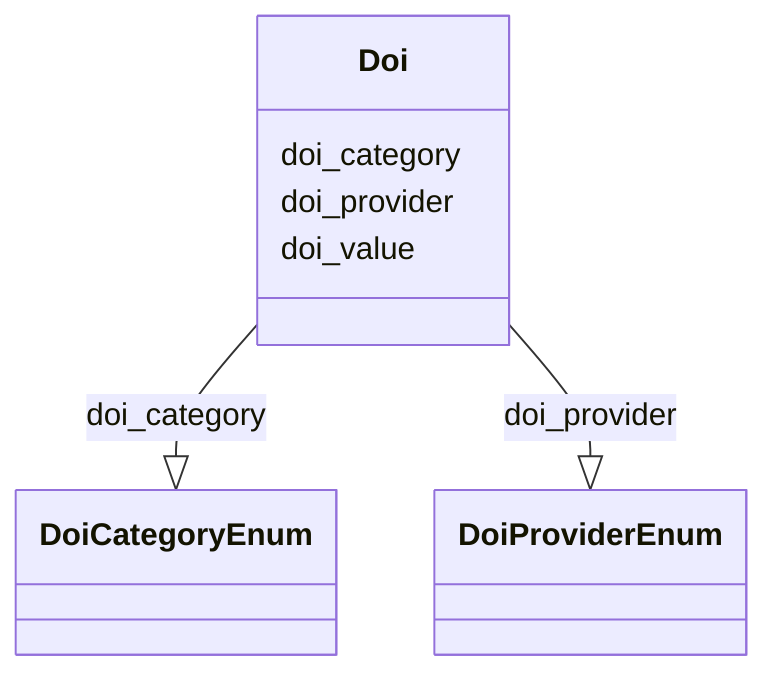

# Class: Doi


_A centrally registered identifier symbol used to uniquely identify objects given by the International DOI Foundation. The DOI system is particularly used for electronic documents._


URI: [nmdc:Doi](https://w3id.org/nmdc/Doi)





<!-- no inheritance hierarchy -->


## Slots

| Name | Cardinality and Range | Description | Inheritance |
| ---  | --- | --- | --- |
| [doi_value](doi_value.md) | 1..1 <br/> [Uriorcurie](Uriorcurie.md) | A digital object identifier, which is intended to persistantly identify some ... | direct |
| [doi_provider](doi_provider.md) | 0..1 <br/> [DoiProviderEnum](DoiProviderEnum.md) | The authority, or organization, the DOI is associated with | direct |
| [doi_category](doi_category.md) | 1..1 <br/> [DoiCategoryEnum](DoiCategoryEnum.md) | The resource type the corresponding doi resolves to | direct |


## Usages

| used by | used in | type | used |
| ---  | --- | --- | --- |
| [Doi](Doi.md) | [doi_value](doi_value.md) | domain | [Doi](Doi.md) |
| [Doi](Doi.md) | [doi_provider](doi_provider.md) | domain | [Doi](Doi.md) |
| [Doi](Doi.md) | [doi_category](doi_category.md) | domain | [Doi](Doi.md) |
| [Study](Study.md) | [associated_dois](associated_dois.md) | range | [Doi](Doi.md) |


## Aliases


* DOIs
* digital object identifiers


## Identifier and Mapping Information


### Schema Source


* from schema: https://w3id.org/nmdc/nmdc


## Mappings

| Mapping Type | Mapped Value |
| ---  | ---  |
| self | nmdc:Doi |
| native | nmdc:Doi |
| exact | OBI:0002110 |


## LinkML Source

<!-- TODO: investigate https://stackoverflow.com/questions/37606292/how-to-create-tabbed-code-blocks-in-mkdocs-or-sphinx -->

### Direct

<details>
```yaml
name: Doi
description: A centrally registered identifier symbol used to uniquely identify objects
  given by the International DOI Foundation. The DOI system is particularly used for
  electronic documents.
from_schema: https://w3id.org/nmdc/nmdc
aliases:
- DOIs
- digital object identifiers
exact_mappings:
- OBI:0002110
slots:
- doi_value
- doi_provider
- doi_category
rules:
- preconditions:
    slot_conditions:
      doi_category:
        name: doi_category
        any_of:
        - equals_string: dataset_doi
        - equals_string: award_doi
  postconditions:
    slot_conditions:
      doi_provider:
        name: doi_provider
        required: true
  description: If doi_category is a publication_doi, then doi_provider is not required.
    Otherwise, doi_provider is required.
  title: dataset_award_dois_required

```
</details>

### Induced

<details>
```yaml
name: Doi
description: A centrally registered identifier symbol used to uniquely identify objects
  given by the International DOI Foundation. The DOI system is particularly used for
  electronic documents.
from_schema: https://w3id.org/nmdc/nmdc
aliases:
- DOIs
- digital object identifiers
exact_mappings:
- OBI:0002110
attributes:
  doi_value:
    name: doi_value
    description: A digital object identifier, which is intended to persistantly identify
      some resource on the web.
    examples:
    - value: doi:10.46936/10.25585/60000880
      description: The DOI links to an electronic document.
    in_subset:
    - data_portal_subset
    from_schema: https://w3id.org/nmdc/nmdc
    aliases:
    - DOI
    - digital object identifier
    exact_mappings:
    - OBI:0002110
    narrow_mappings:
    - edam.data:1188
    rank: 1000
    domain: Doi
    alias: doi_value
    owner: Doi
    domain_of:
    - Doi
    range: uriorcurie
    required: true
    pattern: ^doi:10.\d{2,9}/.*$
  doi_provider:
    name: doi_provider
    description: The authority, or organization, the DOI is associated with.
    examples:
    - value: ess_dive
      description: The corresponding DOI is associated with ESS-DIVE.
    in_subset:
    - data_portal_subset
    from_schema: https://w3id.org/nmdc/nmdc
    close_mappings:
    - NCIT:C74932
    rank: 1000
    domain: Doi
    alias: doi_provider
    owner: Doi
    domain_of:
    - Doi
    range: DoiProviderEnum
  doi_category:
    name: doi_category
    description: The resource type the corresponding doi resolves to.
    examples:
    - value: dataset_doi
      description: The corresponding DOI is a dataset resource type.
    in_subset:
    - data_portal_subset
    from_schema: https://w3id.org/nmdc/nmdc
    rank: 1000
    domain: Doi
    alias: doi_category
    owner: Doi
    domain_of:
    - Doi
    range: DoiCategoryEnum
    required: true
rules:
- preconditions:
    slot_conditions:
      doi_category:
        name: doi_category
        any_of:
        - equals_string: dataset_doi
        - equals_string: award_doi
  postconditions:
    slot_conditions:
      doi_provider:
        name: doi_provider
        required: true
  description: If doi_category is a publication_doi, then doi_provider is not required.
    Otherwise, doi_provider is required.
  title: dataset_award_dois_required

```
</details>