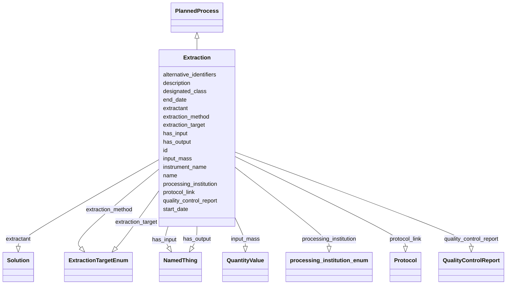

# Class: Extraction


_A material separation in which a desired component of an input material is separated from the remainder._


URI: [nmdc:Extraction](https://w3id.org/nmdc/Extraction)





## Inheritance
* [NamedThing](NamedThing.md)
    * [PlannedProcess](PlannedProcess.md)
        * **Extraction**


## Slots

| Name | Cardinality and Range | Description | Inheritance |
| ---  | --- | --- | --- |
| [extractant](extractant.md) | 0..1 <br/> [Solution](Solution.md) | The active component(s) primarily responsible for transfer of a solute from o... | direct |
| [extraction_method](extraction_method.md) | 0..1 <br/> [ExtractionTargetEnum](ExtractionTargetEnum.md) |  | direct |
| [extraction_target](extraction_target.md) | 0..1 <br/> [ExtractionTargetEnum](ExtractionTargetEnum.md) |  | direct |
| [input_mass](input_mass.md) | 0..1 <br/> [QuantityValue](QuantityValue.md) | Total mass of sample used in activity | direct |
| [quality_control_report](quality_control_report.md) | 0..1 <br/> [QualityControlReport](QualityControlReport.md) |  | direct |
| [designated_class](designated_class.md) | 0..1 <br/> [Uriorcurie](Uriorcurie.md) |  | [PlannedProcess](PlannedProcess.md) |
| [end_date](end_date.md) | 0..1 <br/> [String](String.md) | The date on which any process or activity was ended | [PlannedProcess](PlannedProcess.md) |
| [has_input](has_input.md) | 1..* <br/> [NamedThing](NamedThing.md) | An input to a process | [PlannedProcess](PlannedProcess.md) |
| [has_output](has_output.md) | 1..* <br/> [NamedThing](NamedThing.md) | An output biosample to a processing step | [PlannedProcess](PlannedProcess.md) |
| [processing_institution](processing_institution.md) | 0..1 <br/> [ProcessingInstitutionEnum](ProcessingInstitutionEnum.md) | The organization that processed the sample | [PlannedProcess](PlannedProcess.md) |
| [protocol_link](protocol_link.md) | 0..1 <br/> [Protocol](Protocol.md) |  | [PlannedProcess](PlannedProcess.md) |
| [start_date](start_date.md) | 0..1 <br/> [String](String.md) | The date on which any process or activity was started | [PlannedProcess](PlannedProcess.md) |
| [instrument_name](instrument_name.md) | 0..1 <br/> [String](String.md) | The name of the instrument that was used for processing the sample | [PlannedProcess](PlannedProcess.md) |
| [id](id.md) | 1..1 <br/> [Uriorcurie](Uriorcurie.md) | A unique identifier for a thing | [NamedThing](NamedThing.md) |
| [name](name.md) | 0..1 <br/> [String](String.md) | A human readable label for an entity | [NamedThing](NamedThing.md) |
| [description](description.md) | 0..1 <br/> [String](String.md) | a human-readable description of a thing | [NamedThing](NamedThing.md) |
| [alternative_identifiers](alternative_identifiers.md) | 0..* <br/> [Uriorcurie](Uriorcurie.md) | A list of alternative identifiers for the entity | [NamedThing](NamedThing.md) |


## Usages

| used by | used in | type | used |
| ---  | --- | --- | --- |
| [Database](Database.md) | [extraction_set](extraction_set.md) | range | [Extraction](Extraction.md) |
| [Extraction](Extraction.md) | [extractant](extractant.md) | domain | [Extraction](Extraction.md) |
| [Extraction](Extraction.md) | [extraction_method](extraction_method.md) | domain | [Extraction](Extraction.md) |


## Identifier and Mapping Information


### Schema Source


* from schema: https://w3id.org/nmdc/nmdc


## Mappings

| Mapping Type | Mapped Value |
| ---  | ---  |
| self | nmdc:Extraction |
| native | nmdc:Extraction |
| exact | OBI:0302884 |


## LinkML Source

<!-- TODO: investigate https://stackoverflow.com/questions/37606292/how-to-create-tabbed-code-blocks-in-mkdocs-or-sphinx -->

### Direct

<details>
```yaml
name: Extraction
description: A material separation in which a desired component of an input material
  is separated from the remainder.
from_schema: https://w3id.org/nmdc/nmdc
exact_mappings:
- OBI:0302884
is_a: PlannedProcess
slots:
- extractant
- extraction_method
- extraction_target
- input_mass
- quality_control_report
slot_usage:
  has_input:
    name: has_input
    domain_of:
    - BiosampleProcessing
    - OmicsProcessing
    - WorkflowExecutionActivity
    - PlannedProcess
    required: true
    any_of:
    - range: Biosample
    - range: ProcessedSample
  has_output:
    name: has_output
    domain_of:
    - OmicsProcessing
    - WorkflowExecutionActivity
    - PlannedProcess
    required: true
  id:
    name: id
    domain_of:
    - Biosample
    - Study
    - NamedThing
    - Activity
    required: true
    structured_pattern:
      syntax: '{id_nmdc_prefix}:extrp-{id_shoulder}-{id_blade}{id_version}{id_locus}'
      interpolated: true
  volume:
    name: volume
    description: The volume of the solvent/solute being used, not the input.
class_uri: nmdc:Extraction

```
</details>

### Induced

<details>
```yaml
name: Extraction
description: A material separation in which a desired component of an input material
  is separated from the remainder.
from_schema: https://w3id.org/nmdc/nmdc
exact_mappings:
- OBI:0302884
is_a: PlannedProcess
slot_usage:
  has_input:
    name: has_input
    domain_of:
    - BiosampleProcessing
    - OmicsProcessing
    - WorkflowExecutionActivity
    - PlannedProcess
    required: true
    any_of:
    - range: Biosample
    - range: ProcessedSample
  has_output:
    name: has_output
    domain_of:
    - OmicsProcessing
    - WorkflowExecutionActivity
    - PlannedProcess
    required: true
  id:
    name: id
    domain_of:
    - Biosample
    - Study
    - NamedThing
    - Activity
    required: true
    structured_pattern:
      syntax: '{id_nmdc_prefix}:extrp-{id_shoulder}-{id_blade}{id_version}{id_locus}'
      interpolated: true
  volume:
    name: volume
    description: The volume of the solvent/solute being used, not the input.
attributes:
  extractant:
    name: extractant
    description: The active component(s) primarily responsible for transfer of a solute
      from one phase to the other.
    from_schema: https://w3id.org/nmdc/nmdc
    rank: 1000
    domain: Extraction
    alias: extractant
    owner: Extraction
    domain_of:
    - Extraction
    range: Solution
  extraction_method:
    name: extraction_method
    from_schema: https://w3id.org/nmdc/nmdc
    rank: 1000
    domain: Extraction
    alias: extraction_method
    owner: Extraction
    domain_of:
    - Extraction
    range: ExtractionTargetEnum
  extraction_target:
    name: extraction_target
    from_schema: https://w3id.org/nmdc/nmdc
    rank: 1000
    alias: extraction_target
    owner: Extraction
    domain_of:
    - Extraction
    range: ExtractionTargetEnum
  input_mass:
    name: input_mass
    description: Total mass of sample used in activity.
    title: sample mass used
    from_schema: https://w3id.org/nmdc/nmdc
    aliases:
    - sample mass
    - sample weight
    exact_mappings:
    - MS:1000004
    rank: 1000
    domain: PlannedProcess
    alias: input_mass
    owner: Extraction
    domain_of:
    - Extraction
    range: QuantityValue
  quality_control_report:
    name: quality_control_report
    from_schema: https://w3id.org/nmdc/nmdc
    rank: 1000
    domain: PlannedProcess
    alias: quality_control_report
    owner: Extraction
    domain_of:
    - Extraction
    range: QualityControlReport
  designated_class:
    name: designated_class
    comments:
    - required on all instances in a polymorphic Database slot like planned_process_set
    from_schema: https://w3id.org/nmdc/nmdc
    rank: 1000
    designates_type: true
    alias: designated_class
    owner: Extraction
    domain_of:
    - PlannedProcess
    range: uriorcurie
  end_date:
    name: end_date
    description: The date on which any process or activity was ended
    todos:
    - add date string validation pattern
    comments:
    - We are using string representations of dates until all components of our ecosystem
      can handle ISO 8610 dates
    - The date should be formatted as YYYY-MM-DD
    from_schema: https://w3id.org/nmdc/nmdc
    rank: 1000
    alias: end_date
    owner: Extraction
    domain_of:
    - PlannedProcess
    range: string
  has_input:
    name: has_input
    description: An input to a process.
    from_schema: https://w3id.org/nmdc/nmdc
    rank: 1000
    domain: NamedThing
    multivalued: true
    alias: has_input
    owner: Extraction
    domain_of:
    - BiosampleProcessing
    - OmicsProcessing
    - WorkflowExecutionActivity
    - PlannedProcess
    range: NamedThing
    required: true
    any_of:
    - range: Biosample
    - range: ProcessedSample
  has_output:
    name: has_output
    description: An output biosample to a processing step
    from_schema: https://w3id.org/nmdc/nmdc
    rank: 1000
    domain: NamedThing
    multivalued: true
    alias: has_output
    owner: Extraction
    domain_of:
    - OmicsProcessing
    - WorkflowExecutionActivity
    - PlannedProcess
    range: NamedThing
    required: true
  processing_institution:
    name: processing_institution
    description: The organization that processed the sample.
    from_schema: https://w3id.org/nmdc/nmdc
    rank: 1000
    domain: PlannedProcess
    alias: processing_institution
    owner: Extraction
    domain_of:
    - OmicsProcessing
    - PlannedProcess
    range: processing_institution_enum
  protocol_link:
    name: protocol_link
    from_schema: https://w3id.org/nmdc/nmdc
    rank: 1000
    domain: PlannedProcess
    alias: protocol_link
    owner: Extraction
    domain_of:
    - PlannedProcess
    range: Protocol
  start_date:
    name: start_date
    description: The date on which any process or activity was started
    todos:
    - add date string validation pattern
    comments:
    - We are using string representations of dates until all components of our ecosystem
      can handle ISO 8610 dates
    - The date should be formatted as YYYY-MM-DD
    from_schema: https://w3id.org/nmdc/nmdc
    rank: 1000
    alias: start_date
    owner: Extraction
    domain_of:
    - PlannedProcess
    range: string
  instrument_name:
    name: instrument_name
    description: The name of the instrument that was used for processing the sample.
    from_schema: https://w3id.org/nmdc/nmdc
    rank: 1000
    domain: PlannedProcess
    alias: instrument_name
    owner: Extraction
    domain_of:
    - OmicsProcessing
    - PlannedProcess
    range: string
  id:
    name: id
    description: A unique identifier for a thing. Must be either a CURIE shorthand
      for a URI or a complete URI
    from_schema: https://w3id.org/nmdc/nmdc
    rank: 1000
    identifier: true
    alias: id
    owner: Extraction
    domain_of:
    - Biosample
    - Study
    - NamedThing
    - Activity
    range: uriorcurie
    required: true
    pattern: ^[a-zA-Z0-9][a-zA-Z0-9_\.]+:[a-zA-Z0-9_][a-zA-Z0-9_\-\/\.,]*$
    structured_pattern:
      syntax: '{id_nmdc_prefix}:extrp-{id_shoulder}-{id_blade}{id_version}{id_locus}'
      interpolated: true
  name:
    name: name
    description: A human readable label for an entity
    from_schema: https://w3id.org/nmdc/nmdc
    rank: 1000
    alias: name
    owner: Extraction
    domain_of:
    - Protocol
    - QualityControlReport
    - NamedThing
    - PersonValue
    - Activity
    range: string
  description:
    name: description
    description: a human-readable description of a thing
    from_schema: https://w3id.org/nmdc/nmdc
    rank: 1000
    slot_uri: dcterms:description
    alias: description
    owner: Extraction
    domain_of:
    - Study
    - NamedThing
    - ImageValue
    range: string
  alternative_identifiers:
    name: alternative_identifiers
    description: A list of alternative identifiers for the entity.
    from_schema: https://w3id.org/nmdc/nmdc
    rank: 1000
    multivalued: true
    alias: alternative_identifiers
    owner: Extraction
    domain_of:
    - Biosample
    - Study
    - NamedThing
    - MetaboliteQuantification
    range: uriorcurie
    pattern: ^[a-zA-Z0-9][a-zA-Z0-9_\.]+:[a-zA-Z0-9_][a-zA-Z0-9_\-\/\.,]*$
class_uri: nmdc:Extraction

```
</details>