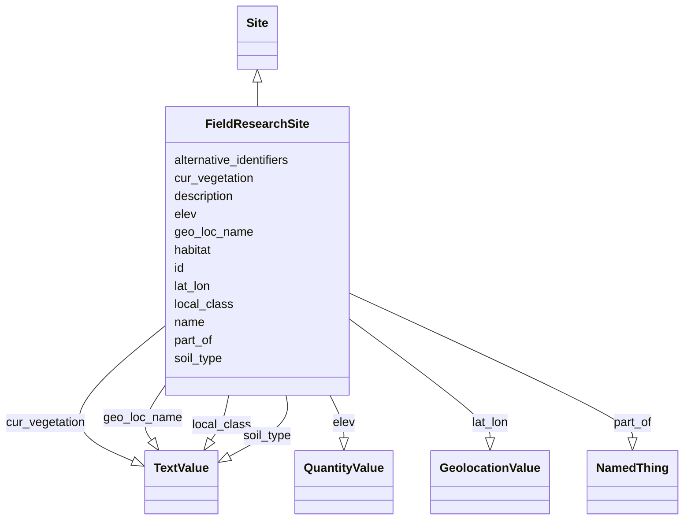

# Class: Field Research Site (FieldResearchSite)


_A site, outside of a laboratory, from which biosamples may be collected._


URI: [nmdc:FieldResearchSite](https://w3id.org/nmdc/FieldResearchSite)





## Inheritance
* [NamedThing](NamedThing.md)
    * [MaterialEntity](MaterialEntity.md)
        * [Site](Site.md)
            * **FieldResearchSite**


## Slots

| Name | Cardinality and Range | Description | Inheritance |
| ---  | --- | --- | --- |
| [cur_vegetation](cur_vegetation.md) | 0..1 <br/> [TextValue](TextValue.md) | Vegetation classification from one or more standard classification systems, o... | direct |
| [elev](elev.md) | 0..1 <br/> [QuantityValue](QuantityValue.md) | Elevation of the sampling site is its height above a fixed reference point, m... | direct |
| [geo_loc_name](geo_loc_name.md) | 0..1 <br/> [TextValue](TextValue.md) | The geographical origin of the sample as defined by the country or sea name f... | direct |
| [habitat](habitat.md) | 0..1 <br/> [String](String.md) |  | direct |
| [lat_lon](lat_lon.md) | 0..1 <br/> [GeolocationValue](GeolocationValue.md) | The geographical origin of the sample as defined by latitude and longitude | direct |
| [local_class](local_class.md) | 0..1 <br/> [TextValue](TextValue.md) | Soil classification based on local soil classification system | direct |
| [part_of](part_of.md) | 0..* <br/> [NamedThing](NamedThing.md) | Links a resource to another resource that either logically or physically incl... | direct |
| [soil_type](soil_type.md) | 0..1 <br/> [TextValue](TextValue.md) | Description of the soil type or classification | direct |
| [id](id.md) | 1..1 <br/> [Uriorcurie](Uriorcurie.md) | A unique identifier for a thing | [NamedThing](NamedThing.md) |
| [name](name.md) | 0..1 <br/> [String](String.md) | A human readable label for an entity | [NamedThing](NamedThing.md) |
| [description](description.md) | 0..1 <br/> [String](String.md) | a human-readable description of a thing | [NamedThing](NamedThing.md) |
| [alternative_identifiers](alternative_identifiers.md) | 0..* <br/> [Uriorcurie](Uriorcurie.md) | A list of alternative identifiers for the entity | [NamedThing](NamedThing.md) |


## Usages

| used by | used in | type | used |
| ---  | --- | --- | --- |
| [Database](Database.md) | [field_research_site_set](field_research_site_set.md) | range | [FieldResearchSite](FieldResearchSite.md) |
| [Biosample](Biosample.md) | [collected_from](collected_from.md) | range | [FieldResearchSite](FieldResearchSite.md) |


## Aliases


* research plot


## Comments

* Provides grouping of biosamples at level that's more specific than belonging to the same study
* be very clear that this could be part of a larger site
* In Bioscales, one might say that rhizosphere soil and bulk soil from around the same plant were obtained at the same site. In this case, the site would correspond to one tree.
* might correspond to GOLD's identifier on a page like https://gold.jgi.doe.gov/biosample?id=Gb0305833

## Identifier and Mapping Information


### Schema Source


* from schema: https://w3id.org/nmdc/nmdc


## Mappings

| Mapping Type | Mapped Value |
| ---  | ---  |
| self | nmdc:FieldResearchSite |
| native | nmdc:FieldResearchSite |


## LinkML Source

<!-- TODO: investigate https://stackoverflow.com/questions/37606292/how-to-create-tabbed-code-blocks-in-mkdocs-or-sphinx -->

### Direct

<details>
```yaml
name: FieldResearchSite
description: A site, outside of a laboratory, from which biosamples may be collected.
title: Field Research Site
comments:
- Provides grouping of biosamples at level that's more specific than belonging to
  the same study
- be very clear that this could be part of a larger site
- In Bioscales, one might say that rhizosphere soil and bulk soil from around the
  same plant were obtained at the same site. In this case, the site would correspond
  to one tree.
- might correspond to GOLD's identifier on a page like https://gold.jgi.doe.gov/biosample?id=Gb0305833
from_schema: https://w3id.org/nmdc/nmdc
aliases:
- research plot
is_a: Site
slots:
- cur_vegetation
- elev
- geo_loc_name
- habitat
- lat_lon
- local_class
- part_of
- soil_type
slot_usage:
  id:
    name: id
    domain_of:
    - Biosample
    - Study
    - NamedThing
    - Activity
    required: true
    structured_pattern:
      syntax: '{id_nmdc_prefix}:frsite-{id_shoulder}-{id_blade}{id_version}{id_locus}'
      interpolated: true

```
</details>

### Induced

<details>
```yaml
name: FieldResearchSite
description: A site, outside of a laboratory, from which biosamples may be collected.
title: Field Research Site
comments:
- Provides grouping of biosamples at level that's more specific than belonging to
  the same study
- be very clear that this could be part of a larger site
- In Bioscales, one might say that rhizosphere soil and bulk soil from around the
  same plant were obtained at the same site. In this case, the site would correspond
  to one tree.
- might correspond to GOLD's identifier on a page like https://gold.jgi.doe.gov/biosample?id=Gb0305833
from_schema: https://w3id.org/nmdc/nmdc
aliases:
- research plot
is_a: Site
slot_usage:
  id:
    name: id
    domain_of:
    - Biosample
    - Study
    - NamedThing
    - Activity
    required: true
    structured_pattern:
      syntax: '{id_nmdc_prefix}:frsite-{id_shoulder}-{id_blade}{id_version}{id_locus}'
      interpolated: true
attributes:
  cur_vegetation:
    name: cur_vegetation
    annotations:
      expected_value:
        tag: expected_value
        value: current vegetation type
      occurrence:
        tag: occurrence
        value: '1'
    description: Vegetation classification from one or more standard classification
      systems, or agricultural crop
    title: current vegetation
    examples:
    - value: ''
    from_schema: https://w3id.org/nmdc/nmdc
    aliases:
    - current vegetation
    rank: 1000
    is_a: core field
    string_serialization: '{text}'
    slot_uri: MIXS:0000312
    multivalued: false
    alias: cur_vegetation
    owner: FieldResearchSite
    domain_of:
    - FieldResearchSite
    - Biosample
    range: TextValue
  elev:
    name: elev
    annotations:
      expected_value:
        tag: expected_value
        value: measurement value
    description: Elevation of the sampling site is its height above a fixed reference
      point, most commonly the mean sea level. Elevation is mainly used when referring
      to points on the earth's surface, while altitude is used for points above the
      surface, such as an aircraft in flight or a spacecraft in orbit.
    title: elevation
    examples:
    - value: 100 meter
    from_schema: https://w3id.org/nmdc/nmdc
    aliases:
    - elevation
    rank: 1000
    is_a: environment field
    slot_uri: MIXS:0000093
    multivalued: false
    alias: elev
    owner: FieldResearchSite
    domain_of:
    - FieldResearchSite
    - Biosample
    range: QuantityValue
  geo_loc_name:
    name: geo_loc_name
    annotations:
      expected_value:
        tag: expected_value
        value: 'country or sea name (INSDC or GAZ): region(GAZ), specific location
          name'
    description: The geographical origin of the sample as defined by the country or
      sea name followed by specific region name. Country or sea names should be chosen
      from the INSDC country list (http://insdc.org/country.html), or the GAZ ontology
      (http://purl.bioontology.org/ontology/GAZ)
    title: geographic location (country and/or sea,region)
    examples:
    - value: 'USA: Maryland, Bethesda'
    from_schema: https://w3id.org/nmdc/nmdc
    aliases:
    - geographic location (country and/or sea,region)
    rank: 1000
    is_a: environment field
    string_serialization: '{term}: {term}, {text}'
    slot_uri: MIXS:0000010
    multivalued: false
    alias: geo_loc_name
    owner: FieldResearchSite
    domain_of:
    - FieldResearchSite
    - Biosample
    range: TextValue
  habitat:
    name: habitat
    from_schema: https://w3id.org/nmdc/nmdc
    rank: 1000
    alias: habitat
    owner: FieldResearchSite
    domain_of:
    - FieldResearchSite
    - Biosample
    range: string
  lat_lon:
    name: lat_lon
    annotations:
      expected_value:
        tag: expected_value
        value: decimal degrees,  limit to 8 decimal points
    description: The geographical origin of the sample as defined by latitude and
      longitude. The values should be reported in decimal degrees and in WGS84 system
    title: geographic location (latitude and longitude)
    examples:
    - value: 50.586825 6.408977
    from_schema: https://w3id.org/nmdc/nmdc
    aliases:
    - geographic location (latitude and longitude)
    rank: 1000
    is_a: environment field
    string_serialization: '{float} {float}'
    slot_uri: MIXS:0000009
    multivalued: false
    alias: lat_lon
    owner: FieldResearchSite
    domain_of:
    - FieldResearchSite
    - Biosample
    range: GeolocationValue
  local_class:
    name: local_class
    annotations:
      expected_value:
        tag: expected_value
        value: local classification name
      occurrence:
        tag: occurrence
        value: '1'
    description: Soil classification based on local soil classification system
    title: soil_taxonomic/local classification
    examples:
    - value: ''
    from_schema: https://w3id.org/nmdc/nmdc
    aliases:
    - soil_taxonomic/local classification
    rank: 1000
    is_a: core field
    string_serialization: '{text}'
    slot_uri: MIXS:0000330
    multivalued: false
    alias: local_class
    owner: FieldResearchSite
    domain_of:
    - FieldResearchSite
    - Biosample
    range: TextValue
  part_of:
    name: part_of
    description: Links a resource to another resource that either logically or physically
      includes it.
    from_schema: https://w3id.org/nmdc/nmdc
    aliases:
    - is part of
    rank: 1000
    domain: NamedThing
    slot_uri: dcterms:isPartOf
    multivalued: true
    alias: part_of
    owner: FieldResearchSite
    domain_of:
    - FieldResearchSite
    - Biosample
    - Study
    - OmicsProcessing
    - WorkflowExecutionActivity
    range: NamedThing
  soil_type:
    name: soil_type
    annotations:
      expected_value:
        tag: expected_value
        value: ENVO_00001998
      occurrence:
        tag: occurrence
        value: '1'
    description: Description of the soil type or classification. This field accepts
      terms under soil (http://purl.obolibrary.org/obo/ENVO_00001998).  Multiple terms
      can be separated by pipes.
    title: soil type
    examples:
    - value: plinthosol [ENVO:00002250]
    from_schema: https://w3id.org/nmdc/nmdc
    aliases:
    - soil type
    rank: 1000
    is_a: core field
    string_serialization: '{termLabel} {[termID]}'
    slot_uri: MIXS:0000332
    multivalued: false
    alias: soil_type
    owner: FieldResearchSite
    domain_of:
    - FieldResearchSite
    - Biosample
    range: TextValue
  id:
    name: id
    description: A unique identifier for a thing. Must be either a CURIE shorthand
      for a URI or a complete URI
    from_schema: https://w3id.org/nmdc/nmdc
    rank: 1000
    identifier: true
    alias: id
    owner: FieldResearchSite
    domain_of:
    - Biosample
    - Study
    - NamedThing
    - Activity
    range: uriorcurie
    required: true
    pattern: ^[a-zA-Z0-9][a-zA-Z0-9_\.]+:[a-zA-Z0-9_][a-zA-Z0-9_\-\/\.,]*$
    structured_pattern:
      syntax: '{id_nmdc_prefix}:frsite-{id_shoulder}-{id_blade}{id_version}{id_locus}'
      interpolated: true
  name:
    name: name
    description: A human readable label for an entity
    from_schema: https://w3id.org/nmdc/nmdc
    rank: 1000
    alias: name
    owner: FieldResearchSite
    domain_of:
    - Protocol
    - QualityControlReport
    - NamedThing
    - PersonValue
    - Activity
    range: string
  description:
    name: description
    description: a human-readable description of a thing
    from_schema: https://w3id.org/nmdc/nmdc
    rank: 1000
    slot_uri: dcterms:description
    alias: description
    owner: FieldResearchSite
    domain_of:
    - Study
    - NamedThing
    - ImageValue
    range: string
  alternative_identifiers:
    name: alternative_identifiers
    description: A list of alternative identifiers for the entity.
    from_schema: https://w3id.org/nmdc/nmdc
    rank: 1000
    multivalued: true
    alias: alternative_identifiers
    owner: FieldResearchSite
    domain_of:
    - Biosample
    - Study
    - NamedThing
    - MetaboliteQuantification
    range: uriorcurie
    pattern: ^[a-zA-Z0-9][a-zA-Z0-9_\.]+:[a-zA-Z0-9_][a-zA-Z0-9_\-\/\.,]*$

```
</details>