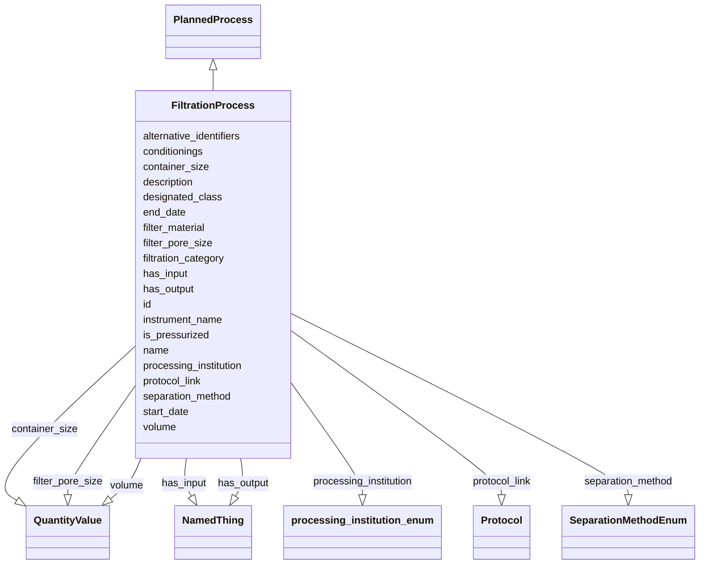

# Class: FiltrationProcess


_The process of segregation of phases; e.g. the separation of suspended solids from a liquid or gas, usually by forcing a carrier gas or liquid through a porous medium._


URI: [nmdc:FiltrationProcess](https://w3id.org/nmdc/FiltrationProcess)





## Inheritance
* [NamedThing](NamedThing.md)
    * [PlannedProcess](PlannedProcess.md)
        * **FiltrationProcess**


## Slots

| Name | Cardinality and Range | Description | Inheritance |
| ---  | --- | --- | --- |
| [conditionings](conditionings.md) | 0..* <br/> [String](String.md) | Preliminary treatment of either phase with a suitable solution of the other p... | direct |
| [container_size](container_size.md) | 0..1 <br/> [QuantityValue](QuantityValue.md) | The volume of the container an analyte is stored in or an activity takes plac... | direct |
| [filter_material](filter_material.md) | 0..1 <br/> [String](String.md) | A porous material on which solid particles present in air or other fluid whic... | direct |
| [filter_pore_size](filter_pore_size.md) | 0..1 <br/> [QuantityValue](QuantityValue.md) | A quantitative or qualitative measurement of the physical dimensions of the p... | direct |
| [filtration_category](filtration_category.md) | 0..1 <br/> [String](String.md) | The type of conditioning applied to a filter, device, etc | direct |
| [is_pressurized](is_pressurized.md) | 0..1 <br/> [Boolean](Boolean.md) | Whether or not pressure was applied to a thing or process | direct |
| [separation_method](separation_method.md) | 0..1 <br/> [SeparationMethodEnum](SeparationMethodEnum.md) | The method that was used to separate a substance from a solution or mixture | direct |
| [volume](volume.md) | 0..1 <br/> [QuantityValue](QuantityValue.md) | The volume of sample filtered | direct |
| [designated_class](designated_class.md) | 0..1 <br/> [Uriorcurie](Uriorcurie.md) |  | [PlannedProcess](PlannedProcess.md) |
| [end_date](end_date.md) | 0..1 <br/> [String](String.md) | The date on which any process or activity was ended | [PlannedProcess](PlannedProcess.md) |
| [has_input](has_input.md) | 0..* <br/> [NamedThing](NamedThing.md) | An input to a process | [PlannedProcess](PlannedProcess.md) |
| [has_output](has_output.md) | 0..* <br/> [NamedThing](NamedThing.md) | An output biosample to a processing step | [PlannedProcess](PlannedProcess.md) |
| [processing_institution](processing_institution.md) | 0..1 <br/> [ProcessingInstitutionEnum](ProcessingInstitutionEnum.md) | The organization that processed the sample | [PlannedProcess](PlannedProcess.md) |
| [protocol_link](protocol_link.md) | 0..1 <br/> [Protocol](Protocol.md) |  | [PlannedProcess](PlannedProcess.md) |
| [start_date](start_date.md) | 0..1 <br/> [String](String.md) | The date on which any process or activity was started | [PlannedProcess](PlannedProcess.md) |
| [instrument_name](instrument_name.md) | 0..1 <br/> [String](String.md) | The name of the instrument that was used for processing the sample | [PlannedProcess](PlannedProcess.md) |
| [id](id.md) | 1..1 <br/> [Uriorcurie](Uriorcurie.md) | A unique identifier for a thing | [NamedThing](NamedThing.md) |
| [name](name.md) | 0..1 <br/> [String](String.md) | A human readable label for an entity | [NamedThing](NamedThing.md) |
| [description](description.md) | 0..1 <br/> [String](String.md) | a human-readable description of a thing | [NamedThing](NamedThing.md) |
| [alternative_identifiers](alternative_identifiers.md) | 0..* <br/> [Uriorcurie](Uriorcurie.md) | A list of alternative identifiers for the entity | [NamedThing](NamedThing.md) |


## Usages

| used by | used in | type | used |
| ---  | --- | --- | --- |
| [FiltrationProcess](FiltrationProcess.md) | [filter_pore_size](filter_pore_size.md) | domain | [FiltrationProcess](FiltrationProcess.md) |
| [FiltrationProcess](FiltrationProcess.md) | [separation_method](separation_method.md) | domain | [FiltrationProcess](FiltrationProcess.md) |


## Identifier and Mapping Information


### Schema Source


* from schema: https://w3id.org/nmdc/nmdc


## Mappings

| Mapping Type | Mapped Value |
| ---  | ---  |
| self | nmdc:FiltrationProcess |
| native | nmdc:FiltrationProcess |
| related | CHMO:0001640 |


## LinkML Source

<!-- TODO: investigate https://stackoverflow.com/questions/37606292/how-to-create-tabbed-code-blocks-in-mkdocs-or-sphinx -->

### Direct

<details>
```yaml
name: FiltrationProcess
description: The process of segregation of phases; e.g. the separation of suspended
  solids from a liquid or gas, usually by forcing a carrier gas or liquid through
  a porous medium.
from_schema: https://w3id.org/nmdc/nmdc
related_mappings:
- CHMO:0001640
contributors:
- ORCID:0009-0001-1555-1601
- ORCID:0000-0002-8683-0050
- ORCID:0000-0001-9076-6066
- ORCID:0009-0008-4013-7737
is_a: PlannedProcess
slots:
- conditionings
- container_size
- filter_material
- filter_pore_size
- filtration_category
- is_pressurized
- separation_method
- volume
slot_usage:
  volume:
    name: volume
    description: The volume of sample filtered.
    domain_of:
    - Solution
    - SubSamplingProcess
    - FiltrationProcess

```
</details>

### Induced

<details>
```yaml
name: FiltrationProcess
description: The process of segregation of phases; e.g. the separation of suspended
  solids from a liquid or gas, usually by forcing a carrier gas or liquid through
  a porous medium.
from_schema: https://w3id.org/nmdc/nmdc
related_mappings:
- CHMO:0001640
contributors:
- ORCID:0009-0001-1555-1601
- ORCID:0000-0002-8683-0050
- ORCID:0000-0001-9076-6066
- ORCID:0009-0008-4013-7737
is_a: PlannedProcess
slot_usage:
  volume:
    name: volume
    description: The volume of sample filtered.
    domain_of:
    - Solution
    - SubSamplingProcess
    - FiltrationProcess
attributes:
  conditionings:
    name: conditionings
    description: Preliminary treatment of either phase with a suitable solution of
      the other phase (in the absence of main extractable solute(s)) so that when
      the subsequent equilibration is carried out changes in the (volume) phase ratio
      or in the concentrations of other components are minimized.
    from_schema: https://w3id.org/nmdc/nmdc
    rank: 1000
    multivalued: true
    list_elements_ordered: true
    alias: conditionings
    owner: FiltrationProcess
    domain_of:
    - FiltrationProcess
    range: string
  container_size:
    name: container_size
    description: The volume of the container an analyte is stored in or an activity
      takes place in
    from_schema: https://w3id.org/nmdc/nmdc
    contributors:
    - ORCID:0009-0001-1555-1601
    - ORCID:0000-0002-8683-0050
    rank: 1000
    alias: container_size
    owner: FiltrationProcess
    domain_of:
    - SubSamplingProcess
    - FiltrationProcess
    range: QuantityValue
  filter_material:
    name: filter_material
    description: A porous material on which solid particles present in air or other
      fluid which flows through it are largely caught and retained.
    comments:
    - 'Filters are made with a variety of materials: cellulose and derivatives, glass
      fibre, ceramic, synthetic plastics and fibres. Filters may be naturally porous
      or be made so by mechanical or other means. Membrane/ceramic filters are prepared
      with highly controlled pore size in a sheet of suitable material such as polyfluoroethylene,
      polycarbonate or cellulose esters. Nylon mesh is sometimes used for reinforcement.
      The pores constitute 80–85% of the filter volume commonly and several pore sizes
      are available for air sampling (0.45−0.8 μm are commonly employed).'
    from_schema: https://w3id.org/nmdc/nmdc
    rank: 1000
    alias: filter_material
    owner: FiltrationProcess
    domain_of:
    - FiltrationProcess
    range: string
  filter_pore_size:
    name: filter_pore_size
    description: A quantitative or qualitative measurement of the physical dimensions
      of the pores in a material.
    from_schema: https://w3id.org/nmdc/nmdc
    rank: 1000
    domain: FiltrationProcess
    alias: filter_pore_size
    owner: FiltrationProcess
    domain_of:
    - FiltrationProcess
    range: QuantityValue
  filtration_category:
    name: filtration_category
    description: The type of conditioning applied to a filter, device, etc.
    from_schema: https://w3id.org/nmdc/nmdc
    rank: 1000
    alias: filtration_category
    owner: FiltrationProcess
    domain_of:
    - FiltrationProcess
    range: string
  is_pressurized:
    name: is_pressurized
    description: Whether or not pressure was applied to a thing or process.
    from_schema: https://w3id.org/nmdc/nmdc
    rank: 1000
    alias: is_pressurized
    owner: FiltrationProcess
    domain_of:
    - FiltrationProcess
    range: boolean
  separation_method:
    name: separation_method
    description: The method that was used to separate a substance from a solution
      or mixture.
    from_schema: https://w3id.org/nmdc/nmdc
    rank: 1000
    domain: FiltrationProcess
    alias: separation_method
    owner: FiltrationProcess
    domain_of:
    - FiltrationProcess
    range: SeparationMethodEnum
  volume:
    name: volume
    description: The volume of sample filtered.
    from_schema: https://w3id.org/nmdc/nmdc
    rank: 1000
    domain: PlannedProcess
    alias: volume
    owner: FiltrationProcess
    domain_of:
    - Solution
    - SubSamplingProcess
    - FiltrationProcess
    range: QuantityValue
  designated_class:
    name: designated_class
    comments:
    - required on all instances in a polymorphic Database slot like planned_process_set
    from_schema: https://w3id.org/nmdc/nmdc
    rank: 1000
    designates_type: true
    alias: designated_class
    owner: FiltrationProcess
    domain_of:
    - PlannedProcess
    range: uriorcurie
  end_date:
    name: end_date
    description: The date on which any process or activity was ended
    todos:
    - add date string validation pattern
    comments:
    - We are using string representations of dates until all components of our ecosystem
      can handle ISO 8610 dates
    - The date should be formatted as YYYY-MM-DD
    from_schema: https://w3id.org/nmdc/nmdc
    rank: 1000
    alias: end_date
    owner: FiltrationProcess
    domain_of:
    - PlannedProcess
    range: string
  has_input:
    name: has_input
    description: An input to a process.
    from_schema: https://w3id.org/nmdc/nmdc
    aliases:
    - input
    rank: 1000
    domain: NamedThing
    multivalued: true
    alias: has_input
    owner: FiltrationProcess
    domain_of:
    - BiosampleProcessing
    - OmicsProcessing
    - WorkflowExecutionActivity
    - PlannedProcess
    range: NamedThing
  has_output:
    name: has_output
    description: An output biosample to a processing step
    from_schema: https://w3id.org/nmdc/nmdc
    aliases:
    - output
    rank: 1000
    domain: NamedThing
    multivalued: true
    alias: has_output
    owner: FiltrationProcess
    domain_of:
    - OmicsProcessing
    - WorkflowExecutionActivity
    - PlannedProcess
    range: NamedThing
  processing_institution:
    name: processing_institution
    description: The organization that processed the sample.
    from_schema: https://w3id.org/nmdc/nmdc
    rank: 1000
    domain: PlannedProcess
    alias: processing_institution
    owner: FiltrationProcess
    domain_of:
    - OmicsProcessing
    - PlannedProcess
    range: processing_institution_enum
  protocol_link:
    name: protocol_link
    from_schema: https://w3id.org/nmdc/nmdc
    rank: 1000
    domain: PlannedProcess
    alias: protocol_link
    owner: FiltrationProcess
    domain_of:
    - PlannedProcess
    range: Protocol
  start_date:
    name: start_date
    description: The date on which any process or activity was started
    todos:
    - add date string validation pattern
    comments:
    - We are using string representations of dates until all components of our ecosystem
      can handle ISO 8610 dates
    - The date should be formatted as YYYY-MM-DD
    from_schema: https://w3id.org/nmdc/nmdc
    rank: 1000
    alias: start_date
    owner: FiltrationProcess
    domain_of:
    - PlannedProcess
    range: string
  instrument_name:
    name: instrument_name
    description: The name of the instrument that was used for processing the sample.
    from_schema: https://w3id.org/nmdc/nmdc
    rank: 1000
    domain: PlannedProcess
    alias: instrument_name
    owner: FiltrationProcess
    domain_of:
    - OmicsProcessing
    - PlannedProcess
    range: string
  id:
    name: id
    description: A unique identifier for a thing. Must be either a CURIE shorthand
      for a URI or a complete URI
    notes:
    - 'abstracted pattern: prefix:typecode-authshoulder-blade(.version)?(_seqsuffix)?'
    - a minimum length of 3 characters is suggested for typecodes, but 1 or 2 characters
      will be accepted
    - typecodes must correspond 1:1 to a class in the NMDC schema. this will be checked
      via per-class id slot usage assertions
    - minting authority shoulders should probably be enumerated and checked in the
      pattern
    examples:
    - value: nmdc:mgmag-00-x012.1_7_c1
      description: https://github.com/microbiomedata/nmdc-schema/pull/499#discussion_r1018499248
    from_schema: https://w3id.org/nmdc/nmdc
    rank: 1000
    identifier: true
    alias: id
    owner: FiltrationProcess
    domain_of:
    - Biosample
    - Study
    - NamedThing
    - Activity
    range: uriorcurie
    required: true
    pattern: ^[a-zA-Z0-9][a-zA-Z0-9_\.]+:[a-zA-Z0-9_][a-zA-Z0-9_\-\/\.,]*$
  name:
    name: name
    description: A human readable label for an entity
    from_schema: https://w3id.org/nmdc/nmdc
    rank: 1000
    alias: name
    owner: FiltrationProcess
    domain_of:
    - Protocol
    - QualityControlReport
    - NamedThing
    - PersonValue
    - Activity
    range: string
  description:
    name: description
    description: a human-readable description of a thing
    from_schema: https://w3id.org/nmdc/nmdc
    rank: 1000
    slot_uri: dcterms:description
    alias: description
    owner: FiltrationProcess
    domain_of:
    - Study
    - NamedThing
    - ImageValue
    range: string
  alternative_identifiers:
    name: alternative_identifiers
    description: A list of alternative identifiers for the entity.
    from_schema: https://w3id.org/nmdc/nmdc
    rank: 1000
    multivalued: true
    alias: alternative_identifiers
    owner: FiltrationProcess
    domain_of:
    - Biosample
    - Study
    - NamedThing
    - MetaboliteQuantification
    range: uriorcurie
    pattern: ^[a-zA-Z0-9][a-zA-Z0-9_\.]+:[a-zA-Z0-9_][a-zA-Z0-9_\-\/\.,]*$

```
</details>