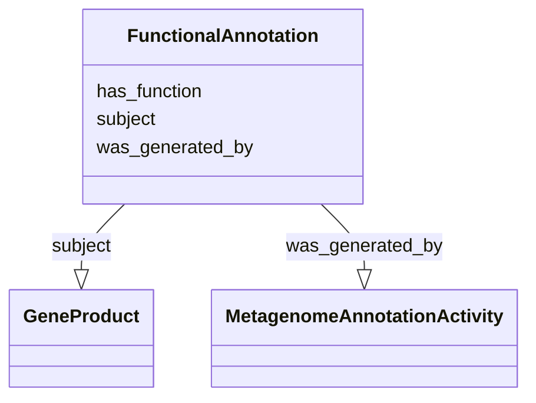

# Class: FunctionalAnnotation


_An assignment of a function term (e.g. reaction or pathway) that is executed by a gene product, or which the gene product plays an active role in. Functional annotations can be assigned manually by curators, or automatically in workflows. In the context of NMDC, all function annotation is performed automatically, typically using HMM or Blast type methods_


URI: [nmdc:FunctionalAnnotation](https://w3id.org/nmdc/FunctionalAnnotation)





<!-- no inheritance hierarchy -->


## Slots

| Name | Cardinality and Range | Description | Inheritance |
| ---  | --- | --- | --- |
| [has_function](has_function.md) | 0..1 <br/> [String](String.md) |  | direct |
| [subject](subject.md) | 0..1 <br/> [GeneProduct](GeneProduct.md) |  | direct |
| [was_generated_by](was_generated_by.md) | 0..1 <br/> [MetagenomeAnnotationActivity](MetagenomeAnnotationActivity.md) | provenance for the annotation | direct |


## Usages

| used by | used in | type | used |
| ---  | --- | --- | --- |
| [Database](Database.md) | [functional_annotation_set](functional_annotation_set.md) | range | [FunctionalAnnotation](FunctionalAnnotation.md) |
| [FunctionalAnnotation](FunctionalAnnotation.md) | [has_function](has_function.md) | domain | [FunctionalAnnotation](FunctionalAnnotation.md) |
| [FunctionalAnnotation](FunctionalAnnotation.md) | [subject](subject.md) | domain | [FunctionalAnnotation](FunctionalAnnotation.md) |


## See Also

* [https://img.jgi.doe.gov/docs/functional-annotation.pdf](https://img.jgi.doe.gov/docs/functional-annotation.pdf)
* [https://github.com/microbiomedata/mg_annotation/blob/master/functional-annotation.wdl](https://github.com/microbiomedata/mg_annotation/blob/master/functional-annotation.wdl)

## Identifier and Mapping Information


### Schema Source


* from schema: https://w3id.org/nmdc/nmdc


## Mappings

| Mapping Type | Mapped Value |
| ---  | ---  |
| self | nmdc:FunctionalAnnotation |
| native | nmdc:FunctionalAnnotation |
| narrow | biolink:GeneToGoTermAssociation |


## LinkML Source

<!-- TODO: investigate https://stackoverflow.com/questions/37606292/how-to-create-tabbed-code-blocks-in-mkdocs-or-sphinx -->

### Direct

<details>
```yaml
name: FunctionalAnnotation
description: An assignment of a function term (e.g. reaction or pathway) that is executed
  by a gene product, or which the gene product plays an active role in. Functional
  annotations can be assigned manually by curators, or automatically in workflows.
  In the context of NMDC, all function annotation is performed automatically, typically
  using HMM or Blast type methods
notes:
- move id slot usage patterns to has_function slot usage?
from_schema: https://w3id.org/nmdc/nmdc
see_also:
- https://img.jgi.doe.gov/docs/functional-annotation.pdf
- https://github.com/microbiomedata/mg_annotation/blob/master/functional-annotation.wdl
narrow_mappings:
- biolink:GeneToGoTermAssociation
slots:
- has_function
- subject
- was_generated_by
slot_usage:
  has_function:
    name: has_function
    notes:
    - this slot had been called id
    - Still missing patterns for COG and RetroRules.
    - These patterns aren't tied to the listed prefixes. A discussion about that possibility
      had been started, including the question of whether these lists are intended
      to be open examples or closed
    domain_of:
    - FunctionalAnnotation
  type:
    name: type
    description: TODO
    range: OntologyClass
  was_generated_by:
    name: was_generated_by
    description: provenance for the annotation.
    notes:
    - To be consistent with the rest of the NMDC schema we use the PROV annotation
      model, rather than GPAD
    domain_of:
    - DataObject
    - AttributeValue
    - FunctionalAnnotation
    range: MetagenomeAnnotationActivity

```
</details>

### Induced

<details>
```yaml
name: FunctionalAnnotation
description: An assignment of a function term (e.g. reaction or pathway) that is executed
  by a gene product, or which the gene product plays an active role in. Functional
  annotations can be assigned manually by curators, or automatically in workflows.
  In the context of NMDC, all function annotation is performed automatically, typically
  using HMM or Blast type methods
notes:
- move id slot usage patterns to has_function slot usage?
from_schema: https://w3id.org/nmdc/nmdc
see_also:
- https://img.jgi.doe.gov/docs/functional-annotation.pdf
- https://github.com/microbiomedata/mg_annotation/blob/master/functional-annotation.wdl
narrow_mappings:
- biolink:GeneToGoTermAssociation
slot_usage:
  has_function:
    name: has_function
    notes:
    - this slot had been called id
    - Still missing patterns for COG and RetroRules.
    - These patterns aren't tied to the listed prefixes. A discussion about that possibility
      had been started, including the question of whether these lists are intended
      to be open examples or closed
    domain_of:
    - FunctionalAnnotation
  type:
    name: type
    description: TODO
    range: OntologyClass
  was_generated_by:
    name: was_generated_by
    description: provenance for the annotation.
    notes:
    - To be consistent with the rest of the NMDC schema we use the PROV annotation
      model, rather than GPAD
    domain_of:
    - DataObject
    - AttributeValue
    - FunctionalAnnotation
    range: MetagenomeAnnotationActivity
attributes:
  has_function:
    name: has_function
    notes:
    - this slot had been called id
    - Still missing patterns for COG and RetroRules.
    - These patterns aren't tied to the listed prefixes. A discussion about that possibility
      had been started, including the question of whether these lists are intended
      to be open examples or closed
    from_schema: https://w3id.org/nmdc/nmdc
    rank: 1000
    domain: FunctionalAnnotation
    alias: has_function
    owner: FunctionalAnnotation
    domain_of:
    - FunctionalAnnotation
    range: string
    pattern: ^(KEGG_PATHWAY:\w{2,4}\d{5}|KEGG.REACTION:R\d+|RHEA:\d{5}|MetaCyc:[A-Za-z0-9+_.%-:]+|EC:\d{1,2}(\.\d{0,3}){0,3}|GO:\d{7}|MetaNetX:(MNXR\d+|EMPTY)|SEED:\w+|KEGG\.ORTHOLOGY:K\d+|EGGNOG:\w+|PFAM:PF\d{5}|TIGRFAM:TIGR\d+|SUPFAM:\w+|CATH:[1-6]\.[0-9]+\.[0-9]+\.[0-9]+|PANTHER.FAMILY:PTHR\d{5}(\:SF\d{1,3})?)$
  subject:
    name: subject
    from_schema: https://w3id.org/nmdc/nmdc
    rank: 1000
    domain: FunctionalAnnotation
    alias: subject
    owner: FunctionalAnnotation
    domain_of:
    - FunctionalAnnotation
    range: GeneProduct
  was_generated_by:
    name: was_generated_by
    description: provenance for the annotation.
    notes:
    - To be consistent with the rest of the NMDC schema we use the PROV annotation
      model, rather than GPAD
    from_schema: https://w3id.org/nmdc/nmdc
    rank: 1000
    alias: was_generated_by
    owner: FunctionalAnnotation
    domain_of:
    - DataObject
    - AttributeValue
    - FunctionalAnnotation
    range: MetagenomeAnnotationActivity

```
</details>