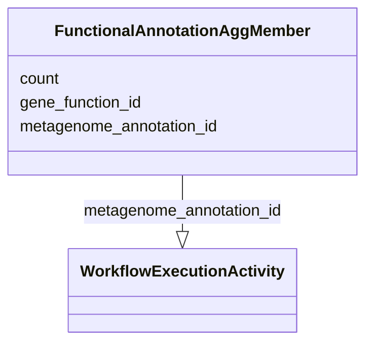

# Class: FunctionalAnnotationAggMember


URI: [nmdc:FunctionalAnnotationAggMember](https://w3id.org/nmdc/FunctionalAnnotationAggMember)





<!-- no inheritance hierarchy -->


## Slots

| Name | Cardinality and Range | Description | Inheritance |
| ---  | --- | --- | --- |
| [metagenome_annotation_id](metagenome_annotation_id.md) | 0..1 <br/> [WorkflowExecutionActivity](WorkflowExecutionActivity.md) |  | direct |
| [gene_function_id](gene_function_id.md) | 0..1 <br/> [Uriorcurie](Uriorcurie.md) |  | direct |
| [count](count.md) | 0..1 <br/> [Integer](Integer.md) |  | direct |


## Usages

| used by | used in | type | used |
| ---  | --- | --- | --- |
| [FunctionalAnnotationAggMember](FunctionalAnnotationAggMember.md) | [metagenome_annotation_id](metagenome_annotation_id.md) | domain | [FunctionalAnnotationAggMember](FunctionalAnnotationAggMember.md) |
| [Database](Database.md) | [functional_annotation_agg](functional_annotation_agg.md) | range | [FunctionalAnnotationAggMember](FunctionalAnnotationAggMember.md) |


## Identifier and Mapping Information


### Schema Source


* from schema: https://w3id.org/nmdc/nmdc


## Mappings

| Mapping Type | Mapped Value |
| ---  | ---  |
| self | nmdc:FunctionalAnnotationAggMember |
| native | nmdc:FunctionalAnnotationAggMember |


## LinkML Source

<!-- TODO: investigate https://stackoverflow.com/questions/37606292/how-to-create-tabbed-code-blocks-in-mkdocs-or-sphinx -->

### Direct

<details>
```yaml
name: FunctionalAnnotationAggMember
from_schema: https://w3id.org/nmdc/nmdc
slots:
- metagenome_annotation_id
- gene_function_id
- count

```
</details>

### Induced

<details>
```yaml
name: FunctionalAnnotationAggMember
from_schema: https://w3id.org/nmdc/nmdc
attributes:
  metagenome_annotation_id:
    name: metagenome_annotation_id
    from_schema: https://w3id.org/nmdc/nmdc
    rank: 1000
    domain: FunctionalAnnotationAggMember
    alias: metagenome_annotation_id
    owner: FunctionalAnnotationAggMember
    domain_of:
    - FunctionalAnnotationAggMember
    range: WorkflowExecutionActivity
  gene_function_id:
    name: gene_function_id
    from_schema: https://w3id.org/nmdc/nmdc
    rank: 1000
    alias: gene_function_id
    owner: FunctionalAnnotationAggMember
    domain_of:
    - FunctionalAnnotationAggMember
    range: uriorcurie
  count:
    name: count
    from_schema: https://w3id.org/nmdc/nmdc
    rank: 1000
    alias: count
    owner: FunctionalAnnotationAggMember
    domain_of:
    - FunctionalAnnotationAggMember
    range: integer

```
</details>