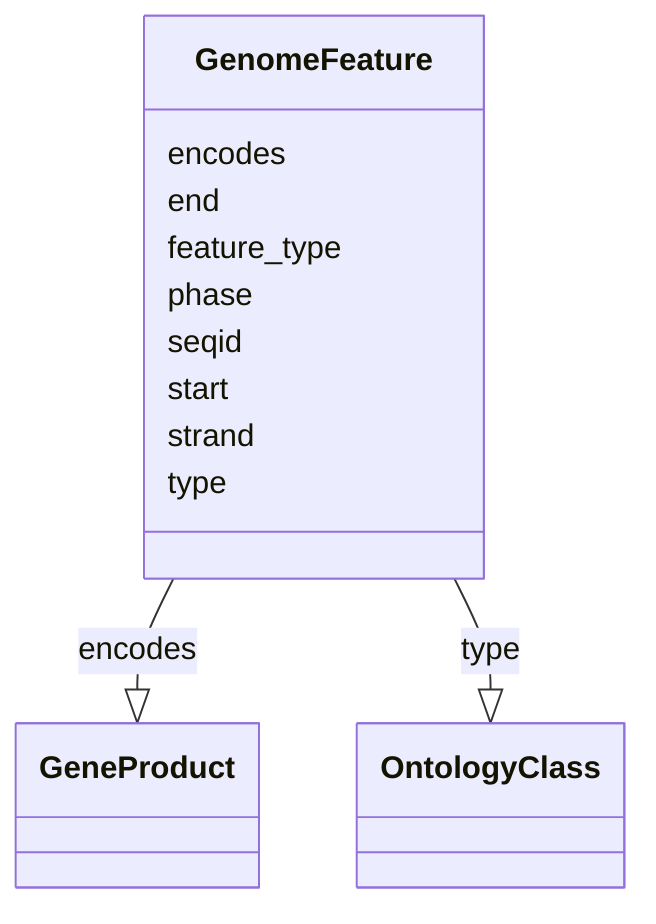

# Class: GenomeFeature


_A feature localized to an interval along a genome_


URI: [nmdc:GenomeFeature](https://w3id.org/nmdc/GenomeFeature)





<!-- no inheritance hierarchy -->


## Slots

| Name | Cardinality and Range | Description | Inheritance |
| ---  | --- | --- | --- |
| [encodes](encodes.md) | 0..1 <br/> [GeneProduct](GeneProduct.md) | The gene product encoded by this feature | direct |
| [end](end.md) | 1..1 <br/> [Integer](Integer.md) | The end of the feature in positive 1-based integer coordinates | direct |
| [feature_type](feature_type.md) | 0..1 <br/> [String](String.md) | TODO: Yuri to write | direct |
| [phase](phase.md) | 0..1 <br/> [Integer](Integer.md) | The phase for a coding sequence entity | direct |
| [seqid](seqid.md) | 1..1 <br/> [String](String.md) | The ID of the landmark used to establish the coordinate system for the curren... | direct |
| [start](start.md) | 1..1 <br/> [Integer](Integer.md) | The start of the feature in positive 1-based integer coordinates | direct |
| [strand](strand.md) | 0..1 <br/> [String](String.md) | The strand on which a feature is located | direct |
| [type](type.md) | 0..1 <br/> [OntologyClass](OntologyClass.md) | A type from the sequence ontology | direct |


## Usages

| used by | used in | type | used |
| ---  | --- | --- | --- |
| [Database](Database.md) | [genome_feature_set](genome_feature_set.md) | range | [GenomeFeature](GenomeFeature.md) |
| [GenomeFeature](GenomeFeature.md) | [encodes](encodes.md) | domain | [GenomeFeature](GenomeFeature.md) |
| [GenomeFeature](GenomeFeature.md) | [end](end.md) | domain | [GenomeFeature](GenomeFeature.md) |
| [GenomeFeature](GenomeFeature.md) | [feature_type](feature_type.md) | domain | [GenomeFeature](GenomeFeature.md) |
| [GenomeFeature](GenomeFeature.md) | [phase](phase.md) | domain | [GenomeFeature](GenomeFeature.md) |
| [GenomeFeature](GenomeFeature.md) | [start](start.md) | domain | [GenomeFeature](GenomeFeature.md) |
| [GenomeFeature](GenomeFeature.md) | [strand](strand.md) | domain | [GenomeFeature](GenomeFeature.md) |


## Comments

* corresponds to an entry in GFF3

## See Also

* [https://github.com/The-Sequence-Ontology/Specifications/blob/master/gff3.md](https://github.com/The-Sequence-Ontology/Specifications/blob/master/gff3.md)

## Identifier and Mapping Information


### Schema Source


* from schema: https://w3id.org/nmdc/nmdc


## Mappings

| Mapping Type | Mapped Value |
| ---  | ---  |
| self | nmdc:GenomeFeature |
| native | nmdc:GenomeFeature |


## LinkML Source

<!-- TODO: investigate https://stackoverflow.com/questions/37606292/how-to-create-tabbed-code-blocks-in-mkdocs-or-sphinx -->

### Direct

<details>
```yaml
name: GenomeFeature
description: A feature localized to an interval along a genome
comments:
- corresponds to an entry in GFF3
from_schema: https://w3id.org/nmdc/nmdc
see_also:
- https://github.com/The-Sequence-Ontology/Specifications/blob/master/gff3.md
slots:
- encodes
- end
- feature_type
- phase
- seqid
- start
- strand
- type
slot_usage:
  seqid:
    name: seqid
    domain_of:
    - GenomeFeature
    required: true
  type:
    name: type
    description: A type from the sequence ontology
    domain_of:
    - DataObject
    - Biosample
    - Study
    - OmicsProcessing
    - CreditAssociation
    - WorkflowExecutionActivity
    - MetagenomeAssembly
    - MetagenomeAnnotationActivity
    - MetatranscriptomeAnnotationActivity
    - MetatranscriptomeActivity
    - MagsAnalysisActivity
    - ReadQcAnalysisActivity
    - ReadBasedTaxonomyAnalysisActivity
    - MagBin
    - GenomeFeature
    range: OntologyClass
  start:
    name: start
    domain_of:
    - GenomeFeature
    required: true
  end:
    name: end
    domain_of:
    - GenomeFeature
    required: true

```
</details>

### Induced

<details>
```yaml
name: GenomeFeature
description: A feature localized to an interval along a genome
comments:
- corresponds to an entry in GFF3
from_schema: https://w3id.org/nmdc/nmdc
see_also:
- https://github.com/The-Sequence-Ontology/Specifications/blob/master/gff3.md
slot_usage:
  seqid:
    name: seqid
    domain_of:
    - GenomeFeature
    required: true
  type:
    name: type
    description: A type from the sequence ontology
    domain_of:
    - DataObject
    - Biosample
    - Study
    - OmicsProcessing
    - CreditAssociation
    - WorkflowExecutionActivity
    - MetagenomeAssembly
    - MetagenomeAnnotationActivity
    - MetatranscriptomeAnnotationActivity
    - MetatranscriptomeActivity
    - MagsAnalysisActivity
    - ReadQcAnalysisActivity
    - ReadBasedTaxonomyAnalysisActivity
    - MagBin
    - GenomeFeature
    range: OntologyClass
  start:
    name: start
    domain_of:
    - GenomeFeature
    required: true
  end:
    name: end
    domain_of:
    - GenomeFeature
    required: true
attributes:
  encodes:
    name: encodes
    description: The gene product encoded by this feature. Typically this is used
      for a CDS feature or gene feature which will encode a protein. It can also be
      used by a nc transcript ot gene feature that encoded a ncRNA
    from_schema: https://w3id.org/nmdc/nmdc
    rank: 1000
    domain: GenomeFeature
    alias: encodes
    owner: GenomeFeature
    domain_of:
    - GenomeFeature
    range: GeneProduct
  end:
    name: end
    description: The end of the feature in positive 1-based integer coordinates
    from_schema: https://w3id.org/nmdc/nmdc
    rank: 1000
    is_a: gff_coordinate
    domain: GenomeFeature
    alias: end
    owner: GenomeFeature
    domain_of:
    - GenomeFeature
    range: integer
    required: true
    minimum_value: 1
  feature_type:
    name: feature_type
    description: 'TODO: Yuri to write'
    from_schema: https://w3id.org/nmdc/nmdc
    rank: 1000
    domain: GenomeFeature
    alias: feature_type
    owner: GenomeFeature
    domain_of:
    - GenomeFeature
    range: string
  phase:
    name: phase
    description: The phase for a coding sequence entity. For example, phase of a CDS
      as represented in a GFF3 with a value of 0, 1 or 2.
    from_schema: https://w3id.org/nmdc/nmdc
    exact_mappings:
    - biolink:phase
    rank: 1000
    domain: GenomeFeature
    alias: phase
    owner: GenomeFeature
    domain_of:
    - GenomeFeature
    range: integer
    minimum_value: 0
    maximum_value: 2
  seqid:
    name: seqid
    description: The ID of the landmark used to establish the coordinate system for
      the current feature.
    from_schema: https://w3id.org/nmdc/nmdc
    rank: 1000
    alias: seqid
    owner: GenomeFeature
    domain_of:
    - GenomeFeature
    range: string
    required: true
  start:
    name: start
    description: The start of the feature in positive 1-based integer coordinates
    from_schema: https://w3id.org/nmdc/nmdc
    rank: 1000
    is_a: gff_coordinate
    domain: GenomeFeature
    alias: start
    owner: GenomeFeature
    domain_of:
    - GenomeFeature
    range: integer
    required: true
    minimum_value: 1
  strand:
    name: strand
    description: The strand on which a feature is located. Has a value of '+' (sense
      strand or forward strand) or '-' (anti-sense strand or reverse strand).
    todos:
    - set the range to an enum?
    from_schema: https://w3id.org/nmdc/nmdc
    exact_mappings:
    - biolink:strand
    rank: 1000
    domain: GenomeFeature
    alias: strand
    owner: GenomeFeature
    domain_of:
    - GenomeFeature
    range: string
  type:
    name: type
    description: A type from the sequence ontology
    deprecated: Due to confusion about what values are used for this slot, it is best
      not to use this slot. See https://github.com/microbiomedata/nmdc-schema/issues/248.
      MAM removed designates_type and rdf:type slot uri 2022-11-30
    from_schema: https://w3id.org/nmdc/nmdc
    rank: 1000
    alias: type
    owner: GenomeFeature
    domain_of:
    - DataObject
    - Biosample
    - Study
    - OmicsProcessing
    - CreditAssociation
    - WorkflowExecutionActivity
    - MetagenomeAssembly
    - MetagenomeAnnotationActivity
    - MetatranscriptomeAnnotationActivity
    - MetatranscriptomeActivity
    - MagsAnalysisActivity
    - ReadQcAnalysisActivity
    - ReadBasedTaxonomyAnalysisActivity
    - MagBin
    - GenomeFeature
    range: OntologyClass

```
</details>