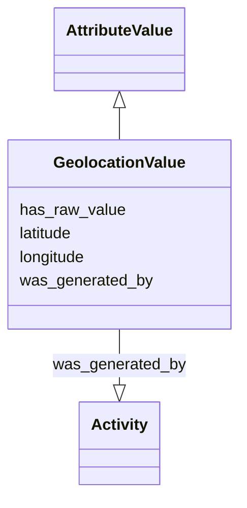

# Class: GeolocationValue


_A normalized value for a location on the earth's surface_


URI: [nmdc:GeolocationValue](https://w3id.org/nmdc/GeolocationValue)





## Inheritance
* [AttributeValue](AttributeValue.md)
    * **GeolocationValue**


## Slots

| Name | Cardinality and Range | Description | Inheritance |
| ---  | --- | --- | --- |
| [latitude](latitude.md) | 1..1 <br/> [DecimalDegree](DecimalDegree.md) | latitude | direct |
| [longitude](longitude.md) | 1..1 <br/> [DecimalDegree](DecimalDegree.md) | longitude | direct |
| [has_raw_value](has_raw_value.md) | 0..1 <br/> [String](String.md) | The raw value for a geolocation should follow {latitude} {longitude} | [AttributeValue](AttributeValue.md) |
| [was_generated_by](was_generated_by.md) | 0..1 <br/> [Activity](Activity.md) |  | [AttributeValue](AttributeValue.md) |


## Usages

| used by | used in | type | used |
| ---  | --- | --- | --- |
| [FieldResearchSite](FieldResearchSite.md) | [lat_lon](lat_lon.md) | range | [GeolocationValue](GeolocationValue.md) |
| [Biosample](Biosample.md) | [lat_lon](lat_lon.md) | range | [GeolocationValue](GeolocationValue.md) |
| [GeolocationValue](GeolocationValue.md) | [latitude](latitude.md) | domain | [GeolocationValue](GeolocationValue.md) |
| [GeolocationValue](GeolocationValue.md) | [longitude](longitude.md) | domain | [GeolocationValue](GeolocationValue.md) |


## Identifier and Mapping Information


### Schema Source


* from schema: https://w3id.org/nmdc/nmdc


## Mappings

| Mapping Type | Mapped Value |
| ---  | ---  |
| self | nmdc:GeolocationValue |
| native | nmdc:GeolocationValue |
| undefined | schema:GeoCoordinates |


## LinkML Source

<!-- TODO: investigate https://stackoverflow.com/questions/37606292/how-to-create-tabbed-code-blocks-in-mkdocs-or-sphinx -->

### Direct

<details>
```yaml
name: GeolocationValue
description: A normalized value for a location on the earth's surface
notes:
- 'what did ''to_str: {latitude} {longitude}'' mean?'
from_schema: https://w3id.org/nmdc/nmdc
mappings:
- schema:GeoCoordinates
is_a: AttributeValue
slots:
- latitude
- longitude
slot_usage:
  has_raw_value:
    name: has_raw_value
    description: The raw value for a geolocation should follow {latitude} {longitude}
    domain_of:
    - AttributeValue
    - QuantityValue
  latitude:
    name: latitude
    domain_of:
    - GeolocationValue
    required: true
  longitude:
    name: longitude
    domain_of:
    - GeolocationValue
    required: true

```
</details>

### Induced

<details>
```yaml
name: GeolocationValue
description: A normalized value for a location on the earth's surface
notes:
- 'what did ''to_str: {latitude} {longitude}'' mean?'
from_schema: https://w3id.org/nmdc/nmdc
mappings:
- schema:GeoCoordinates
is_a: AttributeValue
slot_usage:
  has_raw_value:
    name: has_raw_value
    description: The raw value for a geolocation should follow {latitude} {longitude}
    domain_of:
    - AttributeValue
    - QuantityValue
  latitude:
    name: latitude
    domain_of:
    - GeolocationValue
    required: true
  longitude:
    name: longitude
    domain_of:
    - GeolocationValue
    required: true
attributes:
  latitude:
    name: latitude
    description: latitude
    from_schema: https://w3id.org/nmdc/nmdc
    rank: 1000
    domain: GeolocationValue
    slot_uri: wgs84:lat
    alias: latitude
    owner: GeolocationValue
    domain_of:
    - GeolocationValue
    range: decimal degree
    required: true
  longitude:
    name: longitude
    description: longitude
    from_schema: https://w3id.org/nmdc/nmdc
    rank: 1000
    domain: GeolocationValue
    slot_uri: wgs84:long
    alias: longitude
    owner: GeolocationValue
    domain_of:
    - GeolocationValue
    range: decimal degree
    required: true
  has_raw_value:
    name: has_raw_value
    description: The raw value for a geolocation should follow {latitude} {longitude}
    from_schema: https://w3id.org/nmdc/nmdc
    rank: 1000
    domain: AttributeValue
    multivalued: false
    alias: has_raw_value
    owner: GeolocationValue
    domain_of:
    - AttributeValue
    - QuantityValue
    range: string
  was_generated_by:
    name: was_generated_by
    from_schema: https://w3id.org/nmdc/nmdc
    mappings:
    - prov:wasGeneratedBy
    rank: 1000
    alias: was_generated_by
    owner: GeolocationValue
    domain_of:
    - DataObject
    - AttributeValue
    - FunctionalAnnotation
    range: Activity

```
</details>