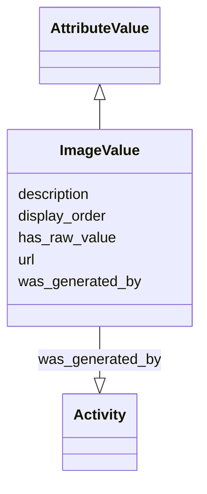

# Class: ImageValue


_An attribute value representing an image._


URI: [nmdc:ImageValue](https://w3id.org/nmdc/ImageValue)





## Inheritance
* [AttributeValue](AttributeValue.md)
    * **ImageValue**


## Slots

| Name | Cardinality and Range | Description | Inheritance |
| ---  | --- | --- | --- |
| [url](url.md) | 0..1 <br/> [String](String.md) |  | direct |
| [description](description.md) | 0..1 <br/> [String](String.md) | a human-readable description of a thing | direct |
| [display_order](display_order.md) | 0..1 <br/> [Integer](Integer.md) | When rendering information, this attribute to specify the order in which the ... | direct |
| [has_raw_value](has_raw_value.md) | 0..1 <br/> [String](String.md) | The value that was specified for an annotation in raw form, i | [AttributeValue](AttributeValue.md) |
| [was_generated_by](was_generated_by.md) | 0..1 <br/> [Activity](Activity.md) |  | [AttributeValue](AttributeValue.md) |


## Usages

| used by | used in | type | used |
| ---  | --- | --- | --- |
| [Study](Study.md) | [study_image](study_image.md) | range | [ImageValue](ImageValue.md) |
| [ImageValue](ImageValue.md) | [display_order](display_order.md) | domain | [ImageValue](ImageValue.md) |


## Identifier and Mapping Information


### Schema Source


* from schema: https://w3id.org/nmdc/nmdc


## Mappings

| Mapping Type | Mapped Value |
| ---  | ---  |
| self | nmdc:ImageValue |
| native | nmdc:ImageValue |


## LinkML Source

<!-- TODO: investigate https://stackoverflow.com/questions/37606292/how-to-create-tabbed-code-blocks-in-mkdocs-or-sphinx -->

### Direct

<details>
```yaml
name: ImageValue
description: An attribute value representing an image.
from_schema: https://w3id.org/nmdc/nmdc
is_a: AttributeValue
slots:
- url
- description
- display_order

```
</details>

### Induced

<details>
```yaml
name: ImageValue
description: An attribute value representing an image.
from_schema: https://w3id.org/nmdc/nmdc
is_a: AttributeValue
attributes:
  url:
    name: url
    notes:
    - See issue 207 - this clashes with the mixs field
    from_schema: https://w3id.org/nmdc/nmdc
    rank: 1000
    alias: url
    owner: ImageValue
    domain_of:
    - Protocol
    - DataObject
    - ImageValue
    range: string
  description:
    name: description
    description: a human-readable description of a thing
    from_schema: https://w3id.org/nmdc/nmdc
    rank: 1000
    slot_uri: dcterms:description
    alias: description
    owner: ImageValue
    domain_of:
    - Study
    - NamedThing
    - ImageValue
    range: string
  display_order:
    name: display_order
    description: When rendering information, this attribute to specify the order in
      which the information should be rendered.
    from_schema: https://w3id.org/nmdc/nmdc
    rank: 1000
    domain: ImageValue
    alias: display_order
    owner: ImageValue
    domain_of:
    - ImageValue
    range: integer
  has_raw_value:
    name: has_raw_value
    description: The value that was specified for an annotation in raw form, i.e.
      a string. E.g. "2 cm" or "2-4 cm"
    from_schema: https://w3id.org/nmdc/nmdc
    rank: 1000
    domain: AttributeValue
    multivalued: false
    alias: has_raw_value
    owner: ImageValue
    domain_of:
    - AttributeValue
    - QuantityValue
    range: string
  was_generated_by:
    name: was_generated_by
    from_schema: https://w3id.org/nmdc/nmdc
    mappings:
    - prov:wasGeneratedBy
    rank: 1000
    alias: was_generated_by
    owner: ImageValue
    domain_of:
    - DataObject
    - AttributeValue
    - FunctionalAnnotation
    range: Activity

```
</details>