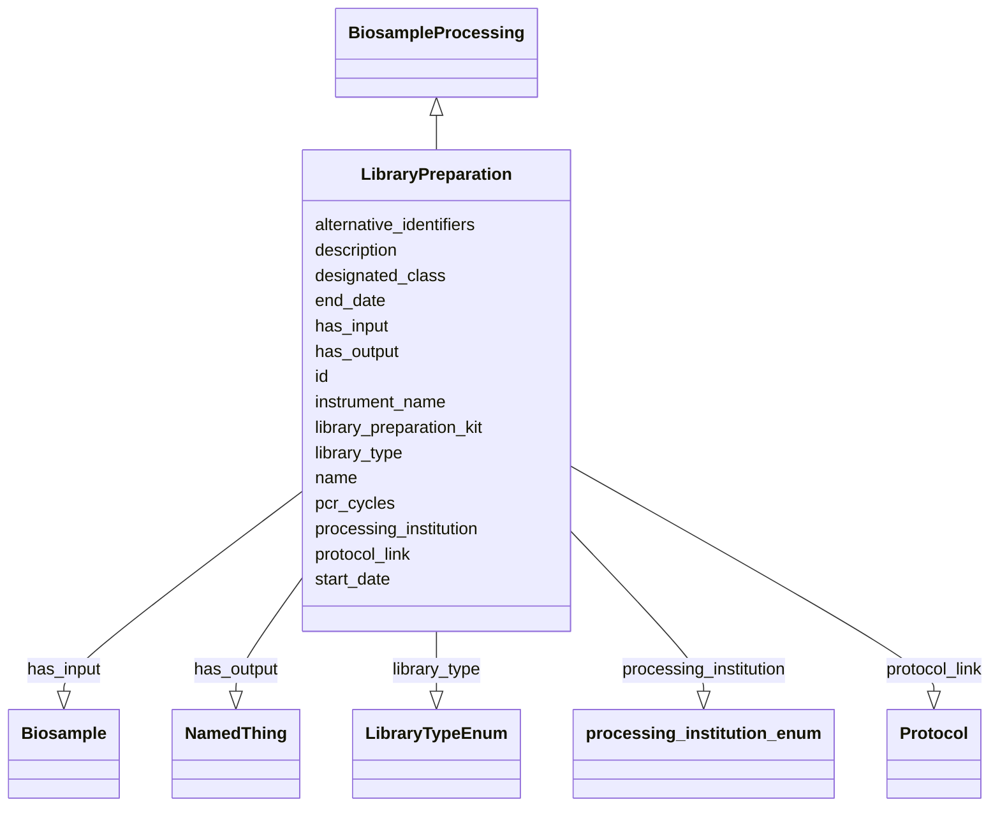

# Class: LibraryPreparation


URI: [nmdc:LibraryPreparation](https://w3id.org/nmdc/LibraryPreparation)





## Inheritance
* [NamedThing](NamedThing.md)
    * [PlannedProcess](PlannedProcess.md)
        * [BiosampleProcessing](BiosampleProcessing.md)
            * **LibraryPreparation**


## Slots

| Name | Cardinality and Range | Description | Inheritance |
| ---  | --- | --- | --- |
| [library_preparation_kit](library_preparation_kit.md) | 0..1 <br/> [String](String.md) |  | direct |
| [library_type](library_type.md) | 0..1 <br/> [LibraryTypeEnum](LibraryTypeEnum.md) |  | direct |
| [pcr_cycles](pcr_cycles.md) | 0..1 <br/> [Integer](Integer.md) |  | direct |
| [has_input](has_input.md) | 1..* <br/> [Biosample](Biosample.md) | An input to a process | [PlannedProcess](PlannedProcess.md), [BiosampleProcessing](BiosampleProcessing.md) |
| [designated_class](designated_class.md) | 0..1 <br/> [Uriorcurie](Uriorcurie.md) |  | [PlannedProcess](PlannedProcess.md) |
| [end_date](end_date.md) | 0..1 <br/> [String](String.md) | The date on which any process or activity was ended | [PlannedProcess](PlannedProcess.md) |
| [has_output](has_output.md) | 1..* <br/> [NamedThing](NamedThing.md) | An output biosample to a processing step | [PlannedProcess](PlannedProcess.md) |
| [processing_institution](processing_institution.md) | 0..1 <br/> [ProcessingInstitutionEnum](ProcessingInstitutionEnum.md) | The organization that processed the sample | [PlannedProcess](PlannedProcess.md) |
| [protocol_link](protocol_link.md) | 0..1 <br/> [Protocol](Protocol.md) |  | [PlannedProcess](PlannedProcess.md) |
| [start_date](start_date.md) | 0..1 <br/> [String](String.md) | The date on which any process or activity was started | [PlannedProcess](PlannedProcess.md) |
| [instrument_name](instrument_name.md) | 0..1 <br/> [String](String.md) | The name of the instrument that was used for processing the sample | [PlannedProcess](PlannedProcess.md) |
| [id](id.md) | 1..1 <br/> [Uriorcurie](Uriorcurie.md) | A unique identifier for a thing | [NamedThing](NamedThing.md) |
| [name](name.md) | 0..1 <br/> [String](String.md) | A human readable label for an entity | [NamedThing](NamedThing.md) |
| [description](description.md) | 0..1 <br/> [String](String.md) | a human-readable description of a thing | [NamedThing](NamedThing.md) |
| [alternative_identifiers](alternative_identifiers.md) | 0..* <br/> [Uriorcurie](Uriorcurie.md) | A list of alternative identifiers for the entity | [NamedThing](NamedThing.md) |


## Usages

| used by | used in | type | used |
| ---  | --- | --- | --- |
| [Database](Database.md) | [library_preparation_set](library_preparation_set.md) | range | [LibraryPreparation](LibraryPreparation.md) |
| [LibraryPreparation](LibraryPreparation.md) | [library_type](library_type.md) | domain | [LibraryPreparation](LibraryPreparation.md) |


## Aliases


* LibraryConstruction


## Comments

* OBI:0000711 specifies a DNA input (but not ONLY a DNA input)

## Identifier and Mapping Information


### Schema Source


* from schema: https://w3id.org/nmdc/nmdc


## Mappings

| Mapping Type | Mapped Value |
| ---  | ---  |
| self | nmdc:LibraryPreparation |
| native | nmdc:LibraryPreparation |
| close | OBI:0000711 |


## LinkML Source

<!-- TODO: investigate https://stackoverflow.com/questions/37606292/how-to-create-tabbed-code-blocks-in-mkdocs-or-sphinx -->

### Direct

<details>
```yaml
name: LibraryPreparation
comments:
- OBI:0000711 specifies a DNA input (but not ONLY a DNA input)
from_schema: https://w3id.org/nmdc/nmdc
aliases:
- LibraryConstruction
close_mappings:
- OBI:0000711
is_a: BiosampleProcessing
slots:
- library_preparation_kit
- library_type
- pcr_cycles
slot_usage:
  has_input:
    name: has_input
    domain_of:
    - BiosampleProcessing
    - OmicsProcessing
    - WorkflowExecutionActivity
    - PlannedProcess
    required: true
  has_output:
    name: has_output
    domain_of:
    - OmicsProcessing
    - WorkflowExecutionActivity
    - PlannedProcess
    required: true
  id:
    name: id
    domain_of:
    - Biosample
    - Study
    - NamedThing
    - Activity
    required: true
    structured_pattern:
      syntax: '{id_nmdc_prefix}:libprp-{id_shoulder}-{id_blade}{id_version}{id_locus}'
      interpolated: true
class_uri: nmdc:LibraryPreparation

```
</details>

### Induced

<details>
```yaml
name: LibraryPreparation
comments:
- OBI:0000711 specifies a DNA input (but not ONLY a DNA input)
from_schema: https://w3id.org/nmdc/nmdc
aliases:
- LibraryConstruction
close_mappings:
- OBI:0000711
is_a: BiosampleProcessing
slot_usage:
  has_input:
    name: has_input
    domain_of:
    - BiosampleProcessing
    - OmicsProcessing
    - WorkflowExecutionActivity
    - PlannedProcess
    required: true
  has_output:
    name: has_output
    domain_of:
    - OmicsProcessing
    - WorkflowExecutionActivity
    - PlannedProcess
    required: true
  id:
    name: id
    domain_of:
    - Biosample
    - Study
    - NamedThing
    - Activity
    required: true
    structured_pattern:
      syntax: '{id_nmdc_prefix}:libprp-{id_shoulder}-{id_blade}{id_version}{id_locus}'
      interpolated: true
attributes:
  library_preparation_kit:
    name: library_preparation_kit
    from_schema: https://w3id.org/nmdc/nmdc
    rank: 1000
    alias: library_preparation_kit
    owner: LibraryPreparation
    domain_of:
    - LibraryPreparation
    range: string
  library_type:
    name: library_type
    title: library type
    examples:
    - value: DNA
    from_schema: https://w3id.org/nmdc/nmdc
    rank: 1000
    domain: LibraryPreparation
    alias: library_type
    owner: LibraryPreparation
    domain_of:
    - LibraryPreparation
    range: LibraryTypeEnum
  pcr_cycles:
    name: pcr_cycles
    from_schema: https://w3id.org/nmdc/nmdc
    exact_mappings:
    - OBI:0002475
    rank: 1000
    alias: pcr_cycles
    owner: LibraryPreparation
    domain_of:
    - LibraryPreparation
    range: integer
  has_input:
    name: has_input
    description: An input to a process.
    from_schema: https://w3id.org/nmdc/nmdc
    rank: 1000
    domain: NamedThing
    multivalued: true
    alias: has_input
    owner: LibraryPreparation
    domain_of:
    - BiosampleProcessing
    - OmicsProcessing
    - WorkflowExecutionActivity
    - PlannedProcess
    range: Biosample
    required: true
  designated_class:
    name: designated_class
    comments:
    - required on all instances in a polymorphic Database slot like planned_process_set
    from_schema: https://w3id.org/nmdc/nmdc
    rank: 1000
    designates_type: true
    alias: designated_class
    owner: LibraryPreparation
    domain_of:
    - PlannedProcess
    range: uriorcurie
  end_date:
    name: end_date
    description: The date on which any process or activity was ended
    todos:
    - add date string validation pattern
    comments:
    - We are using string representations of dates until all components of our ecosystem
      can handle ISO 8610 dates
    - The date should be formatted as YYYY-MM-DD
    from_schema: https://w3id.org/nmdc/nmdc
    rank: 1000
    alias: end_date
    owner: LibraryPreparation
    domain_of:
    - PlannedProcess
    range: string
  has_output:
    name: has_output
    description: An output biosample to a processing step
    from_schema: https://w3id.org/nmdc/nmdc
    rank: 1000
    domain: NamedThing
    multivalued: true
    alias: has_output
    owner: LibraryPreparation
    domain_of:
    - OmicsProcessing
    - WorkflowExecutionActivity
    - PlannedProcess
    range: NamedThing
    required: true
  processing_institution:
    name: processing_institution
    description: The organization that processed the sample.
    from_schema: https://w3id.org/nmdc/nmdc
    rank: 1000
    domain: PlannedProcess
    alias: processing_institution
    owner: LibraryPreparation
    domain_of:
    - OmicsProcessing
    - PlannedProcess
    range: processing_institution_enum
  protocol_link:
    name: protocol_link
    from_schema: https://w3id.org/nmdc/nmdc
    rank: 1000
    domain: PlannedProcess
    alias: protocol_link
    owner: LibraryPreparation
    domain_of:
    - PlannedProcess
    range: Protocol
  start_date:
    name: start_date
    description: The date on which any process or activity was started
    todos:
    - add date string validation pattern
    comments:
    - We are using string representations of dates until all components of our ecosystem
      can handle ISO 8610 dates
    - The date should be formatted as YYYY-MM-DD
    from_schema: https://w3id.org/nmdc/nmdc
    rank: 1000
    alias: start_date
    owner: LibraryPreparation
    domain_of:
    - PlannedProcess
    range: string
  instrument_name:
    name: instrument_name
    description: The name of the instrument that was used for processing the sample.
    from_schema: https://w3id.org/nmdc/nmdc
    rank: 1000
    domain: PlannedProcess
    alias: instrument_name
    owner: LibraryPreparation
    domain_of:
    - OmicsProcessing
    - PlannedProcess
    range: string
  id:
    name: id
    description: A unique identifier for a thing. Must be either a CURIE shorthand
      for a URI or a complete URI
    from_schema: https://w3id.org/nmdc/nmdc
    rank: 1000
    identifier: true
    alias: id
    owner: LibraryPreparation
    domain_of:
    - Biosample
    - Study
    - NamedThing
    - Activity
    range: uriorcurie
    required: true
    pattern: ^[a-zA-Z0-9][a-zA-Z0-9_\.]+:[a-zA-Z0-9_][a-zA-Z0-9_\-\/\.,]*$
    structured_pattern:
      syntax: '{id_nmdc_prefix}:libprp-{id_shoulder}-{id_blade}{id_version}{id_locus}'
      interpolated: true
  name:
    name: name
    description: A human readable label for an entity
    from_schema: https://w3id.org/nmdc/nmdc
    rank: 1000
    alias: name
    owner: LibraryPreparation
    domain_of:
    - Protocol
    - QualityControlReport
    - NamedThing
    - PersonValue
    - Activity
    range: string
  description:
    name: description
    description: a human-readable description of a thing
    from_schema: https://w3id.org/nmdc/nmdc
    rank: 1000
    slot_uri: dcterms:description
    alias: description
    owner: LibraryPreparation
    domain_of:
    - Study
    - NamedThing
    - ImageValue
    range: string
  alternative_identifiers:
    name: alternative_identifiers
    description: A list of alternative identifiers for the entity.
    from_schema: https://w3id.org/nmdc/nmdc
    rank: 1000
    multivalued: true
    alias: alternative_identifiers
    owner: LibraryPreparation
    domain_of:
    - Biosample
    - Study
    - NamedThing
    - MetaboliteQuantification
    range: uriorcurie
    pattern: ^[a-zA-Z0-9][a-zA-Z0-9_\.]+:[a-zA-Z0-9_][a-zA-Z0-9_\-\/\.,]*$
class_uri: nmdc:LibraryPreparation

```
</details>