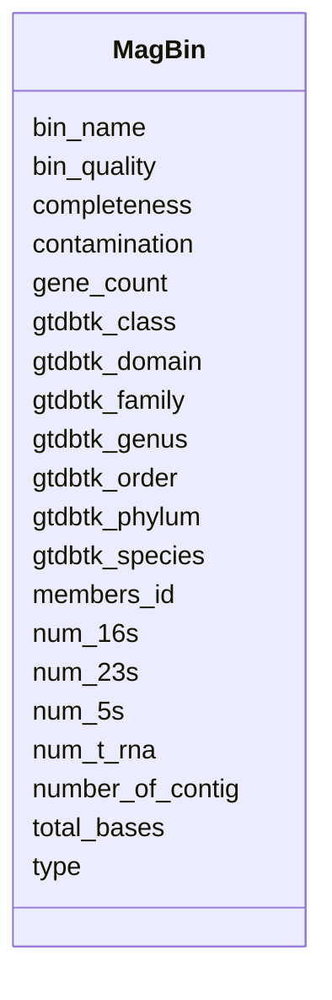

# Class: MagBin


URI: [nmdc:MagBin](https://w3id.org/nmdc/MagBin)





<!-- no inheritance hierarchy -->


## Slots

| Name | Cardinality and Range | Description | Inheritance |
| ---  | --- | --- | --- |
| [bin_name](bin_name.md) | 0..1 <br/> [String](String.md) |  | direct |
| [bin_quality](bin_quality.md) | 0..1 <br/> [String](String.md) |  | direct |
| [completeness](completeness.md) | 0..1 <br/> [Float](Float.md) |  | direct |
| [contamination](contamination.md) | 0..1 <br/> [Float](Float.md) |  | direct |
| [gene_count](gene_count.md) | 0..1 <br/> [Integer](Integer.md) |  | direct |
| [gtdbtk_class](gtdbtk_class.md) | 0..1 <br/> [String](String.md) |  | direct |
| [gtdbtk_domain](gtdbtk_domain.md) | 0..1 <br/> [String](String.md) |  | direct |
| [gtdbtk_family](gtdbtk_family.md) | 0..1 <br/> [String](String.md) |  | direct |
| [gtdbtk_genus](gtdbtk_genus.md) | 0..1 <br/> [String](String.md) |  | direct |
| [gtdbtk_order](gtdbtk_order.md) | 0..1 <br/> [String](String.md) |  | direct |
| [gtdbtk_phylum](gtdbtk_phylum.md) | 0..1 <br/> [String](String.md) |  | direct |
| [gtdbtk_species](gtdbtk_species.md) | 0..1 <br/> [String](String.md) |  | direct |
| [members_id](members_id.md) | 0..1 <br/> [String](String.md) |  | direct |
| [num_16s](num_16s.md) | 0..1 <br/> [Integer](Integer.md) |  | direct |
| [num_23s](num_23s.md) | 0..1 <br/> [Integer](Integer.md) |  | direct |
| [num_5s](num_5s.md) | 0..1 <br/> [Integer](Integer.md) |  | direct |
| [num_t_rna](num_t_rna.md) | 0..1 <br/> [Integer](Integer.md) |  | direct |
| [number_of_contig](number_of_contig.md) | 0..1 <br/> [Integer](Integer.md) |  | direct |
| [total_bases](total_bases.md) | 0..1 <br/> [Integer](Integer.md) |  | direct |
| [type](type.md) | 0..1 <br/> [String](String.md) | An optional string that specifies the type object | direct |


## Usages

| used by | used in | type | used |
| ---  | --- | --- | --- |
| [MagsAnalysisActivity](MagsAnalysisActivity.md) | [mags_list](mags_list.md) | range | [MagBin](MagBin.md) |
| [MagBin](MagBin.md) | [members_id](members_id.md) | domain | [MagBin](MagBin.md) |
| [MagBin](MagBin.md) | [total_bases](total_bases.md) | domain | [MagBin](MagBin.md) |


## Identifier and Mapping Information


### Schema Source


* from schema: https://w3id.org/nmdc/nmdc


## Mappings

| Mapping Type | Mapped Value |
| ---  | ---  |
| self | nmdc:MagBin |
| native | nmdc:MagBin |


## LinkML Source

<!-- TODO: investigate https://stackoverflow.com/questions/37606292/how-to-create-tabbed-code-blocks-in-mkdocs-or-sphinx -->

### Direct

<details>
```yaml
name: MagBin
from_schema: https://w3id.org/nmdc/nmdc
slots:
- bin_name
- bin_quality
- completeness
- contamination
- gene_count
- gtdbtk_class
- gtdbtk_domain
- gtdbtk_family
- gtdbtk_genus
- gtdbtk_order
- gtdbtk_phylum
- gtdbtk_species
- members_id
- num_16s
- num_23s
- num_5s
- num_t_rna
- number_of_contig
- total_bases
- type

```
</details>

### Induced

<details>
```yaml
name: MagBin
from_schema: https://w3id.org/nmdc/nmdc
attributes:
  bin_name:
    name: bin_name
    from_schema: https://w3id.org/nmdc/nmdc
    rank: 1000
    alias: bin_name
    owner: MagBin
    domain_of:
    - MagBin
    range: string
  bin_quality:
    name: bin_quality
    from_schema: https://w3id.org/nmdc/nmdc
    rank: 1000
    alias: bin_quality
    owner: MagBin
    domain_of:
    - MagBin
    range: string
  completeness:
    name: completeness
    from_schema: https://w3id.org/nmdc/nmdc
    rank: 1000
    alias: completeness
    owner: MagBin
    domain_of:
    - MagBin
    range: float
  contamination:
    name: contamination
    from_schema: https://w3id.org/nmdc/nmdc
    rank: 1000
    alias: contamination
    owner: MagBin
    domain_of:
    - MagBin
    range: float
  gene_count:
    name: gene_count
    from_schema: https://w3id.org/nmdc/nmdc
    rank: 1000
    alias: gene_count
    owner: MagBin
    domain_of:
    - MagBin
    range: integer
  gtdbtk_class:
    name: gtdbtk_class
    from_schema: https://w3id.org/nmdc/nmdc
    rank: 1000
    alias: gtdbtk_class
    owner: MagBin
    domain_of:
    - MagBin
    range: string
  gtdbtk_domain:
    name: gtdbtk_domain
    from_schema: https://w3id.org/nmdc/nmdc
    rank: 1000
    alias: gtdbtk_domain
    owner: MagBin
    domain_of:
    - MagBin
    range: string
  gtdbtk_family:
    name: gtdbtk_family
    from_schema: https://w3id.org/nmdc/nmdc
    rank: 1000
    alias: gtdbtk_family
    owner: MagBin
    domain_of:
    - MagBin
    range: string
  gtdbtk_genus:
    name: gtdbtk_genus
    from_schema: https://w3id.org/nmdc/nmdc
    rank: 1000
    alias: gtdbtk_genus
    owner: MagBin
    domain_of:
    - MagBin
    range: string
  gtdbtk_order:
    name: gtdbtk_order
    from_schema: https://w3id.org/nmdc/nmdc
    rank: 1000
    alias: gtdbtk_order
    owner: MagBin
    domain_of:
    - MagBin
    range: string
  gtdbtk_phylum:
    name: gtdbtk_phylum
    from_schema: https://w3id.org/nmdc/nmdc
    rank: 1000
    alias: gtdbtk_phylum
    owner: MagBin
    domain_of:
    - MagBin
    range: string
  gtdbtk_species:
    name: gtdbtk_species
    from_schema: https://w3id.org/nmdc/nmdc
    rank: 1000
    alias: gtdbtk_species
    owner: MagBin
    domain_of:
    - MagBin
    range: string
  members_id:
    name: members_id
    todos:
    - this slot needs some basic textual annotations and constraints
    from_schema: https://w3id.org/nmdc/nmdc
    rank: 1000
    domain: MagBin
    alias: members_id
    owner: MagBin
    domain_of:
    - MagBin
    range: string
  num_16s:
    name: num_16s
    from_schema: https://w3id.org/nmdc/nmdc
    rank: 1000
    alias: num_16s
    owner: MagBin
    domain_of:
    - MagBin
    range: integer
  num_23s:
    name: num_23s
    from_schema: https://w3id.org/nmdc/nmdc
    rank: 1000
    alias: num_23s
    owner: MagBin
    domain_of:
    - MagBin
    range: integer
  num_5s:
    name: num_5s
    from_schema: https://w3id.org/nmdc/nmdc
    rank: 1000
    alias: num_5s
    owner: MagBin
    domain_of:
    - MagBin
    range: integer
  num_t_rna:
    name: num_t_rna
    from_schema: https://w3id.org/nmdc/nmdc
    rank: 1000
    alias: num_t_rna
    owner: MagBin
    domain_of:
    - MagBin
    range: integer
  number_of_contig:
    name: number_of_contig
    from_schema: https://w3id.org/nmdc/nmdc
    rank: 1000
    alias: number_of_contig
    owner: MagBin
    domain_of:
    - MagBin
    range: integer
  total_bases:
    name: total_bases
    todos:
    - this slot needs some basic textual annotations and constraints
    from_schema: https://w3id.org/nmdc/nmdc
    rank: 1000
    domain: MagBin
    alias: total_bases
    owner: MagBin
    domain_of:
    - MagBin
    range: integer
  type:
    name: type
    description: An optional string that specifies the type object.  This is used
      to allow for searches for different kinds of objects.
    deprecated: Due to confusion about what values are used for this slot, it is best
      not to use this slot. See https://github.com/microbiomedata/nmdc-schema/issues/248.
      MAM removed designates_type and rdf:type slot uri 2022-11-30
    examples:
    - value: nmdc:Biosample
    - value: nmdc:Study
    from_schema: https://w3id.org/nmdc/nmdc
    see_also:
    - https://github.com/microbiomedata/nmdc-schema/issues/1233
    rank: 1000
    alias: type
    owner: MagBin
    domain_of:
    - DataObject
    - Biosample
    - Study
    - OmicsProcessing
    - CreditAssociation
    - WorkflowExecutionActivity
    - MetagenomeAssembly
    - MetagenomeAnnotationActivity
    - MetatranscriptomeAnnotationActivity
    - MetatranscriptomeActivity
    - MagsAnalysisActivity
    - ReadQcAnalysisActivity
    - ReadBasedTaxonomyAnalysisActivity
    - MagBin
    - GenomeFeature
    range: string

```
</details>