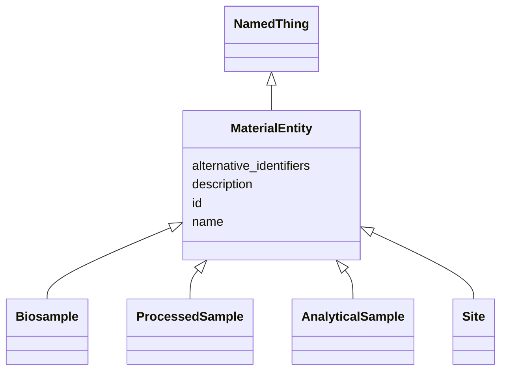

# Class: Material Entity (MaterialEntity)


* __NOTE__: this is an abstract class and should not be instantiated directly


URI: [nmdc:MaterialEntity](https://w3id.org/nmdc/MaterialEntity)





## Inheritance
* [NamedThing](NamedThing.md)
    * **MaterialEntity**
        * [Biosample](Biosample.md)
        * [ProcessedSample](ProcessedSample.md)
        * [AnalyticalSample](AnalyticalSample.md)
        * [Site](Site.md)


## Slots

| Name | Cardinality and Range | Description | Inheritance |
| ---  | --- | --- | --- |
| [id](id.md) | 1..1 <br/> [Uriorcurie](Uriorcurie.md) | A unique identifier for a thing | [NamedThing](NamedThing.md) |
| [name](name.md) | 0..1 <br/> [String](String.md) | A human readable label for an entity | [NamedThing](NamedThing.md) |
| [description](description.md) | 0..1 <br/> [String](String.md) | a human-readable description of a thing | [NamedThing](NamedThing.md) |
| [alternative_identifiers](alternative_identifiers.md) | 0..* <br/> [Uriorcurie](Uriorcurie.md) | A list of alternative identifiers for the entity | [NamedThing](NamedThing.md) |


## Aliases


* Material
* Physical entity


## Identifier and Mapping Information


### Schema Source


* from schema: https://w3id.org/nmdc/nmdc


## Mappings

| Mapping Type | Mapped Value |
| ---  | ---  |
| self | nmdc:MaterialEntity |
| native | nmdc:MaterialEntity |


## LinkML Source

<!-- TODO: investigate https://stackoverflow.com/questions/37606292/how-to-create-tabbed-code-blocks-in-mkdocs-or-sphinx -->

### Direct

<details>
```yaml
name: MaterialEntity
title: Material Entity
from_schema: https://w3id.org/nmdc/nmdc
aliases:
- Material
- Physical entity
is_a: NamedThing
abstract: true

```
</details>

### Induced

<details>
```yaml
name: MaterialEntity
title: Material Entity
from_schema: https://w3id.org/nmdc/nmdc
aliases:
- Material
- Physical entity
is_a: NamedThing
abstract: true
attributes:
  id:
    name: id
    description: A unique identifier for a thing. Must be either a CURIE shorthand
      for a URI or a complete URI
    notes:
    - 'abstracted pattern: prefix:typecode-authshoulder-blade(.version)?(_seqsuffix)?'
    - a minimum length of 3 characters is suggested for typecodes, but 1 or 2 characters
      will be accepted
    - typecodes must correspond 1:1 to a class in the NMDC schema. this will be checked
      via per-class id slot usage assertions
    - minting authority shoulders should probably be enumerated and checked in the
      pattern
    examples:
    - value: nmdc:mgmag-00-x012.1_7_c1
      description: https://github.com/microbiomedata/nmdc-schema/pull/499#discussion_r1018499248
    from_schema: https://w3id.org/nmdc/nmdc
    rank: 1000
    identifier: true
    alias: id
    owner: MaterialEntity
    domain_of:
    - Biosample
    - Study
    - NamedThing
    - Activity
    range: uriorcurie
    required: true
    pattern: ^[a-zA-Z0-9][a-zA-Z0-9_\.]+:[a-zA-Z0-9_][a-zA-Z0-9_\-\/\.,]*$
  name:
    name: name
    description: A human readable label for an entity
    from_schema: https://w3id.org/nmdc/nmdc
    rank: 1000
    alias: name
    owner: MaterialEntity
    domain_of:
    - Protocol
    - QualityControlReport
    - NamedThing
    - PersonValue
    - Activity
    range: string
  description:
    name: description
    description: a human-readable description of a thing
    from_schema: https://w3id.org/nmdc/nmdc
    rank: 1000
    slot_uri: dcterms:description
    alias: description
    owner: MaterialEntity
    domain_of:
    - Study
    - NamedThing
    - ImageValue
    range: string
  alternative_identifiers:
    name: alternative_identifiers
    description: A list of alternative identifiers for the entity.
    from_schema: https://w3id.org/nmdc/nmdc
    rank: 1000
    multivalued: true
    alias: alternative_identifiers
    owner: MaterialEntity
    domain_of:
    - Biosample
    - Study
    - NamedThing
    - MetaboliteQuantification
    range: uriorcurie
    pattern: ^[a-zA-Z0-9][a-zA-Z0-9_\.]+:[a-zA-Z0-9_][a-zA-Z0-9_\-\/\.,]*$

```
</details>