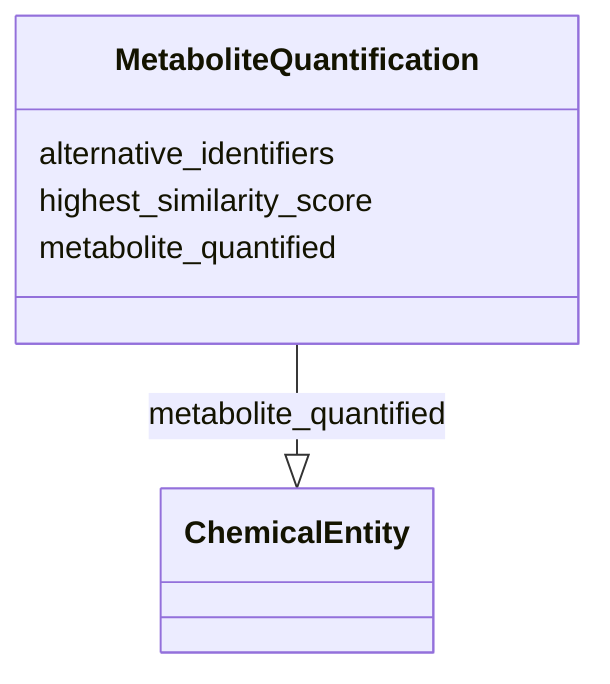

# Class: MetaboliteQuantification


_This is used to link a metabolomics analysis workflow to a specific metabolite_


URI: [nmdc:MetaboliteQuantification](https://w3id.org/nmdc/MetaboliteQuantification)





<!-- no inheritance hierarchy -->


## Slots

| Name | Cardinality and Range | Description | Inheritance |
| ---  | --- | --- | --- |
| [alternative_identifiers](alternative_identifiers.md) | 0..* <br/> [Uriorcurie](Uriorcurie.md) | A list of alternative identifiers for the entity | direct |
| [highest_similarity_score](highest_similarity_score.md) | 0..1 <br/> [Float](Float.md) |  | direct |
| [metabolite_quantified](metabolite_quantified.md) | 0..1 <br/> [ChemicalEntity](ChemicalEntity.md) | the specific metabolite identifier | direct |


## Usages

| used by | used in | type | used |
| ---  | --- | --- | --- |
| [MetabolomicsAnalysisActivity](MetabolomicsAnalysisActivity.md) | [has_metabolite_quantifications](has_metabolite_quantifications.md) | range | [MetaboliteQuantification](MetaboliteQuantification.md) |
| [MetaboliteQuantification](MetaboliteQuantification.md) | [metabolite_quantified](metabolite_quantified.md) | domain | [MetaboliteQuantification](MetaboliteQuantification.md) |


## Identifier and Mapping Information


### Schema Source


* from schema: https://w3id.org/nmdc/nmdc


## Mappings

| Mapping Type | Mapped Value |
| ---  | ---  |
| self | nmdc:MetaboliteQuantification |
| native | nmdc:MetaboliteQuantification |


## LinkML Source

<!-- TODO: investigate https://stackoverflow.com/questions/37606292/how-to-create-tabbed-code-blocks-in-mkdocs-or-sphinx -->

### Direct

<details>
```yaml
name: MetaboliteQuantification
description: This is used to link a metabolomics analysis workflow to a specific metabolite
from_schema: https://w3id.org/nmdc/nmdc
slots:
- alternative_identifiers
- highest_similarity_score
- metabolite_quantified

```
</details>

### Induced

<details>
```yaml
name: MetaboliteQuantification
description: This is used to link a metabolomics analysis workflow to a specific metabolite
from_schema: https://w3id.org/nmdc/nmdc
attributes:
  alternative_identifiers:
    name: alternative_identifiers
    description: A list of alternative identifiers for the entity.
    from_schema: https://w3id.org/nmdc/nmdc
    rank: 1000
    multivalued: true
    alias: alternative_identifiers
    owner: MetaboliteQuantification
    domain_of:
    - Biosample
    - Study
    - NamedThing
    - MetaboliteQuantification
    range: uriorcurie
    pattern: ^[a-zA-Z0-9][a-zA-Z0-9_\.]+:[a-zA-Z0-9_][a-zA-Z0-9_\-\/\.,]*$
  highest_similarity_score:
    name: highest_similarity_score
    todos:
    - Yuri to fill in description
    from_schema: https://w3id.org/nmdc/nmdc
    rank: 1000
    alias: highest_similarity_score
    owner: MetaboliteQuantification
    domain_of:
    - MetaboliteQuantification
    range: float
  metabolite_quantified:
    name: metabolite_quantified
    description: the specific metabolite identifier
    from_schema: https://w3id.org/nmdc/nmdc
    rank: 1000
    domain: MetaboliteQuantification
    alias: metabolite_quantified
    owner: MetaboliteQuantification
    domain_of:
    - MetaboliteQuantification
    range: ChemicalEntity

```
</details>