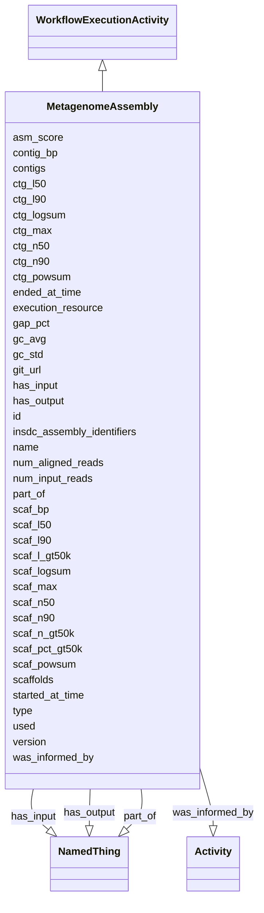

# Class: MetagenomeAssembly


_A workflow execution activity that converts sequencing reads into an assembled metagenome._


URI: [nmdc:MetagenomeAssembly](https://w3id.org/nmdc/MetagenomeAssembly)





## Inheritance
* [Activity](Activity.md)
    * [WorkflowExecutionActivity](WorkflowExecutionActivity.md)
        * **MetagenomeAssembly**


## Slots

| Name | Cardinality and Range | Description | Inheritance |
| ---  | --- | --- | --- |
| [type](type.md) | 1..1 <br/> [String](String.md) | An optional string that specifies the type object | direct |
| [asm_score](asm_score.md) | 0..1 <br/> [Float](Float.md) | A score for comparing metagenomic assembly quality from same sample | direct |
| [scaffolds](scaffolds.md) | 0..1 <br/> [Float](Float.md) | Total sequence count of all scaffolds | direct |
| [scaf_logsum](scaf_logsum.md) | 0..1 <br/> [Float](Float.md) | The sum of the (length*log(length)) of all scaffolds, times some constant | direct |
| [scaf_powsum](scaf_powsum.md) | 0..1 <br/> [Float](Float.md) | Powersum of all scaffolds is the same as logsum except that it uses the sum o... | direct |
| [scaf_max](scaf_max.md) | 0..1 <br/> [Float](Float.md) | Maximum scaffold length | direct |
| [scaf_bp](scaf_bp.md) | 0..1 <br/> [Float](Float.md) | Total size in bp of all scaffolds | direct |
| [scaf_n50](scaf_n50.md) | 0..1 <br/> [Float](Float.md) | Given a set of scaffolds, each with its own length, the N50 count is defined ... | direct |
| [scaf_n90](scaf_n90.md) | 0..1 <br/> [Float](Float.md) | Given a set of scaffolds, each with its own length, the N90 count is defined ... | direct |
| [scaf_l50](scaf_l50.md) | 0..1 <br/> [Float](Float.md) | Given a set of scaffolds, the L50 is defined as the sequence length of the sh... | direct |
| [scaf_l90](scaf_l90.md) | 0..1 <br/> [Float](Float.md) | The L90 statistic is less than or equal to the L50 statistic; it is the lengt... | direct |
| [scaf_n_gt50k](scaf_n_gt50k.md) | 0..1 <br/> [Float](Float.md) | Total sequence count of scaffolds greater than 50 KB | direct |
| [scaf_l_gt50k](scaf_l_gt50k.md) | 0..1 <br/> [Float](Float.md) | Total size in bp of all scaffolds greater than 50 KB | direct |
| [scaf_pct_gt50k](scaf_pct_gt50k.md) | 0..1 <br/> [Float](Float.md) | Total sequence size percentage of scaffolds greater than 50 KB | direct |
| [contigs](contigs.md) | 0..1 <br/> [Float](Float.md) | The sum of the (length*log(length)) of all contigs, times some constant | direct |
| [contig_bp](contig_bp.md) | 0..1 <br/> [Float](Float.md) | Total size in bp of all contigs | direct |
| [ctg_n50](ctg_n50.md) | 0..1 <br/> [Float](Float.md) | Given a set of contigs, each with its own length, the N50 count is defined as... | direct |
| [ctg_l50](ctg_l50.md) | 0..1 <br/> [Float](Float.md) | Given a set of contigs, the L50 is defined as the sequence length of the shor... | direct |
| [ctg_n90](ctg_n90.md) | 0..1 <br/> [Float](Float.md) | Given a set of contigs, each with its own length, the N90 count is defined as... | direct |
| [ctg_l90](ctg_l90.md) | 0..1 <br/> [Float](Float.md) | The L90 statistic is less than or equal to the L50 statistic; it is the lengt... | direct |
| [ctg_logsum](ctg_logsum.md) | 0..1 <br/> [Float](Float.md) | Maximum contig length | direct |
| [ctg_powsum](ctg_powsum.md) | 0..1 <br/> [Float](Float.md) | Powersum of all contigs is the same as logsum except that it uses the sum of ... | direct |
| [ctg_max](ctg_max.md) | 0..1 <br/> [Float](Float.md) | Maximum contig length | direct |
| [gap_pct](gap_pct.md) | 0..1 <br/> [Float](Float.md) | The gap size percentage of all scaffolds | direct |
| [gc_std](gc_std.md) | 0..1 <br/> [Float](Float.md) | Standard deviation of GC content of all contigs | direct |
| [gc_avg](gc_avg.md) | 0..1 <br/> [Float](Float.md) | Average of GC content of all contigs | direct |
| [num_input_reads](num_input_reads.md) | 0..1 <br/> [Float](Float.md) | The sequence count number of input reads for assembly | direct |
| [num_aligned_reads](num_aligned_reads.md) | 0..1 <br/> [Float](Float.md) | The sequence count number of input reads aligned to assembled contigs | direct |
| [insdc_assembly_identifiers](insdc_assembly_identifiers.md) | 0..1 <br/> [String](String.md) |  | direct |
| [execution_resource](execution_resource.md) | 1..1 <br/> [String](String.md) |  | [WorkflowExecutionActivity](WorkflowExecutionActivity.md) |
| [git_url](git_url.md) | 1..1 <br/> [String](String.md) |  | [WorkflowExecutionActivity](WorkflowExecutionActivity.md) |
| [has_input](has_input.md) | 1..* <br/> [NamedThing](NamedThing.md) | An input to a process | [WorkflowExecutionActivity](WorkflowExecutionActivity.md) |
| [has_output](has_output.md) | 1..* <br/> [NamedThing](NamedThing.md) | An output biosample to a processing step | [WorkflowExecutionActivity](WorkflowExecutionActivity.md) |
| [part_of](part_of.md) | 0..* <br/> [NamedThing](NamedThing.md) | Links a resource to another resource that either logically or physically incl... | [WorkflowExecutionActivity](WorkflowExecutionActivity.md) |
| [version](version.md) | 0..1 <br/> [String](String.md) |  | [WorkflowExecutionActivity](WorkflowExecutionActivity.md) |
| [id](id.md) | 1..1 <br/> [Uriorcurie](Uriorcurie.md) | A unique identifier for a thing | [Activity](Activity.md) |
| [name](name.md) | 0..1 <br/> [String](String.md) | A human readable label for an entity | [Activity](Activity.md) |
| [started_at_time](started_at_time.md) | 1..1 <br/> [String](String.md) |  | [Activity](Activity.md) |
| [ended_at_time](ended_at_time.md) | 1..1 <br/> [String](String.md) |  | [Activity](Activity.md) |
| [was_informed_by](was_informed_by.md) | 0..1 <br/> [Activity](Activity.md) |  | [Activity](Activity.md) |
| [used](used.md) | 0..1 <br/> [String](String.md) |  | [Activity](Activity.md) |


## Usages

| used by | used in | type | used |
| ---  | --- | --- | --- |
| [Database](Database.md) | [metagenome_assembly_set](metagenome_assembly_set.md) | range | [MetagenomeAssembly](MetagenomeAssembly.md) |


## Comments

* instances of this class may use a de novo assembly strategy in most or all cases relevant to NMDC

## Identifier and Mapping Information


### Schema Source


* from schema: https://w3id.org/nmdc/nmdc


## Mappings

| Mapping Type | Mapped Value |
| ---  | ---  |
| self | nmdc:MetagenomeAssembly |
| native | nmdc:MetagenomeAssembly |


## LinkML Source

<!-- TODO: investigate https://stackoverflow.com/questions/37606292/how-to-create-tabbed-code-blocks-in-mkdocs-or-sphinx -->

### Direct

<details>
```yaml
name: MetagenomeAssembly
description: A workflow execution activity that converts sequencing reads into an
  assembled metagenome.
comments:
- instances of this class may use a de novo assembly strategy in most or all cases
  relevant to NMDC
in_subset:
- workflow subset
from_schema: https://w3id.org/nmdc/nmdc
is_a: WorkflowExecutionActivity
slots:
- type
- asm_score
- scaffolds
- scaf_logsum
- scaf_powsum
- scaf_max
- scaf_bp
- scaf_n50
- scaf_n90
- scaf_l50
- scaf_l90
- scaf_n_gt50k
- scaf_l_gt50k
- scaf_pct_gt50k
- contigs
- contig_bp
- ctg_n50
- ctg_l50
- ctg_n90
- ctg_l90
- ctg_logsum
- ctg_powsum
- ctg_max
- gap_pct
- gc_std
- gc_avg
- num_input_reads
- num_aligned_reads
- insdc_assembly_identifiers
slot_usage:
  id:
    name: id
    domain_of:
    - Biosample
    - Study
    - NamedThing
    - Activity
    required: true
    structured_pattern:
      syntax: '{id_nmdc_prefix}:wfmgas-{id_shoulder}-{id_blade}{id_version}{id_locus}'
      interpolated: true

```
</details>

### Induced

<details>
```yaml
name: MetagenomeAssembly
description: A workflow execution activity that converts sequencing reads into an
  assembled metagenome.
comments:
- instances of this class may use a de novo assembly strategy in most or all cases
  relevant to NMDC
in_subset:
- workflow subset
from_schema: https://w3id.org/nmdc/nmdc
is_a: WorkflowExecutionActivity
slot_usage:
  id:
    name: id
    domain_of:
    - Biosample
    - Study
    - NamedThing
    - Activity
    required: true
    structured_pattern:
      syntax: '{id_nmdc_prefix}:wfmgas-{id_shoulder}-{id_blade}{id_version}{id_locus}'
      interpolated: true
attributes:
  type:
    name: type
    description: An optional string that specifies the type object.  This is used
      to allow for searches for different kinds of objects.
    deprecated: Due to confusion about what values are used for this slot, it is best
      not to use this slot. See https://github.com/microbiomedata/nmdc-schema/issues/248.
      MAM removed designates_type and rdf:type slot uri 2022-11-30
    from_schema: https://w3id.org/nmdc/nmdc
    rank: 1000
    alias: type
    owner: MetagenomeAssembly
    domain_of:
    - DataObject
    - Biosample
    - Study
    - OmicsProcessing
    - CreditAssociation
    - WorkflowExecutionActivity
    - MetagenomeAssembly
    - MetagenomeAnnotationActivity
    - MetatranscriptomeAnnotationActivity
    - MetatranscriptomeActivity
    - MagsAnalysisActivity
    - ReadQcAnalysisActivity
    - ReadBasedTaxonomyAnalysisActivity
    - MagBin
    - GenomeFeature
    range: string
    required: true
  asm_score:
    name: asm_score
    description: A score for comparing metagenomic assembly quality from same sample.
    from_schema: https://w3id.org/nmdc/nmdc
    rank: 1000
    is_a: metagenome_assembly_parameter
    alias: asm_score
    owner: MetagenomeAssembly
    domain_of:
    - MetagenomeAssembly
    - MetatranscriptomeAssembly
    range: float
  scaffolds:
    name: scaffolds
    description: Total sequence count of all scaffolds.
    from_schema: https://w3id.org/nmdc/nmdc
    rank: 1000
    is_a: metagenome_assembly_parameter
    alias: scaffolds
    owner: MetagenomeAssembly
    domain_of:
    - MetagenomeAssembly
    - MetatranscriptomeAssembly
    range: float
  scaf_logsum:
    name: scaf_logsum
    description: The sum of the (length*log(length)) of all scaffolds, times some
      constant.  Increase the contiguity, the score will increase
    from_schema: https://w3id.org/nmdc/nmdc
    rank: 1000
    is_a: metagenome_assembly_parameter
    alias: scaf_logsum
    owner: MetagenomeAssembly
    domain_of:
    - MetagenomeAssembly
    - MetatranscriptomeAssembly
    range: float
  scaf_powsum:
    name: scaf_powsum
    description: Powersum of all scaffolds is the same as logsum except that it uses
      the sum of (length*(length^P)) for some power P (default P=0.25).
    from_schema: https://w3id.org/nmdc/nmdc
    rank: 1000
    is_a: metagenome_assembly_parameter
    alias: scaf_powsum
    owner: MetagenomeAssembly
    domain_of:
    - MetagenomeAssembly
    - MetatranscriptomeAssembly
    range: float
  scaf_max:
    name: scaf_max
    description: Maximum scaffold length.
    from_schema: https://w3id.org/nmdc/nmdc
    rank: 1000
    is_a: metagenome_assembly_parameter
    alias: scaf_max
    owner: MetagenomeAssembly
    domain_of:
    - MetagenomeAssembly
    - MetatranscriptomeAssembly
    range: float
  scaf_bp:
    name: scaf_bp
    description: Total size in bp of all scaffolds.
    from_schema: https://w3id.org/nmdc/nmdc
    rank: 1000
    is_a: metagenome_assembly_parameter
    alias: scaf_bp
    owner: MetagenomeAssembly
    domain_of:
    - MetagenomeAssembly
    - MetatranscriptomeAssembly
    range: float
  scaf_n50:
    name: scaf_n50
    description: Given a set of scaffolds, each with its own length, the N50 count
      is defined as the smallest number of scaffolds whose length sum makes up half
      of genome size.
    from_schema: https://w3id.org/nmdc/nmdc
    rank: 1000
    is_a: metagenome_assembly_parameter
    alias: scaf_n50
    owner: MetagenomeAssembly
    domain_of:
    - MetagenomeAssembly
    - MetatranscriptomeAssembly
    range: float
  scaf_n90:
    name: scaf_n90
    description: Given a set of scaffolds, each with its own length, the N90 count
      is defined as the smallest number of scaffolds whose length sum makes up 90%
      of genome size.
    from_schema: https://w3id.org/nmdc/nmdc
    rank: 1000
    is_a: metagenome_assembly_parameter
    alias: scaf_n90
    owner: MetagenomeAssembly
    domain_of:
    - MetagenomeAssembly
    - MetatranscriptomeAssembly
    range: float
  scaf_l50:
    name: scaf_l50
    description: Given a set of scaffolds, the L50 is defined as the sequence length
      of the shortest scaffold at 50% of the total genome length.
    from_schema: https://w3id.org/nmdc/nmdc
    rank: 1000
    is_a: metagenome_assembly_parameter
    alias: scaf_l50
    owner: MetagenomeAssembly
    domain_of:
    - MetagenomeAssembly
    - MetatranscriptomeAssembly
    range: float
  scaf_l90:
    name: scaf_l90
    description: The L90 statistic is less than or equal to the L50 statistic; it
      is the length for which the collection of all scaffolds of that length or longer
      contains at least 90% of the sum of the lengths of all scaffolds.
    from_schema: https://w3id.org/nmdc/nmdc
    rank: 1000
    is_a: metagenome_assembly_parameter
    alias: scaf_l90
    owner: MetagenomeAssembly
    domain_of:
    - MetagenomeAssembly
    - MetatranscriptomeAssembly
    range: float
  scaf_n_gt50k:
    name: scaf_n_gt50k
    description: Total sequence count of scaffolds greater than 50 KB.
    from_schema: https://w3id.org/nmdc/nmdc
    rank: 1000
    is_a: metagenome_assembly_parameter
    alias: scaf_n_gt50k
    owner: MetagenomeAssembly
    domain_of:
    - MetagenomeAssembly
    - MetatranscriptomeAssembly
    range: float
  scaf_l_gt50k:
    name: scaf_l_gt50k
    description: Total size in bp of all scaffolds greater than 50 KB.
    from_schema: https://w3id.org/nmdc/nmdc
    rank: 1000
    is_a: metagenome_assembly_parameter
    alias: scaf_l_gt50k
    owner: MetagenomeAssembly
    domain_of:
    - MetagenomeAssembly
    - MetatranscriptomeAssembly
    range: float
  scaf_pct_gt50k:
    name: scaf_pct_gt50k
    description: Total sequence size percentage of scaffolds greater than 50 KB.
    from_schema: https://w3id.org/nmdc/nmdc
    rank: 1000
    is_a: metagenome_assembly_parameter
    alias: scaf_pct_gt50k
    owner: MetagenomeAssembly
    domain_of:
    - MetagenomeAssembly
    - MetatranscriptomeAssembly
    range: float
  contigs:
    name: contigs
    description: The sum of the (length*log(length)) of all contigs, times some constant.  Increase
      the contiguity, the score will increase
    from_schema: https://w3id.org/nmdc/nmdc
    rank: 1000
    is_a: metagenome_assembly_parameter
    alias: contigs
    owner: MetagenomeAssembly
    domain_of:
    - MetagenomeAssembly
    - MetatranscriptomeAssembly
    range: float
  contig_bp:
    name: contig_bp
    description: Total size in bp of all contigs.
    from_schema: https://w3id.org/nmdc/nmdc
    rank: 1000
    is_a: metagenome_assembly_parameter
    alias: contig_bp
    owner: MetagenomeAssembly
    domain_of:
    - MetagenomeAssembly
    - MetatranscriptomeAssembly
    range: float
  ctg_n50:
    name: ctg_n50
    description: Given a set of contigs, each with its own length, the N50 count is
      defined as the smallest number_of_contigs whose length sum makes up half of
      genome size.
    from_schema: https://w3id.org/nmdc/nmdc
    rank: 1000
    is_a: metagenome_assembly_parameter
    alias: ctg_n50
    owner: MetagenomeAssembly
    domain_of:
    - MetagenomeAssembly
    - MetatranscriptomeAssembly
    range: float
  ctg_l50:
    name: ctg_l50
    description: Given a set of contigs, the L50 is defined as the sequence length
      of the shortest contig at 50% of the total genome length.
    from_schema: https://w3id.org/nmdc/nmdc
    rank: 1000
    is_a: metagenome_assembly_parameter
    alias: ctg_l50
    owner: MetagenomeAssembly
    domain_of:
    - MetagenomeAssembly
    - MetatranscriptomeAssembly
    range: float
  ctg_n90:
    name: ctg_n90
    description: Given a set of contigs, each with its own length, the N90 count is
      defined as the smallest number of contigs whose length sum makes up 90% of genome
      size.
    from_schema: https://w3id.org/nmdc/nmdc
    rank: 1000
    is_a: metagenome_assembly_parameter
    alias: ctg_n90
    owner: MetagenomeAssembly
    domain_of:
    - MetagenomeAssembly
    - MetatranscriptomeAssembly
    range: float
  ctg_l90:
    name: ctg_l90
    description: The L90 statistic is less than or equal to the L50 statistic; it
      is the length for which the collection of all contigs of that length or longer
      contains at least 90% of the sum of the lengths of all contigs.
    from_schema: https://w3id.org/nmdc/nmdc
    rank: 1000
    is_a: metagenome_assembly_parameter
    alias: ctg_l90
    owner: MetagenomeAssembly
    domain_of:
    - MetagenomeAssembly
    - MetatranscriptomeAssembly
    range: float
  ctg_logsum:
    name: ctg_logsum
    description: Maximum contig length.
    from_schema: https://w3id.org/nmdc/nmdc
    rank: 1000
    is_a: metagenome_assembly_parameter
    alias: ctg_logsum
    owner: MetagenomeAssembly
    domain_of:
    - MetagenomeAssembly
    - MetatranscriptomeAssembly
    range: float
  ctg_powsum:
    name: ctg_powsum
    description: Powersum of all contigs is the same as logsum except that it uses
      the sum of (length*(length^P)) for some power P (default P=0.25).
    from_schema: https://w3id.org/nmdc/nmdc
    rank: 1000
    is_a: metagenome_assembly_parameter
    alias: ctg_powsum
    owner: MetagenomeAssembly
    domain_of:
    - MetagenomeAssembly
    - MetatranscriptomeAssembly
    range: float
  ctg_max:
    name: ctg_max
    description: Maximum contig length.
    from_schema: https://w3id.org/nmdc/nmdc
    rank: 1000
    is_a: metagenome_assembly_parameter
    alias: ctg_max
    owner: MetagenomeAssembly
    domain_of:
    - MetagenomeAssembly
    - MetatranscriptomeAssembly
    range: float
  gap_pct:
    name: gap_pct
    description: The gap size percentage of all scaffolds.
    from_schema: https://w3id.org/nmdc/nmdc
    rank: 1000
    is_a: metagenome_assembly_parameter
    alias: gap_pct
    owner: MetagenomeAssembly
    domain_of:
    - MetagenomeAssembly
    - MetatranscriptomeAssembly
    range: float
  gc_std:
    name: gc_std
    description: Standard deviation of GC content of all contigs.
    from_schema: https://w3id.org/nmdc/nmdc
    rank: 1000
    is_a: metagenome_assembly_parameter
    alias: gc_std
    owner: MetagenomeAssembly
    domain_of:
    - MetagenomeAssembly
    - MetatranscriptomeAssembly
    range: float
  gc_avg:
    name: gc_avg
    description: Average of GC content of all contigs.
    from_schema: https://w3id.org/nmdc/nmdc
    rank: 1000
    is_a: metagenome_assembly_parameter
    alias: gc_avg
    owner: MetagenomeAssembly
    domain_of:
    - MetagenomeAssembly
    - MetatranscriptomeAssembly
    range: float
  num_input_reads:
    name: num_input_reads
    description: The sequence count number of input reads for assembly.
    from_schema: https://w3id.org/nmdc/nmdc
    rank: 1000
    is_a: metagenome_assembly_parameter
    alias: num_input_reads
    owner: MetagenomeAssembly
    domain_of:
    - MetagenomeAssembly
    - MetatranscriptomeAssembly
    range: float
  num_aligned_reads:
    name: num_aligned_reads
    description: The sequence count number of input reads aligned to assembled contigs.
    from_schema: https://w3id.org/nmdc/nmdc
    rank: 1000
    is_a: metagenome_assembly_parameter
    alias: num_aligned_reads
    owner: MetagenomeAssembly
    domain_of:
    - MetagenomeAssembly
    - MetatranscriptomeAssembly
    range: float
  insdc_assembly_identifiers:
    name: insdc_assembly_identifiers
    from_schema: https://w3id.org/nmdc/nmdc
    rank: 1000
    is_a: assembly_identifiers
    mixins:
    - insdc_identifiers
    alias: insdc_assembly_identifiers
    owner: MetagenomeAssembly
    domain_of:
    - MetagenomeAssembly
    - MetatranscriptomeAssembly
    range: string
    pattern: ^insdc.sra:[A-Z]+[0-9]+(\.[0-9]+)?$
  execution_resource:
    name: execution_resource
    from_schema: https://w3id.org/nmdc/nmdc
    rank: 1000
    domain: Activity
    alias: execution_resource
    owner: MetagenomeAssembly
    domain_of:
    - WorkflowExecutionActivity
    range: string
    required: true
  git_url:
    name: git_url
    from_schema: https://w3id.org/nmdc/nmdc
    rank: 1000
    alias: git_url
    owner: MetagenomeAssembly
    domain_of:
    - WorkflowExecutionActivity
    range: string
    required: true
  has_input:
    name: has_input
    description: An input to a process.
    from_schema: https://w3id.org/nmdc/nmdc
    rank: 1000
    domain: NamedThing
    multivalued: true
    alias: has_input
    owner: MetagenomeAssembly
    domain_of:
    - BiosampleProcessing
    - OmicsProcessing
    - WorkflowExecutionActivity
    - PlannedProcess
    range: NamedThing
    required: true
  has_output:
    name: has_output
    description: An output biosample to a processing step
    from_schema: https://w3id.org/nmdc/nmdc
    rank: 1000
    domain: NamedThing
    multivalued: true
    alias: has_output
    owner: MetagenomeAssembly
    domain_of:
    - OmicsProcessing
    - WorkflowExecutionActivity
    - PlannedProcess
    range: NamedThing
    required: true
  part_of:
    name: part_of
    description: Links a resource to another resource that either logically or physically
      includes it.
    from_schema: https://w3id.org/nmdc/nmdc
    aliases:
    - is part of
    rank: 1000
    domain: NamedThing
    slot_uri: dcterms:isPartOf
    multivalued: true
    alias: part_of
    owner: MetagenomeAssembly
    domain_of:
    - FieldResearchSite
    - Biosample
    - Study
    - OmicsProcessing
    - WorkflowExecutionActivity
    range: NamedThing
  version:
    name: version
    from_schema: https://w3id.org/nmdc/nmdc
    rank: 1000
    domain: Activity
    alias: version
    owner: MetagenomeAssembly
    domain_of:
    - WorkflowExecutionActivity
    - ReadQcAnalysisActivity
    range: string
  id:
    name: id
    description: A unique identifier for a thing. Must be either a CURIE shorthand
      for a URI or a complete URI
    from_schema: https://w3id.org/nmdc/nmdc
    rank: 1000
    identifier: true
    alias: id
    owner: MetagenomeAssembly
    domain_of:
    - Biosample
    - Study
    - NamedThing
    - Activity
    range: uriorcurie
    required: true
    pattern: ^[a-zA-Z0-9][a-zA-Z0-9_\.]+:[a-zA-Z0-9_][a-zA-Z0-9_\-\/\.,]*$
    structured_pattern:
      syntax: '{id_nmdc_prefix}:wfmgas-{id_shoulder}-{id_blade}{id_version}{id_locus}'
      interpolated: true
  name:
    name: name
    description: A human readable label for an entity
    from_schema: https://w3id.org/nmdc/nmdc
    rank: 1000
    alias: name
    owner: MetagenomeAssembly
    domain_of:
    - Protocol
    - QualityControlReport
    - NamedThing
    - PersonValue
    - Activity
    range: string
  started_at_time:
    name: started_at_time
    from_schema: https://w3id.org/nmdc/nmdc
    rank: 1000
    domain: Activity
    alias: started_at_time
    owner: MetagenomeAssembly
    domain_of:
    - Activity
    range: string
    required: true
    pattern: ^([\+-]?\d{4}(?!\d{2}\b))((-?)((0[1-9]|1[0-2])(\3([12]\d|0[1-9]|3[01]))?|W([0-4]\d|5[0-2])(-?[1-7])?|(00[1-9]|0[1-9]\d|[12]\d{2}|3([0-5]\d|6[1-6])))([T\s]((([01]\d|2[0-3])((:?)[0-5]\d)?|24\:?00)([\.,]\d+(?!:))?)?(\17[0-5]\d([\.,]\d+)?)?([zZ]|([\+-])([01]\d|2[0-3]):?([0-5]\d)?)?)?)?$
  ended_at_time:
    name: ended_at_time
    from_schema: https://w3id.org/nmdc/nmdc
    rank: 1000
    domain: Activity
    alias: ended_at_time
    owner: MetagenomeAssembly
    domain_of:
    - Activity
    range: string
    required: true
    pattern: ^([\+-]?\d{4}(?!\d{2}\b))((-?)((0[1-9]|1[0-2])(\3([12]\d|0[1-9]|3[01]))?|W([0-4]\d|5[0-2])(-?[1-7])?|(00[1-9]|0[1-9]\d|[12]\d{2}|3([0-5]\d|6[1-6])))([T\s]((([01]\d|2[0-3])((:?)[0-5]\d)?|24\:?00)([\.,]\d+(?!:))?)?(\17[0-5]\d([\.,]\d+)?)?([zZ]|([\+-])([01]\d|2[0-3]):?([0-5]\d)?)?)?)?$
  was_informed_by:
    name: was_informed_by
    from_schema: https://w3id.org/nmdc/nmdc
    mappings:
    - prov:wasInformedBy
    rank: 1000
    domain: Activity
    alias: was_informed_by
    owner: MetagenomeAssembly
    domain_of:
    - Activity
    range: Activity
  used:
    name: used
    from_schema: https://w3id.org/nmdc/nmdc
    mappings:
    - prov:used
    rank: 1000
    domain: Activity
    alias: used
    owner: MetagenomeAssembly
    domain_of:
    - Activity
    range: string

```
</details>