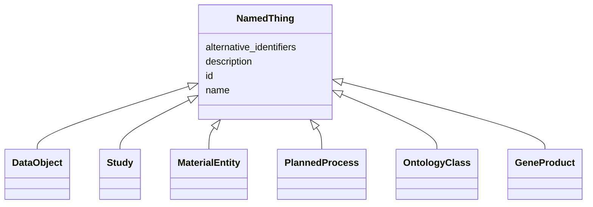

# Class: NamedThing


_a databased entity or concept/class_


* __NOTE__: this is an abstract class and should not be instantiated directly


URI: [nmdc:NamedThing](https://w3id.org/nmdc/NamedThing)





## Inheritance
* **NamedThing**
    * [DataObject](DataObject.md)
    * [Study](Study.md)
    * [MaterialEntity](MaterialEntity.md)
    * [PlannedProcess](PlannedProcess.md)
    * [OntologyClass](OntologyClass.md)
    * [GeneProduct](GeneProduct.md)


## Slots

| Name | Cardinality and Range | Description | Inheritance |
| ---  | --- | --- | --- |
| [id](id.md) | 1..1 <br/> [Uriorcurie](Uriorcurie.md) | A unique identifier for a thing | direct |
| [name](name.md) | 0..1 <br/> [String](String.md) | A human readable label for an entity | direct |
| [description](description.md) | 0..1 <br/> [String](String.md) | a human-readable description of a thing | direct |
| [alternative_identifiers](alternative_identifiers.md) | 0..* <br/> [Uriorcurie](Uriorcurie.md) | A list of alternative identifiers for the entity | direct |


## Usages

| used by | used in | type | used |
| ---  | --- | --- | --- |
| [Pooling](Pooling.md) | [has_input](has_input.md) | domain | [NamedThing](NamedThing.md) |
| [Pooling](Pooling.md) | [has_output](has_output.md) | domain | [NamedThing](NamedThing.md) |
| [Pooling](Pooling.md) | [has_output](has_output.md) | range | [NamedThing](NamedThing.md) |
| [Extraction](Extraction.md) | [has_input](has_input.md) | domain | [NamedThing](NamedThing.md) |
| [Extraction](Extraction.md) | [has_input](has_input.md) | range | [NamedThing](NamedThing.md) |
| [Extraction](Extraction.md) | [has_output](has_output.md) | domain | [NamedThing](NamedThing.md) |
| [Extraction](Extraction.md) | [has_output](has_output.md) | range | [NamedThing](NamedThing.md) |
| [LibraryPreparation](LibraryPreparation.md) | [has_input](has_input.md) | domain | [NamedThing](NamedThing.md) |
| [LibraryPreparation](LibraryPreparation.md) | [has_output](has_output.md) | domain | [NamedThing](NamedThing.md) |
| [LibraryPreparation](LibraryPreparation.md) | [has_output](has_output.md) | range | [NamedThing](NamedThing.md) |
| [FieldResearchSite](FieldResearchSite.md) | [part_of](part_of.md) | domain | [NamedThing](NamedThing.md) |
| [FieldResearchSite](FieldResearchSite.md) | [part_of](part_of.md) | range | [NamedThing](NamedThing.md) |
| [CollectingBiosamplesFromSite](CollectingBiosamplesFromSite.md) | [has_input](has_input.md) | domain | [NamedThing](NamedThing.md) |
| [CollectingBiosamplesFromSite](CollectingBiosamplesFromSite.md) | [has_output](has_output.md) | domain | [NamedThing](NamedThing.md) |
| [Biosample](Biosample.md) | [part_of](part_of.md) | domain | [NamedThing](NamedThing.md) |
| [Study](Study.md) | [part_of](part_of.md) | domain | [NamedThing](NamedThing.md) |
| [BiosampleProcessing](BiosampleProcessing.md) | [has_input](has_input.md) | domain | [NamedThing](NamedThing.md) |
| [BiosampleProcessing](BiosampleProcessing.md) | [has_output](has_output.md) | domain | [NamedThing](NamedThing.md) |
| [BiosampleProcessing](BiosampleProcessing.md) | [has_output](has_output.md) | range | [NamedThing](NamedThing.md) |
| [SubSamplingProcess](SubSamplingProcess.md) | [has_input](has_input.md) | domain | [NamedThing](NamedThing.md) |
| [SubSamplingProcess](SubSamplingProcess.md) | [has_input](has_input.md) | range | [NamedThing](NamedThing.md) |
| [SubSamplingProcess](SubSamplingProcess.md) | [has_output](has_output.md) | domain | [NamedThing](NamedThing.md) |
| [MixingProcess](MixingProcess.md) | [has_input](has_input.md) | domain | [NamedThing](NamedThing.md) |
| [MixingProcess](MixingProcess.md) | [has_input](has_input.md) | range | [NamedThing](NamedThing.md) |
| [MixingProcess](MixingProcess.md) | [has_output](has_output.md) | domain | [NamedThing](NamedThing.md) |
| [FiltrationProcess](FiltrationProcess.md) | [has_input](has_input.md) | domain | [NamedThing](NamedThing.md) |
| [FiltrationProcess](FiltrationProcess.md) | [has_input](has_input.md) | range | [NamedThing](NamedThing.md) |
| [FiltrationProcess](FiltrationProcess.md) | [has_output](has_output.md) | domain | [NamedThing](NamedThing.md) |
| [FiltrationProcess](FiltrationProcess.md) | [has_output](has_output.md) | range | [NamedThing](NamedThing.md) |
| [ChromatographicSeparationProcess](ChromatographicSeparationProcess.md) | [has_input](has_input.md) | domain | [NamedThing](NamedThing.md) |
| [ChromatographicSeparationProcess](ChromatographicSeparationProcess.md) | [has_input](has_input.md) | range | [NamedThing](NamedThing.md) |
| [ChromatographicSeparationProcess](ChromatographicSeparationProcess.md) | [has_output](has_output.md) | domain | [NamedThing](NamedThing.md) |
| [ChromatographicSeparationProcess](ChromatographicSeparationProcess.md) | [has_output](has_output.md) | range | [NamedThing](NamedThing.md) |
| [OmicsProcessing](OmicsProcessing.md) | [has_input](has_input.md) | domain | [NamedThing](NamedThing.md) |
| [OmicsProcessing](OmicsProcessing.md) | [has_input](has_input.md) | range | [NamedThing](NamedThing.md) |
| [OmicsProcessing](OmicsProcessing.md) | [has_output](has_output.md) | domain | [NamedThing](NamedThing.md) |
| [OmicsProcessing](OmicsProcessing.md) | [part_of](part_of.md) | domain | [NamedThing](NamedThing.md) |
| [WorkflowExecutionActivity](WorkflowExecutionActivity.md) | [has_input](has_input.md) | domain | [NamedThing](NamedThing.md) |
| [WorkflowExecutionActivity](WorkflowExecutionActivity.md) | [has_input](has_input.md) | range | [NamedThing](NamedThing.md) |
| [WorkflowExecutionActivity](WorkflowExecutionActivity.md) | [has_output](has_output.md) | domain | [NamedThing](NamedThing.md) |
| [WorkflowExecutionActivity](WorkflowExecutionActivity.md) | [has_output](has_output.md) | range | [NamedThing](NamedThing.md) |
| [WorkflowExecutionActivity](WorkflowExecutionActivity.md) | [part_of](part_of.md) | domain | [NamedThing](NamedThing.md) |
| [WorkflowExecutionActivity](WorkflowExecutionActivity.md) | [part_of](part_of.md) | range | [NamedThing](NamedThing.md) |
| [MetagenomeAssembly](MetagenomeAssembly.md) | [has_input](has_input.md) | domain | [NamedThing](NamedThing.md) |
| [MetagenomeAssembly](MetagenomeAssembly.md) | [has_input](has_input.md) | range | [NamedThing](NamedThing.md) |
| [MetagenomeAssembly](MetagenomeAssembly.md) | [has_output](has_output.md) | domain | [NamedThing](NamedThing.md) |
| [MetagenomeAssembly](MetagenomeAssembly.md) | [has_output](has_output.md) | range | [NamedThing](NamedThing.md) |
| [MetagenomeAssembly](MetagenomeAssembly.md) | [part_of](part_of.md) | domain | [NamedThing](NamedThing.md) |
| [MetagenomeAssembly](MetagenomeAssembly.md) | [part_of](part_of.md) | range | [NamedThing](NamedThing.md) |
| [MetatranscriptomeAssembly](MetatranscriptomeAssembly.md) | [has_input](has_input.md) | domain | [NamedThing](NamedThing.md) |
| [MetatranscriptomeAssembly](MetatranscriptomeAssembly.md) | [has_input](has_input.md) | range | [NamedThing](NamedThing.md) |
| [MetatranscriptomeAssembly](MetatranscriptomeAssembly.md) | [has_output](has_output.md) | domain | [NamedThing](NamedThing.md) |
| [MetatranscriptomeAssembly](MetatranscriptomeAssembly.md) | [has_output](has_output.md) | range | [NamedThing](NamedThing.md) |
| [MetatranscriptomeAssembly](MetatranscriptomeAssembly.md) | [part_of](part_of.md) | domain | [NamedThing](NamedThing.md) |
| [MetatranscriptomeAssembly](MetatranscriptomeAssembly.md) | [part_of](part_of.md) | range | [NamedThing](NamedThing.md) |
| [MetagenomeAnnotationActivity](MetagenomeAnnotationActivity.md) | [has_input](has_input.md) | domain | [NamedThing](NamedThing.md) |
| [MetagenomeAnnotationActivity](MetagenomeAnnotationActivity.md) | [has_input](has_input.md) | range | [NamedThing](NamedThing.md) |
| [MetagenomeAnnotationActivity](MetagenomeAnnotationActivity.md) | [has_output](has_output.md) | domain | [NamedThing](NamedThing.md) |
| [MetagenomeAnnotationActivity](MetagenomeAnnotationActivity.md) | [has_output](has_output.md) | range | [NamedThing](NamedThing.md) |
| [MetagenomeAnnotationActivity](MetagenomeAnnotationActivity.md) | [part_of](part_of.md) | domain | [NamedThing](NamedThing.md) |
| [MetagenomeAnnotationActivity](MetagenomeAnnotationActivity.md) | [part_of](part_of.md) | range | [NamedThing](NamedThing.md) |
| [MetatranscriptomeAnnotationActivity](MetatranscriptomeAnnotationActivity.md) | [has_input](has_input.md) | domain | [NamedThing](NamedThing.md) |
| [MetatranscriptomeAnnotationActivity](MetatranscriptomeAnnotationActivity.md) | [has_input](has_input.md) | range | [NamedThing](NamedThing.md) |
| [MetatranscriptomeAnnotationActivity](MetatranscriptomeAnnotationActivity.md) | [has_output](has_output.md) | domain | [NamedThing](NamedThing.md) |
| [MetatranscriptomeAnnotationActivity](MetatranscriptomeAnnotationActivity.md) | [has_output](has_output.md) | range | [NamedThing](NamedThing.md) |
| [MetatranscriptomeAnnotationActivity](MetatranscriptomeAnnotationActivity.md) | [part_of](part_of.md) | domain | [NamedThing](NamedThing.md) |
| [MetatranscriptomeAnnotationActivity](MetatranscriptomeAnnotationActivity.md) | [part_of](part_of.md) | range | [NamedThing](NamedThing.md) |
| [MetatranscriptomeActivity](MetatranscriptomeActivity.md) | [has_input](has_input.md) | domain | [NamedThing](NamedThing.md) |
| [MetatranscriptomeActivity](MetatranscriptomeActivity.md) | [has_input](has_input.md) | range | [NamedThing](NamedThing.md) |
| [MetatranscriptomeActivity](MetatranscriptomeActivity.md) | [has_output](has_output.md) | domain | [NamedThing](NamedThing.md) |
| [MetatranscriptomeActivity](MetatranscriptomeActivity.md) | [has_output](has_output.md) | range | [NamedThing](NamedThing.md) |
| [MetatranscriptomeActivity](MetatranscriptomeActivity.md) | [part_of](part_of.md) | domain | [NamedThing](NamedThing.md) |
| [MetatranscriptomeActivity](MetatranscriptomeActivity.md) | [part_of](part_of.md) | range | [NamedThing](NamedThing.md) |
| [MagsAnalysisActivity](MagsAnalysisActivity.md) | [has_input](has_input.md) | domain | [NamedThing](NamedThing.md) |
| [MagsAnalysisActivity](MagsAnalysisActivity.md) | [has_input](has_input.md) | range | [NamedThing](NamedThing.md) |
| [MagsAnalysisActivity](MagsAnalysisActivity.md) | [has_output](has_output.md) | domain | [NamedThing](NamedThing.md) |
| [MagsAnalysisActivity](MagsAnalysisActivity.md) | [has_output](has_output.md) | range | [NamedThing](NamedThing.md) |
| [MagsAnalysisActivity](MagsAnalysisActivity.md) | [part_of](part_of.md) | domain | [NamedThing](NamedThing.md) |
| [MagsAnalysisActivity](MagsAnalysisActivity.md) | [part_of](part_of.md) | range | [NamedThing](NamedThing.md) |
| [MetagenomeSequencingActivity](MetagenomeSequencingActivity.md) | [has_input](has_input.md) | domain | [NamedThing](NamedThing.md) |
| [MetagenomeSequencingActivity](MetagenomeSequencingActivity.md) | [has_input](has_input.md) | range | [NamedThing](NamedThing.md) |
| [MetagenomeSequencingActivity](MetagenomeSequencingActivity.md) | [has_output](has_output.md) | domain | [NamedThing](NamedThing.md) |
| [MetagenomeSequencingActivity](MetagenomeSequencingActivity.md) | [has_output](has_output.md) | range | [NamedThing](NamedThing.md) |
| [MetagenomeSequencingActivity](MetagenomeSequencingActivity.md) | [part_of](part_of.md) | domain | [NamedThing](NamedThing.md) |
| [MetagenomeSequencingActivity](MetagenomeSequencingActivity.md) | [part_of](part_of.md) | range | [NamedThing](NamedThing.md) |
| [ReadQcAnalysisActivity](ReadQcAnalysisActivity.md) | [has_input](has_input.md) | domain | [NamedThing](NamedThing.md) |
| [ReadQcAnalysisActivity](ReadQcAnalysisActivity.md) | [has_input](has_input.md) | range | [NamedThing](NamedThing.md) |
| [ReadQcAnalysisActivity](ReadQcAnalysisActivity.md) | [has_output](has_output.md) | domain | [NamedThing](NamedThing.md) |
| [ReadQcAnalysisActivity](ReadQcAnalysisActivity.md) | [has_output](has_output.md) | range | [NamedThing](NamedThing.md) |
| [ReadQcAnalysisActivity](ReadQcAnalysisActivity.md) | [part_of](part_of.md) | domain | [NamedThing](NamedThing.md) |
| [ReadQcAnalysisActivity](ReadQcAnalysisActivity.md) | [part_of](part_of.md) | range | [NamedThing](NamedThing.md) |
| [ReadBasedTaxonomyAnalysisActivity](ReadBasedTaxonomyAnalysisActivity.md) | [has_input](has_input.md) | domain | [NamedThing](NamedThing.md) |
| [ReadBasedTaxonomyAnalysisActivity](ReadBasedTaxonomyAnalysisActivity.md) | [has_input](has_input.md) | range | [NamedThing](NamedThing.md) |
| [ReadBasedTaxonomyAnalysisActivity](ReadBasedTaxonomyAnalysisActivity.md) | [has_output](has_output.md) | domain | [NamedThing](NamedThing.md) |
| [ReadBasedTaxonomyAnalysisActivity](ReadBasedTaxonomyAnalysisActivity.md) | [has_output](has_output.md) | range | [NamedThing](NamedThing.md) |
| [ReadBasedTaxonomyAnalysisActivity](ReadBasedTaxonomyAnalysisActivity.md) | [part_of](part_of.md) | domain | [NamedThing](NamedThing.md) |
| [ReadBasedTaxonomyAnalysisActivity](ReadBasedTaxonomyAnalysisActivity.md) | [part_of](part_of.md) | range | [NamedThing](NamedThing.md) |
| [MetabolomicsAnalysisActivity](MetabolomicsAnalysisActivity.md) | [has_input](has_input.md) | domain | [NamedThing](NamedThing.md) |
| [MetabolomicsAnalysisActivity](MetabolomicsAnalysisActivity.md) | [has_input](has_input.md) | range | [NamedThing](NamedThing.md) |
| [MetabolomicsAnalysisActivity](MetabolomicsAnalysisActivity.md) | [has_output](has_output.md) | domain | [NamedThing](NamedThing.md) |
| [MetabolomicsAnalysisActivity](MetabolomicsAnalysisActivity.md) | [has_output](has_output.md) | range | [NamedThing](NamedThing.md) |
| [MetabolomicsAnalysisActivity](MetabolomicsAnalysisActivity.md) | [part_of](part_of.md) | domain | [NamedThing](NamedThing.md) |
| [MetabolomicsAnalysisActivity](MetabolomicsAnalysisActivity.md) | [part_of](part_of.md) | range | [NamedThing](NamedThing.md) |
| [MetaproteomicsAnalysisActivity](MetaproteomicsAnalysisActivity.md) | [has_input](has_input.md) | domain | [NamedThing](NamedThing.md) |
| [MetaproteomicsAnalysisActivity](MetaproteomicsAnalysisActivity.md) | [has_input](has_input.md) | range | [NamedThing](NamedThing.md) |
| [MetaproteomicsAnalysisActivity](MetaproteomicsAnalysisActivity.md) | [has_output](has_output.md) | domain | [NamedThing](NamedThing.md) |
| [MetaproteomicsAnalysisActivity](MetaproteomicsAnalysisActivity.md) | [has_output](has_output.md) | range | [NamedThing](NamedThing.md) |
| [MetaproteomicsAnalysisActivity](MetaproteomicsAnalysisActivity.md) | [part_of](part_of.md) | domain | [NamedThing](NamedThing.md) |
| [MetaproteomicsAnalysisActivity](MetaproteomicsAnalysisActivity.md) | [part_of](part_of.md) | range | [NamedThing](NamedThing.md) |
| [NomAnalysisActivity](NomAnalysisActivity.md) | [has_input](has_input.md) | domain | [NamedThing](NamedThing.md) |
| [NomAnalysisActivity](NomAnalysisActivity.md) | [has_input](has_input.md) | range | [NamedThing](NamedThing.md) |
| [NomAnalysisActivity](NomAnalysisActivity.md) | [has_output](has_output.md) | domain | [NamedThing](NamedThing.md) |
| [NomAnalysisActivity](NomAnalysisActivity.md) | [has_output](has_output.md) | range | [NamedThing](NamedThing.md) |
| [NomAnalysisActivity](NomAnalysisActivity.md) | [part_of](part_of.md) | domain | [NamedThing](NamedThing.md) |
| [NomAnalysisActivity](NomAnalysisActivity.md) | [part_of](part_of.md) | range | [NamedThing](NamedThing.md) |
| [PlannedProcess](PlannedProcess.md) | [has_input](has_input.md) | domain | [NamedThing](NamedThing.md) |
| [PlannedProcess](PlannedProcess.md) | [has_input](has_input.md) | range | [NamedThing](NamedThing.md) |
| [PlannedProcess](PlannedProcess.md) | [has_output](has_output.md) | domain | [NamedThing](NamedThing.md) |
| [PlannedProcess](PlannedProcess.md) | [has_output](has_output.md) | range | [NamedThing](NamedThing.md) |


## Identifier and Mapping Information


### Schema Source


* from schema: https://w3id.org/nmdc/nmdc


## Mappings

| Mapping Type | Mapped Value |
| ---  | ---  |
| self | nmdc:NamedThing |
| native | nmdc:NamedThing |


## LinkML Source

<!-- TODO: investigate https://stackoverflow.com/questions/37606292/how-to-create-tabbed-code-blocks-in-mkdocs-or-sphinx -->

### Direct

<details>
```yaml
name: NamedThing
description: a databased entity or concept/class
from_schema: https://w3id.org/nmdc/nmdc
abstract: true
slots:
- id
- name
- description
- alternative_identifiers

```
</details>

### Induced

<details>
```yaml
name: NamedThing
description: a databased entity or concept/class
from_schema: https://w3id.org/nmdc/nmdc
abstract: true
attributes:
  id:
    name: id
    description: A unique identifier for a thing. Must be either a CURIE shorthand
      for a URI or a complete URI
    notes:
    - 'abstracted pattern: prefix:typecode-authshoulder-blade(.version)?(_seqsuffix)?'
    - a minimum length of 3 characters is suggested for typecodes, but 1 or 2 characters
      will be accepted
    - typecodes must correspond 1:1 to a class in the NMDC schema. this will be checked
      via per-class id slot usage assertions
    - minting authority shoulders should probably be enumerated and checked in the
      pattern
    examples:
    - value: nmdc:mgmag-00-x012.1_7_c1
      description: https://github.com/microbiomedata/nmdc-schema/pull/499#discussion_r1018499248
    from_schema: https://w3id.org/nmdc/nmdc
    rank: 1000
    identifier: true
    alias: id
    owner: NamedThing
    domain_of:
    - Biosample
    - Study
    - NamedThing
    - Activity
    range: uriorcurie
    required: true
    pattern: ^[a-zA-Z0-9][a-zA-Z0-9_\.]+:[a-zA-Z0-9_][a-zA-Z0-9_\-\/\.,]*$
  name:
    name: name
    description: A human readable label for an entity
    from_schema: https://w3id.org/nmdc/nmdc
    rank: 1000
    alias: name
    owner: NamedThing
    domain_of:
    - Protocol
    - QualityControlReport
    - NamedThing
    - PersonValue
    - Activity
    range: string
  description:
    name: description
    description: a human-readable description of a thing
    from_schema: https://w3id.org/nmdc/nmdc
    rank: 1000
    slot_uri: dcterms:description
    alias: description
    owner: NamedThing
    domain_of:
    - Study
    - NamedThing
    - ImageValue
    range: string
  alternative_identifiers:
    name: alternative_identifiers
    description: A list of alternative identifiers for the entity.
    from_schema: https://w3id.org/nmdc/nmdc
    rank: 1000
    multivalued: true
    alias: alternative_identifiers
    owner: NamedThing
    domain_of:
    - Biosample
    - Study
    - NamedThing
    - MetaboliteQuantification
    range: uriorcurie
    pattern: ^[a-zA-Z0-9][a-zA-Z0-9_\.]+:[a-zA-Z0-9_][a-zA-Z0-9_\-\/\.,]*$

```
</details>