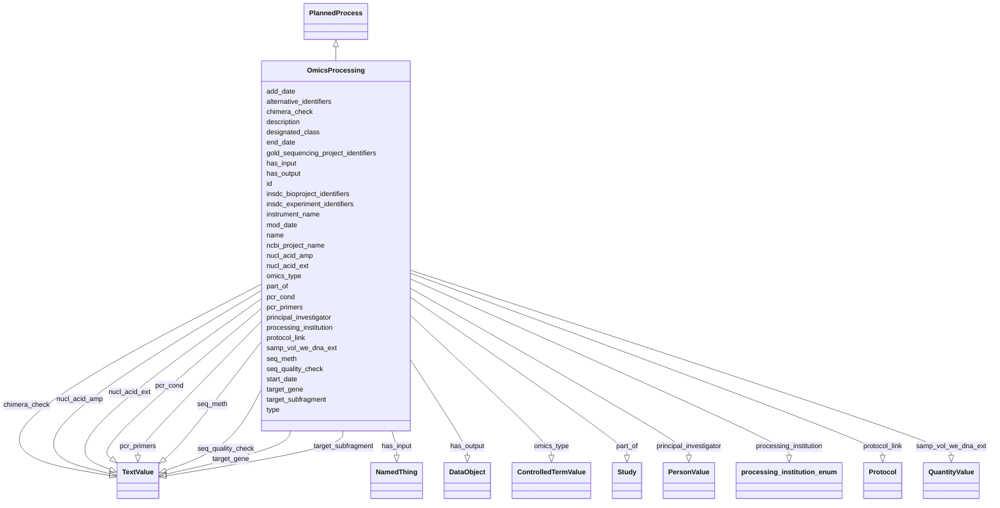

# Class: OmicsProcessing


_The methods and processes used to generate omics data from a biosample or organism._


URI: [nmdc:OmicsProcessing](https://w3id.org/nmdc/OmicsProcessing)





## Inheritance
* [NamedThing](NamedThing.md)
    * [PlannedProcess](PlannedProcess.md)
        * **OmicsProcessing**


## Slots

| Name | Cardinality and Range | Description | Inheritance |
| ---  | --- | --- | --- |
| [add_date](add_date.md) | 0..1 <br/> [String](String.md) | The date on which the information was added to the database | direct |
| [chimera_check](chimera_check.md) | 0..1 <br/> [TextValue](TextValue.md) | Tool(s) used for chimera checking, including version number and parameters, t... | direct |
| [gold_sequencing_project_identifiers](gold_sequencing_project_identifiers.md) | 0..* <br/> [ExternalIdentifier](ExternalIdentifier.md) | identifiers for corresponding sequencing project in GOLD | direct |
| [has_input](has_input.md) | 1..* <br/> [NamedThing](NamedThing.md) | An input to a process | direct |
| [has_output](has_output.md) | 0..* <br/> [DataObject](DataObject.md) | An output biosample to a processing step | direct |
| [insdc_bioproject_identifiers](insdc_bioproject_identifiers.md) | 0..* <br/> [ExternalIdentifier](ExternalIdentifier.md) | identifiers for corresponding project in INSDC Bioproject | direct |
| [insdc_experiment_identifiers](insdc_experiment_identifiers.md) | 0..* <br/> [ExternalIdentifier](ExternalIdentifier.md) |  | direct |
| [instrument_name](instrument_name.md) | 0..1 <br/> [String](String.md) | The name of the instrument that was used for processing the sample | direct |
| [mod_date](mod_date.md) | 0..1 <br/> [String](String.md) | The last date on which the database information was modified | direct |
| [ncbi_project_name](ncbi_project_name.md) | 0..1 <br/> [String](String.md) |  | direct |
| [nucl_acid_amp](nucl_acid_amp.md) | 0..1 <br/> [TextValue](TextValue.md) | A link to a literature reference, electronic resource or a standard operating... | direct |
| [nucl_acid_ext](nucl_acid_ext.md) | 0..1 <br/> [TextValue](TextValue.md) | A link to a literature reference, electronic resource or a standard operating... | direct |
| [omics_type](omics_type.md) | 0..1 <br/> [ControlledTermValue](ControlledTermValue.md) | The type of omics data | direct |
| [part_of](part_of.md) | 0..* <br/> [Study](Study.md) | Links a resource to another resource that either logically or physically incl... | direct |
| [pcr_cond](pcr_cond.md) | 0..1 <br/> [TextValue](TextValue.md) | Description of reaction conditions and components of PCR in the form of 'init... | direct |
| [pcr_primers](pcr_primers.md) | 0..1 <br/> [TextValue](TextValue.md) | PCR primers that were used to amplify the sequence of the targeted gene, locu... | direct |
| [principal_investigator](principal_investigator.md) | 0..1 <br/> [PersonValue](PersonValue.md) | Principal Investigator who led the study and/or generated the dataset | direct |
| [processing_institution](processing_institution.md) | 0..1 <br/> [ProcessingInstitutionEnum](ProcessingInstitutionEnum.md) | The organization that processed the sample | direct |
| [samp_vol_we_dna_ext](samp_vol_we_dna_ext.md) | 0..1 <br/> [QuantityValue](QuantityValue.md) | Volume (ml) or mass (g) of total collected sample processed for DNA extractio... | direct |
| [seq_meth](seq_meth.md) | 0..1 <br/> [TextValue](TextValue.md) | Sequencing machine used | direct |
| [seq_quality_check](seq_quality_check.md) | 0..1 <br/> [TextValue](TextValue.md) | Indicate if the sequence has been called by automatic systems (none) or under... | direct |
| [target_gene](target_gene.md) | 0..1 <br/> [TextValue](TextValue.md) | Targeted gene or locus name for marker gene studies | direct |
| [target_subfragment](target_subfragment.md) | 0..1 <br/> [TextValue](TextValue.md) | Name of subfragment of a gene or locus | direct |
| [type](type.md) | 0..1 <br/> [String](String.md) | An optional string that specifies the type object | direct |
| [designated_class](designated_class.md) | 0..1 <br/> [Uriorcurie](Uriorcurie.md) |  | [PlannedProcess](PlannedProcess.md) |
| [end_date](end_date.md) | 0..1 <br/> [String](String.md) | The date on which any process or activity was ended | [PlannedProcess](PlannedProcess.md) |
| [protocol_link](protocol_link.md) | 0..1 <br/> [Protocol](Protocol.md) |  | [PlannedProcess](PlannedProcess.md) |
| [start_date](start_date.md) | 0..1 <br/> [String](String.md) | The date on which any process or activity was started | [PlannedProcess](PlannedProcess.md) |
| [id](id.md) | 1..1 <br/> [Uriorcurie](Uriorcurie.md) | A unique identifier for a thing | [NamedThing](NamedThing.md) |
| [name](name.md) | 0..1 <br/> [String](String.md) | A human readable label for an entity | [NamedThing](NamedThing.md) |
| [description](description.md) | 0..1 <br/> [String](String.md) | a human-readable description of a thing | [NamedThing](NamedThing.md) |
| [alternative_identifiers](alternative_identifiers.md) | 0..* <br/> [Uriorcurie](Uriorcurie.md) | A list of alternative identifiers for the entity | [NamedThing](NamedThing.md) |


## Usages

| used by | used in | type | used |
| ---  | --- | --- | --- |
| [Database](Database.md) | [omics_processing_set](omics_processing_set.md) | range | [OmicsProcessing](OmicsProcessing.md) |
| [OmicsProcessing](OmicsProcessing.md) | [gold_sequencing_project_identifiers](gold_sequencing_project_identifiers.md) | domain | [OmicsProcessing](OmicsProcessing.md) |
| [OmicsProcessing](OmicsProcessing.md) | [insdc_experiment_identifiers](insdc_experiment_identifiers.md) | domain | [OmicsProcessing](OmicsProcessing.md) |
| [OmicsProcessing](OmicsProcessing.md) | [omics_type](omics_type.md) | domain | [OmicsProcessing](OmicsProcessing.md) |


## Aliases


* omics assay
* sequencing project
* experiment


## Identifier and Mapping Information


### Schema Source


* from schema: https://w3id.org/nmdc/nmdc


## Mappings

| Mapping Type | Mapped Value |
| ---  | ---  |
| self | nmdc:OmicsProcessing |
| native | nmdc:OmicsProcessing |
| broad | OBI:0000070, ISA:Assay |


## LinkML Source

<!-- TODO: investigate https://stackoverflow.com/questions/37606292/how-to-create-tabbed-code-blocks-in-mkdocs-or-sphinx -->

### Direct

<details>
```yaml
name: OmicsProcessing
description: The methods and processes used to generate omics data from a biosample
  or organism.
alt_descriptions:
  embl.ena:
    source: embl.ena
    description: An experiment contains information about a sequencing experiment
      including library and instrument details.
in_subset:
- sample subset
from_schema: https://w3id.org/nmdc/nmdc
aliases:
- omics assay
- sequencing project
- experiment
broad_mappings:
- OBI:0000070
- ISA:Assay
is_a: PlannedProcess
slots:
- add_date
- chimera_check
- gold_sequencing_project_identifiers
- has_input
- has_output
- insdc_bioproject_identifiers
- insdc_experiment_identifiers
- instrument_name
- mod_date
- ncbi_project_name
- nucl_acid_amp
- nucl_acid_ext
- omics_type
- part_of
- pcr_cond
- pcr_primers
- principal_investigator
- processing_institution
- samp_vol_we_dna_ext
- seq_meth
- seq_quality_check
- target_gene
- target_subfragment
- type
slot_usage:
  id:
    name: id
    domain_of:
    - Biosample
    - Study
    - NamedThing
    - Activity
    required: true
    structured_pattern:
      syntax: '{id_nmdc_prefix}:omprc-{id_shoulder}-{id_blade}{id_version}{id_locus}'
      interpolated: true
  has_input:
    name: has_input
    comments:
    - pattern should allow typecode for Biosample and ProcessedSample
    domain_of:
    - BiosampleProcessing
    - OmicsProcessing
    - WorkflowExecutionActivity
    - PlannedProcess
    required: true
    pattern: ^nmdc:(bsm|procsm)-[0-9][a-z]{0,6}[0-9]-[A-Za-z0-9]{1,}(\.[A-Za-z0-9]{1,})*(_[A-Za-z0-9_\.-]+)?$
  part_of:
    name: part_of
    domain_of:
    - FieldResearchSite
    - Biosample
    - Study
    - OmicsProcessing
    - WorkflowExecutionActivity
    range: Study
    pattern: ^nmdc:sty-[0-9][a-z]{0,6}[0-9]-[A-Za-z0-9]{1,}(\.[A-Za-z0-9]{1,})*(_[A-Za-z0-9_\.-]+)?$
  has_output:
    name: has_output
    domain_of:
    - OmicsProcessing
    - WorkflowExecutionActivity
    - PlannedProcess
    range: DataObject
    pattern: ^nmdc:dobj-[0-9][a-z]{0,6}[0-9]-[A-Za-z0-9]{1,}(\.[A-Za-z0-9]{1,})*(_[A-Za-z0-9_\.-]+)?$

```
</details>

### Induced

<details>
```yaml
name: OmicsProcessing
description: The methods and processes used to generate omics data from a biosample
  or organism.
alt_descriptions:
  embl.ena:
    source: embl.ena
    description: An experiment contains information about a sequencing experiment
      including library and instrument details.
in_subset:
- sample subset
from_schema: https://w3id.org/nmdc/nmdc
aliases:
- omics assay
- sequencing project
- experiment
broad_mappings:
- OBI:0000070
- ISA:Assay
is_a: PlannedProcess
slot_usage:
  id:
    name: id
    domain_of:
    - Biosample
    - Study
    - NamedThing
    - Activity
    required: true
    structured_pattern:
      syntax: '{id_nmdc_prefix}:omprc-{id_shoulder}-{id_blade}{id_version}{id_locus}'
      interpolated: true
  has_input:
    name: has_input
    comments:
    - pattern should allow typecode for Biosample and ProcessedSample
    domain_of:
    - BiosampleProcessing
    - OmicsProcessing
    - WorkflowExecutionActivity
    - PlannedProcess
    required: true
    pattern: ^nmdc:(bsm|procsm)-[0-9][a-z]{0,6}[0-9]-[A-Za-z0-9]{1,}(\.[A-Za-z0-9]{1,})*(_[A-Za-z0-9_\.-]+)?$
  part_of:
    name: part_of
    domain_of:
    - FieldResearchSite
    - Biosample
    - Study
    - OmicsProcessing
    - WorkflowExecutionActivity
    range: Study
    pattern: ^nmdc:sty-[0-9][a-z]{0,6}[0-9]-[A-Za-z0-9]{1,}(\.[A-Za-z0-9]{1,})*(_[A-Za-z0-9_\.-]+)?$
  has_output:
    name: has_output
    domain_of:
    - OmicsProcessing
    - WorkflowExecutionActivity
    - PlannedProcess
    range: DataObject
    pattern: ^nmdc:dobj-[0-9][a-z]{0,6}[0-9]-[A-Za-z0-9]{1,}(\.[A-Za-z0-9]{1,})*(_[A-Za-z0-9_\.-]+)?$
attributes:
  add_date:
    name: add_date
    description: The date on which the information was added to the database.
    from_schema: https://w3id.org/nmdc/nmdc
    rank: 1000
    alias: add_date
    owner: OmicsProcessing
    domain_of:
    - Biosample
    - OmicsProcessing
    range: string
  chimera_check:
    name: chimera_check
    annotations:
      expected_value:
        tag: expected_value
        value: name and version of software, parameters used
    description: Tool(s) used for chimera checking, including version number and parameters,
      to discover and remove chimeric sequences. A chimeric sequence is comprised
      of two or more phylogenetically distinct parent sequences.
    title: chimera check software
    examples:
    - value: uchime;v4.1;default parameters
    from_schema: https://w3id.org/nmdc/nmdc
    aliases:
    - chimera check software
    rank: 1000
    is_a: sequencing field
    string_serialization: '{software};{version};{parameters}'
    slot_uri: MIXS:0000052
    multivalued: false
    alias: chimera_check
    owner: OmicsProcessing
    domain_of:
    - Biosample
    - OmicsProcessing
    range: TextValue
  gold_sequencing_project_identifiers:
    name: gold_sequencing_project_identifiers
    description: identifiers for corresponding sequencing project in GOLD
    examples:
    - value: https://bioregistry.io/gold:Gp0108335
    from_schema: https://w3id.org/nmdc/nmdc
    rank: 1000
    is_a: omics_processing_identifiers
    mixins:
    - gold_identifiers
    domain: OmicsProcessing
    multivalued: true
    alias: gold_sequencing_project_identifiers
    owner: OmicsProcessing
    domain_of:
    - OmicsProcessing
    range: external_identifier
    pattern: ^gold:Gp[0-9]+$
  has_input:
    name: has_input
    description: An input to a process.
    comments:
    - pattern should allow typecode for Biosample and ProcessedSample
    from_schema: https://w3id.org/nmdc/nmdc
    rank: 1000
    domain: NamedThing
    multivalued: true
    alias: has_input
    owner: OmicsProcessing
    domain_of:
    - BiosampleProcessing
    - OmicsProcessing
    - WorkflowExecutionActivity
    - PlannedProcess
    range: NamedThing
    required: true
    pattern: ^nmdc:(bsm|procsm)-[0-9][a-z]{0,6}[0-9]-[A-Za-z0-9]{1,}(\.[A-Za-z0-9]{1,})*(_[A-Za-z0-9_\.-]+)?$
  has_output:
    name: has_output
    description: An output biosample to a processing step
    from_schema: https://w3id.org/nmdc/nmdc
    rank: 1000
    domain: NamedThing
    multivalued: true
    alias: has_output
    owner: OmicsProcessing
    domain_of:
    - OmicsProcessing
    - WorkflowExecutionActivity
    - PlannedProcess
    range: DataObject
    pattern: ^nmdc:dobj-[0-9][a-z]{0,6}[0-9]-[A-Za-z0-9]{1,}(\.[A-Za-z0-9]{1,})*(_[A-Za-z0-9_\.-]+)?$
  insdc_bioproject_identifiers:
    name: insdc_bioproject_identifiers
    description: identifiers for corresponding project in INSDC Bioproject
    comments:
    - these are distinct IDs from INSDC SRA/ENA project identifiers, but are usually(?)
      one to one
    examples:
    - value: https://bioregistry.io/bioproject:PRJNA366857
      description: Avena fatua rhizosphere microbial communities - H1_Rhizo_Litter_2
        metatranscriptome
    from_schema: https://w3id.org/nmdc/nmdc
    see_also:
    - https://www.ncbi.nlm.nih.gov/bioproject/
    - https://www.ddbj.nig.ac.jp/bioproject/index-e.html
    aliases:
    - NCBI bioproject identifiers
    - DDBJ bioproject identifiers
    rank: 1000
    is_a: study_identifiers
    mixins:
    - insdc_identifiers
    multivalued: true
    alias: insdc_bioproject_identifiers
    owner: OmicsProcessing
    domain_of:
    - Study
    - OmicsProcessing
    range: external_identifier
    pattern: ^bioproject:PRJ[DEN][A-Z][0-9]+$
  insdc_experiment_identifiers:
    name: insdc_experiment_identifiers
    from_schema: https://w3id.org/nmdc/nmdc
    rank: 1000
    is_a: external_database_identifiers
    mixins:
    - insdc_identifiers
    domain: OmicsProcessing
    multivalued: true
    alias: insdc_experiment_identifiers
    owner: OmicsProcessing
    domain_of:
    - OmicsProcessing
    range: external_identifier
    pattern: ^insdc.sra:(E|D|S)RX[0-9]{6,}$
  instrument_name:
    name: instrument_name
    description: The name of the instrument that was used for processing the sample.
    from_schema: https://w3id.org/nmdc/nmdc
    rank: 1000
    domain: PlannedProcess
    alias: instrument_name
    owner: OmicsProcessing
    domain_of:
    - OmicsProcessing
    - PlannedProcess
    range: string
  mod_date:
    name: mod_date
    description: The last date on which the database information was modified.
    from_schema: https://w3id.org/nmdc/nmdc
    rank: 1000
    alias: mod_date
    owner: OmicsProcessing
    domain_of:
    - Biosample
    - OmicsProcessing
    range: string
  ncbi_project_name:
    name: ncbi_project_name
    from_schema: https://w3id.org/nmdc/nmdc
    rank: 1000
    alias: ncbi_project_name
    owner: OmicsProcessing
    domain_of:
    - OmicsProcessing
    range: string
  nucl_acid_amp:
    name: nucl_acid_amp
    annotations:
      expected_value:
        tag: expected_value
        value: PMID, DOI or URL
    description: A link to a literature reference, electronic resource or a standard
      operating procedure (SOP), that describes the enzymatic amplification (PCR,
      TMA, NASBA) of specific nucleic acids
    title: nucleic acid amplification
    examples:
    - value: https://phylogenomics.me/protocols/16s-pcr-protocol/
    from_schema: https://w3id.org/nmdc/nmdc
    aliases:
    - nucleic acid amplification
    rank: 1000
    is_a: sequencing field
    string_serialization: '{PMID}|{DOI}|{URL}'
    slot_uri: MIXS:0000038
    multivalued: false
    alias: nucl_acid_amp
    owner: OmicsProcessing
    domain_of:
    - Biosample
    - OmicsProcessing
    range: TextValue
  nucl_acid_ext:
    name: nucl_acid_ext
    annotations:
      expected_value:
        tag: expected_value
        value: PMID, DOI or URL
    description: A link to a literature reference, electronic resource or a standard
      operating procedure (SOP), that describes the material separation to recover
      the nucleic acid fraction from a sample
    title: nucleic acid extraction
    examples:
    - value: https://mobio.com/media/wysiwyg/pdfs/protocols/12888.pdf
    from_schema: https://w3id.org/nmdc/nmdc
    aliases:
    - nucleic acid extraction
    rank: 1000
    is_a: sequencing field
    string_serialization: '{PMID}|{DOI}|{URL}'
    slot_uri: MIXS:0000037
    multivalued: false
    alias: nucl_acid_ext
    owner: OmicsProcessing
    domain_of:
    - Biosample
    - OmicsProcessing
    range: TextValue
  omics_type:
    name: omics_type
    description: The type of omics data
    examples:
    - value: metatranscriptome
    - value: metagenome
    from_schema: https://w3id.org/nmdc/nmdc
    rank: 1000
    domain: OmicsProcessing
    alias: omics_type
    owner: OmicsProcessing
    domain_of:
    - OmicsProcessing
    range: ControlledTermValue
  part_of:
    name: part_of
    description: Links a resource to another resource that either logically or physically
      includes it.
    from_schema: https://w3id.org/nmdc/nmdc
    rank: 1000
    domain: NamedThing
    slot_uri: dcterms:isPartOf
    multivalued: true
    alias: part_of
    owner: OmicsProcessing
    domain_of:
    - FieldResearchSite
    - Biosample
    - Study
    - OmicsProcessing
    - WorkflowExecutionActivity
    range: Study
    pattern: ^nmdc:sty-[0-9][a-z]{0,6}[0-9]-[A-Za-z0-9]{1,}(\.[A-Za-z0-9]{1,})*(_[A-Za-z0-9_\.-]+)?$
  pcr_cond:
    name: pcr_cond
    annotations:
      expected_value:
        tag: expected_value
        value: initial denaturation:degrees_minutes;annealing:degrees_minutes;elongation:degrees_minutes;final
          elongation:degrees_minutes;total cycles
    description: Description of reaction conditions and components of PCR in the form
      of 'initial denaturation:94degC_1.5min; annealing=...'
    title: pcr conditions
    examples:
    - value: initial denaturation:94_3;annealing:50_1;elongation:72_1.5;final elongation:72_10;35
    from_schema: https://w3id.org/nmdc/nmdc
    aliases:
    - pcr conditions
    rank: 1000
    is_a: sequencing field
    string_serialization: initial denaturation:degrees_minutes;annealing:degrees_minutes;elongation:degrees_minutes;final
      elongation:degrees_minutes;total cycles
    slot_uri: MIXS:0000049
    multivalued: false
    alias: pcr_cond
    owner: OmicsProcessing
    domain_of:
    - Biosample
    - OmicsProcessing
    range: TextValue
  pcr_primers:
    name: pcr_primers
    annotations:
      expected_value:
        tag: expected_value
        value: 'FWD: forward primer sequence;REV:reverse primer sequence'
    description: PCR primers that were used to amplify the sequence of the targeted
      gene, locus or subfragment. This field should contain all the primers used for
      a single PCR reaction if multiple forward or reverse primers are present in
      a single PCR reaction. The primer sequence should be reported in uppercase letters
    title: pcr primers
    examples:
    - value: FWD:GTGCCAGCMGCCGCGGTAA;REV:GGACTACHVGGGTWTCTAAT
    from_schema: https://w3id.org/nmdc/nmdc
    aliases:
    - pcr primers
    rank: 1000
    is_a: sequencing field
    string_serialization: FWD:{dna};REV:{dna}
    slot_uri: MIXS:0000046
    multivalued: false
    alias: pcr_primers
    owner: OmicsProcessing
    domain_of:
    - Biosample
    - OmicsProcessing
    range: TextValue
  principal_investigator:
    name: principal_investigator
    description: Principal Investigator who led the study and/or generated the dataset.
    from_schema: https://w3id.org/nmdc/nmdc
    aliases:
    - PI
    rank: 1000
    alias: principal_investigator
    owner: OmicsProcessing
    domain_of:
    - Study
    - OmicsProcessing
    range: PersonValue
  processing_institution:
    name: processing_institution
    description: The organization that processed the sample.
    from_schema: https://w3id.org/nmdc/nmdc
    rank: 1000
    domain: PlannedProcess
    alias: processing_institution
    owner: OmicsProcessing
    domain_of:
    - OmicsProcessing
    - PlannedProcess
    range: processing_institution_enum
  samp_vol_we_dna_ext:
    name: samp_vol_we_dna_ext
    annotations:
      expected_value:
        tag: expected_value
        value: measurement value
      preferred_unit:
        tag: preferred_unit
        value: millliter, gram, milligram, square centimeter
    description: 'Volume (ml) or mass (g) of total collected sample processed for
      DNA extraction. Note: total sample collected should be entered under the term
      Sample Size (MIXS:0000001).'
    title: sample volume or weight for DNA extraction
    examples:
    - value: 1500 milliliter
    from_schema: https://w3id.org/nmdc/nmdc
    aliases:
    - sample volume or weight for DNA extraction
    rank: 1000
    is_a: nucleic acid sequence source field
    slot_uri: MIXS:0000111
    multivalued: false
    alias: samp_vol_we_dna_ext
    owner: OmicsProcessing
    domain_of:
    - Biosample
    - OmicsProcessing
    range: QuantityValue
  seq_meth:
    name: seq_meth
    annotations:
      expected_value:
        tag: expected_value
        value: Text or OBI
    description: Sequencing machine used. Where possible the term should be taken
      from the OBI list of DNA sequencers (http://purl.obolibrary.org/obo/OBI_0400103).
    title: sequencing method
    examples:
    - value: 454 Genome Sequencer FLX [OBI:0000702]
    from_schema: https://w3id.org/nmdc/nmdc
    aliases:
    - sequencing method
    rank: 1000
    is_a: sequencing field
    string_serialization: '{termLabel} {[termID]}|{text}'
    slot_uri: MIXS:0000050
    multivalued: false
    alias: seq_meth
    owner: OmicsProcessing
    domain_of:
    - Biosample
    - OmicsProcessing
    range: TextValue
  seq_quality_check:
    name: seq_quality_check
    annotations:
      expected_value:
        tag: expected_value
        value: none or manually edited
    description: Indicate if the sequence has been called by automatic systems (none)
      or undergone a manual editing procedure (e.g. by inspecting the raw data or
      chromatograms). Applied only for sequences that are not submitted to SRA,ENA
      or DRA
    title: sequence quality check
    examples:
    - value: none
    from_schema: https://w3id.org/nmdc/nmdc
    aliases:
    - sequence quality check
    rank: 1000
    is_a: sequencing field
    string_serialization: '[none|manually edited]'
    slot_uri: MIXS:0000051
    multivalued: false
    alias: seq_quality_check
    owner: OmicsProcessing
    domain_of:
    - Biosample
    - OmicsProcessing
    range: TextValue
  target_gene:
    name: target_gene
    annotations:
      expected_value:
        tag: expected_value
        value: gene name
    description: Targeted gene or locus name for marker gene studies
    title: target gene
    examples:
    - value: 16S rRNA, 18S rRNA, nif, amoA, rpo
    from_schema: https://w3id.org/nmdc/nmdc
    aliases:
    - target gene
    rank: 1000
    is_a: sequencing field
    string_serialization: '{text}'
    slot_uri: MIXS:0000044
    multivalued: false
    alias: target_gene
    owner: OmicsProcessing
    domain_of:
    - Biosample
    - OmicsProcessing
    range: TextValue
  target_subfragment:
    name: target_subfragment
    annotations:
      expected_value:
        tag: expected_value
        value: gene fragment name
    description: Name of subfragment of a gene or locus. Important to e.g. identify
      special regions on marker genes like V6 on 16S rRNA
    title: target subfragment
    examples:
    - value: V6, V9, ITS
    from_schema: https://w3id.org/nmdc/nmdc
    aliases:
    - target subfragment
    rank: 1000
    is_a: sequencing field
    string_serialization: '{text}'
    slot_uri: MIXS:0000045
    multivalued: false
    alias: target_subfragment
    owner: OmicsProcessing
    domain_of:
    - Biosample
    - OmicsProcessing
    range: TextValue
  type:
    name: type
    description: An optional string that specifies the type object.  This is used
      to allow for searches for different kinds of objects.
    deprecated: Due to confusion about what values are used for this slot, it is best
      not to use this slot. See https://github.com/microbiomedata/nmdc-schema/issues/248.
      MAM removed designates_type and rdf:type slot uri 2022-11-30
    examples:
    - value: nmdc:Biosample
    - value: nmdc:Study
    from_schema: https://w3id.org/nmdc/nmdc
    see_also:
    - https://github.com/microbiomedata/nmdc-schema/issues/1233
    rank: 1000
    alias: type
    owner: OmicsProcessing
    domain_of:
    - DataObject
    - Biosample
    - Study
    - OmicsProcessing
    - CreditAssociation
    - WorkflowExecutionActivity
    - MetagenomeAssembly
    - MetagenomeAnnotationActivity
    - MetatranscriptomeAnnotationActivity
    - MetatranscriptomeActivity
    - MagsAnalysisActivity
    - ReadQcAnalysisActivity
    - ReadBasedTaxonomyAnalysisActivity
    - MagBin
    - GenomeFeature
    range: string
  designated_class:
    name: designated_class
    comments:
    - required on all instances in a polymorphic Database slot like planned_process_set
    from_schema: https://w3id.org/nmdc/nmdc
    rank: 1000
    designates_type: true
    alias: designated_class
    owner: OmicsProcessing
    domain_of:
    - PlannedProcess
    range: uriorcurie
  end_date:
    name: end_date
    description: The date on which any process or activity was ended
    todos:
    - add date string validation pattern
    comments:
    - We are using string representations of dates until all components of our ecosystem
      can handle ISO 8610 dates
    - The date should be formatted as YYYY-MM-DD
    from_schema: https://w3id.org/nmdc/nmdc
    rank: 1000
    alias: end_date
    owner: OmicsProcessing
    domain_of:
    - PlannedProcess
    range: string
  protocol_link:
    name: protocol_link
    from_schema: https://w3id.org/nmdc/nmdc
    rank: 1000
    domain: PlannedProcess
    alias: protocol_link
    owner: OmicsProcessing
    domain_of:
    - PlannedProcess
    range: Protocol
  start_date:
    name: start_date
    description: The date on which any process or activity was started
    todos:
    - add date string validation pattern
    comments:
    - We are using string representations of dates until all components of our ecosystem
      can handle ISO 8610 dates
    - The date should be formatted as YYYY-MM-DD
    from_schema: https://w3id.org/nmdc/nmdc
    rank: 1000
    alias: start_date
    owner: OmicsProcessing
    domain_of:
    - PlannedProcess
    range: string
  id:
    name: id
    description: A unique identifier for a thing. Must be either a CURIE shorthand
      for a URI or a complete URI
    from_schema: https://w3id.org/nmdc/nmdc
    rank: 1000
    identifier: true
    alias: id
    owner: OmicsProcessing
    domain_of:
    - Biosample
    - Study
    - NamedThing
    - Activity
    range: uriorcurie
    required: true
    pattern: ^[a-zA-Z0-9][a-zA-Z0-9_\.]+:[a-zA-Z0-9_][a-zA-Z0-9_\-\/\.,]*$
    structured_pattern:
      syntax: '{id_nmdc_prefix}:omprc-{id_shoulder}-{id_blade}{id_version}{id_locus}'
      interpolated: true
  name:
    name: name
    description: A human readable label for an entity
    from_schema: https://w3id.org/nmdc/nmdc
    rank: 1000
    alias: name
    owner: OmicsProcessing
    domain_of:
    - Protocol
    - QualityControlReport
    - NamedThing
    - PersonValue
    - Activity
    range: string
  description:
    name: description
    description: a human-readable description of a thing
    from_schema: https://w3id.org/nmdc/nmdc
    rank: 1000
    slot_uri: dcterms:description
    alias: description
    owner: OmicsProcessing
    domain_of:
    - Study
    - NamedThing
    - ImageValue
    range: string
  alternative_identifiers:
    name: alternative_identifiers
    description: A list of alternative identifiers for the entity.
    from_schema: https://w3id.org/nmdc/nmdc
    rank: 1000
    multivalued: true
    alias: alternative_identifiers
    owner: OmicsProcessing
    domain_of:
    - Biosample
    - Study
    - NamedThing
    - MetaboliteQuantification
    range: uriorcurie
    pattern: ^[a-zA-Z0-9][a-zA-Z0-9_\.]+:[a-zA-Z0-9_][a-zA-Z0-9_\-\/\.,]*$

```
</details>