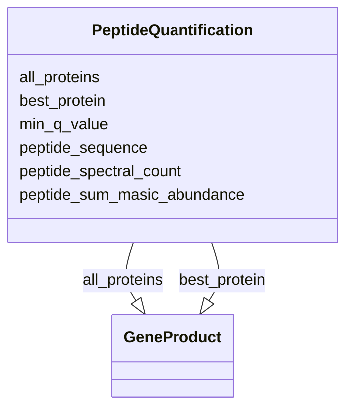

# Class: PeptideQuantification


_This is used to link a metaproteomics analysis workflow to a specific peptide sequence and related information_


URI: [nmdc:PeptideQuantification](https://w3id.org/nmdc/PeptideQuantification)





<!-- no inheritance hierarchy -->


## Slots

| Name | Cardinality and Range | Description | Inheritance |
| ---  | --- | --- | --- |
| [all_proteins](all_proteins.md) | 0..* <br/> [GeneProduct](GeneProduct.md) | the list of protein identifiers that are associated with the peptide sequence | direct |
| [best_protein](best_protein.md) | 0..1 <br/> [GeneProduct](GeneProduct.md) | the specific protein identifier most correctly associated with the peptide se... | direct |
| [min_q_value](min_q_value.md) | 0..1 <br/> [Float](Float.md) | smallest Q-Value associated with the peptide sequence as provided by MSGFPlus... | direct |
| [peptide_sequence](peptide_sequence.md) | 0..1 <br/> [String](String.md) |  | direct |
| [peptide_spectral_count](peptide_spectral_count.md) | 0..1 <br/> [Integer](Integer.md) | sum of filter passing MS2 spectra associated with the peptide sequence within... | direct |
| [peptide_sum_masic_abundance](peptide_sum_masic_abundance.md) | 0..1 <br/> [Integer](Integer.md) | combined MS1 extracted ion chromatograms derived from MS2 spectra associated ... | direct |


## Usages

| used by | used in | type | used |
| ---  | --- | --- | --- |
| [MetaproteomicsAnalysisActivity](MetaproteomicsAnalysisActivity.md) | [has_peptide_quantifications](has_peptide_quantifications.md) | range | [PeptideQuantification](PeptideQuantification.md) |


## Identifier and Mapping Information


### Schema Source


* from schema: https://w3id.org/nmdc/nmdc


## Mappings

| Mapping Type | Mapped Value |
| ---  | ---  |
| self | nmdc:PeptideQuantification |
| native | nmdc:PeptideQuantification |


## LinkML Source

<!-- TODO: investigate https://stackoverflow.com/questions/37606292/how-to-create-tabbed-code-blocks-in-mkdocs-or-sphinx -->

### Direct

<details>
```yaml
name: PeptideQuantification
description: This is used to link a metaproteomics analysis workflow to a specific
  peptide sequence and related information
from_schema: https://w3id.org/nmdc/nmdc
slots:
- all_proteins
- best_protein
- min_q_value
- peptide_sequence
- peptide_spectral_count
- peptide_sum_masic_abundance

```
</details>

### Induced

<details>
```yaml
name: PeptideQuantification
description: This is used to link a metaproteomics analysis workflow to a specific
  peptide sequence and related information
from_schema: https://w3id.org/nmdc/nmdc
attributes:
  all_proteins:
    name: all_proteins
    description: the list of protein identifiers that are associated with the peptide
      sequence
    from_schema: https://w3id.org/nmdc/nmdc
    rank: 1000
    multivalued: true
    alias: all_proteins
    owner: PeptideQuantification
    domain_of:
    - PeptideQuantification
    - ProteinQuantification
    range: GeneProduct
  best_protein:
    name: best_protein
    description: the specific protein identifier most correctly associated with the
      peptide sequence
    from_schema: https://w3id.org/nmdc/nmdc
    rank: 1000
    alias: best_protein
    owner: PeptideQuantification
    domain_of:
    - PeptideQuantification
    - ProteinQuantification
    range: GeneProduct
  min_q_value:
    name: min_q_value
    description: smallest Q-Value associated with the peptide sequence as provided
      by MSGFPlus tool
    from_schema: https://w3id.org/nmdc/nmdc
    see_also:
    - OBI:0001442
    rank: 1000
    alias: min_q_value
    owner: PeptideQuantification
    domain_of:
    - PeptideQuantification
    range: float
  peptide_sequence:
    name: peptide_sequence
    from_schema: https://w3id.org/nmdc/nmdc
    rank: 1000
    alias: peptide_sequence
    owner: PeptideQuantification
    domain_of:
    - PeptideQuantification
    range: string
  peptide_spectral_count:
    name: peptide_spectral_count
    description: sum of filter passing MS2 spectra associated with the peptide sequence
      within a given LC-MS/MS data file
    from_schema: https://w3id.org/nmdc/nmdc
    rank: 1000
    alias: peptide_spectral_count
    owner: PeptideQuantification
    domain_of:
    - PeptideQuantification
    range: integer
  peptide_sum_masic_abundance:
    name: peptide_sum_masic_abundance
    description: combined MS1 extracted ion chromatograms derived from MS2 spectra
      associated with the peptide sequence from a given LC-MS/MS data file using the
      MASIC tool
    from_schema: https://w3id.org/nmdc/nmdc
    rank: 1000
    alias: peptide_sum_masic_abundance
    owner: PeptideQuantification
    domain_of:
    - PeptideQuantification
    range: integer

```
</details>