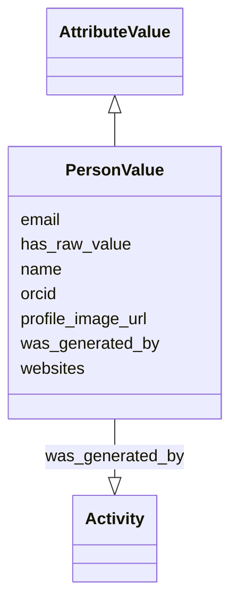

# Class: PersonValue


_An attribute value representing a person_


URI: [nmdc:PersonValue](https://w3id.org/nmdc/PersonValue)





## Inheritance
* [AttributeValue](AttributeValue.md)
    * **PersonValue**


## Slots

| Name | Cardinality and Range | Description | Inheritance |
| ---  | --- | --- | --- |
| [email](email.md) | 0..1 <br/> [String](String.md) | An email address for an entity such as a person | direct |
| [name](name.md) | 0..1 <br/> [String](String.md) | The full name of the Investigator | direct |
| [orcid](orcid.md) | 0..1 <br/> [String](String.md) | The ORCID of a person | direct |
| [profile_image_url](profile_image_url.md) | 0..1 <br/> [String](String.md) | A url that points to an image of a person | direct |
| [websites](websites.md) | 0..* <br/> [String](String.md) | A list of websites that are associated with the entity | direct |
| [has_raw_value](has_raw_value.md) | 0..1 <br/> [String](String.md) | The full name of the Investigator in format FIRST LAST | [AttributeValue](AttributeValue.md) |
| [was_generated_by](was_generated_by.md) | 0..1 <br/> [Activity](Activity.md) |  | [AttributeValue](AttributeValue.md) |


## Usages

| used by | used in | type | used |
| ---  | --- | --- | --- |
| [Study](Study.md) | [principal_investigator](principal_investigator.md) | range | [PersonValue](PersonValue.md) |
| [OmicsProcessing](OmicsProcessing.md) | [principal_investigator](principal_investigator.md) | range | [PersonValue](PersonValue.md) |
| [CreditAssociation](CreditAssociation.md) | [applies_to_person](applies_to_person.md) | range | [PersonValue](PersonValue.md) |
| [PersonValue](PersonValue.md) | [orcid](orcid.md) | domain | [PersonValue](PersonValue.md) |
| [PersonValue](PersonValue.md) | [profile_image_url](profile_image_url.md) | domain | [PersonValue](PersonValue.md) |


## TODOs

* add additional fields e.g for institution
* deprecate "has_raw_value" in favor of "name"

## Identifier and Mapping Information


### Schema Source


* from schema: https://w3id.org/nmdc/nmdc


## Mappings

| Mapping Type | Mapped Value |
| ---  | ---  |
| self | nmdc:PersonValue |
| native | nmdc:PersonValue |


## LinkML Source

<!-- TODO: investigate https://stackoverflow.com/questions/37606292/how-to-create-tabbed-code-blocks-in-mkdocs-or-sphinx -->

### Direct

<details>
```yaml
name: PersonValue
description: An attribute value representing a person
todos:
- add additional fields e.g for institution
- deprecate "has_raw_value" in favor of "name"
from_schema: https://w3id.org/nmdc/nmdc
is_a: AttributeValue
slots:
- email
- name
- orcid
- profile_image_url
- websites
slot_usage:
  orcid:
    name: orcid
    annotations:
      display_hint:
        tag: display_hint
        value: Open Researcher and Contributor ID for this person. See https://orcid.org
    domain_of:
    - PersonValue
  email:
    name: email
    annotations:
      display_hint:
        tag: display_hint
        value: Email address for this person.
    domain_of:
    - PersonValue
  has_raw_value:
    name: has_raw_value
    description: The full name of the Investigator in format FIRST LAST.
    notes:
    - May eventually be deprecated in favor of "name".
    domain_of:
    - AttributeValue
    - QuantityValue
  name:
    name: name
    annotations:
      display_hint:
        tag: display_hint
        value: First name, middle initial, and last name of this person.
    description: The full name of the Investigator. It should follow the format FIRST
      [MIDDLE NAME| MIDDLE INITIAL] LAST, where MIDDLE NAME| MIDDLE INITIAL is optional.
    domain_of:
    - Protocol
    - QualityControlReport
    - NamedThing
    - PersonValue
    - Activity

```
</details>

### Induced

<details>
```yaml
name: PersonValue
description: An attribute value representing a person
todos:
- add additional fields e.g for institution
- deprecate "has_raw_value" in favor of "name"
from_schema: https://w3id.org/nmdc/nmdc
is_a: AttributeValue
slot_usage:
  orcid:
    name: orcid
    annotations:
      display_hint:
        tag: display_hint
        value: Open Researcher and Contributor ID for this person. See https://orcid.org
    domain_of:
    - PersonValue
  email:
    name: email
    annotations:
      display_hint:
        tag: display_hint
        value: Email address for this person.
    domain_of:
    - PersonValue
  has_raw_value:
    name: has_raw_value
    description: The full name of the Investigator in format FIRST LAST.
    notes:
    - May eventually be deprecated in favor of "name".
    domain_of:
    - AttributeValue
    - QuantityValue
  name:
    name: name
    annotations:
      display_hint:
        tag: display_hint
        value: First name, middle initial, and last name of this person.
    description: The full name of the Investigator. It should follow the format FIRST
      [MIDDLE NAME| MIDDLE INITIAL] LAST, where MIDDLE NAME| MIDDLE INITIAL is optional.
    domain_of:
    - Protocol
    - QualityControlReport
    - NamedThing
    - PersonValue
    - Activity
attributes:
  email:
    name: email
    annotations:
      display_hint:
        tag: display_hint
        value: Email address for this person.
    description: An email address for an entity such as a person. This should be the
      primary email address used.
    from_schema: https://w3id.org/nmdc/nmdc
    rank: 1000
    slot_uri: schema:email
    alias: email
    owner: PersonValue
    domain_of:
    - PersonValue
    range: string
  name:
    name: name
    annotations:
      display_hint:
        tag: display_hint
        value: First name, middle initial, and last name of this person.
    description: The full name of the Investigator. It should follow the format FIRST
      [MIDDLE NAME| MIDDLE INITIAL] LAST, where MIDDLE NAME| MIDDLE INITIAL is optional.
    from_schema: https://w3id.org/nmdc/nmdc
    rank: 1000
    alias: name
    owner: PersonValue
    domain_of:
    - Protocol
    - QualityControlReport
    - NamedThing
    - PersonValue
    - Activity
    range: string
  orcid:
    name: orcid
    annotations:
      display_hint:
        tag: display_hint
        value: Open Researcher and Contributor ID for this person. See https://orcid.org
    description: The ORCID of a person.
    from_schema: https://w3id.org/nmdc/nmdc
    rank: 1000
    domain: PersonValue
    alias: orcid
    owner: PersonValue
    domain_of:
    - PersonValue
    range: string
  profile_image_url:
    name: profile_image_url
    description: A url that points to an image of a person.
    from_schema: https://w3id.org/nmdc/nmdc
    rank: 1000
    domain: PersonValue
    alias: profile_image_url
    owner: PersonValue
    domain_of:
    - PersonValue
    range: string
  websites:
    name: websites
    description: A list of websites that are associated with the entity.
    comments:
    - DOIs should not be included as websites. Instead, use the associated_dois slot.
    from_schema: https://w3id.org/nmdc/nmdc
    rank: 1000
    multivalued: true
    alias: websites
    owner: PersonValue
    domain_of:
    - Study
    - PersonValue
    range: string
    pattern: ^[Hh][Tt][Tt][Pp][Ss]?:\/\/(?!.*[Dd][Oo][Ii]\.[Oo][Rr][Gg]).*$
  has_raw_value:
    name: has_raw_value
    description: The full name of the Investigator in format FIRST LAST.
    notes:
    - May eventually be deprecated in favor of "name".
    from_schema: https://w3id.org/nmdc/nmdc
    rank: 1000
    domain: AttributeValue
    multivalued: false
    alias: has_raw_value
    owner: PersonValue
    domain_of:
    - AttributeValue
    - QuantityValue
    range: string
  was_generated_by:
    name: was_generated_by
    from_schema: https://w3id.org/nmdc/nmdc
    mappings:
    - prov:wasGeneratedBy
    rank: 1000
    alias: was_generated_by
    owner: PersonValue
    domain_of:
    - DataObject
    - AttributeValue
    - FunctionalAnnotation
    range: Activity

```
</details>