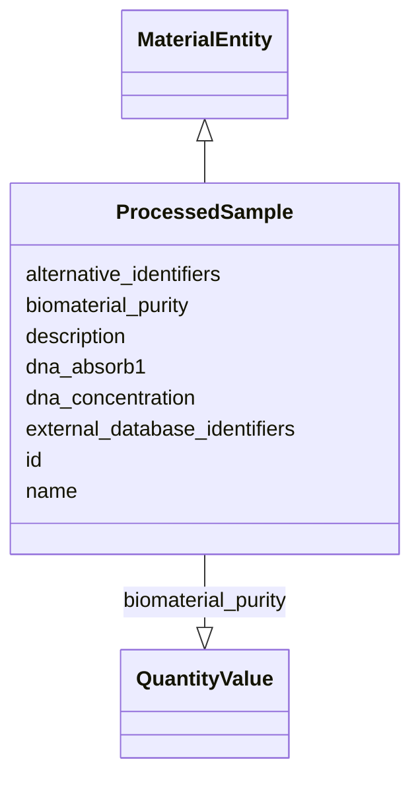

# Class: Processed Sample (ProcessedSample)


URI: [nmdc:ProcessedSample](https://w3id.org/nmdc/ProcessedSample)





## Inheritance
* [NamedThing](NamedThing.md)
    * [MaterialEntity](MaterialEntity.md)
        * **ProcessedSample**


## Slots

| Name | Cardinality and Range | Description | Inheritance |
| ---  | --- | --- | --- |
| [biomaterial_purity](biomaterial_purity.md) | 0..1 <br/> [QuantityValue](QuantityValue.md) |  | direct |
| [dna_absorb1](dna_absorb1.md) | 0..1 _recommended_ <br/> [Float](Float.md) | 260/280 measurement of DNA sample purity | direct |
| [dna_concentration](dna_concentration.md) | 0..1 _recommended_ <br/> [Float](Float.md) |  | direct |
| [external_database_identifiers](external_database_identifiers.md) | 0..* <br/> [ExternalIdentifier](ExternalIdentifier.md) | Link to corresponding identifier in external database | direct |
| [id](id.md) | 1..1 <br/> [Uriorcurie](Uriorcurie.md) | A unique identifier for a thing | [NamedThing](NamedThing.md) |
| [name](name.md) | 0..1 <br/> [String](String.md) | A human readable label for an entity | [NamedThing](NamedThing.md) |
| [description](description.md) | 0..1 <br/> [String](String.md) | a human-readable description of a thing | [NamedThing](NamedThing.md) |
| [alternative_identifiers](alternative_identifiers.md) | 0..* <br/> [Uriorcurie](Uriorcurie.md) | A list of alternative identifiers for the entity | [NamedThing](NamedThing.md) |


## Usages

| used by | used in | type | used |
| ---  | --- | --- | --- |
| [Database](Database.md) | [processed_sample_set](processed_sample_set.md) | range | [ProcessedSample](ProcessedSample.md) |
| [Biosample](Biosample.md) | [dna_absorb1](dna_absorb1.md) | domain | [ProcessedSample](ProcessedSample.md) |
| [Biosample](Biosample.md) | [dna_absorb2](dna_absorb2.md) | domain | [ProcessedSample](ProcessedSample.md) |
| [Biosample](Biosample.md) | [rna_absorb1](rna_absorb1.md) | domain | [ProcessedSample](ProcessedSample.md) |
| [Biosample](Biosample.md) | [rna_absorb2](rna_absorb2.md) | domain | [ProcessedSample](ProcessedSample.md) |
| [SubSamplingProcess](SubSamplingProcess.md) | [has_output](has_output.md) | range | [ProcessedSample](ProcessedSample.md) |
| [MixingProcess](MixingProcess.md) | [has_output](has_output.md) | range | [ProcessedSample](ProcessedSample.md) |
| [ProcessedSample](ProcessedSample.md) | [biomaterial_purity](biomaterial_purity.md) | domain | [ProcessedSample](ProcessedSample.md) |
| [ProcessedSample](ProcessedSample.md) | [dna_absorb1](dna_absorb1.md) | domain | [ProcessedSample](ProcessedSample.md) |


## Identifier and Mapping Information


### Schema Source


* from schema: https://w3id.org/nmdc/nmdc


## Mappings

| Mapping Type | Mapped Value |
| ---  | ---  |
| self | nmdc:ProcessedSample |
| native | nmdc:ProcessedSample |


## LinkML Source

<!-- TODO: investigate https://stackoverflow.com/questions/37606292/how-to-create-tabbed-code-blocks-in-mkdocs-or-sphinx -->

### Direct

<details>
```yaml
name: ProcessedSample
title: Processed Sample
from_schema: https://w3id.org/nmdc/nmdc
is_a: MaterialEntity
slots:
- biomaterial_purity
- dna_absorb1
- dna_concentration
- external_database_identifiers
slot_usage:
  id:
    name: id
    domain_of:
    - Biosample
    - Study
    - NamedThing
    - Activity
    required: true
    structured_pattern:
      syntax: '{id_nmdc_prefix}:procsm-{id_shoulder}-{id_blade}{id_version}{id_locus}'
      interpolated: true

```
</details>

### Induced

<details>
```yaml
name: ProcessedSample
title: Processed Sample
from_schema: https://w3id.org/nmdc/nmdc
is_a: MaterialEntity
slot_usage:
  id:
    name: id
    domain_of:
    - Biosample
    - Study
    - NamedThing
    - Activity
    required: true
    structured_pattern:
      syntax: '{id_nmdc_prefix}:procsm-{id_shoulder}-{id_blade}{id_version}{id_locus}'
      interpolated: true
attributes:
  biomaterial_purity:
    name: biomaterial_purity
    from_schema: https://w3id.org/nmdc/nmdc
    rank: 1000
    domain: ProcessedSample
    alias: biomaterial_purity
    owner: ProcessedSample
    domain_of:
    - ProcessedSample
    range: QuantityValue
  dna_absorb1:
    name: dna_absorb1
    description: 260/280 measurement of DNA sample purity
    title: DNA absorbance 260/280
    comments:
    - Recommended value is between 1 and 3.
    examples:
    - value: '2.02'
    from_schema: https://w3id.org/nmdc/nmdc
    rank: 7
    is_a: biomaterial_purity
    domain: ProcessedSample
    alias: dna_absorb1
    owner: ProcessedSample
    domain_of:
    - Biosample
    - ProcessedSample
    slot_group: JGI-Metagenomics
    range: float
    recommended: true
  dna_concentration:
    name: dna_concentration
    title: DNA concentration in ng/ul
    comments:
    - Units must be in ng/uL. Enter the numerical part only. Must be calculated using
      a fluorometric method. Acceptable values are 0-2000.
    examples:
    - value: '100'
    from_schema: https://w3id.org/nmdc/nmdc
    see_also:
    - nmdc:nucleic_acid_concentration
    rank: 5
    alias: dna_concentration
    owner: ProcessedSample
    domain_of:
    - Biosample
    - ProcessedSample
    slot_group: JGI-Metagenomics
    range: float
    recommended: true
    minimum_value: 0
    maximum_value: 2000
  external_database_identifiers:
    name: external_database_identifiers
    description: Link to corresponding identifier in external database
    notes:
    - had tried ranges of external identifier and string
    comments:
    - The value of this field is always a registered CURIE
    from_schema: https://w3id.org/nmdc/nmdc
    close_mappings:
    - skos:closeMatch
    rank: 1000
    is_a: alternative_identifiers
    abstract: true
    multivalued: true
    alias: external_database_identifiers
    owner: ProcessedSample
    domain_of:
    - ProcessedSample
    range: external_identifier
    pattern: ^[a-zA-Z0-9][a-zA-Z0-9_\.]+:[a-zA-Z0-9_][a-zA-Z0-9_\-\/\.,]*$
  id:
    name: id
    description: A unique identifier for a thing. Must be either a CURIE shorthand
      for a URI or a complete URI
    from_schema: https://w3id.org/nmdc/nmdc
    rank: 1000
    identifier: true
    alias: id
    owner: ProcessedSample
    domain_of:
    - Biosample
    - Study
    - NamedThing
    - Activity
    range: uriorcurie
    required: true
    pattern: ^[a-zA-Z0-9][a-zA-Z0-9_\.]+:[a-zA-Z0-9_][a-zA-Z0-9_\-\/\.,]*$
    structured_pattern:
      syntax: '{id_nmdc_prefix}:procsm-{id_shoulder}-{id_blade}{id_version}{id_locus}'
      interpolated: true
  name:
    name: name
    description: A human readable label for an entity
    from_schema: https://w3id.org/nmdc/nmdc
    rank: 1000
    alias: name
    owner: ProcessedSample
    domain_of:
    - Protocol
    - QualityControlReport
    - NamedThing
    - PersonValue
    - Activity
    range: string
  description:
    name: description
    description: a human-readable description of a thing
    from_schema: https://w3id.org/nmdc/nmdc
    rank: 1000
    slot_uri: dcterms:description
    alias: description
    owner: ProcessedSample
    domain_of:
    - Study
    - NamedThing
    - ImageValue
    range: string
  alternative_identifiers:
    name: alternative_identifiers
    description: A list of alternative identifiers for the entity.
    from_schema: https://w3id.org/nmdc/nmdc
    rank: 1000
    multivalued: true
    alias: alternative_identifiers
    owner: ProcessedSample
    domain_of:
    - Biosample
    - Study
    - NamedThing
    - MetaboliteQuantification
    range: uriorcurie
    pattern: ^[a-zA-Z0-9][a-zA-Z0-9_\.]+:[a-zA-Z0-9_][a-zA-Z0-9_\-\/\.,]*$

```
</details>