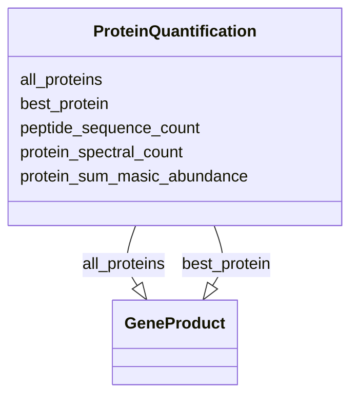

# Class: ProteinQuantification


_This is used to link a metaproteomics analysis workflow to a specific protein_


URI: [nmdc:ProteinQuantification](https://w3id.org/nmdc/ProteinQuantification)





<!-- no inheritance hierarchy -->


## Slots

| Name | Cardinality and Range | Description | Inheritance |
| ---  | --- | --- | --- |
| [all_proteins](all_proteins.md) | 0..* <br/> [GeneProduct](GeneProduct.md) | the grouped list of protein identifiers associated with the peptide sequences... | direct |
| [best_protein](best_protein.md) | 0..1 <br/> [GeneProduct](GeneProduct.md) | the specific protein identifier most correctly grouped to its associated pept... | direct |
| [peptide_sequence_count](peptide_sequence_count.md) | 0..1 <br/> [Integer](Integer.md) | count of peptide sequences grouped to the best_protein | direct |
| [protein_spectral_count](protein_spectral_count.md) | 0..1 <br/> [Integer](Integer.md) | sum of filter passing MS2 spectra associated with the best protein within a g... | direct |
| [protein_sum_masic_abundance](protein_sum_masic_abundance.md) | 0..1 <br/> [Integer](Integer.md) | combined MS1 extracted ion chromatograms derived from MS2 spectra associated ... | direct |


## Identifier and Mapping Information


### Schema Source


* from schema: https://w3id.org/nmdc/nmdc


## Mappings

| Mapping Type | Mapped Value |
| ---  | ---  |
| self | nmdc:ProteinQuantification |
| native | nmdc:ProteinQuantification |


## LinkML Source

<!-- TODO: investigate https://stackoverflow.com/questions/37606292/how-to-create-tabbed-code-blocks-in-mkdocs-or-sphinx -->

### Direct

<details>
```yaml
name: ProteinQuantification
description: This is used to link a metaproteomics analysis workflow to a specific
  protein
from_schema: https://w3id.org/nmdc/nmdc
slots:
- all_proteins
- best_protein
- peptide_sequence_count
- protein_spectral_count
- protein_sum_masic_abundance
slot_usage:
  best_protein:
    name: best_protein
    description: the specific protein identifier most correctly grouped to its associated
      peptide sequences
    domain_of:
    - PeptideQuantification
    - ProteinQuantification
  all_proteins:
    name: all_proteins
    description: the grouped list of protein identifiers associated with the peptide
      sequences that were grouped to a best protein
    domain_of:
    - PeptideQuantification
    - ProteinQuantification

```
</details>

### Induced

<details>
```yaml
name: ProteinQuantification
description: This is used to link a metaproteomics analysis workflow to a specific
  protein
from_schema: https://w3id.org/nmdc/nmdc
slot_usage:
  best_protein:
    name: best_protein
    description: the specific protein identifier most correctly grouped to its associated
      peptide sequences
    domain_of:
    - PeptideQuantification
    - ProteinQuantification
  all_proteins:
    name: all_proteins
    description: the grouped list of protein identifiers associated with the peptide
      sequences that were grouped to a best protein
    domain_of:
    - PeptideQuantification
    - ProteinQuantification
attributes:
  all_proteins:
    name: all_proteins
    description: the grouped list of protein identifiers associated with the peptide
      sequences that were grouped to a best protein
    from_schema: https://w3id.org/nmdc/nmdc
    rank: 1000
    multivalued: true
    alias: all_proteins
    owner: ProteinQuantification
    domain_of:
    - PeptideQuantification
    - ProteinQuantification
    range: GeneProduct
  best_protein:
    name: best_protein
    description: the specific protein identifier most correctly grouped to its associated
      peptide sequences
    from_schema: https://w3id.org/nmdc/nmdc
    rank: 1000
    alias: best_protein
    owner: ProteinQuantification
    domain_of:
    - PeptideQuantification
    - ProteinQuantification
    range: GeneProduct
  peptide_sequence_count:
    name: peptide_sequence_count
    description: count of peptide sequences grouped to the best_protein
    from_schema: https://w3id.org/nmdc/nmdc
    rank: 1000
    alias: peptide_sequence_count
    owner: ProteinQuantification
    domain_of:
    - ProteinQuantification
    range: integer
  protein_spectral_count:
    name: protein_spectral_count
    description: sum of filter passing MS2 spectra associated with the best protein
      within a given LC-MS/MS data file
    from_schema: https://w3id.org/nmdc/nmdc
    rank: 1000
    alias: protein_spectral_count
    owner: ProteinQuantification
    domain_of:
    - ProteinQuantification
    range: integer
  protein_sum_masic_abundance:
    name: protein_sum_masic_abundance
    description: combined MS1 extracted ion chromatograms derived from MS2 spectra
      associated with the best protein from a given LC-MS/MS data file using the MASIC
      tool
    from_schema: https://w3id.org/nmdc/nmdc
    rank: 1000
    alias: protein_sum_masic_abundance
    owner: ProteinQuantification
    domain_of:
    - ProteinQuantification
    range: integer

```
</details>