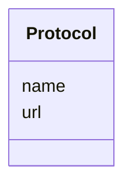

# Class: Protocol


URI: [nmdc:Protocol](https://w3id.org/nmdc/Protocol)





<!-- no inheritance hierarchy -->


## Slots

| Name | Cardinality and Range | Description | Inheritance |
| ---  | --- | --- | --- |
| [url](url.md) | 0..1 <br/> [String](String.md) |  | direct |
| [name](name.md) | 0..1 <br/> [String](String.md) | A human readable label for an entity | direct |


## Usages

| used by | used in | type | used |
| ---  | --- | --- | --- |
| [Pooling](Pooling.md) | [protocol_link](protocol_link.md) | range | [Protocol](Protocol.md) |
| [Extraction](Extraction.md) | [protocol_link](protocol_link.md) | range | [Protocol](Protocol.md) |
| [LibraryPreparation](LibraryPreparation.md) | [protocol_link](protocol_link.md) | range | [Protocol](Protocol.md) |
| [CollectingBiosamplesFromSite](CollectingBiosamplesFromSite.md) | [protocol_link](protocol_link.md) | range | [Protocol](Protocol.md) |
| [BiosampleProcessing](BiosampleProcessing.md) | [protocol_link](protocol_link.md) | range | [Protocol](Protocol.md) |
| [SubSamplingProcess](SubSamplingProcess.md) | [protocol_link](protocol_link.md) | range | [Protocol](Protocol.md) |
| [MixingProcess](MixingProcess.md) | [protocol_link](protocol_link.md) | range | [Protocol](Protocol.md) |
| [FiltrationProcess](FiltrationProcess.md) | [protocol_link](protocol_link.md) | range | [Protocol](Protocol.md) |
| [ChromatographicSeparationProcess](ChromatographicSeparationProcess.md) | [protocol_link](protocol_link.md) | range | [Protocol](Protocol.md) |
| [OmicsProcessing](OmicsProcessing.md) | [protocol_link](protocol_link.md) | range | [Protocol](Protocol.md) |
| [PlannedProcess](PlannedProcess.md) | [protocol_link](protocol_link.md) | range | [Protocol](Protocol.md) |


## Identifier and Mapping Information


### Schema Source


* from schema: https://w3id.org/nmdc/nmdc


## Mappings

| Mapping Type | Mapped Value |
| ---  | ---  |
| self | nmdc:Protocol |
| native | nmdc:Protocol |


## LinkML Source

<!-- TODO: investigate https://stackoverflow.com/questions/37606292/how-to-create-tabbed-code-blocks-in-mkdocs-or-sphinx -->

### Direct

<details>
```yaml
name: Protocol
from_schema: https://w3id.org/nmdc/nmdc
slots:
- url
- name

```
</details>

### Induced

<details>
```yaml
name: Protocol
from_schema: https://w3id.org/nmdc/nmdc
attributes:
  url:
    name: url
    notes:
    - See issue 207 - this clashes with the mixs field
    from_schema: https://w3id.org/nmdc/nmdc
    rank: 1000
    alias: url
    owner: Protocol
    domain_of:
    - Protocol
    - DataObject
    - ImageValue
    range: string
  name:
    name: name
    description: A human readable label for an entity
    from_schema: https://w3id.org/nmdc/nmdc
    rank: 1000
    alias: name
    owner: Protocol
    domain_of:
    - Protocol
    - QualityControlReport
    - NamedThing
    - PersonValue
    - Activity
    range: string

```
</details>