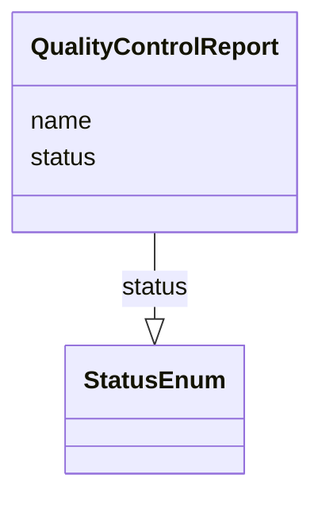

# Class: QualityControlReport


URI: [nmdc:QualityControlReport](https://w3id.org/nmdc/QualityControlReport)





<!-- no inheritance hierarchy -->


## Slots

| Name | Cardinality and Range | Description | Inheritance |
| ---  | --- | --- | --- |
| [status](status.md) | 0..1 <br/> [StatusEnum](StatusEnum.md) |  | direct |
| [name](name.md) | 0..1 <br/> [String](String.md) | A human readable label for an entity | direct |


## Usages

| used by | used in | type | used |
| ---  | --- | --- | --- |
| [Extraction](Extraction.md) | [quality_control_report](quality_control_report.md) | range | [QualityControlReport](QualityControlReport.md) |
| [QualityControlReport](QualityControlReport.md) | [status](status.md) | domain | [QualityControlReport](QualityControlReport.md) |


## Identifier and Mapping Information


### Schema Source


* from schema: https://w3id.org/nmdc/nmdc


## Mappings

| Mapping Type | Mapped Value |
| ---  | ---  |
| self | nmdc:QualityControlReport |
| native | nmdc:QualityControlReport |


## LinkML Source

<!-- TODO: investigate https://stackoverflow.com/questions/37606292/how-to-create-tabbed-code-blocks-in-mkdocs-or-sphinx -->

### Direct

<details>
```yaml
name: QualityControlReport
from_schema: https://w3id.org/nmdc/nmdc
slots:
- status
- name

```
</details>

### Induced

<details>
```yaml
name: QualityControlReport
from_schema: https://w3id.org/nmdc/nmdc
attributes:
  status:
    name: status
    from_schema: https://w3id.org/nmdc/nmdc
    rank: 1000
    domain: QualityControlReport
    alias: status
    owner: QualityControlReport
    domain_of:
    - QualityControlReport
    range: StatusEnum
  name:
    name: name
    description: A human readable label for an entity
    from_schema: https://w3id.org/nmdc/nmdc
    rank: 1000
    alias: name
    owner: QualityControlReport
    domain_of:
    - Protocol
    - QualityControlReport
    - NamedThing
    - PersonValue
    - Activity
    range: string

```
</details>