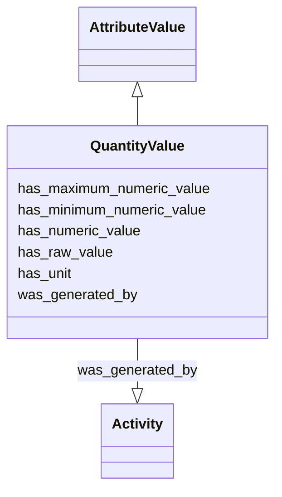

# Class: QuantityValue


_A simple quantity, e.g. 2cm_


URI: [nmdc:QuantityValue](https://w3id.org/nmdc/QuantityValue)





## Inheritance
* [AttributeValue](AttributeValue.md)
    * **QuantityValue**


## Slots

| Name | Cardinality and Range | Description | Inheritance |
| ---  | --- | --- | --- |
| [has_maximum_numeric_value](has_maximum_numeric_value.md) | 0..1 <br/> [Float](Float.md) | The maximum value part, expressed as number, of the quantity value when the v... | direct |
| [has_minimum_numeric_value](has_minimum_numeric_value.md) | 0..1 <br/> [Float](Float.md) | The minimum value part, expressed as number, of the quantity value when the v... | direct |
| [has_numeric_value](has_numeric_value.md) | 0..1 <br/> [Double](Double.md) | The number part of the quantity | direct |
| [has_raw_value](has_raw_value.md) | 0..1 <br/> [String](String.md) | Unnormalized atomic string representation, should in syntax {number} {unit} | direct |
| [has_unit](has_unit.md) | 0..1 <br/> [Unit](Unit.md) | The unit of the quantity | direct |
| [was_generated_by](was_generated_by.md) | 0..1 <br/> [Activity](Activity.md) |  | [AttributeValue](AttributeValue.md) |


## Usages

| used by | used in | type | used |
| ---  | --- | --- | --- |
| [Extraction](Extraction.md) | [input_mass](input_mass.md) | range | [QuantityValue](QuantityValue.md) |
| [SolutionComponent](SolutionComponent.md) | [concentration](concentration.md) | range | [QuantityValue](QuantityValue.md) |
| [Solution](Solution.md) | [volume](volume.md) | range | [QuantityValue](QuantityValue.md) |
| [FieldResearchSite](FieldResearchSite.md) | [elev](elev.md) | range | [QuantityValue](QuantityValue.md) |
| [Biosample](Biosample.md) | [abs_air_humidity](abs_air_humidity.md) | range | [QuantityValue](QuantityValue.md) |
| [Biosample](Biosample.md) | [air_temp](air_temp.md) | range | [QuantityValue](QuantityValue.md) |
| [Biosample](Biosample.md) | [al_sat](al_sat.md) | range | [QuantityValue](QuantityValue.md) |
| [Biosample](Biosample.md) | [alkalinity](alkalinity.md) | range | [QuantityValue](QuantityValue.md) |
| [Biosample](Biosample.md) | [alkyl_diethers](alkyl_diethers.md) | range | [QuantityValue](QuantityValue.md) |
| [Biosample](Biosample.md) | [alt](alt.md) | range | [QuantityValue](QuantityValue.md) |
| [Biosample](Biosample.md) | [aminopept_act](aminopept_act.md) | range | [QuantityValue](QuantityValue.md) |
| [Biosample](Biosample.md) | [ammonium](ammonium.md) | range | [QuantityValue](QuantityValue.md) |
| [Biosample](Biosample.md) | [ammonium_nitrogen](ammonium_nitrogen.md) | range | [QuantityValue](QuantityValue.md) |
| [Biosample](Biosample.md) | [amount_light](amount_light.md) | range | [QuantityValue](QuantityValue.md) |
| [Biosample](Biosample.md) | [annual_precpt](annual_precpt.md) | range | [QuantityValue](QuantityValue.md) |
| [Biosample](Biosample.md) | [annual_temp](annual_temp.md) | range | [QuantityValue](QuantityValue.md) |
| [Biosample](Biosample.md) | [api](api.md) | range | [QuantityValue](QuantityValue.md) |
| [Biosample](Biosample.md) | [avg_dew_point](avg_dew_point.md) | range | [QuantityValue](QuantityValue.md) |
| [Biosample](Biosample.md) | [avg_temp](avg_temp.md) | range | [QuantityValue](QuantityValue.md) |
| [Biosample](Biosample.md) | [bac_prod](bac_prod.md) | range | [QuantityValue](QuantityValue.md) |
| [Biosample](Biosample.md) | [bac_resp](bac_resp.md) | range | [QuantityValue](QuantityValue.md) |
| [Biosample](Biosample.md) | [bacteria_carb_prod](bacteria_carb_prod.md) | range | [QuantityValue](QuantityValue.md) |
| [Biosample](Biosample.md) | [barometric_press](barometric_press.md) | range | [QuantityValue](QuantityValue.md) |
| [Biosample](Biosample.md) | [benzene](benzene.md) | range | [QuantityValue](QuantityValue.md) |
| [Biosample](Biosample.md) | [biochem_oxygen_dem](biochem_oxygen_dem.md) | range | [QuantityValue](QuantityValue.md) |
| [Biosample](Biosample.md) | [bishomohopanol](bishomohopanol.md) | range | [QuantityValue](QuantityValue.md) |
| [Biosample](Biosample.md) | [blood_press_diast](blood_press_diast.md) | range | [QuantityValue](QuantityValue.md) |
| [Biosample](Biosample.md) | [blood_press_syst](blood_press_syst.md) | range | [QuantityValue](QuantityValue.md) |
| [Biosample](Biosample.md) | [bromide](bromide.md) | range | [QuantityValue](QuantityValue.md) |
| [Biosample](Biosample.md) | [built_struc_age](built_struc_age.md) | range | [QuantityValue](QuantityValue.md) |
| [Biosample](Biosample.md) | [calcium](calcium.md) | range | [QuantityValue](QuantityValue.md) |
| [Biosample](Biosample.md) | [carb_dioxide](carb_dioxide.md) | range | [QuantityValue](QuantityValue.md) |
| [Biosample](Biosample.md) | [carb_monoxide](carb_monoxide.md) | range | [QuantityValue](QuantityValue.md) |
| [Biosample](Biosample.md) | [carb_nitro_ratio](carb_nitro_ratio.md) | range | [QuantityValue](QuantityValue.md) |
| [Biosample](Biosample.md) | [ceil_area](ceil_area.md) | range | [QuantityValue](QuantityValue.md) |
| [Biosample](Biosample.md) | [ceil_thermal_mass](ceil_thermal_mass.md) | range | [QuantityValue](QuantityValue.md) |
| [Biosample](Biosample.md) | [chem_oxygen_dem](chem_oxygen_dem.md) | range | [QuantityValue](QuantityValue.md) |
| [Biosample](Biosample.md) | [chloride](chloride.md) | range | [QuantityValue](QuantityValue.md) |
| [Biosample](Biosample.md) | [chlorophyll](chlorophyll.md) | range | [QuantityValue](QuantityValue.md) |
| [Biosample](Biosample.md) | [conduc](conduc.md) | range | [QuantityValue](QuantityValue.md) |
| [Biosample](Biosample.md) | [density](density.md) | range | [QuantityValue](QuantityValue.md) |
| [Biosample](Biosample.md) | [depth](depth.md) | range | [QuantityValue](QuantityValue.md) |
| [Biosample](Biosample.md) | [dew_point](dew_point.md) | range | [QuantityValue](QuantityValue.md) |
| [Biosample](Biosample.md) | [diss_carb_dioxide](diss_carb_dioxide.md) | range | [QuantityValue](QuantityValue.md) |
| [Biosample](Biosample.md) | [diss_hydrogen](diss_hydrogen.md) | range | [QuantityValue](QuantityValue.md) |
| [Biosample](Biosample.md) | [diss_inorg_carb](diss_inorg_carb.md) | range | [QuantityValue](QuantityValue.md) |
| [Biosample](Biosample.md) | [diss_inorg_nitro](diss_inorg_nitro.md) | range | [QuantityValue](QuantityValue.md) |
| [Biosample](Biosample.md) | [diss_inorg_phosp](diss_inorg_phosp.md) | range | [QuantityValue](QuantityValue.md) |
| [Biosample](Biosample.md) | [diss_iron](diss_iron.md) | range | [QuantityValue](QuantityValue.md) |
| [Biosample](Biosample.md) | [diss_org_carb](diss_org_carb.md) | range | [QuantityValue](QuantityValue.md) |
| [Biosample](Biosample.md) | [diss_org_nitro](diss_org_nitro.md) | range | [QuantityValue](QuantityValue.md) |
| [Biosample](Biosample.md) | [diss_oxygen](diss_oxygen.md) | range | [QuantityValue](QuantityValue.md) |
| [Biosample](Biosample.md) | [diss_oxygen_fluid](diss_oxygen_fluid.md) | range | [QuantityValue](QuantityValue.md) |
| [Biosample](Biosample.md) | [door_size](door_size.md) | range | [QuantityValue](QuantityValue.md) |
| [Biosample](Biosample.md) | [down_par](down_par.md) | range | [QuantityValue](QuantityValue.md) |
| [Biosample](Biosample.md) | [efficiency_percent](efficiency_percent.md) | range | [QuantityValue](QuantityValue.md) |
| [Biosample](Biosample.md) | [ethylbenzene](ethylbenzene.md) | range | [QuantityValue](QuantityValue.md) |
| [Biosample](Biosample.md) | [exp_duct](exp_duct.md) | range | [QuantityValue](QuantityValue.md) |
| [Biosample](Biosample.md) | [exp_pipe](exp_pipe.md) | range | [QuantityValue](QuantityValue.md) |
| [Biosample](Biosample.md) | [floor_age](floor_age.md) | range | [QuantityValue](QuantityValue.md) |
| [Biosample](Biosample.md) | [floor_area](floor_area.md) | range | [QuantityValue](QuantityValue.md) |
| [Biosample](Biosample.md) | [floor_thermal_mass](floor_thermal_mass.md) | range | [QuantityValue](QuantityValue.md) |
| [Biosample](Biosample.md) | [fluor](fluor.md) | range | [QuantityValue](QuantityValue.md) |
| [Biosample](Biosample.md) | [freq_clean](freq_clean.md) | range | [QuantityValue](QuantityValue.md) |
| [Biosample](Biosample.md) | [freq_cook](freq_cook.md) | range | [QuantityValue](QuantityValue.md) |
| [Biosample](Biosample.md) | [glucosidase_act](glucosidase_act.md) | range | [QuantityValue](QuantityValue.md) |
| [Biosample](Biosample.md) | [hcr_fw_salinity](hcr_fw_salinity.md) | range | [QuantityValue](QuantityValue.md) |
| [Biosample](Biosample.md) | [height_carper_fiber](height_carper_fiber.md) | range | [QuantityValue](QuantityValue.md) |
| [Biosample](Biosample.md) | [host_age](host_age.md) | range | [QuantityValue](QuantityValue.md) |
| [Biosample](Biosample.md) | [host_body_temp](host_body_temp.md) | range | [QuantityValue](QuantityValue.md) |
| [Biosample](Biosample.md) | [host_dry_mass](host_dry_mass.md) | range | [QuantityValue](QuantityValue.md) |
| [Biosample](Biosample.md) | [host_height](host_height.md) | range | [QuantityValue](QuantityValue.md) |
| [Biosample](Biosample.md) | [host_length](host_length.md) | range | [QuantityValue](QuantityValue.md) |
| [Biosample](Biosample.md) | [host_tot_mass](host_tot_mass.md) | range | [QuantityValue](QuantityValue.md) |
| [Biosample](Biosample.md) | [host_wet_mass](host_wet_mass.md) | range | [QuantityValue](QuantityValue.md) |
| [Biosample](Biosample.md) | [humidity](humidity.md) | range | [QuantityValue](QuantityValue.md) |
| [Biosample](Biosample.md) | [indust_eff_percent](indust_eff_percent.md) | range | [QuantityValue](QuantityValue.md) |
| [Biosample](Biosample.md) | [inside_lux](inside_lux.md) | range | [QuantityValue](QuantityValue.md) |
| [Biosample](Biosample.md) | [iwf](iwf.md) | range | [QuantityValue](QuantityValue.md) |
| [Biosample](Biosample.md) | [lbc_thirty](lbc_thirty.md) | range | [QuantityValue](QuantityValue.md) |
| [Biosample](Biosample.md) | [lbceq](lbceq.md) | range | [QuantityValue](QuantityValue.md) |
| [Biosample](Biosample.md) | [light_intensity](light_intensity.md) | range | [QuantityValue](QuantityValue.md) |
| [Biosample](Biosample.md) | [magnesium](magnesium.md) | range | [QuantityValue](QuantityValue.md) |
| [Biosample](Biosample.md) | [manganese](manganese.md) | range | [QuantityValue](QuantityValue.md) |
| [Biosample](Biosample.md) | [max_occup](max_occup.md) | range | [QuantityValue](QuantityValue.md) |
| [Biosample](Biosample.md) | [mean_frict_vel](mean_frict_vel.md) | range | [QuantityValue](QuantityValue.md) |
| [Biosample](Biosample.md) | [mean_peak_frict_vel](mean_peak_frict_vel.md) | range | [QuantityValue](QuantityValue.md) |
| [Biosample](Biosample.md) | [methane](methane.md) | range | [QuantityValue](QuantityValue.md) |
| [Biosample](Biosample.md) | [microbial_biomass](microbial_biomass.md) | range | [QuantityValue](QuantityValue.md) |
| [Biosample](Biosample.md) | [nitrate](nitrate.md) | range | [QuantityValue](QuantityValue.md) |
| [Biosample](Biosample.md) | [nitrate_nitrogen](nitrate_nitrogen.md) | range | [QuantityValue](QuantityValue.md) |
| [Biosample](Biosample.md) | [nitrite](nitrite.md) | range | [QuantityValue](QuantityValue.md) |
| [Biosample](Biosample.md) | [nitrite_nitrogen](nitrite_nitrogen.md) | range | [QuantityValue](QuantityValue.md) |
| [Biosample](Biosample.md) | [nitro](nitro.md) | range | [QuantityValue](QuantityValue.md) |
| [Biosample](Biosample.md) | [number_pets](number_pets.md) | range | [QuantityValue](QuantityValue.md) |
| [Biosample](Biosample.md) | [number_plants](number_plants.md) | range | [QuantityValue](QuantityValue.md) |
| [Biosample](Biosample.md) | [number_resident](number_resident.md) | range | [QuantityValue](QuantityValue.md) |
| [Biosample](Biosample.md) | [occup_density_samp](occup_density_samp.md) | range | [QuantityValue](QuantityValue.md) |
| [Biosample](Biosample.md) | [occup_samp](occup_samp.md) | range | [QuantityValue](QuantityValue.md) |
| [Biosample](Biosample.md) | [org_carb](org_carb.md) | range | [QuantityValue](QuantityValue.md) |
| [Biosample](Biosample.md) | [org_matter](org_matter.md) | range | [QuantityValue](QuantityValue.md) |
| [Biosample](Biosample.md) | [org_nitro](org_nitro.md) | range | [QuantityValue](QuantityValue.md) |
| [Biosample](Biosample.md) | [organism_count](organism_count.md) | range | [QuantityValue](QuantityValue.md) |
| [Biosample](Biosample.md) | [owc_tvdss](owc_tvdss.md) | range | [QuantityValue](QuantityValue.md) |
| [Biosample](Biosample.md) | [oxygen](oxygen.md) | range | [QuantityValue](QuantityValue.md) |
| [Biosample](Biosample.md) | [part_org_carb](part_org_carb.md) | range | [QuantityValue](QuantityValue.md) |
| [Biosample](Biosample.md) | [part_org_nitro](part_org_nitro.md) | range | [QuantityValue](QuantityValue.md) |
| [Biosample](Biosample.md) | [petroleum_hydrocarb](petroleum_hydrocarb.md) | range | [QuantityValue](QuantityValue.md) |
| [Biosample](Biosample.md) | [phosphate](phosphate.md) | range | [QuantityValue](QuantityValue.md) |
| [Biosample](Biosample.md) | [photon_flux](photon_flux.md) | range | [QuantityValue](QuantityValue.md) |
| [Biosample](Biosample.md) | [potassium](potassium.md) | range | [QuantityValue](QuantityValue.md) |
| [Biosample](Biosample.md) | [pour_point](pour_point.md) | range | [QuantityValue](QuantityValue.md) |
| [Biosample](Biosample.md) | [pressure](pressure.md) | range | [QuantityValue](QuantityValue.md) |
| [Biosample](Biosample.md) | [primary_prod](primary_prod.md) | range | [QuantityValue](QuantityValue.md) |
| [Biosample](Biosample.md) | [prod_rate](prod_rate.md) | range | [QuantityValue](QuantityValue.md) |
| [Biosample](Biosample.md) | [redox_potential](redox_potential.md) | range | [QuantityValue](QuantityValue.md) |
| [Biosample](Biosample.md) | [rel_air_humidity](rel_air_humidity.md) | range | [QuantityValue](QuantityValue.md) |
| [Biosample](Biosample.md) | [rel_humidity_out](rel_humidity_out.md) | range | [QuantityValue](QuantityValue.md) |
| [Biosample](Biosample.md) | [room_air_exch_rate](room_air_exch_rate.md) | range | [QuantityValue](QuantityValue.md) |
| [Biosample](Biosample.md) | [room_occup](room_occup.md) | range | [QuantityValue](QuantityValue.md) |
| [Biosample](Biosample.md) | [root_med_ph](root_med_ph.md) | range | [QuantityValue](QuantityValue.md) |
| [Biosample](Biosample.md) | [salinity](salinity.md) | range | [QuantityValue](QuantityValue.md) |
| [Biosample](Biosample.md) | [samp_md](samp_md.md) | range | [QuantityValue](QuantityValue.md) |
| [Biosample](Biosample.md) | [samp_size](samp_size.md) | range | [QuantityValue](QuantityValue.md) |
| [Biosample](Biosample.md) | [samp_store_temp](samp_store_temp.md) | range | [QuantityValue](QuantityValue.md) |
| [Biosample](Biosample.md) | [samp_vol_we_dna_ext](samp_vol_we_dna_ext.md) | range | [QuantityValue](QuantityValue.md) |
| [Biosample](Biosample.md) | [season_precpt](season_precpt.md) | range | [QuantityValue](QuantityValue.md) |
| [Biosample](Biosample.md) | [season_temp](season_temp.md) | range | [QuantityValue](QuantityValue.md) |
| [Biosample](Biosample.md) | [silicate](silicate.md) | range | [QuantityValue](QuantityValue.md) |
| [Biosample](Biosample.md) | [size_frac_low](size_frac_low.md) | range | [QuantityValue](QuantityValue.md) |
| [Biosample](Biosample.md) | [size_frac_up](size_frac_up.md) | range | [QuantityValue](QuantityValue.md) |
| [Biosample](Biosample.md) | [slope_aspect](slope_aspect.md) | range | [QuantityValue](QuantityValue.md) |
| [Biosample](Biosample.md) | [slope_gradient](slope_gradient.md) | range | [QuantityValue](QuantityValue.md) |
| [Biosample](Biosample.md) | [sludge_retent_time](sludge_retent_time.md) | range | [QuantityValue](QuantityValue.md) |
| [Biosample](Biosample.md) | [sodium](sodium.md) | range | [QuantityValue](QuantityValue.md) |
| [Biosample](Biosample.md) | [soil_text_measure](soil_text_measure.md) | range | [QuantityValue](QuantityValue.md) |
| [Biosample](Biosample.md) | [solar_irradiance](solar_irradiance.md) | range | [QuantityValue](QuantityValue.md) |
| [Biosample](Biosample.md) | [soluble_react_phosp](soluble_react_phosp.md) | range | [QuantityValue](QuantityValue.md) |
| [Biosample](Biosample.md) | [specific_humidity](specific_humidity.md) | range | [QuantityValue](QuantityValue.md) |
| [Biosample](Biosample.md) | [sulfate](sulfate.md) | range | [QuantityValue](QuantityValue.md) |
| [Biosample](Biosample.md) | [sulfate_fw](sulfate_fw.md) | range | [QuantityValue](QuantityValue.md) |
| [Biosample](Biosample.md) | [sulfide](sulfide.md) | range | [QuantityValue](QuantityValue.md) |
| [Biosample](Biosample.md) | [surf_humidity](surf_humidity.md) | range | [QuantityValue](QuantityValue.md) |
| [Biosample](Biosample.md) | [surf_moisture](surf_moisture.md) | range | [QuantityValue](QuantityValue.md) |
| [Biosample](Biosample.md) | [surf_temp](surf_temp.md) | range | [QuantityValue](QuantityValue.md) |
| [Biosample](Biosample.md) | [suspend_part_matter](suspend_part_matter.md) | range | [QuantityValue](QuantityValue.md) |
| [Biosample](Biosample.md) | [tan](tan.md) | range | [QuantityValue](QuantityValue.md) |
| [Biosample](Biosample.md) | [temp](temp.md) | range | [QuantityValue](QuantityValue.md) |
| [Biosample](Biosample.md) | [temp_out](temp_out.md) | range | [QuantityValue](QuantityValue.md) |
| [Biosample](Biosample.md) | [toluene](toluene.md) | range | [QuantityValue](QuantityValue.md) |
| [Biosample](Biosample.md) | [tot_carb](tot_carb.md) | range | [QuantityValue](QuantityValue.md) |
| [Biosample](Biosample.md) | [tot_depth_water_col](tot_depth_water_col.md) | range | [QuantityValue](QuantityValue.md) |
| [Biosample](Biosample.md) | [tot_diss_nitro](tot_diss_nitro.md) | range | [QuantityValue](QuantityValue.md) |
| [Biosample](Biosample.md) | [tot_inorg_nitro](tot_inorg_nitro.md) | range | [QuantityValue](QuantityValue.md) |
| [Biosample](Biosample.md) | [tot_iron](tot_iron.md) | range | [QuantityValue](QuantityValue.md) |
| [Biosample](Biosample.md) | [tot_nitro](tot_nitro.md) | range | [QuantityValue](QuantityValue.md) |
| [Biosample](Biosample.md) | [tot_nitro_content](tot_nitro_content.md) | range | [QuantityValue](QuantityValue.md) |
| [Biosample](Biosample.md) | [tot_org_carb](tot_org_carb.md) | range | [QuantityValue](QuantityValue.md) |
| [Biosample](Biosample.md) | [tot_part_carb](tot_part_carb.md) | range | [QuantityValue](QuantityValue.md) |
| [Biosample](Biosample.md) | [tot_phosp](tot_phosp.md) | range | [QuantityValue](QuantityValue.md) |
| [Biosample](Biosample.md) | [tot_phosphate](tot_phosphate.md) | range | [QuantityValue](QuantityValue.md) |
| [Biosample](Biosample.md) | [tot_sulfur](tot_sulfur.md) | range | [QuantityValue](QuantityValue.md) |
| [Biosample](Biosample.md) | [turbidity](turbidity.md) | range | [QuantityValue](QuantityValue.md) |
| [Biosample](Biosample.md) | [tvdss_of_hcr_press](tvdss_of_hcr_press.md) | range | [QuantityValue](QuantityValue.md) |
| [Biosample](Biosample.md) | [tvdss_of_hcr_temp](tvdss_of_hcr_temp.md) | range | [QuantityValue](QuantityValue.md) |
| [Biosample](Biosample.md) | [ventilation_rate](ventilation_rate.md) | range | [QuantityValue](QuantityValue.md) |
| [Biosample](Biosample.md) | [vfa](vfa.md) | range | [QuantityValue](QuantityValue.md) |
| [Biosample](Biosample.md) | [vfa_fw](vfa_fw.md) | range | [QuantityValue](QuantityValue.md) |
| [Biosample](Biosample.md) | [wall_area](wall_area.md) | range | [QuantityValue](QuantityValue.md) |
| [Biosample](Biosample.md) | [wall_height](wall_height.md) | range | [QuantityValue](QuantityValue.md) |
| [Biosample](Biosample.md) | [wall_thermal_mass](wall_thermal_mass.md) | range | [QuantityValue](QuantityValue.md) |
| [Biosample](Biosample.md) | [water_current](water_current.md) | range | [QuantityValue](QuantityValue.md) |
| [Biosample](Biosample.md) | [water_cut](water_cut.md) | range | [QuantityValue](QuantityValue.md) |
| [Biosample](Biosample.md) | [water_feat_size](water_feat_size.md) | range | [QuantityValue](QuantityValue.md) |
| [Biosample](Biosample.md) | [water_prod_rate](water_prod_rate.md) | range | [QuantityValue](QuantityValue.md) |
| [Biosample](Biosample.md) | [wind_speed](wind_speed.md) | range | [QuantityValue](QuantityValue.md) |
| [Biosample](Biosample.md) | [xylene](xylene.md) | range | [QuantityValue](QuantityValue.md) |
| [Biosample](Biosample.md) | [zinc](zinc.md) | range | [QuantityValue](QuantityValue.md) |
| [Biosample](Biosample.md) | [subsurface_depth](subsurface_depth.md) | range | [QuantityValue](QuantityValue.md) |
| [Biosample](Biosample.md) | [bulk_elect_conductivity](bulk_elect_conductivity.md) | range | [QuantityValue](QuantityValue.md) |
| [SubSamplingProcess](SubSamplingProcess.md) | [container_size](container_size.md) | range | [QuantityValue](QuantityValue.md) |
| [SubSamplingProcess](SubSamplingProcess.md) | [temperature](temperature.md) | range | [QuantityValue](QuantityValue.md) |
| [SubSamplingProcess](SubSamplingProcess.md) | [volume](volume.md) | range | [QuantityValue](QuantityValue.md) |
| [SubSamplingProcess](SubSamplingProcess.md) | [mass](mass.md) | range | [QuantityValue](QuantityValue.md) |
| [MixingProcess](MixingProcess.md) | [duration](duration.md) | range | [QuantityValue](QuantityValue.md) |
| [FiltrationProcess](FiltrationProcess.md) | [container_size](container_size.md) | range | [QuantityValue](QuantityValue.md) |
| [FiltrationProcess](FiltrationProcess.md) | [filter_pore_size](filter_pore_size.md) | range | [QuantityValue](QuantityValue.md) |
| [FiltrationProcess](FiltrationProcess.md) | [volume](volume.md) | range | [QuantityValue](QuantityValue.md) |
| [ChromatographicSeparationProcess](ChromatographicSeparationProcess.md) | [temperature](temperature.md) | range | [QuantityValue](QuantityValue.md) |
| [OmicsProcessing](OmicsProcessing.md) | [samp_vol_we_dna_ext](samp_vol_we_dna_ext.md) | range | [QuantityValue](QuantityValue.md) |
| [ProcessedSample](ProcessedSample.md) | [biomaterial_purity](biomaterial_purity.md) | range | [QuantityValue](QuantityValue.md) |
| [QuantityValue](QuantityValue.md) | [has_maximum_numeric_value](has_maximum_numeric_value.md) | domain | [QuantityValue](QuantityValue.md) |
| [QuantityValue](QuantityValue.md) | [has_minimum_numeric_value](has_minimum_numeric_value.md) | domain | [QuantityValue](QuantityValue.md) |
| [QuantityValue](QuantityValue.md) | [has_numeric_value](has_numeric_value.md) | domain | [QuantityValue](QuantityValue.md) |
| [QuantityValue](QuantityValue.md) | [has_unit](has_unit.md) | domain | [QuantityValue](QuantityValue.md) |
| [IntegerValue](IntegerValue.md) | [has_numeric_value](has_numeric_value.md) | domain | [QuantityValue](QuantityValue.md) |


## Identifier and Mapping Information


### Schema Source


* from schema: https://w3id.org/nmdc/nmdc


## Mappings

| Mapping Type | Mapped Value |
| ---  | ---  |
| self | nmdc:QuantityValue |
| native | nmdc:QuantityValue |
| undefined | schema:QuantityValue |


## LinkML Source

<!-- TODO: investigate https://stackoverflow.com/questions/37606292/how-to-create-tabbed-code-blocks-in-mkdocs-or-sphinx -->

### Direct

<details>
```yaml
name: QuantityValue
description: A simple quantity, e.g. 2cm
from_schema: https://w3id.org/nmdc/nmdc
mappings:
- schema:QuantityValue
is_a: AttributeValue
slots:
- has_maximum_numeric_value
- has_minimum_numeric_value
- has_numeric_value
- has_raw_value
- has_unit
slot_usage:
  has_raw_value:
    name: has_raw_value
    description: Unnormalized atomic string representation, should in syntax {number}
      {unit}
    domain_of:
    - AttributeValue
    - QuantityValue
  has_unit:
    name: has_unit
    description: The unit of the quantity
    domain_of:
    - QuantityValue
  has_numeric_value:
    name: has_numeric_value
    description: The number part of the quantity
    domain_of:
    - QuantityValue
    - IntegerValue
    range: double

```
</details>

### Induced

<details>
```yaml
name: QuantityValue
description: A simple quantity, e.g. 2cm
from_schema: https://w3id.org/nmdc/nmdc
mappings:
- schema:QuantityValue
is_a: AttributeValue
slot_usage:
  has_raw_value:
    name: has_raw_value
    description: Unnormalized atomic string representation, should in syntax {number}
      {unit}
    domain_of:
    - AttributeValue
    - QuantityValue
  has_unit:
    name: has_unit
    description: The unit of the quantity
    domain_of:
    - QuantityValue
  has_numeric_value:
    name: has_numeric_value
    description: The number part of the quantity
    domain_of:
    - QuantityValue
    - IntegerValue
    range: double
attributes:
  has_maximum_numeric_value:
    name: has_maximum_numeric_value
    description: The maximum value part, expressed as number, of the quantity value
      when the value covers a range.
    from_schema: https://w3id.org/nmdc/nmdc
    rank: 1000
    is_a: has_numeric_value
    domain: QuantityValue
    alias: has_maximum_numeric_value
    owner: QuantityValue
    domain_of:
    - QuantityValue
    range: float
  has_minimum_numeric_value:
    name: has_minimum_numeric_value
    description: The minimum value part, expressed as number, of the quantity value
      when the value covers a range.
    from_schema: https://w3id.org/nmdc/nmdc
    rank: 1000
    is_a: has_numeric_value
    domain: QuantityValue
    alias: has_minimum_numeric_value
    owner: QuantityValue
    domain_of:
    - QuantityValue
    range: float
  has_numeric_value:
    name: has_numeric_value
    description: The number part of the quantity
    from_schema: https://w3id.org/nmdc/nmdc
    rank: 1000
    domain: QuantityValue
    multivalued: false
    alias: has_numeric_value
    owner: QuantityValue
    domain_of:
    - QuantityValue
    - IntegerValue
    range: double
  has_raw_value:
    name: has_raw_value
    description: Unnormalized atomic string representation, should in syntax {number}
      {unit}
    from_schema: https://w3id.org/nmdc/nmdc
    rank: 1000
    domain: AttributeValue
    multivalued: false
    alias: has_raw_value
    owner: QuantityValue
    domain_of:
    - AttributeValue
    - QuantityValue
    range: string
  has_unit:
    name: has_unit
    description: The unit of the quantity
    from_schema: https://w3id.org/nmdc/nmdc
    rank: 1000
    domain: QuantityValue
    alias: has_unit
    owner: QuantityValue
    domain_of:
    - QuantityValue
    range: unit
  was_generated_by:
    name: was_generated_by
    from_schema: https://w3id.org/nmdc/nmdc
    mappings:
    - prov:wasGeneratedBy
    rank: 1000
    alias: was_generated_by
    owner: QuantityValue
    domain_of:
    - DataObject
    - AttributeValue
    - FunctionalAnnotation
    range: Activity

```
</details>