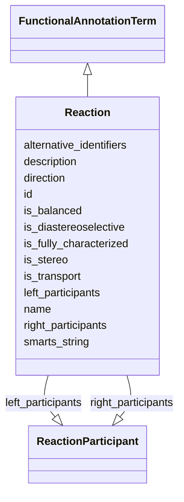

# Class: Reaction


_An individual biochemical transformation carried out by a functional unit of an organism, in which a collection of substrates are transformed into a collection of products. Can also represent transporters_


URI: [nmdc:Reaction](https://w3id.org/nmdc/Reaction)





## Inheritance
* [NamedThing](NamedThing.md)
    * [OntologyClass](OntologyClass.md)
        * [FunctionalAnnotationTerm](FunctionalAnnotationTerm.md)
            * **Reaction**


## Slots

| Name | Cardinality and Range | Description | Inheritance |
| ---  | --- | --- | --- |
| [direction](direction.md) | 0..1 <br/> [String](String.md) | One of l->r, r->l, bidirectional, neutral | direct |
| [is_balanced](is_balanced.md) | 0..1 <br/> [Boolean](Boolean.md) |  | direct |
| [is_diastereoselective](is_diastereoselective.md) | 0..1 <br/> [Boolean](Boolean.md) |  | direct |
| [is_fully_characterized](is_fully_characterized.md) | 0..1 <br/> [Boolean](Boolean.md) | False if includes R-groups | direct |
| [is_stereo](is_stereo.md) | 0..1 <br/> [Boolean](Boolean.md) |  | direct |
| [is_transport](is_transport.md) | 0..1 <br/> [Boolean](Boolean.md) |  | direct |
| [left_participants](left_participants.md) | 0..* <br/> [ReactionParticipant](ReactionParticipant.md) |  | direct |
| [right_participants](right_participants.md) | 0..* <br/> [ReactionParticipant](ReactionParticipant.md) |  | direct |
| [smarts_string](smarts_string.md) | 0..1 <br/> [String](String.md) |  | direct |
| [id](id.md) | 1..1 <br/> [Uriorcurie](Uriorcurie.md) | A unique identifier for a thing | [NamedThing](NamedThing.md) |
| [name](name.md) | 0..1 <br/> [String](String.md) | A human readable label for an entity | [NamedThing](NamedThing.md) |
| [description](description.md) | 0..1 <br/> [String](String.md) | a human-readable description of a thing | [NamedThing](NamedThing.md) |
| [alternative_identifiers](alternative_identifiers.md) | 0..* <br/> [Uriorcurie](Uriorcurie.md) | A list of alternative identifiers for the entity | [NamedThing](NamedThing.md) |


## Usages

| used by | used in | type | used |
| ---  | --- | --- | --- |
| [Pathway](Pathway.md) | [has_part](has_part.md) | range | [Reaction](Reaction.md) |
| [Reaction](Reaction.md) | [direction](direction.md) | domain | [Reaction](Reaction.md) |
| [Reaction](Reaction.md) | [left_participants](left_participants.md) | domain | [Reaction](Reaction.md) |
| [Reaction](Reaction.md) | [right_participants](right_participants.md) | domain | [Reaction](Reaction.md) |


## Identifier and Mapping Information


### Valid ID Prefixes

Instances of this class *should* have identifiers with one of the following prefixes:

* KEGG.REACTION

* RHEA

* MetaCyc

* EC

* GO

* MetaNetX

* SEED

* RetroRules


### Schema Source


* from schema: https://w3id.org/nmdc/nmdc


## Mappings

| Mapping Type | Mapped Value |
| ---  | ---  |
| self | nmdc:Reaction |
| native | nmdc:Reaction |
| exact | biolink:MolecularActivity |


## LinkML Source

<!-- TODO: investigate https://stackoverflow.com/questions/37606292/how-to-create-tabbed-code-blocks-in-mkdocs-or-sphinx -->

### Direct

<details>
```yaml
name: Reaction
id_prefixes:
- KEGG.REACTION
- RHEA
- MetaCyc
- EC
- GO
- MetaNetX
- SEED
- RetroRules
description: An individual biochemical transformation carried out by a functional
  unit of an organism, in which a collection of substrates are transformed into a
  collection of products. Can also represent transporters
from_schema: https://w3id.org/nmdc/nmdc
exact_mappings:
- biolink:MolecularActivity
is_a: FunctionalAnnotationTerm
slots:
- direction
- is_balanced
- is_diastereoselective
- is_fully_characterized
- is_stereo
- is_transport
- left_participants
- right_participants
- smarts_string

```
</details>

### Induced

<details>
```yaml
name: Reaction
id_prefixes:
- KEGG.REACTION
- RHEA
- MetaCyc
- EC
- GO
- MetaNetX
- SEED
- RetroRules
description: An individual biochemical transformation carried out by a functional
  unit of an organism, in which a collection of substrates are transformed into a
  collection of products. Can also represent transporters
from_schema: https://w3id.org/nmdc/nmdc
exact_mappings:
- biolink:MolecularActivity
is_a: FunctionalAnnotationTerm
attributes:
  direction:
    name: direction
    description: One of l->r, r->l, bidirectional, neutral
    from_schema: https://w3id.org/nmdc/nmdc
    rank: 1000
    domain: Reaction
    alias: direction
    owner: Reaction
    domain_of:
    - Reaction
    range: string
  is_balanced:
    name: is_balanced
    from_schema: https://w3id.org/nmdc/nmdc
    rank: 1000
    alias: is_balanced
    owner: Reaction
    domain_of:
    - Reaction
    range: boolean
  is_diastereoselective:
    name: is_diastereoselective
    from_schema: https://w3id.org/nmdc/nmdc
    rank: 1000
    alias: is_diastereoselective
    owner: Reaction
    domain_of:
    - Reaction
    range: boolean
  is_fully_characterized:
    name: is_fully_characterized
    description: False if includes R-groups
    from_schema: https://w3id.org/nmdc/nmdc
    rank: 1000
    alias: is_fully_characterized
    owner: Reaction
    domain_of:
    - Reaction
    range: boolean
  is_stereo:
    name: is_stereo
    from_schema: https://w3id.org/nmdc/nmdc
    rank: 1000
    alias: is_stereo
    owner: Reaction
    domain_of:
    - Reaction
    range: boolean
  is_transport:
    name: is_transport
    from_schema: https://w3id.org/nmdc/nmdc
    rank: 1000
    alias: is_transport
    owner: Reaction
    domain_of:
    - Reaction
    range: boolean
  left_participants:
    name: left_participants
    from_schema: https://w3id.org/nmdc/nmdc
    rank: 1000
    is_a: has_participants
    domain: Reaction
    multivalued: true
    alias: left_participants
    owner: Reaction
    domain_of:
    - Reaction
    range: ReactionParticipant
  right_participants:
    name: right_participants
    from_schema: https://w3id.org/nmdc/nmdc
    rank: 1000
    is_a: has_participants
    domain: Reaction
    multivalued: true
    alias: right_participants
    owner: Reaction
    domain_of:
    - Reaction
    range: ReactionParticipant
  smarts_string:
    name: smarts_string
    from_schema: https://w3id.org/nmdc/nmdc
    rank: 1000
    alias: smarts_string
    owner: Reaction
    domain_of:
    - Reaction
    range: string
  id:
    name: id
    description: A unique identifier for a thing. Must be either a CURIE shorthand
      for a URI or a complete URI
    from_schema: https://w3id.org/nmdc/nmdc
    rank: 1000
    identifier: true
    alias: id
    owner: Reaction
    domain_of:
    - Biosample
    - Study
    - NamedThing
    - Activity
    range: uriorcurie
    required: true
    pattern: ^[a-zA-Z0-9][a-zA-Z0-9_\.]+:[a-zA-Z0-9_][a-zA-Z0-9_\-\/\.,]*$
  name:
    name: name
    description: A human readable label for an entity
    from_schema: https://w3id.org/nmdc/nmdc
    rank: 1000
    alias: name
    owner: Reaction
    domain_of:
    - Protocol
    - QualityControlReport
    - NamedThing
    - PersonValue
    - Activity
    range: string
  description:
    name: description
    description: a human-readable description of a thing
    from_schema: https://w3id.org/nmdc/nmdc
    rank: 1000
    slot_uri: dcterms:description
    alias: description
    owner: Reaction
    domain_of:
    - Study
    - NamedThing
    - ImageValue
    range: string
  alternative_identifiers:
    name: alternative_identifiers
    description: A list of alternative identifiers for the entity.
    from_schema: https://w3id.org/nmdc/nmdc
    rank: 1000
    multivalued: true
    alias: alternative_identifiers
    owner: Reaction
    domain_of:
    - Biosample
    - Study
    - NamedThing
    - MetaboliteQuantification
    range: uriorcurie
    pattern: ^[a-zA-Z0-9][a-zA-Z0-9_\.]+:[a-zA-Z0-9_][a-zA-Z0-9_\-\/\.,]*$

```
</details>