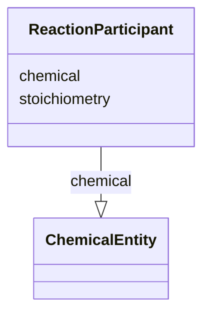

# Class: ReactionParticipant


_Instances of this link a reaction to a chemical entity participant_


URI: [nmdc:ReactionParticipant](https://w3id.org/nmdc/ReactionParticipant)





<!-- no inheritance hierarchy -->


## Slots

| Name | Cardinality and Range | Description | Inheritance |
| ---  | --- | --- | --- |
| [chemical](chemical.md) | 0..1 <br/> [ChemicalEntity](ChemicalEntity.md) | from reaction participant class | direct |
| [stoichiometry](stoichiometry.md) | 0..1 <br/> [Integer](Integer.md) | from reaction participant class | direct |


## Usages

| used by | used in | type | used |
| ---  | --- | --- | --- |
| [Reaction](Reaction.md) | [left_participants](left_participants.md) | range | [ReactionParticipant](ReactionParticipant.md) |
| [Reaction](Reaction.md) | [right_participants](right_participants.md) | range | [ReactionParticipant](ReactionParticipant.md) |
| [ReactionParticipant](ReactionParticipant.md) | [chemical](chemical.md) | domain | [ReactionParticipant](ReactionParticipant.md) |


## Identifier and Mapping Information


### Schema Source


* from schema: https://w3id.org/nmdc/nmdc


## Mappings

| Mapping Type | Mapped Value |
| ---  | ---  |
| self | nmdc:ReactionParticipant |
| native | nmdc:ReactionParticipant |


## LinkML Source

<!-- TODO: investigate https://stackoverflow.com/questions/37606292/how-to-create-tabbed-code-blocks-in-mkdocs-or-sphinx -->

### Direct

<details>
```yaml
name: ReactionParticipant
description: Instances of this link a reaction to a chemical entity participant
from_schema: https://w3id.org/nmdc/nmdc
slots:
- chemical
- stoichiometry

```
</details>

### Induced

<details>
```yaml
name: ReactionParticipant
description: Instances of this link a reaction to a chemical entity participant
from_schema: https://w3id.org/nmdc/nmdc
attributes:
  chemical:
    name: chemical
    description: from reaction participant class
    from_schema: https://w3id.org/nmdc/nmdc
    rank: 1000
    domain: ReactionParticipant
    alias: chemical
    owner: ReactionParticipant
    domain_of:
    - ReactionParticipant
    range: ChemicalEntity
  stoichiometry:
    name: stoichiometry
    description: from reaction participant class
    from_schema: https://w3id.org/nmdc/nmdc
    rank: 1000
    alias: stoichiometry
    owner: ReactionParticipant
    domain_of:
    - ReactionParticipant
    range: integer

```
</details>