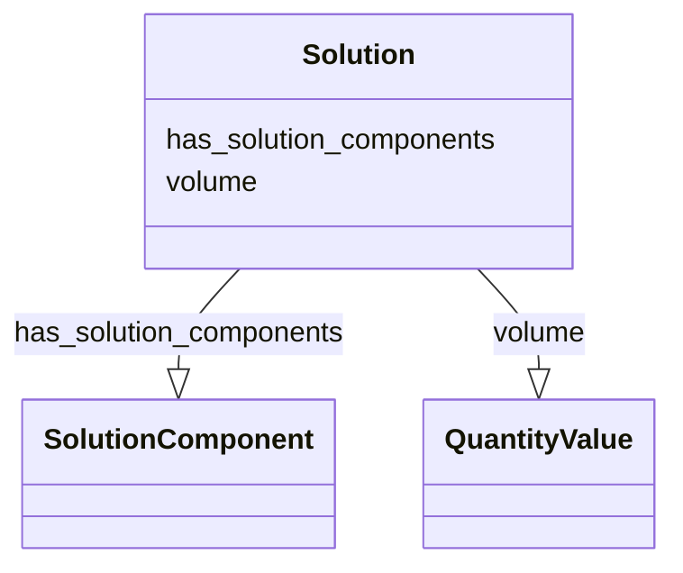

# Class: Solution


_A mixture that is homogeneous, made up of two or more scattered molecular aggregates, one playing the role of solute and the other playing the role of solvent._


URI: [nmdc:Solution](https://w3id.org/nmdc/Solution)





<!-- no inheritance hierarchy -->


## Slots

| Name | Cardinality and Range | Description | Inheritance |
| ---  | --- | --- | --- |
| [has_solution_components](has_solution_components.md) | 1..* <br/> [SolutionComponent](SolutionComponent.md) | Relationship from a Solution to one or more constituent solution components | direct |
| [volume](volume.md) | 0..1 <br/> [QuantityValue](QuantityValue.md) | The volume of a substance | direct |


## Usages

| used by | used in | type | used |
| ---  | --- | --- | --- |
| [Extraction](Extraction.md) | [extractant](extractant.md) | range | [Solution](Solution.md) |
| [Solution](Solution.md) | [has_solution_components](has_solution_components.md) | domain | [Solution](Solution.md) |
| [ChromatographicSeparationProcess](ChromatographicSeparationProcess.md) | [ordered_mobile_phases](ordered_mobile_phases.md) | range | [Solution](Solution.md) |


## Aliases


* mixture
* solvent


## Comments

* We acknowledge that users of the nmdc-schema may instantiate Solution with only a single component which goes against the letter of the description.
* The solution class may be used to instantiate a single component in the has_solution_components slot

## Identifier and Mapping Information


### Schema Source


* from schema: https://w3id.org/nmdc/nmdc


## Mappings

| Mapping Type | Mapped Value |
| ---  | ---  |
| self | nmdc:Solution |
| native | nmdc:Solution |


## LinkML Source

<!-- TODO: investigate https://stackoverflow.com/questions/37606292/how-to-create-tabbed-code-blocks-in-mkdocs-or-sphinx -->

### Direct

<details>
```yaml
name: Solution
description: A mixture that is homogeneous, made up of two or more scattered molecular
  aggregates, one playing the role of solute and the other playing the role of solvent.
notes:
- TODO review the description, possibly more descriptive modeling to allow solvent
  to be used
- TODO consider making a "Fluid" class
comments:
- We acknowledge that users of the nmdc-schema may instantiate Solution with only
  a single component which goes against the letter of the description.
- The solution class may be used to instantiate a single component in the has_solution_components
  slot
from_schema: https://w3id.org/nmdc/nmdc
aliases:
- mixture
- solvent
slots:
- has_solution_components
- volume

```
</details>

### Induced

<details>
```yaml
name: Solution
description: A mixture that is homogeneous, made up of two or more scattered molecular
  aggregates, one playing the role of solute and the other playing the role of solvent.
notes:
- TODO review the description, possibly more descriptive modeling to allow solvent
  to be used
- TODO consider making a "Fluid" class
comments:
- We acknowledge that users of the nmdc-schema may instantiate Solution with only
  a single component which goes against the letter of the description.
- The solution class may be used to instantiate a single component in the has_solution_components
  slot
from_schema: https://w3id.org/nmdc/nmdc
aliases:
- mixture
- solvent
attributes:
  has_solution_components:
    name: has_solution_components
    description: Relationship from a Solution to one or more constituent solution
      components
    from_schema: https://w3id.org/nmdc/nmdc
    rank: 1000
    domain: Solution
    multivalued: true
    alias: has_solution_components
    owner: Solution
    domain_of:
    - Solution
    range: SolutionComponent
    required: true
    inlined: true
    inlined_as_list: true
    minimum_cardinality: 1
  volume:
    name: volume
    description: The volume of a substance.
    from_schema: https://w3id.org/nmdc/nmdc
    contributors:
    - ORCID:0009-0001-1555-1601
    - ORCID:0000-0002-8683-0050
    rank: 1000
    domain: PlannedProcess
    alias: volume
    owner: Solution
    domain_of:
    - Solution
    - SubSamplingProcess
    - FiltrationProcess
    range: QuantityValue

```
</details>