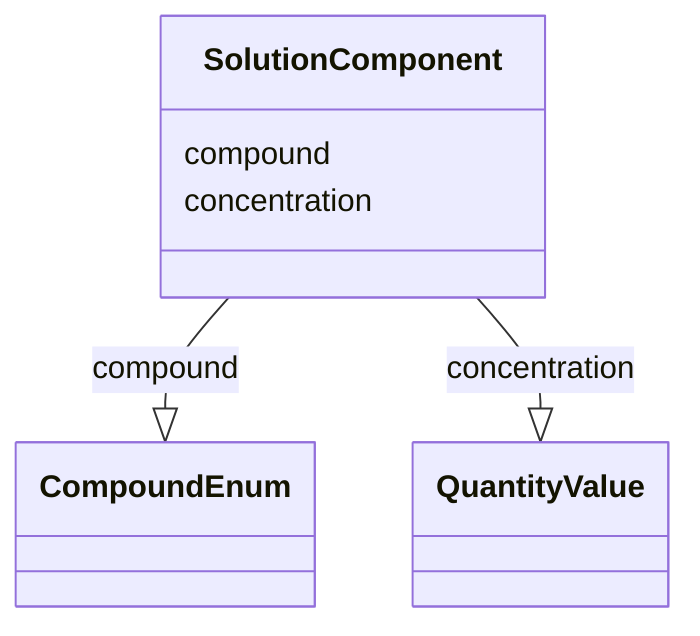

# Class: SolutionComponent


_One constituent of a solution_


URI: [nmdc:SolutionComponent](https://w3id.org/nmdc/SolutionComponent)





<!-- no inheritance hierarchy -->


## Slots

| Name | Cardinality and Range | Description | Inheritance |
| ---  | --- | --- | --- |
| [compound](compound.md) | 1..1 <br/> [CompoundEnum](CompoundEnum.md) | A substance that consists of more than one atom or ion | direct |
| [concentration](concentration.md) | 0..1 <br/> [QuantityValue](QuantityValue.md) | The concentration of a substance used in a process | direct |


## Usages

| used by | used in | type | used |
| ---  | --- | --- | --- |
| [SolutionComponent](SolutionComponent.md) | [compound](compound.md) | domain | [SolutionComponent](SolutionComponent.md) |
| [SolutionComponent](SolutionComponent.md) | [concentration](concentration.md) | domain | [SolutionComponent](SolutionComponent.md) |
| [Solution](Solution.md) | [has_solution_components](has_solution_components.md) | range | [SolutionComponent](SolutionComponent.md) |


## Identifier and Mapping Information


### Schema Source


* from schema: https://w3id.org/nmdc/nmdc


## Mappings

| Mapping Type | Mapped Value |
| ---  | ---  |
| self | nmdc:SolutionComponent |
| native | nmdc:SolutionComponent |


## LinkML Source

<!-- TODO: investigate https://stackoverflow.com/questions/37606292/how-to-create-tabbed-code-blocks-in-mkdocs-or-sphinx -->

### Direct

<details>
```yaml
name: SolutionComponent
description: One constituent of a solution
from_schema: https://w3id.org/nmdc/nmdc
slots:
- compound
- concentration

```
</details>

### Induced

<details>
```yaml
name: SolutionComponent
description: One constituent of a solution
from_schema: https://w3id.org/nmdc/nmdc
attributes:
  compound:
    name: compound
    description: A substance that consists of more than one atom or ion. Includes
      solvents and solutes. Can be combined into solutions.
    from_schema: https://w3id.org/nmdc/nmdc
    rank: 1000
    domain: SolutionComponent
    alias: compound
    owner: SolutionComponent
    domain_of:
    - SolutionComponent
    range: CompoundEnum
    required: true
  concentration:
    name: concentration
    description: The concentration of a substance used in a process
    from_schema: https://w3id.org/nmdc/nmdc
    rank: 1000
    domain: SolutionComponent
    alias: concentration
    owner: SolutionComponent
    domain_of:
    - SolutionComponent
    range: QuantityValue

```
</details>