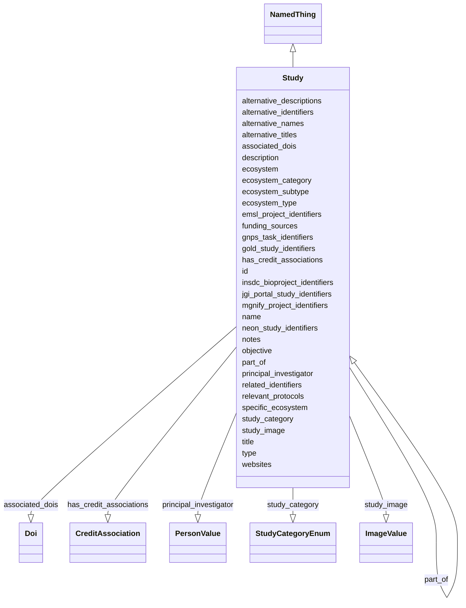

# Class: Study


_A study summarizes the overall goal of a research initiative and outlines the key objective of its underlying projects._


URI: [nmdc:Study](https://w3id.org/nmdc/Study)





## Inheritance
* [NamedThing](NamedThing.md)
    * **Study**


## Slots

| Name | Cardinality and Range | Description | Inheritance |
| ---  | --- | --- | --- |
| [emsl_project_identifiers](emsl_project_identifiers.md) | 0..* <br/> [ExternalIdentifier](ExternalIdentifier.md) | an identifier that links to an EMSL user facility project | direct |
| [neon_study_identifiers](neon_study_identifiers.md) | 0..* <br/> [ExternalIdentifier](ExternalIdentifier.md) |  | direct |
| [jgi_portal_study_identifiers](jgi_portal_study_identifiers.md) | 0..* <br/> [ExternalIdentifier](ExternalIdentifier.md) | Identifiers that link a NMDC study to a website hosting raw and analyzed data... | direct |
| [id](id.md) | 1..1 <br/> [Uriorcurie](Uriorcurie.md) | A unique identifier for a thing | direct |
| [alternative_identifiers](alternative_identifiers.md) | 0..* <br/> [Uriorcurie](Uriorcurie.md) | Unique identifier for a study submitted to additional resources | direct |
| [gnps_task_identifiers](gnps_task_identifiers.md) | 0..* <br/> [ExternalIdentifier](ExternalIdentifier.md) | identifiers that link a NMDC study to a web-based report about metabolomics a... | direct |
| [alternative_descriptions](alternative_descriptions.md) | 0..* <br/> [String](String.md) | A list of alternative descriptions for the entity | direct |
| [alternative_names](alternative_names.md) | 0..* <br/> [String](String.md) | A list of alternative names used to refer to the entity | direct |
| [alternative_titles](alternative_titles.md) | 0..* <br/> [String](String.md) | A list of alternative titles for the entity | direct |
| [description](description.md) | 0..1 <br/> [String](String.md) | A brief, link-free summary of a Study | direct |
| [associated_dois](associated_dois.md) | 0..* <br/> [Doi](Doi.md) | A list of DOIs associated with a resource, such as a list of DOIS associated ... | direct |
| [ecosystem](ecosystem.md) | 0..1 <br/> [String](String.md) | An ecosystem is a combination of a physical environment (abiotic factors) and... | direct |
| [ecosystem_category](ecosystem_category.md) | 0..1 <br/> [String](String.md) | Ecosystem categories represent divisions within the ecosystem based on specif... | direct |
| [ecosystem_subtype](ecosystem_subtype.md) | 0..1 <br/> [String](String.md) | Ecosystem subtypes represent further subdivision of Ecosystem types into more... | direct |
| [ecosystem_type](ecosystem_type.md) | 0..1 <br/> [String](String.md) | Ecosystem types represent things having common characteristics within the Eco... | direct |
| [funding_sources](funding_sources.md) | 0..* <br/> [String](String.md) | A list of organizations, along with the award numbers, that underwrite financ... | direct |
| [gold_study_identifiers](gold_study_identifiers.md) | 0..* <br/> [ExternalIdentifier](ExternalIdentifier.md) | identifiers for corresponding project(s) in GOLD | direct |
| [has_credit_associations](has_credit_associations.md) | 0..* <br/> [CreditAssociation](CreditAssociation.md) | This slot links a study to a credit association | direct |
| [study_category](study_category.md) | 1..1 <br/> [StudyCategoryEnum](StudyCategoryEnum.md) | The type of research initiative | direct |
| [insdc_bioproject_identifiers](insdc_bioproject_identifiers.md) | 0..* <br/> [ExternalIdentifier](ExternalIdentifier.md) | Unique identifier for a bioproject submitted to INSDC that relates to the NMD... | direct |
| [mgnify_project_identifiers](mgnify_project_identifiers.md) | 0..* <br/> [ExternalIdentifier](ExternalIdentifier.md) | identifiers for corresponding project in MGnify | direct |
| [notes](notes.md) | 0..1 <br/> [String](String.md) | from study class | direct |
| [objective](objective.md) | 0..1 <br/> [String](String.md) | The scientific objectives associated with the entity | direct |
| [part_of](part_of.md) | 0..* <br/> [Study](Study.md) | Links a study or consortium to a parent (or umbrella) study or consortium | direct |
| [principal_investigator](principal_investigator.md) | 0..1 <br/> [PersonValue](PersonValue.md) | Principal Investigator who led the study and/or generated the dataset | direct |
| [related_identifiers](related_identifiers.md) | 0..1 <br/> [String](String.md) | Unique identifier for a study submitted to additional resources | direct |
| [relevant_protocols](relevant_protocols.md) | 0..* <br/> [String](String.md) |  | direct |
| [specific_ecosystem](specific_ecosystem.md) | 0..1 <br/> [String](String.md) | Specific ecosystems represent specific features of the environment like aphot... | direct |
| [study_image](study_image.md) | 0..* <br/> [ImageValue](ImageValue.md) | Links a study to one or more images | direct |
| [title](title.md) | 0..1 <br/> [String](String.md) | A name given to the entity that differs from the name/label programmatically ... | direct |
| [type](type.md) | 0..1 <br/> [String](String.md) | An optional string that specifies the type object | direct |
| [websites](websites.md) | 0..* <br/> [String](String.md) | A list of websites that are associated with the entity | direct |
| [name](name.md) | 0..1 <br/> [String](String.md) | A human readable label for an entity | [NamedThing](NamedThing.md) |


## Usages

| used by | used in | type | used |
| ---  | --- | --- | --- |
| [Database](Database.md) | [study_set](study_set.md) | range | [Study](Study.md) |
| [Biosample](Biosample.md) | [part_of](part_of.md) | range | [Study](Study.md) |
| [Study](Study.md) | [emsl_project_identifiers](emsl_project_identifiers.md) | domain | [Study](Study.md) |
| [Study](Study.md) | [neon_study_identifiers](neon_study_identifiers.md) | domain | [Study](Study.md) |
| [Study](Study.md) | [jgi_portal_study_identifiers](jgi_portal_study_identifiers.md) | domain | [Study](Study.md) |
| [Study](Study.md) | [gnps_task_identifiers](gnps_task_identifiers.md) | domain | [Study](Study.md) |
| [Study](Study.md) | [associated_dois](associated_dois.md) | domain | [Study](Study.md) |
| [Study](Study.md) | [gold_study_identifiers](gold_study_identifiers.md) | domain | [Study](Study.md) |
| [Study](Study.md) | [has_credit_associations](has_credit_associations.md) | domain | [Study](Study.md) |
| [Study](Study.md) | [study_category](study_category.md) | domain | [Study](Study.md) |
| [Study](Study.md) | [mgnify_project_identifiers](mgnify_project_identifiers.md) | domain | [Study](Study.md) |
| [Study](Study.md) | [part_of](part_of.md) | range | [Study](Study.md) |
| [Study](Study.md) | [related_identifiers](related_identifiers.md) | domain | [Study](Study.md) |
| [Study](Study.md) | [study_image](study_image.md) | domain | [Study](Study.md) |
| [OmicsProcessing](OmicsProcessing.md) | [part_of](part_of.md) | range | [Study](Study.md) |


## Aliases


* proposal
* research proposal
* research study
* investigation
* project
* umbrella project
* research initiative


## Comments

* The Study class can include both consortia and research studies.

## TODOs

* determine how to get data values for submitted_to_insdc, investigation_type, experimental_factor
* project_name is redundant with name, so excluding it

## Identifier and Mapping Information


### Schema Source


* from schema: https://w3id.org/nmdc/nmdc


## Mappings

| Mapping Type | Mapped Value |
| ---  | ---  |
| self | nmdc:Study |
| native | nmdc:Study |
| exact | OBI:0000066, SIO:000747, NCIT:C41198, ISA:Investigation |
| broad | prov:Activity |


## LinkML Source

<!-- TODO: investigate https://stackoverflow.com/questions/37606292/how-to-create-tabbed-code-blocks-in-mkdocs-or-sphinx -->

### Direct

<details>
```yaml
name: Study
description: A study summarizes the overall goal of a research initiative and outlines
  the key objective of its underlying projects.
alt_descriptions:
  embl.ena:
    source: embl.ena
    description: A study (project) groups together data submitted to the archive and
      controls its release date. A study accession is typically used when citing data
      submitted to ENA
todos:
- determine how to get data values for submitted_to_insdc, investigation_type, experimental_factor
- project_name is redundant with name, so excluding it
notes:
- sample GOLD link https://bioregistry.io/gold:Gs0110115
- sample insdc.srs link https://www.ebi.ac.uk/ena/browser/view/PRJEB45055 ?
- sample mgnify link https://www.ebi.ac.uk/metagenomics/studies/MGYS00005757
- GOLD, insdc.srs and mgnify are reasonable prefixes for alternative study identifiers,
  but no longer for the Study.id
comments:
- The Study class can include both consortia and research studies.
in_subset:
- sample subset
from_schema: https://w3id.org/nmdc/nmdc
aliases:
- proposal
- research proposal
- research study
- investigation
- project
- umbrella project
- research initiative
exact_mappings:
- OBI:0000066
- SIO:000747
- NCIT:C41198
- ISA:Investigation
broad_mappings:
- prov:Activity
is_a: NamedThing
slots:
- emsl_project_identifiers
- neon_study_identifiers
- jgi_portal_study_identifiers
- id
- alternative_identifiers
- gnps_task_identifiers
- alternative_descriptions
- alternative_names
- alternative_titles
- description
- associated_dois
- ecosystem
- ecosystem_category
- ecosystem_subtype
- ecosystem_type
- funding_sources
- gold_study_identifiers
- has_credit_associations
- study_category
- insdc_bioproject_identifiers
- mgnify_project_identifiers
- notes
- objective
- part_of
- principal_investigator
- related_identifiers
- relevant_protocols
- specific_ecosystem
- study_image
- title
- type
- websites
slot_usage:
  id:
    name: id
    domain_of:
    - Biosample
    - Study
    - NamedThing
    - Activity
    required: true
    structured_pattern:
      syntax: '{id_nmdc_prefix}:sty-{id_shoulder}-{id_blade}{id_version}{id_locus}'
      interpolated: true
  name:
    name: name
    annotations:
      display_hint:
        tag: display_hint
        value: Provide a name for the study your samples will belong with.
    domain_of:
    - Protocol
    - QualityControlReport
    - NamedThing
    - PersonValue
    - Activity
  websites:
    name: websites
    annotations:
      display_hint:
        tag: display_hint
        value: Link to the Principal Investigator's research lab webpage or the study
          webpage associated with this collection of samples. Multiple links can be
          provided.
    domain_of:
    - Study
    - PersonValue
  description:
    name: description
    annotations:
      display_hint:
        tag: display_hint
        value: Provide a brief description of your study.
    description: A brief, link-free summary of a Study
    comments:
    - Include links in other Study slots, such as websites or dois.
    domain_of:
    - Study
    - NamedThing
    - ImageValue
  notes:
    name: notes
    annotations:
      display_hint:
        tag: display_hint
        value: Add any additional notes or comments about this study.
    domain_of:
    - Study
  alternative_identifiers:
    name: alternative_identifiers
    description: Unique identifier for a study submitted to additional resources.
      Matches that which has been submitted to NMDC
    domain_of:
    - Biosample
    - Study
    - NamedThing
    - MetaboliteQuantification
  alternative_names:
    name: alternative_names
    annotations:
      display_hint:
        tag: display_hint
        value: Project, study, or sample set names the are also associated with this
          submission or other names / identifiers for this study.
    domain_of:
    - Study
  related_identifiers:
    name: related_identifiers
    description: Unique identifier for a study submitted to additional resources.
      Similar, but not necessarily identical to that which has been submitted to NMDC
    domain_of:
    - Study
  insdc_bioproject_identifiers:
    name: insdc_bioproject_identifiers
    annotations:
      display_hint:
        tag: display_hint
        value: Provide the NCBI BioProject Accession Number associated with the listed
          NCBI BioProject Title.
    description: Unique identifier for a bioproject submitted to INSDC that relates
      to the NMDC submitted study.
    domain_of:
    - Study
    - OmicsProcessing
  part_of:
    name: part_of
    description: Links a study or consortium to a parent (or umbrella) study or consortium.
    comments:
    - Value is the id of the umbrella study or consortium.
    domain_of:
    - FieldResearchSite
    - Biosample
    - Study
    - OmicsProcessing
    - WorkflowExecutionActivity
    range: Study

```
</details>

### Induced

<details>
```yaml
name: Study
description: A study summarizes the overall goal of a research initiative and outlines
  the key objective of its underlying projects.
alt_descriptions:
  embl.ena:
    source: embl.ena
    description: A study (project) groups together data submitted to the archive and
      controls its release date. A study accession is typically used when citing data
      submitted to ENA
todos:
- determine how to get data values for submitted_to_insdc, investigation_type, experimental_factor
- project_name is redundant with name, so excluding it
notes:
- sample GOLD link https://bioregistry.io/gold:Gs0110115
- sample insdc.srs link https://www.ebi.ac.uk/ena/browser/view/PRJEB45055 ?
- sample mgnify link https://www.ebi.ac.uk/metagenomics/studies/MGYS00005757
- GOLD, insdc.srs and mgnify are reasonable prefixes for alternative study identifiers,
  but no longer for the Study.id
comments:
- The Study class can include both consortia and research studies.
in_subset:
- sample subset
from_schema: https://w3id.org/nmdc/nmdc
aliases:
- proposal
- research proposal
- research study
- investigation
- project
- umbrella project
- research initiative
exact_mappings:
- OBI:0000066
- SIO:000747
- NCIT:C41198
- ISA:Investigation
broad_mappings:
- prov:Activity
is_a: NamedThing
slot_usage:
  id:
    name: id
    domain_of:
    - Biosample
    - Study
    - NamedThing
    - Activity
    required: true
    structured_pattern:
      syntax: '{id_nmdc_prefix}:sty-{id_shoulder}-{id_blade}{id_version}{id_locus}'
      interpolated: true
  name:
    name: name
    annotations:
      display_hint:
        tag: display_hint
        value: Provide a name for the study your samples will belong with.
    domain_of:
    - Protocol
    - QualityControlReport
    - NamedThing
    - PersonValue
    - Activity
  websites:
    name: websites
    annotations:
      display_hint:
        tag: display_hint
        value: Link to the Principal Investigator's research lab webpage or the study
          webpage associated with this collection of samples. Multiple links can be
          provided.
    domain_of:
    - Study
    - PersonValue
  description:
    name: description
    annotations:
      display_hint:
        tag: display_hint
        value: Provide a brief description of your study.
    description: A brief, link-free summary of a Study
    comments:
    - Include links in other Study slots, such as websites or dois.
    domain_of:
    - Study
    - NamedThing
    - ImageValue
  notes:
    name: notes
    annotations:
      display_hint:
        tag: display_hint
        value: Add any additional notes or comments about this study.
    domain_of:
    - Study
  alternative_identifiers:
    name: alternative_identifiers
    description: Unique identifier for a study submitted to additional resources.
      Matches that which has been submitted to NMDC
    domain_of:
    - Biosample
    - Study
    - NamedThing
    - MetaboliteQuantification
  alternative_names:
    name: alternative_names
    annotations:
      display_hint:
        tag: display_hint
        value: Project, study, or sample set names the are also associated with this
          submission or other names / identifiers for this study.
    domain_of:
    - Study
  related_identifiers:
    name: related_identifiers
    description: Unique identifier for a study submitted to additional resources.
      Similar, but not necessarily identical to that which has been submitted to NMDC
    domain_of:
    - Study
  insdc_bioproject_identifiers:
    name: insdc_bioproject_identifiers
    annotations:
      display_hint:
        tag: display_hint
        value: Provide the NCBI BioProject Accession Number associated with the listed
          NCBI BioProject Title.
    description: Unique identifier for a bioproject submitted to INSDC that relates
      to the NMDC submitted study.
    domain_of:
    - Study
    - OmicsProcessing
  part_of:
    name: part_of
    description: Links a study or consortium to a parent (or umbrella) study or consortium.
    comments:
    - Value is the id of the umbrella study or consortium.
    domain_of:
    - FieldResearchSite
    - Biosample
    - Study
    - OmicsProcessing
    - WorkflowExecutionActivity
    range: Study
attributes:
  emsl_project_identifiers:
    name: emsl_project_identifiers
    description: an identifier that links to an EMSL user facility project
    title: EMSL Project Identifiers
    todos:
    - elaborate on description
    notes:
    - these identifiers are all currently 5 digits long but that could change in the
      future
    examples:
    - value: emsl.project:60141
    from_schema: https://w3id.org/nmdc/nmdc
    see_also:
    - https://github.com/microbiomedata/nmdc-schema/issues/927#issuecomment-1802136437
    rank: 1000
    is_a: study_identifiers
    mixins:
    - emsl_identifiers
    domain: Study
    multivalued: true
    alias: emsl_project_identifiers
    owner: Study
    domain_of:
    - Study
    range: external_identifier
    pattern: ^emsl\.project:[0-9]{5}$
  neon_study_identifiers:
    name: neon_study_identifiers
    from_schema: https://w3id.org/nmdc/nmdc
    rank: 1000
    is_a: study_identifiers
    mixins:
    - neon_identifiers
    domain: Study
    multivalued: true
    alias: neon_study_identifiers
    owner: Study
    domain_of:
    - Study
    range: external_identifier
    pattern: ^[a-zA-Z0-9][a-zA-Z0-9_\.]+:[a-zA-Z0-9_][a-zA-Z0-9_\-\/\.,]*$
  jgi_portal_study_identifiers:
    name: jgi_portal_study_identifiers
    id_prefixes:
    - jgi.proposal
    description: Identifiers that link a NMDC study to a website hosting raw and analyzed
      data for a JGI proposal.  The suffix of the curie can used to query the GOLD
      API and is interoperable with an award DOI from OSTI and a GOLD study identifier.
    title: JGI Portal Study identifiers
    comments:
    - Could this could be considered a related identifier?
    - Curie suffix is the Site Award Number from an OSTI award page
    - Site Award Number 507130 == award doi doi:10.46936/10.25585/60000017 -- GOLD
      study identifier gold:Gs0154044
    - bioregistry.io/jgi.proposal:507130 ==https://genome.jgi.doe.gov/portal/BioDefcarcycling/BioDefcarcycling.info.html
    examples:
    - value: jgi.proposal:507130
    from_schema: https://w3id.org/nmdc/nmdc
    rank: 1000
    is_a: study_identifiers
    mixins:
    - jgi_portal_identifiers
    domain: Study
    multivalued: true
    alias: jgi_portal_study_identifiers
    owner: Study
    domain_of:
    - Study
    range: external_identifier
    pattern: ^jgi.proposal:\d+$
  id:
    name: id
    description: A unique identifier for a thing. Must be either a CURIE shorthand
      for a URI or a complete URI
    from_schema: https://w3id.org/nmdc/nmdc
    rank: 1000
    identifier: true
    alias: id
    owner: Study
    domain_of:
    - Biosample
    - Study
    - NamedThing
    - Activity
    range: uriorcurie
    required: true
    pattern: ^[a-zA-Z0-9][a-zA-Z0-9_\.]+:[a-zA-Z0-9_][a-zA-Z0-9_\-\/\.,]*$
    structured_pattern:
      syntax: '{id_nmdc_prefix}:sty-{id_shoulder}-{id_blade}{id_version}{id_locus}'
      interpolated: true
  alternative_identifiers:
    name: alternative_identifiers
    description: Unique identifier for a study submitted to additional resources.
      Matches that which has been submitted to NMDC
    from_schema: https://w3id.org/nmdc/nmdc
    rank: 1000
    multivalued: true
    alias: alternative_identifiers
    owner: Study
    domain_of:
    - Biosample
    - Study
    - NamedThing
    - MetaboliteQuantification
    range: uriorcurie
    pattern: ^[a-zA-Z0-9][a-zA-Z0-9_\.]+:[a-zA-Z0-9_][a-zA-Z0-9_\-\/\.,]*$
  gnps_task_identifiers:
    name: gnps_task_identifiers
    description: identifiers that link a NMDC study to a web-based report about metabolomics
      analysis progress and results
    title: GNPS task identifiers
    comments:
    - this could be considered a related identifier, as the metabolomics progress
      and results aren't a study per se
    - this identifier was registered with bioregistry but not identifiers.org
    examples:
    - value: gnps.task:4b848c342a4f4abc871bdf8a09a60807
    from_schema: https://w3id.org/nmdc/nmdc
    see_also:
    - https://microbiomedata.github.io/nmdc-schema/MetabolomicsAnalysisActivity/
    rank: 1000
    is_a: study_identifiers
    mixins:
    - gnps_identifiers
    domain: Study
    multivalued: true
    alias: gnps_task_identifiers
    owner: Study
    domain_of:
    - Study
    range: external_identifier
    pattern: ^gnps\.task:[a-f0-9]+$
  alternative_descriptions:
    name: alternative_descriptions
    description: A list of alternative descriptions for the entity. The distinction
      between description and alternative descriptions is application-specific.
    from_schema: https://w3id.org/nmdc/nmdc
    rank: 1000
    multivalued: true
    alias: alternative_descriptions
    owner: Study
    domain_of:
    - Study
    range: string
  alternative_names:
    name: alternative_names
    annotations:
      display_hint:
        tag: display_hint
        value: Project, study, or sample set names the are also associated with this
          submission or other names / identifiers for this study.
    description: A list of alternative names used to refer to the entity. The distinction
      between name and alternative names is application-specific.
    from_schema: https://w3id.org/nmdc/nmdc
    rank: 1000
    multivalued: true
    alias: alternative_names
    owner: Study
    domain_of:
    - Study
    range: string
  alternative_titles:
    name: alternative_titles
    description: A list of alternative titles for the entity. The distinction between
      title and alternative titles is application-specific.
    from_schema: https://w3id.org/nmdc/nmdc
    exact_mappings:
    - dcterms:alternative
    rank: 1000
    multivalued: true
    alias: alternative_titles
    owner: Study
    domain_of:
    - Study
    range: string
  description:
    name: description
    annotations:
      display_hint:
        tag: display_hint
        value: Provide a brief description of your study.
    description: A brief, link-free summary of a Study
    comments:
    - Include links in other Study slots, such as websites or dois.
    from_schema: https://w3id.org/nmdc/nmdc
    rank: 1000
    slot_uri: dcterms:description
    alias: description
    owner: Study
    domain_of:
    - Study
    - NamedThing
    - ImageValue
    range: string
  associated_dois:
    name: associated_dois
    description: A list of DOIs associated with a resource, such as a list of DOIS
      associated with a Study.
    examples:
    - value: '[{''doi'': ''doi:10.46936/intm.proj.2021.60141/60000423'', ''doi_provider'':
        ''emsl'', ''doi_category'': ''award_doi''}, {''doi'': ''doi:10.1101/2022.12.12.520098'',
        ''doi_category'': ''publication_doi''}, {''doi'': ''doi:10.48321/D1Z60Q'',
        ''doi_category'': ''data_management_plan_doi'', ''doi_provider'': ''gsc''}]'
      description: Provides a list of two DOIs; specifically, an EMSL award DOI and
        a publication DOI.
    in_subset:
    - data_portal_subset
    from_schema: https://w3id.org/nmdc/nmdc
    aliases:
    - Associated DOIs
    - Associated digital object identifiers
    rank: 1000
    domain: Study
    multivalued: true
    alias: associated_dois
    owner: Study
    domain_of:
    - Study
    range: Doi
    inlined: true
    inlined_as_list: true
  ecosystem:
    name: ecosystem
    description: An ecosystem is a combination of a physical environment (abiotic
      factors) and all the organisms (biotic factors) that interact with this environment.
      Ecosystem is in position 1/5 in a GOLD path.
    comments:
    - The abiotic factors play a profound role on the type and composition of organisms
      in a given environment. The GOLD Ecosystem at the top of the five-level classification
      system is aimed at capturing the broader environment from which an organism
      or environmental sample is collected. The three broad groups under Ecosystem
      are Environmental, Host-associated, and Engineered. They represent samples collected
      from a natural environment or from another organism or from engineered environments
      like bioreactors respectively.
    from_schema: https://w3id.org/nmdc/nmdc
    see_also:
    - https://gold.jgi.doe.gov/help
    rank: 1000
    is_a: gold_path_field
    alias: ecosystem
    owner: Study
    domain_of:
    - Biosample
    - Study
    range: string
  ecosystem_category:
    name: ecosystem_category
    description: Ecosystem categories represent divisions within the ecosystem based
      on specific characteristics of the environment from where an organism or sample
      is isolated. Ecosystem category is in position 2/5 in a GOLD path.
    comments:
    - The Environmental ecosystem (for example) is divided into Air, Aquatic and Terrestrial.
      Ecosystem categories for Host-associated samples can be individual hosts or
      phyla and for engineered samples it may be manipulated environments like bioreactors,
      solid waste etc.
    from_schema: https://w3id.org/nmdc/nmdc
    see_also:
    - https://gold.jgi.doe.gov/help
    rank: 1000
    is_a: gold_path_field
    alias: ecosystem_category
    owner: Study
    domain_of:
    - Biosample
    - Study
    range: string
  ecosystem_subtype:
    name: ecosystem_subtype
    description: Ecosystem subtypes represent further subdivision of Ecosystem types
      into more distinct subtypes. Ecosystem subtype is in position 4/5 in a GOLD
      path.
    comments:
    - Ecosystem Type Marine (Environmental -> Aquatic -> Marine) is further divided
      (for example) into Intertidal zone, Coastal, Pelagic, Intertidal zone etc. in
      the Ecosystem subtype category.
    from_schema: https://w3id.org/nmdc/nmdc
    see_also:
    - https://gold.jgi.doe.gov/help
    rank: 1000
    is_a: gold_path_field
    alias: ecosystem_subtype
    owner: Study
    domain_of:
    - Biosample
    - Study
    range: string
  ecosystem_type:
    name: ecosystem_type
    description: Ecosystem types represent things having common characteristics within
      the Ecosystem Category. These common characteristics based grouping is still
      broad but specific to the characteristics of a given environment. Ecosystem
      type is in position 3/5 in a GOLD path.
    comments:
    - The Aquatic ecosystem category (for example) may have ecosystem types like Marine
      or Thermal springs etc. Ecosystem category Air may have Indoor air or Outdoor
      air as different Ecosystem Types. In the case of Host-associated samples, ecosystem
      type can represent Respiratory system, Digestive system, Roots etc.
    from_schema: https://w3id.org/nmdc/nmdc
    see_also:
    - https://gold.jgi.doe.gov/help
    rank: 1000
    is_a: gold_path_field
    alias: ecosystem_type
    owner: Study
    domain_of:
    - Biosample
    - Study
    range: string
  funding_sources:
    name: funding_sources
    description: A list of organizations, along with the award numbers, that underwrite
      financial support for projects of  a particular type. Typically, they process
      applications and award funds to the chosen qualified  applicants.
    comments:
    - Include only the name of the funding organization and the award or contract
      number.
    examples:
    - value: National Sciences Foundation Dimensions of Biodiversity (award no. 1342701)
    - value: U.S. Department of Energy, Office of Science, Office of Biological and
        Environmental Research  (BER) under contract DE-AC05-00OR2275
    from_schema: https://w3id.org/nmdc/nmdc
    close_mappings:
    - NCIT:C39409
    rank: 1000
    multivalued: true
    alias: funding_sources
    owner: Study
    domain_of:
    - Study
    range: string
  gold_study_identifiers:
    name: gold_study_identifiers
    description: identifiers for corresponding project(s) in GOLD
    title: GOLD Study Identifiers
    comments:
    - uses the prefix GS (but possibly in a different case)
    examples:
    - value: https://bioregistry.io/gold:Gs0110115
    from_schema: https://w3id.org/nmdc/nmdc
    see_also:
    - https://gold.jgi.doe.gov/studies
    rank: 1000
    is_a: study_identifiers
    mixins:
    - gold_identifiers
    domain: Study
    multivalued: true
    alias: gold_study_identifiers
    owner: Study
    domain_of:
    - Study
    range: external_identifier
    pattern: ^gold:Gs[0-9]+$
  has_credit_associations:
    name: has_credit_associations
    annotations:
      display_hint:
        tag: display_hint
        value: Other researchers associated with this study.
    description: 'This slot links a study to a credit association.  The credit association
      will be linked to a person value and to a CRediT Contributor Roles term. Overall
      semantics: person should get credit X for their participation in the study'
    from_schema: https://w3id.org/nmdc/nmdc
    rank: 1000
    domain: Study
    slot_uri: prov:qualifiedAssociation
    multivalued: true
    alias: has_credit_associations
    owner: Study
    domain_of:
    - Study
    range: CreditAssociation
    inlined: true
    inlined_as_list: true
  study_category:
    name: study_category
    description: The type of research initiative
    from_schema: https://w3id.org/nmdc/nmdc
    rank: 1000
    domain: Study
    alias: study_category
    owner: Study
    domain_of:
    - Study
    range: StudyCategoryEnum
    required: true
  insdc_bioproject_identifiers:
    name: insdc_bioproject_identifiers
    annotations:
      display_hint:
        tag: display_hint
        value: Provide the NCBI BioProject Accession Number associated with the listed
          NCBI BioProject Title.
    description: Unique identifier for a bioproject submitted to INSDC that relates
      to the NMDC submitted study.
    from_schema: https://w3id.org/nmdc/nmdc
    rank: 1000
    is_a: study_identifiers
    multivalued: true
    alias: insdc_bioproject_identifiers
    owner: Study
    domain_of:
    - Study
    - OmicsProcessing
    range: external_identifier
    pattern: ^bioproject:PRJ[DEN][A-Z][0-9]+$
  mgnify_project_identifiers:
    name: mgnify_project_identifiers
    description: identifiers for corresponding project in MGnify
    examples:
    - value: https://bioregistry.io/mgnify.proj:MGYS00005757
    from_schema: https://w3id.org/nmdc/nmdc
    rank: 1000
    is_a: study_identifiers
    mixins:
    - mgnify_identifiers
    domain: Study
    multivalued: true
    alias: mgnify_project_identifiers
    owner: Study
    domain_of:
    - Study
    range: external_identifier
    pattern: ^mgnify.proj:[A-Z]+[0-9]+$
  notes:
    name: notes
    annotations:
      display_hint:
        tag: display_hint
        value: Add any additional notes or comments about this study.
    description: from study class
    from_schema: https://w3id.org/nmdc/nmdc
    rank: 1000
    alias: notes
    owner: Study
    domain_of:
    - Study
    range: string
  objective:
    name: objective
    description: The scientific objectives associated with the entity. It SHOULD correspond
      to scientific norms for objectives field in a structured abstract.
    from_schema: https://w3id.org/nmdc/nmdc
    mappings:
    - SIO:000337
    rank: 1000
    multivalued: false
    alias: objective
    owner: Study
    domain_of:
    - Study
    range: string
  part_of:
    name: part_of
    description: Links a study or consortium to a parent (or umbrella) study or consortium.
    comments:
    - Value is the id of the umbrella study or consortium.
    from_schema: https://w3id.org/nmdc/nmdc
    rank: 1000
    domain: NamedThing
    slot_uri: dcterms:isPartOf
    multivalued: true
    alias: part_of
    owner: Study
    domain_of:
    - FieldResearchSite
    - Biosample
    - Study
    - OmicsProcessing
    - WorkflowExecutionActivity
    range: Study
  principal_investigator:
    name: principal_investigator
    description: Principal Investigator who led the study and/or generated the dataset.
    from_schema: https://w3id.org/nmdc/nmdc
    aliases:
    - PI
    rank: 1000
    alias: principal_investigator
    owner: Study
    domain_of:
    - Study
    - OmicsProcessing
    range: PersonValue
  related_identifiers:
    name: related_identifiers
    description: Unique identifier for a study submitted to additional resources.
      Similar, but not necessarily identical to that which has been submitted to NMDC
    title: Related Identifiers
    from_schema: https://w3id.org/nmdc/nmdc
    rank: 1000
    domain: Study
    alias: related_identifiers
    owner: Study
    domain_of:
    - Study
    range: string
  relevant_protocols:
    name: relevant_protocols
    from_schema: https://w3id.org/nmdc/nmdc
    rank: 1000
    multivalued: true
    alias: relevant_protocols
    owner: Study
    domain_of:
    - Study
    range: string
  specific_ecosystem:
    name: specific_ecosystem
    description: Specific ecosystems represent specific features of the environment
      like aphotic zone in an ocean or gastric mucosa within a host digestive system.
      Specific ecosystem is in position 5/5 in a GOLD path.
    comments:
    - Specific ecosystems help to define samples based on very specific characteristics
      of an environment under the five-level classification system.
    from_schema: https://w3id.org/nmdc/nmdc
    see_also:
    - https://gold.jgi.doe.gov/help
    rank: 1000
    is_a: gold_path_field
    alias: specific_ecosystem
    owner: Study
    domain_of:
    - Biosample
    - Study
    range: string
  study_image:
    name: study_image
    description: Links a study to one or more images.
    from_schema: https://w3id.org/nmdc/nmdc
    rank: 1000
    domain: Study
    multivalued: true
    alias: study_image
    owner: Study
    domain_of:
    - Study
    range: ImageValue
    inlined: true
  title:
    name: title
    description: A name given to the entity that differs from the name/label programmatically
      assigned to it. For example, when extracting study information for GOLD, the
      GOLD system has assigned a name/label. However, for display purposes, we may
      also wish the capture the title of the proposal that was used to fund the study.
    from_schema: https://w3id.org/nmdc/nmdc
    exact_mappings:
    - dcterms:title
    rank: 1000
    alias: title
    owner: Study
    domain_of:
    - Study
    range: string
  type:
    name: type
    description: An optional string that specifies the type object.  This is used
      to allow for searches for different kinds of objects.
    deprecated: Due to confusion about what values are used for this slot, it is best
      not to use this slot. See https://github.com/microbiomedata/nmdc-schema/issues/248.
      MAM removed designates_type and rdf:type slot uri 2022-11-30
    examples:
    - value: nmdc:Biosample
    - value: nmdc:Study
    from_schema: https://w3id.org/nmdc/nmdc
    see_also:
    - https://github.com/microbiomedata/nmdc-schema/issues/1233
    rank: 1000
    alias: type
    owner: Study
    domain_of:
    - DataObject
    - Biosample
    - Study
    - OmicsProcessing
    - CreditAssociation
    - WorkflowExecutionActivity
    - MetagenomeAssembly
    - MetagenomeAnnotationActivity
    - MetatranscriptomeAnnotationActivity
    - MetatranscriptomeActivity
    - MagsAnalysisActivity
    - ReadQcAnalysisActivity
    - ReadBasedTaxonomyAnalysisActivity
    - MagBin
    - GenomeFeature
    range: string
  websites:
    name: websites
    annotations:
      display_hint:
        tag: display_hint
        value: Link to the Principal Investigator's research lab webpage or the study
          webpage associated with this collection of samples. Multiple links can be
          provided.
    description: A list of websites that are associated with the entity.
    from_schema: https://w3id.org/nmdc/nmdc
    rank: 1000
    multivalued: true
    alias: websites
    owner: Study
    domain_of:
    - Study
    - PersonValue
    range: string
    pattern: ^[Hh][Tt][Tt][Pp][Ss]?:\/\/(?!.*[Dd][Oo][Ii]\.[Oo][Rr][Gg]).*$
  name:
    name: name
    annotations:
      display_hint:
        tag: display_hint
        value: Provide a name for the study your samples will belong with.
    description: A human readable label for an entity
    from_schema: https://w3id.org/nmdc/nmdc
    rank: 1000
    alias: name
    owner: Study
    domain_of:
    - Protocol
    - QualityControlReport
    - NamedThing
    - PersonValue
    - Activity
    range: string

```
</details>