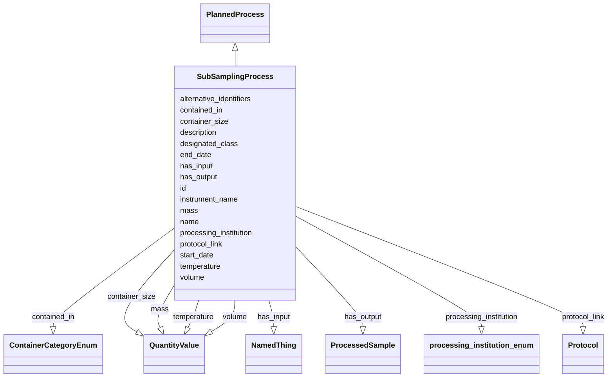

# Class: SubSamplingProcess


_Separating a sample aliquot from the starting material for downstream activity._

__


URI: [nmdc:SubSamplingProcess](https://w3id.org/nmdc/SubSamplingProcess)





## Inheritance
* [NamedThing](NamedThing.md)
    * [PlannedProcess](PlannedProcess.md)
        * **SubSamplingProcess**


## Slots

| Name | Cardinality and Range | Description | Inheritance |
| ---  | --- | --- | --- |
| [container_size](container_size.md) | 0..1 <br/> [QuantityValue](QuantityValue.md) | The volume of the container an analyte is stored in or an activity takes plac... | direct |
| [contained_in](contained_in.md) | 0..1 <br/> [ContainerCategoryEnum](ContainerCategoryEnum.md) | A type of container | direct |
| [temperature](temperature.md) | 0..1 <br/> [QuantityValue](QuantityValue.md) | The value of a temperature measurement or temperature used in a process | direct |
| [volume](volume.md) | 0..1 <br/> [QuantityValue](QuantityValue.md) | The output volume of the SubSampling Process | direct |
| [mass](mass.md) | 0..1 <br/> [QuantityValue](QuantityValue.md) | The output mass of the SubSampling Process | direct |
| [designated_class](designated_class.md) | 0..1 <br/> [Uriorcurie](Uriorcurie.md) |  | [PlannedProcess](PlannedProcess.md) |
| [end_date](end_date.md) | 0..1 <br/> [String](String.md) | The date on which any process or activity was ended | [PlannedProcess](PlannedProcess.md) |
| [has_input](has_input.md) | 0..* <br/> [NamedThing](NamedThing.md) | An input to a process | [PlannedProcess](PlannedProcess.md) |
| [has_output](has_output.md) | 0..* <br/> [ProcessedSample](ProcessedSample.md) | The subsample | [PlannedProcess](PlannedProcess.md) |
| [processing_institution](processing_institution.md) | 0..1 <br/> [ProcessingInstitutionEnum](ProcessingInstitutionEnum.md) | The organization that processed the sample | [PlannedProcess](PlannedProcess.md) |
| [protocol_link](protocol_link.md) | 0..1 <br/> [Protocol](Protocol.md) |  | [PlannedProcess](PlannedProcess.md) |
| [start_date](start_date.md) | 0..1 <br/> [String](String.md) | The date on which any process or activity was started | [PlannedProcess](PlannedProcess.md) |
| [instrument_name](instrument_name.md) | 0..1 <br/> [String](String.md) | The name of the instrument that was used for processing the sample | [PlannedProcess](PlannedProcess.md) |
| [id](id.md) | 1..1 <br/> [Uriorcurie](Uriorcurie.md) | A unique identifier for a thing | [NamedThing](NamedThing.md) |
| [name](name.md) | 0..1 <br/> [String](String.md) | A human readable label for an entity | [NamedThing](NamedThing.md) |
| [description](description.md) | 0..1 <br/> [String](String.md) | a human-readable description of a thing | [NamedThing](NamedThing.md) |
| [alternative_identifiers](alternative_identifiers.md) | 0..* <br/> [Uriorcurie](Uriorcurie.md) | A list of alternative identifiers for the entity | [NamedThing](NamedThing.md) |


## TODOs

* add intermediate class between PlannedProcess and this (MaterialProcessing potentially)
* Montana to visit slot descriptions
* add 'has_output' usage for processed sample - James

## Identifier and Mapping Information


### Schema Source


* from schema: https://w3id.org/nmdc/nmdc


## Mappings

| Mapping Type | Mapped Value |
| ---  | ---  |
| self | nmdc:SubSamplingProcess |
| native | nmdc:SubSamplingProcess |
| related | OBI:0000744 |


## LinkML Source

<!-- TODO: investigate https://stackoverflow.com/questions/37606292/how-to-create-tabbed-code-blocks-in-mkdocs-or-sphinx -->

### Direct

<details>
```yaml
name: SubSamplingProcess
description: 'Separating a sample aliquot from the starting material for downstream
  activity.

  '
todos:
- add intermediate class between PlannedProcess and this (MaterialProcessing potentially)
- Montana to visit slot descriptions
- add 'has_output' usage for processed sample - James
notes:
- A subsample may be (a) a portion of the sample obtained by selection or division;
  (b) an individual unit of the lot taken as part of the sample; (c) the final unit
  of multistage sampling. The term 'subsample' is used either in the sense of a 'sample
  of a sample' or as a synonym for 'unit'. In practice, the meaning is usually apparent
  from the context or is defined.
from_schema: https://w3id.org/nmdc/nmdc
related_mappings:
- OBI:0000744
contributors:
- ORCID:0009-0001-1555-1601
- ORCID:0000-0002-8683-0050
- ORCID:0000-0001-9076-6066
- ORCID:0009-0008-4013-7737
is_a: PlannedProcess
slots:
- container_size
- contained_in
- temperature
- volume
- mass
slot_usage:
  volume:
    name: volume
    description: The output volume of the SubSampling Process.
    domain_of:
    - Solution
    - SubSamplingProcess
    - FiltrationProcess
  mass:
    name: mass
    description: The output mass of the SubSampling Process.
    domain_of:
    - SubSamplingProcess
  has_input:
    name: has_input
    domain_of:
    - BiosampleProcessing
    - OmicsProcessing
    - WorkflowExecutionActivity
    - PlannedProcess
    any_of:
    - range: Biosample
    - range: ProcessedSample
  has_output:
    name: has_output
    description: The subsample.
    domain_of:
    - OmicsProcessing
    - WorkflowExecutionActivity
    - PlannedProcess
    range: ProcessedSample

```
</details>

### Induced

<details>
```yaml
name: SubSamplingProcess
description: 'Separating a sample aliquot from the starting material for downstream
  activity.

  '
todos:
- add intermediate class between PlannedProcess and this (MaterialProcessing potentially)
- Montana to visit slot descriptions
- add 'has_output' usage for processed sample - James
notes:
- A subsample may be (a) a portion of the sample obtained by selection or division;
  (b) an individual unit of the lot taken as part of the sample; (c) the final unit
  of multistage sampling. The term 'subsample' is used either in the sense of a 'sample
  of a sample' or as a synonym for 'unit'. In practice, the meaning is usually apparent
  from the context or is defined.
from_schema: https://w3id.org/nmdc/nmdc
related_mappings:
- OBI:0000744
contributors:
- ORCID:0009-0001-1555-1601
- ORCID:0000-0002-8683-0050
- ORCID:0000-0001-9076-6066
- ORCID:0009-0008-4013-7737
is_a: PlannedProcess
slot_usage:
  volume:
    name: volume
    description: The output volume of the SubSampling Process.
    domain_of:
    - Solution
    - SubSamplingProcess
    - FiltrationProcess
  mass:
    name: mass
    description: The output mass of the SubSampling Process.
    domain_of:
    - SubSamplingProcess
  has_input:
    name: has_input
    domain_of:
    - BiosampleProcessing
    - OmicsProcessing
    - WorkflowExecutionActivity
    - PlannedProcess
    any_of:
    - range: Biosample
    - range: ProcessedSample
  has_output:
    name: has_output
    description: The subsample.
    domain_of:
    - OmicsProcessing
    - WorkflowExecutionActivity
    - PlannedProcess
    range: ProcessedSample
attributes:
  container_size:
    name: container_size
    description: The volume of the container an analyte is stored in or an activity
      takes place in
    from_schema: https://w3id.org/nmdc/nmdc
    contributors:
    - ORCID:0009-0001-1555-1601
    - ORCID:0000-0002-8683-0050
    rank: 1000
    alias: container_size
    owner: SubSamplingProcess
    domain_of:
    - SubSamplingProcess
    - FiltrationProcess
    range: QuantityValue
  contained_in:
    name: contained_in
    description: A type of container. i.e. test tube, falcon tube, etc.
    from_schema: https://w3id.org/nmdc/nmdc
    rank: 1000
    alias: contained_in
    owner: SubSamplingProcess
    domain_of:
    - SubSamplingProcess
    range: ContainerCategoryEnum
  temperature:
    name: temperature
    description: The value of a temperature measurement or temperature used in a process.
    notes:
    - Not to be confused with the MIXS:0000113
    from_schema: https://w3id.org/nmdc/nmdc
    contributors:
    - ORCID:0009-0001-1555-1601
    - ORCID:0000-0002-8683-0050
    rank: 1000
    alias: temperature
    owner: SubSamplingProcess
    domain_of:
    - SubSamplingProcess
    - ChromatographicSeparationProcess
    range: QuantityValue
  volume:
    name: volume
    description: The output volume of the SubSampling Process.
    from_schema: https://w3id.org/nmdc/nmdc
    rank: 1000
    domain: PlannedProcess
    alias: volume
    owner: SubSamplingProcess
    domain_of:
    - Solution
    - SubSamplingProcess
    - FiltrationProcess
    range: QuantityValue
  mass:
    name: mass
    description: The output mass of the SubSampling Process.
    title: mass
    from_schema: https://w3id.org/nmdc/nmdc
    rank: 1000
    alias: mass
    owner: SubSamplingProcess
    domain_of:
    - SubSamplingProcess
    range: QuantityValue
  designated_class:
    name: designated_class
    comments:
    - required on all instances in a polymorphic Database slot like planned_process_set
    from_schema: https://w3id.org/nmdc/nmdc
    rank: 1000
    designates_type: true
    alias: designated_class
    owner: SubSamplingProcess
    domain_of:
    - PlannedProcess
    range: uriorcurie
  end_date:
    name: end_date
    description: The date on which any process or activity was ended
    todos:
    - add date string validation pattern
    comments:
    - We are using string representations of dates until all components of our ecosystem
      can handle ISO 8610 dates
    - The date should be formatted as YYYY-MM-DD
    from_schema: https://w3id.org/nmdc/nmdc
    rank: 1000
    alias: end_date
    owner: SubSamplingProcess
    domain_of:
    - PlannedProcess
    range: string
  has_input:
    name: has_input
    description: An input to a process.
    from_schema: https://w3id.org/nmdc/nmdc
    rank: 1000
    domain: NamedThing
    multivalued: true
    alias: has_input
    owner: SubSamplingProcess
    domain_of:
    - BiosampleProcessing
    - OmicsProcessing
    - WorkflowExecutionActivity
    - PlannedProcess
    range: NamedThing
    any_of:
    - range: Biosample
    - range: ProcessedSample
  has_output:
    name: has_output
    description: The subsample.
    from_schema: https://w3id.org/nmdc/nmdc
    rank: 1000
    domain: NamedThing
    multivalued: true
    alias: has_output
    owner: SubSamplingProcess
    domain_of:
    - OmicsProcessing
    - WorkflowExecutionActivity
    - PlannedProcess
    range: ProcessedSample
  processing_institution:
    name: processing_institution
    description: The organization that processed the sample.
    from_schema: https://w3id.org/nmdc/nmdc
    rank: 1000
    domain: PlannedProcess
    alias: processing_institution
    owner: SubSamplingProcess
    domain_of:
    - OmicsProcessing
    - PlannedProcess
    range: processing_institution_enum
  protocol_link:
    name: protocol_link
    from_schema: https://w3id.org/nmdc/nmdc
    rank: 1000
    domain: PlannedProcess
    alias: protocol_link
    owner: SubSamplingProcess
    domain_of:
    - PlannedProcess
    range: Protocol
  start_date:
    name: start_date
    description: The date on which any process or activity was started
    todos:
    - add date string validation pattern
    comments:
    - We are using string representations of dates until all components of our ecosystem
      can handle ISO 8610 dates
    - The date should be formatted as YYYY-MM-DD
    from_schema: https://w3id.org/nmdc/nmdc
    rank: 1000
    alias: start_date
    owner: SubSamplingProcess
    domain_of:
    - PlannedProcess
    range: string
  instrument_name:
    name: instrument_name
    description: The name of the instrument that was used for processing the sample.
    from_schema: https://w3id.org/nmdc/nmdc
    rank: 1000
    domain: PlannedProcess
    alias: instrument_name
    owner: SubSamplingProcess
    domain_of:
    - OmicsProcessing
    - PlannedProcess
    range: string
  id:
    name: id
    description: A unique identifier for a thing. Must be either a CURIE shorthand
      for a URI or a complete URI
    notes:
    - 'abstracted pattern: prefix:typecode-authshoulder-blade(.version)?(_seqsuffix)?'
    - a minimum length of 3 characters is suggested for typecodes, but 1 or 2 characters
      will be accepted
    - typecodes must correspond 1:1 to a class in the NMDC schema. this will be checked
      via per-class id slot usage assertions
    - minting authority shoulders should probably be enumerated and checked in the
      pattern
    examples:
    - value: nmdc:mgmag-00-x012.1_7_c1
      description: https://github.com/microbiomedata/nmdc-schema/pull/499#discussion_r1018499248
    from_schema: https://w3id.org/nmdc/nmdc
    rank: 1000
    identifier: true
    alias: id
    owner: SubSamplingProcess
    domain_of:
    - Biosample
    - Study
    - NamedThing
    - Activity
    range: uriorcurie
    required: true
    pattern: ^[a-zA-Z0-9][a-zA-Z0-9_\.]+:[a-zA-Z0-9_][a-zA-Z0-9_\-\/\.,]*$
  name:
    name: name
    description: A human readable label for an entity
    from_schema: https://w3id.org/nmdc/nmdc
    rank: 1000
    alias: name
    owner: SubSamplingProcess
    domain_of:
    - Protocol
    - QualityControlReport
    - NamedThing
    - PersonValue
    - Activity
    range: string
  description:
    name: description
    description: a human-readable description of a thing
    from_schema: https://w3id.org/nmdc/nmdc
    rank: 1000
    slot_uri: dcterms:description
    alias: description
    owner: SubSamplingProcess
    domain_of:
    - Study
    - NamedThing
    - ImageValue
    range: string
  alternative_identifiers:
    name: alternative_identifiers
    description: A list of alternative identifiers for the entity.
    from_schema: https://w3id.org/nmdc/nmdc
    rank: 1000
    multivalued: true
    alias: alternative_identifiers
    owner: SubSamplingProcess
    domain_of:
    - Biosample
    - Study
    - NamedThing
    - MetaboliteQuantification
    range: uriorcurie
    pattern: ^[a-zA-Z0-9][a-zA-Z0-9_\.]+:[a-zA-Z0-9_][a-zA-Z0-9_\-\/\.,]*$

```
</details>