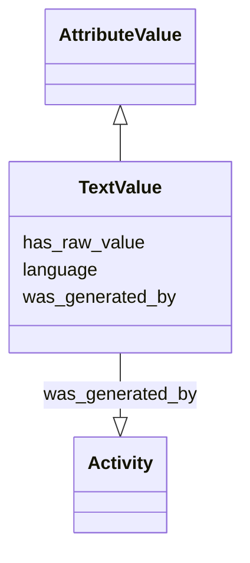

# Class: TextValue


_A basic string value_


URI: [nmdc:TextValue](https://w3id.org/nmdc/TextValue)





## Inheritance
* [AttributeValue](AttributeValue.md)
    * **TextValue**


## Slots

| Name | Cardinality and Range | Description | Inheritance |
| ---  | --- | --- | --- |
| [language](language.md) | 0..1 <br/> [LanguageCode](LanguageCode.md) | Should use ISO 639-1 code e | direct |
| [has_raw_value](has_raw_value.md) | 0..1 <br/> [String](String.md) | The value that was specified for an annotation in raw form, i | [AttributeValue](AttributeValue.md) |
| [was_generated_by](was_generated_by.md) | 0..1 <br/> [Activity](Activity.md) |  | [AttributeValue](AttributeValue.md) |


## Usages

| used by | used in | type | used |
| ---  | --- | --- | --- |
| [FieldResearchSite](FieldResearchSite.md) | [cur_vegetation](cur_vegetation.md) | range | [TextValue](TextValue.md) |
| [FieldResearchSite](FieldResearchSite.md) | [geo_loc_name](geo_loc_name.md) | range | [TextValue](TextValue.md) |
| [FieldResearchSite](FieldResearchSite.md) | [local_class](local_class.md) | range | [TextValue](TextValue.md) |
| [FieldResearchSite](FieldResearchSite.md) | [soil_type](soil_type.md) | range | [TextValue](TextValue.md) |
| [Biosample](Biosample.md) | [host_disease_stat](host_disease_stat.md) | range | [TextValue](TextValue.md) |
| [Biosample](Biosample.md) | [add_recov_method](add_recov_method.md) | range | [TextValue](TextValue.md) |
| [Biosample](Biosample.md) | [additional_info](additional_info.md) | range | [TextValue](TextValue.md) |
| [Biosample](Biosample.md) | [address](address.md) | range | [TextValue](TextValue.md) |
| [Biosample](Biosample.md) | [adj_room](adj_room.md) | range | [TextValue](TextValue.md) |
| [Biosample](Biosample.md) | [aero_struc](aero_struc.md) | range | [TextValue](TextValue.md) |
| [Biosample](Biosample.md) | [agrochem_addition](agrochem_addition.md) | range | [TextValue](TextValue.md) |
| [Biosample](Biosample.md) | [air_PM_concen](air_PM_concen.md) | range | [TextValue](TextValue.md) |
| [Biosample](Biosample.md) | [air_temp_regm](air_temp_regm.md) | range | [TextValue](TextValue.md) |
| [Biosample](Biosample.md) | [al_sat_meth](al_sat_meth.md) | range | [TextValue](TextValue.md) |
| [Biosample](Biosample.md) | [alkalinity_method](alkalinity_method.md) | range | [TextValue](TextValue.md) |
| [Biosample](Biosample.md) | [ances_data](ances_data.md) | range | [TextValue](TextValue.md) |
| [Biosample](Biosample.md) | [antibiotic_regm](antibiotic_regm.md) | range | [TextValue](TextValue.md) |
| [Biosample](Biosample.md) | [aromatics_pc](aromatics_pc.md) | range | [TextValue](TextValue.md) |
| [Biosample](Biosample.md) | [asphaltenes_pc](asphaltenes_pc.md) | range | [TextValue](TextValue.md) |
| [Biosample](Biosample.md) | [atmospheric_data](atmospheric_data.md) | range | [TextValue](TextValue.md) |
| [Biosample](Biosample.md) | [avg_occup](avg_occup.md) | range | [TextValue](TextValue.md) |
| [Biosample](Biosample.md) | [basin](basin.md) | range | [TextValue](TextValue.md) |
| [Biosample](Biosample.md) | [bathroom_count](bathroom_count.md) | range | [TextValue](TextValue.md) |
| [Biosample](Biosample.md) | [bedroom_count](bedroom_count.md) | range | [TextValue](TextValue.md) |
| [Biosample](Biosample.md) | [biocide](biocide.md) | range | [TextValue](TextValue.md) |
| [Biosample](Biosample.md) | [biocide_admin_method](biocide_admin_method.md) | range | [TextValue](TextValue.md) |
| [Biosample](Biosample.md) | [biomass](biomass.md) | range | [TextValue](TextValue.md) |
| [Biosample](Biosample.md) | [biotic_regm](biotic_regm.md) | range | [TextValue](TextValue.md) |
| [Biosample](Biosample.md) | [built_struc_set](built_struc_set.md) | range | [TextValue](TextValue.md) |
| [Biosample](Biosample.md) | [built_struc_type](built_struc_type.md) | range | [TextValue](TextValue.md) |
| [Biosample](Biosample.md) | [ceil_struc](ceil_struc.md) | range | [TextValue](TextValue.md) |
| [Biosample](Biosample.md) | [ceil_water_mold](ceil_water_mold.md) | range | [TextValue](TextValue.md) |
| [Biosample](Biosample.md) | [chem_mutagen](chem_mutagen.md) | range | [TextValue](TextValue.md) |
| [Biosample](Biosample.md) | [chem_treatment](chem_treatment.md) | range | [TextValue](TextValue.md) |
| [Biosample](Biosample.md) | [chimera_check](chimera_check.md) | range | [TextValue](TextValue.md) |
| [Biosample](Biosample.md) | [climate_environment](climate_environment.md) | range | [TextValue](TextValue.md) |
| [Biosample](Biosample.md) | [cool_syst_id](cool_syst_id.md) | range | [TextValue](TextValue.md) |
| [Biosample](Biosample.md) | [crop_rotation](crop_rotation.md) | range | [TextValue](TextValue.md) |
| [Biosample](Biosample.md) | [cult_root_med](cult_root_med.md) | range | [TextValue](TextValue.md) |
| [Biosample](Biosample.md) | [cur_vegetation](cur_vegetation.md) | range | [TextValue](TextValue.md) |
| [Biosample](Biosample.md) | [cur_vegetation_meth](cur_vegetation_meth.md) | range | [TextValue](TextValue.md) |
| [Biosample](Biosample.md) | [diether_lipids](diether_lipids.md) | range | [TextValue](TextValue.md) |
| [Biosample](Biosample.md) | [door_water_mold](door_water_mold.md) | range | [TextValue](TextValue.md) |
| [Biosample](Biosample.md) | [elevator](elevator.md) | range | [TextValue](TextValue.md) |
| [Biosample](Biosample.md) | [emulsions](emulsions.md) | range | [TextValue](TextValue.md) |
| [Biosample](Biosample.md) | [env_package](env_package.md) | range | [TextValue](TextValue.md) |
| [Biosample](Biosample.md) | [escalator](escalator.md) | range | [TextValue](TextValue.md) |
| [Biosample](Biosample.md) | [ext_door](ext_door.md) | range | [TextValue](TextValue.md) |
| [Biosample](Biosample.md) | [fertilizer_regm](fertilizer_regm.md) | range | [TextValue](TextValue.md) |
| [Biosample](Biosample.md) | [field](field.md) | range | [TextValue](TextValue.md) |
| [Biosample](Biosample.md) | [fireplace_type](fireplace_type.md) | range | [TextValue](TextValue.md) |
| [Biosample](Biosample.md) | [floor_count](floor_count.md) | range | [TextValue](TextValue.md) |
| [Biosample](Biosample.md) | [fungicide_regm](fungicide_regm.md) | range | [TextValue](TextValue.md) |
| [Biosample](Biosample.md) | [gaseous_environment](gaseous_environment.md) | range | [TextValue](TextValue.md) |
| [Biosample](Biosample.md) | [gaseous_substances](gaseous_substances.md) | range | [TextValue](TextValue.md) |
| [Biosample](Biosample.md) | [genetic_mod](genetic_mod.md) | range | [TextValue](TextValue.md) |
| [Biosample](Biosample.md) | [geo_loc_name](geo_loc_name.md) | range | [TextValue](TextValue.md) |
| [Biosample](Biosample.md) | [gravidity](gravidity.md) | range | [TextValue](TextValue.md) |
| [Biosample](Biosample.md) | [gravity](gravity.md) | range | [TextValue](TextValue.md) |
| [Biosample](Biosample.md) | [growth_hormone_regm](growth_hormone_regm.md) | range | [TextValue](TextValue.md) |
| [Biosample](Biosample.md) | [hall_count](hall_count.md) | range | [TextValue](TextValue.md) |
| [Biosample](Biosample.md) | [hcr_pressure](hcr_pressure.md) | range | [TextValue](TextValue.md) |
| [Biosample](Biosample.md) | [hcr_temp](hcr_temp.md) | range | [TextValue](TextValue.md) |
| [Biosample](Biosample.md) | [heat_system_id](heat_system_id.md) | range | [TextValue](TextValue.md) |
| [Biosample](Biosample.md) | [heavy_metals](heavy_metals.md) | range | [TextValue](TextValue.md) |
| [Biosample](Biosample.md) | [heavy_metals_meth](heavy_metals_meth.md) | range | [TextValue](TextValue.md) |
| [Biosample](Biosample.md) | [herbicide_regm](herbicide_regm.md) | range | [TextValue](TextValue.md) |
| [Biosample](Biosample.md) | [horizon_meth](horizon_meth.md) | range | [TextValue](TextValue.md) |
| [Biosample](Biosample.md) | [host_body_habitat](host_body_habitat.md) | range | [TextValue](TextValue.md) |
| [Biosample](Biosample.md) | [host_color](host_color.md) | range | [TextValue](TextValue.md) |
| [Biosample](Biosample.md) | [host_common_name](host_common_name.md) | range | [TextValue](TextValue.md) |
| [Biosample](Biosample.md) | [host_diet](host_diet.md) | range | [TextValue](TextValue.md) |
| [Biosample](Biosample.md) | [host_genotype](host_genotype.md) | range | [TextValue](TextValue.md) |
| [Biosample](Biosample.md) | [host_growth_cond](host_growth_cond.md) | range | [TextValue](TextValue.md) |
| [Biosample](Biosample.md) | [host_last_meal](host_last_meal.md) | range | [TextValue](TextValue.md) |
| [Biosample](Biosample.md) | [host_life_stage](host_life_stage.md) | range | [TextValue](TextValue.md) |
| [Biosample](Biosample.md) | [host_shape](host_shape.md) | range | [TextValue](TextValue.md) |
| [Biosample](Biosample.md) | [host_subject_id](host_subject_id.md) | range | [TextValue](TextValue.md) |
| [Biosample](Biosample.md) | [host_substrate](host_substrate.md) | range | [TextValue](TextValue.md) |
| [Biosample](Biosample.md) | [humidity_regm](humidity_regm.md) | range | [TextValue](TextValue.md) |
| [Biosample](Biosample.md) | [inorg_particles](inorg_particles.md) | range | [TextValue](TextValue.md) |
| [Biosample](Biosample.md) | [light_regm](light_regm.md) | range | [TextValue](TextValue.md) |
| [Biosample](Biosample.md) | [link_addit_analys](link_addit_analys.md) | range | [TextValue](TextValue.md) |
| [Biosample](Biosample.md) | [link_class_info](link_class_info.md) | range | [TextValue](TextValue.md) |
| [Biosample](Biosample.md) | [link_climate_info](link_climate_info.md) | range | [TextValue](TextValue.md) |
| [Biosample](Biosample.md) | [local_class](local_class.md) | range | [TextValue](TextValue.md) |
| [Biosample](Biosample.md) | [local_class_meth](local_class_meth.md) | range | [TextValue](TextValue.md) |
| [Biosample](Biosample.md) | [mechanical_damage](mechanical_damage.md) | range | [TextValue](TextValue.md) |
| [Biosample](Biosample.md) | [mineral_nutr_regm](mineral_nutr_regm.md) | range | [TextValue](TextValue.md) |
| [Biosample](Biosample.md) | [misc_param](misc_param.md) | range | [TextValue](TextValue.md) |
| [Biosample](Biosample.md) | [n_alkanes](n_alkanes.md) | range | [TextValue](TextValue.md) |
| [Biosample](Biosample.md) | [nucl_acid_amp](nucl_acid_amp.md) | range | [TextValue](TextValue.md) |
| [Biosample](Biosample.md) | [nucl_acid_ext](nucl_acid_ext.md) | range | [TextValue](TextValue.md) |
| [Biosample](Biosample.md) | [org_particles](org_particles.md) | range | [TextValue](TextValue.md) |
| [Biosample](Biosample.md) | [particle_class](particle_class.md) | range | [TextValue](TextValue.md) |
| [Biosample](Biosample.md) | [pcr_cond](pcr_cond.md) | range | [TextValue](TextValue.md) |
| [Biosample](Biosample.md) | [pcr_primers](pcr_primers.md) | range | [TextValue](TextValue.md) |
| [Biosample](Biosample.md) | [permeability](permeability.md) | range | [TextValue](TextValue.md) |
| [Biosample](Biosample.md) | [perturbation](perturbation.md) | range | [TextValue](TextValue.md) |
| [Biosample](Biosample.md) | [pesticide_regm](pesticide_regm.md) | range | [TextValue](TextValue.md) |
| [Biosample](Biosample.md) | [ph_meth](ph_meth.md) | range | [TextValue](TextValue.md) |
| [Biosample](Biosample.md) | [ph_regm](ph_regm.md) | range | [TextValue](TextValue.md) |
| [Biosample](Biosample.md) | [phaeopigments](phaeopigments.md) | range | [TextValue](TextValue.md) |
| [Biosample](Biosample.md) | [phosplipid_fatt_acid](phosplipid_fatt_acid.md) | range | [TextValue](TextValue.md) |
| [Biosample](Biosample.md) | [plant_product](plant_product.md) | range | [TextValue](TextValue.md) |
| [Biosample](Biosample.md) | [pollutants](pollutants.md) | range | [TextValue](TextValue.md) |
| [Biosample](Biosample.md) | [pool_dna_extracts](pool_dna_extracts.md) | range | [TextValue](TextValue.md) |
| [Biosample](Biosample.md) | [porosity](porosity.md) | range | [TextValue](TextValue.md) |
| [Biosample](Biosample.md) | [pre_treatment](pre_treatment.md) | range | [TextValue](TextValue.md) |
| [Biosample](Biosample.md) | [previous_land_use](previous_land_use.md) | range | [TextValue](TextValue.md) |
| [Biosample](Biosample.md) | [primary_treatment](primary_treatment.md) | range | [TextValue](TextValue.md) |
| [Biosample](Biosample.md) | [radiation_regm](radiation_regm.md) | range | [TextValue](TextValue.md) |
| [Biosample](Biosample.md) | [rainfall_regm](rainfall_regm.md) | range | [TextValue](TextValue.md) |
| [Biosample](Biosample.md) | [reactor_type](reactor_type.md) | range | [TextValue](TextValue.md) |
| [Biosample](Biosample.md) | [reservoir](reservoir.md) | range | [TextValue](TextValue.md) |
| [Biosample](Biosample.md) | [resins_pc](resins_pc.md) | range | [TextValue](TextValue.md) |
| [Biosample](Biosample.md) | [room_count](room_count.md) | range | [TextValue](TextValue.md) |
| [Biosample](Biosample.md) | [room_dim](room_dim.md) | range | [TextValue](TextValue.md) |
| [Biosample](Biosample.md) | [room_door_dist](room_door_dist.md) | range | [TextValue](TextValue.md) |
| [Biosample](Biosample.md) | [room_door_share](room_door_share.md) | range | [TextValue](TextValue.md) |
| [Biosample](Biosample.md) | [room_hallway](room_hallway.md) | range | [TextValue](TextValue.md) |
| [Biosample](Biosample.md) | [room_net_area](room_net_area.md) | range | [TextValue](TextValue.md) |
| [Biosample](Biosample.md) | [room_vol](room_vol.md) | range | [TextValue](TextValue.md) |
| [Biosample](Biosample.md) | [room_wall_share](room_wall_share.md) | range | [TextValue](TextValue.md) |
| [Biosample](Biosample.md) | [root_cond](root_cond.md) | range | [TextValue](TextValue.md) |
| [Biosample](Biosample.md) | [root_med_carbon](root_med_carbon.md) | range | [TextValue](TextValue.md) |
| [Biosample](Biosample.md) | [root_med_macronutr](root_med_macronutr.md) | range | [TextValue](TextValue.md) |
| [Biosample](Biosample.md) | [root_med_micronutr](root_med_micronutr.md) | range | [TextValue](TextValue.md) |
| [Biosample](Biosample.md) | [root_med_regl](root_med_regl.md) | range | [TextValue](TextValue.md) |
| [Biosample](Biosample.md) | [root_med_solid](root_med_solid.md) | range | [TextValue](TextValue.md) |
| [Biosample](Biosample.md) | [root_med_suppl](root_med_suppl.md) | range | [TextValue](TextValue.md) |
| [Biosample](Biosample.md) | [salinity_meth](salinity_meth.md) | range | [TextValue](TextValue.md) |
| [Biosample](Biosample.md) | [salt_regm](salt_regm.md) | range | [TextValue](TextValue.md) |
| [Biosample](Biosample.md) | [samp_loc_corr_rate](samp_loc_corr_rate.md) | range | [TextValue](TextValue.md) |
| [Biosample](Biosample.md) | [samp_preserv](samp_preserv.md) | range | [TextValue](TextValue.md) |
| [Biosample](Biosample.md) | [samp_room_id](samp_room_id.md) | range | [TextValue](TextValue.md) |
| [Biosample](Biosample.md) | [samp_sort_meth](samp_sort_meth.md) | range | [TextValue](TextValue.md) |
| [Biosample](Biosample.md) | [samp_store_dur](samp_store_dur.md) | range | [TextValue](TextValue.md) |
| [Biosample](Biosample.md) | [samp_store_loc](samp_store_loc.md) | range | [TextValue](TextValue.md) |
| [Biosample](Biosample.md) | [samp_time_out](samp_time_out.md) | range | [TextValue](TextValue.md) |
| [Biosample](Biosample.md) | [samp_transport_cond](samp_transport_cond.md) | range | [TextValue](TextValue.md) |
| [Biosample](Biosample.md) | [samp_tvdss](samp_tvdss.md) | range | [TextValue](TextValue.md) |
| [Biosample](Biosample.md) | [samp_type](samp_type.md) | range | [TextValue](TextValue.md) |
| [Biosample](Biosample.md) | [samp_well_name](samp_well_name.md) | range | [TextValue](TextValue.md) |
| [Biosample](Biosample.md) | [saturates_pc](saturates_pc.md) | range | [TextValue](TextValue.md) |
| [Biosample](Biosample.md) | [season](season.md) | range | [TextValue](TextValue.md) |
| [Biosample](Biosample.md) | [season_environment](season_environment.md) | range | [TextValue](TextValue.md) |
| [Biosample](Biosample.md) | [secondary_treatment](secondary_treatment.md) | range | [TextValue](TextValue.md) |
| [Biosample](Biosample.md) | [seq_meth](seq_meth.md) | range | [TextValue](TextValue.md) |
| [Biosample](Biosample.md) | [seq_quality_check](seq_quality_check.md) | range | [TextValue](TextValue.md) |
| [Biosample](Biosample.md) | [sewage_type](sewage_type.md) | range | [TextValue](TextValue.md) |
| [Biosample](Biosample.md) | [shading_device_loc](shading_device_loc.md) | range | [TextValue](TextValue.md) |
| [Biosample](Biosample.md) | [shading_device_mat](shading_device_mat.md) | range | [TextValue](TextValue.md) |
| [Biosample](Biosample.md) | [sieving](sieving.md) | range | [TextValue](TextValue.md) |
| [Biosample](Biosample.md) | [size_frac](size_frac.md) | range | [TextValue](TextValue.md) |
| [Biosample](Biosample.md) | [soil_type](soil_type.md) | range | [TextValue](TextValue.md) |
| [Biosample](Biosample.md) | [soil_type_meth](soil_type_meth.md) | range | [TextValue](TextValue.md) |
| [Biosample](Biosample.md) | [soluble_inorg_mat](soluble_inorg_mat.md) | range | [TextValue](TextValue.md) |
| [Biosample](Biosample.md) | [soluble_org_mat](soluble_org_mat.md) | range | [TextValue](TextValue.md) |
| [Biosample](Biosample.md) | [source_mat_id](source_mat_id.md) | range | [TextValue](TextValue.md) |
| [Biosample](Biosample.md) | [space_typ_state](space_typ_state.md) | range | [TextValue](TextValue.md) |
| [Biosample](Biosample.md) | [standing_water_regm](standing_water_regm.md) | range | [TextValue](TextValue.md) |
| [Biosample](Biosample.md) | [store_cond](store_cond.md) | range | [TextValue](TextValue.md) |
| [Biosample](Biosample.md) | [suspend_solids](suspend_solids.md) | range | [TextValue](TextValue.md) |
| [Biosample](Biosample.md) | [target_gene](target_gene.md) | range | [TextValue](TextValue.md) |
| [Biosample](Biosample.md) | [target_subfragment](target_subfragment.md) | range | [TextValue](TextValue.md) |
| [Biosample](Biosample.md) | [tertiary_treatment](tertiary_treatment.md) | range | [TextValue](TextValue.md) |
| [Biosample](Biosample.md) | [tiss_cult_growth_med](tiss_cult_growth_med.md) | range | [TextValue](TextValue.md) |
| [Biosample](Biosample.md) | [tot_org_c_meth](tot_org_c_meth.md) | range | [TextValue](TextValue.md) |
| [Biosample](Biosample.md) | [ventilation_type](ventilation_type.md) | range | [TextValue](TextValue.md) |
| [Biosample](Biosample.md) | [viscosity](viscosity.md) | range | [TextValue](TextValue.md) |
| [Biosample](Biosample.md) | [volatile_org_comp](volatile_org_comp.md) | range | [TextValue](TextValue.md) |
| [Biosample](Biosample.md) | [wall_water_mold](wall_water_mold.md) | range | [TextValue](TextValue.md) |
| [Biosample](Biosample.md) | [wastewater_type](wastewater_type.md) | range | [TextValue](TextValue.md) |
| [Biosample](Biosample.md) | [water_temp_regm](water_temp_regm.md) | range | [TextValue](TextValue.md) |
| [Biosample](Biosample.md) | [watering_regm](watering_regm.md) | range | [TextValue](TextValue.md) |
| [Biosample](Biosample.md) | [win](win.md) | range | [TextValue](TextValue.md) |
| [Biosample](Biosample.md) | [wind_direction](wind_direction.md) | range | [TextValue](TextValue.md) |
| [Biosample](Biosample.md) | [window_open_freq](window_open_freq.md) | range | [TextValue](TextValue.md) |
| [Biosample](Biosample.md) | [window_size](window_size.md) | range | [TextValue](TextValue.md) |
| [Biosample](Biosample.md) | [window_status](window_status.md) | range | [TextValue](TextValue.md) |
| [Biosample](Biosample.md) | [window_water_mold](window_water_mold.md) | range | [TextValue](TextValue.md) |
| [OmicsProcessing](OmicsProcessing.md) | [chimera_check](chimera_check.md) | range | [TextValue](TextValue.md) |
| [OmicsProcessing](OmicsProcessing.md) | [nucl_acid_amp](nucl_acid_amp.md) | range | [TextValue](TextValue.md) |
| [OmicsProcessing](OmicsProcessing.md) | [nucl_acid_ext](nucl_acid_ext.md) | range | [TextValue](TextValue.md) |
| [OmicsProcessing](OmicsProcessing.md) | [pcr_cond](pcr_cond.md) | range | [TextValue](TextValue.md) |
| [OmicsProcessing](OmicsProcessing.md) | [pcr_primers](pcr_primers.md) | range | [TextValue](TextValue.md) |
| [OmicsProcessing](OmicsProcessing.md) | [seq_meth](seq_meth.md) | range | [TextValue](TextValue.md) |
| [OmicsProcessing](OmicsProcessing.md) | [seq_quality_check](seq_quality_check.md) | range | [TextValue](TextValue.md) |
| [OmicsProcessing](OmicsProcessing.md) | [target_gene](target_gene.md) | range | [TextValue](TextValue.md) |
| [OmicsProcessing](OmicsProcessing.md) | [target_subfragment](target_subfragment.md) | range | [TextValue](TextValue.md) |


## Identifier and Mapping Information


### Schema Source


* from schema: https://w3id.org/nmdc/nmdc


## Mappings

| Mapping Type | Mapped Value |
| ---  | ---  |
| self | nmdc:TextValue |
| native | nmdc:TextValue |


## LinkML Source

<!-- TODO: investigate https://stackoverflow.com/questions/37606292/how-to-create-tabbed-code-blocks-in-mkdocs-or-sphinx -->

### Direct

<details>
```yaml
name: TextValue
description: A basic string value
from_schema: https://w3id.org/nmdc/nmdc
is_a: AttributeValue
slots:
- language

```
</details>

### Induced

<details>
```yaml
name: TextValue
description: A basic string value
from_schema: https://w3id.org/nmdc/nmdc
is_a: AttributeValue
attributes:
  language:
    name: language
    description: Should use ISO 639-1 code e.g. "en", "fr"
    from_schema: https://w3id.org/nmdc/nmdc
    rank: 1000
    alias: language
    owner: TextValue
    domain_of:
    - TextValue
    range: language code
  has_raw_value:
    name: has_raw_value
    description: The value that was specified for an annotation in raw form, i.e.
      a string. E.g. "2 cm" or "2-4 cm"
    from_schema: https://w3id.org/nmdc/nmdc
    rank: 1000
    domain: AttributeValue
    multivalued: false
    alias: has_raw_value
    owner: TextValue
    domain_of:
    - AttributeValue
    - QuantityValue
    range: string
  was_generated_by:
    name: was_generated_by
    from_schema: https://w3id.org/nmdc/nmdc
    mappings:
    - prov:wasGeneratedBy
    rank: 1000
    alias: was_generated_by
    owner: TextValue
    domain_of:
    - DataObject
    - AttributeValue
    - FunctionalAnnotation
    range: Activity

```
</details>