# Class: WorkflowExecutionActivity


_Represents an instance of an execution of a particular workflow_


URI: [nmdc:WorkflowExecutionActivity](https://w3id.org/nmdc/WorkflowExecutionActivity)

```mermaid
 classDiagram
    class WorkflowExecutionActivity
      Activity <|-- WorkflowExecutionActivity
      

      WorkflowExecutionActivity <|-- MetagenomeAssembly
      WorkflowExecutionActivity <|-- MetatranscriptomeAssembly
      WorkflowExecutionActivity <|-- MetagenomeAnnotationActivity
      WorkflowExecutionActivity <|-- MetatranscriptomeAnnotationActivity
      WorkflowExecutionActivity <|-- MetatranscriptomeActivity
      WorkflowExecutionActivity <|-- MagsAnalysisActivity
      WorkflowExecutionActivity <|-- MetagenomeSequencingActivity
      WorkflowExecutionActivity <|-- ReadQcAnalysisActivity
      WorkflowExecutionActivity <|-- ReadBasedTaxonomyAnalysisActivity
      WorkflowExecutionActivity <|-- MetabolomicsAnalysisActivity
      WorkflowExecutionActivity <|-- MetaproteomicsAnalysisActivity
      WorkflowExecutionActivity <|-- NomAnalysisActivity
      
      
      WorkflowExecutionActivity : ended_at_time
        
      WorkflowExecutionActivity : execution_resource
        
      WorkflowExecutionActivity : git_url
        
      WorkflowExecutionActivity : has_input
        
          WorkflowExecutionActivity --|> NamedThing : has_input
        
      WorkflowExecutionActivity : has_output
        
          WorkflowExecutionActivity --|> NamedThing : has_output
        
      WorkflowExecutionActivity : id
        
      WorkflowExecutionActivity : name
        
      WorkflowExecutionActivity : part_of
        
          WorkflowExecutionActivity --|> NamedThing : part_of
        
      WorkflowExecutionActivity : started_at_time
        
      WorkflowExecutionActivity : type
        
      WorkflowExecutionActivity : used
        
      WorkflowExecutionActivity : version
        
      WorkflowExecutionActivity : was_informed_by
        
          WorkflowExecutionActivity --|> Activity : was_informed_by
        
      
```





## Inheritance
* [Activity](Activity.md)
    * **WorkflowExecutionActivity**
        * [MetagenomeAssembly](MetagenomeAssembly.md)
        * [MetatranscriptomeAssembly](MetatranscriptomeAssembly.md)
        * [MetagenomeAnnotationActivity](MetagenomeAnnotationActivity.md)
        * [MetatranscriptomeAnnotationActivity](MetatranscriptomeAnnotationActivity.md)
        * [MetatranscriptomeActivity](MetatranscriptomeActivity.md)
        * [MagsAnalysisActivity](MagsAnalysisActivity.md)
        * [MetagenomeSequencingActivity](MetagenomeSequencingActivity.md)
        * [ReadQcAnalysisActivity](ReadQcAnalysisActivity.md)
        * [ReadBasedTaxonomyAnalysisActivity](ReadBasedTaxonomyAnalysisActivity.md)
        * [MetabolomicsAnalysisActivity](MetabolomicsAnalysisActivity.md)
        * [MetaproteomicsAnalysisActivity](MetaproteomicsAnalysisActivity.md)
        * [NomAnalysisActivity](NomAnalysisActivity.md)


## Slots

| Name | Cardinality and Range | Description | Inheritance |
| ---  | --- | --- | --- |
| [execution_resource](execution_resource.md) | 1..1 <br/> [String](String.md) |  | direct |
| [git_url](git_url.md) | 1..1 <br/> [String](String.md) |  | direct |
| [has_input](has_input.md) | 1..* <br/> [NamedThing](NamedThing.md) | An input to a process | direct |
| [has_output](has_output.md) | 1..* <br/> [NamedThing](NamedThing.md) | An output biosample to a processing step | direct |
| [part_of](part_of.md) | 0..* <br/> [NamedThing](NamedThing.md) | Links a resource to another resource that either logically or physically incl... | direct |
| [type](type.md) | 1..1 <br/> [String](String.md) | An optional string that specifies the type object | direct |
| [version](version.md) | 0..1 <br/> [String](String.md) |  | direct |
| [id](id.md) | 1..1 <br/> [Uriorcurie](Uriorcurie.md) | A unique identifier for a thing | [Activity](Activity.md) |
| [name](name.md) | 0..1 <br/> [String](String.md) | A human readable label for an entity | [Activity](Activity.md) |
| [started_at_time](started_at_time.md) | 1..1 <br/> [String](String.md) |  | [Activity](Activity.md) |
| [ended_at_time](ended_at_time.md) | 1..1 <br/> [String](String.md) |  | [Activity](Activity.md) |
| [was_informed_by](was_informed_by.md) | 0..1 <br/> [Activity](Activity.md) |  | [Activity](Activity.md) |
| [used](used.md) | 0..1 <br/> [String](String.md) |  | [Activity](Activity.md) |


## Usages

| used by | used in | type | used |
| ---  | --- | --- | --- |
| [FunctionalAnnotationAggMember](FunctionalAnnotationAggMember.md) | [metagenome_annotation_id](metagenome_annotation_id.md) | range | [WorkflowExecutionActivity](WorkflowExecutionActivity.md) |
| [Database](Database.md) | [activity_set](activity_set.md) | range | [WorkflowExecutionActivity](WorkflowExecutionActivity.md) |


## Aliases


* analysis


## Comments

* Each instance of this (and all other) activities is  a distinct run with start and stop times, potentially with different inputs and outputs

## Identifier and Mapping Information


### Schema Source


* from schema: https://w3id.org/nmdc/nmdc


## Mappings

| Mapping Type | Mapped Value |
| ---  | ---  |
| self | nmdc:WorkflowExecutionActivity |
| native | nmdc:WorkflowExecutionActivity |


## LinkML Source

<!-- TODO: investigate https://stackoverflow.com/questions/37606292/how-to-create-tabbed-code-blocks-in-mkdocs-or-sphinx -->

### Direct

<details>
```yaml
name: WorkflowExecutionActivity
description: Represents an instance of an execution of a particular workflow
alt_descriptions:
  embl.ena:
    source: embl.ena
    description: An analysis contains secondary analysis results derived from sequence
      reads (e.g. a genome assembly)
comments:
- Each instance of this (and all other) activities is  a distinct run with start and
  stop times, potentially with different inputs and outputs
in_subset:
- workflow subset
from_schema: https://w3id.org/nmdc/nmdc
aliases:
- analysis
is_a: Activity
slots:
- execution_resource
- git_url
- has_input
- has_output
- part_of
- type
- version
slot_usage:
  started_at_time:
    name: started_at_time
    domain_of:
    - Activity
    required: true
  ended_at_time:
    name: ended_at_time
    domain_of:
    - Activity
    required: true
  git_url:
    name: git_url
    domain_of:
    - WorkflowExecutionActivity
    required: true
  has_input:
    name: has_input
    domain_of:
    - BiosampleProcessing
    - OmicsProcessing
    - WorkflowExecutionActivity
    - PlannedProcess
    required: true
  has_output:
    name: has_output
    domain_of:
    - OmicsProcessing
    - WorkflowExecutionActivity
    - PlannedProcess
    required: true
  execution_resource:
    name: execution_resource
    domain_of:
    - WorkflowExecutionActivity
    required: true
  type:
    name: type
    domain_of:
    - DataObject
    - Biosample
    - Study
    - OmicsProcessing
    - CreditAssociation
    - WorkflowExecutionActivity
    - MetagenomeAssembly
    - MetagenomeAnnotationActivity
    - MetatranscriptomeAnnotationActivity
    - MetatranscriptomeActivity
    - MagsAnalysisActivity
    - ReadQcAnalysisActivity
    - ReadBasedTaxonomyAnalysisActivity
    - MagBin
    - GenomeFeature
    required: true
  id:
    name: id
    domain_of:
    - Biosample
    - Study
    - NamedThing
    - Activity
    required: true
    structured_pattern:
      syntax: '{id_nmdc_prefix}:wf-{id_shoulder}-{id_blade}{id_version}{id_locus}'
      interpolated: true

```
</details>

### Induced

<details>
```yaml
name: WorkflowExecutionActivity
description: Represents an instance of an execution of a particular workflow
alt_descriptions:
  embl.ena:
    source: embl.ena
    description: An analysis contains secondary analysis results derived from sequence
      reads (e.g. a genome assembly)
comments:
- Each instance of this (and all other) activities is  a distinct run with start and
  stop times, potentially with different inputs and outputs
in_subset:
- workflow subset
from_schema: https://w3id.org/nmdc/nmdc
aliases:
- analysis
is_a: Activity
slot_usage:
  started_at_time:
    name: started_at_time
    domain_of:
    - Activity
    required: true
  ended_at_time:
    name: ended_at_time
    domain_of:
    - Activity
    required: true
  git_url:
    name: git_url
    domain_of:
    - WorkflowExecutionActivity
    required: true
  has_input:
    name: has_input
    domain_of:
    - BiosampleProcessing
    - OmicsProcessing
    - WorkflowExecutionActivity
    - PlannedProcess
    required: true
  has_output:
    name: has_output
    domain_of:
    - OmicsProcessing
    - WorkflowExecutionActivity
    - PlannedProcess
    required: true
  execution_resource:
    name: execution_resource
    domain_of:
    - WorkflowExecutionActivity
    required: true
  type:
    name: type
    domain_of:
    - DataObject
    - Biosample
    - Study
    - OmicsProcessing
    - CreditAssociation
    - WorkflowExecutionActivity
    - MetagenomeAssembly
    - MetagenomeAnnotationActivity
    - MetatranscriptomeAnnotationActivity
    - MetatranscriptomeActivity
    - MagsAnalysisActivity
    - ReadQcAnalysisActivity
    - ReadBasedTaxonomyAnalysisActivity
    - MagBin
    - GenomeFeature
    required: true
  id:
    name: id
    domain_of:
    - Biosample
    - Study
    - NamedThing
    - Activity
    required: true
    structured_pattern:
      syntax: '{id_nmdc_prefix}:wf-{id_shoulder}-{id_blade}{id_version}{id_locus}'
      interpolated: true
attributes:
  execution_resource:
    name: execution_resource
    from_schema: https://w3id.org/nmdc/nmdc
    rank: 1000
    domain: Activity
    alias: execution_resource
    owner: WorkflowExecutionActivity
    domain_of:
    - WorkflowExecutionActivity
    range: string
    required: true
  git_url:
    name: git_url
    from_schema: https://w3id.org/nmdc/nmdc
    rank: 1000
    alias: git_url
    owner: WorkflowExecutionActivity
    domain_of:
    - WorkflowExecutionActivity
    range: string
    required: true
  has_input:
    name: has_input
    description: An input to a process.
    from_schema: https://w3id.org/nmdc/nmdc
    rank: 1000
    domain: NamedThing
    multivalued: true
    alias: has_input
    owner: WorkflowExecutionActivity
    domain_of:
    - BiosampleProcessing
    - OmicsProcessing
    - WorkflowExecutionActivity
    - PlannedProcess
    range: NamedThing
    required: true
  has_output:
    name: has_output
    description: An output biosample to a processing step
    from_schema: https://w3id.org/nmdc/nmdc
    rank: 1000
    domain: NamedThing
    multivalued: true
    alias: has_output
    owner: WorkflowExecutionActivity
    domain_of:
    - OmicsProcessing
    - WorkflowExecutionActivity
    - PlannedProcess
    range: NamedThing
    required: true
  part_of:
    name: part_of
    description: Links a resource to another resource that either logically or physically
      includes it.
    from_schema: https://w3id.org/nmdc/nmdc
    aliases:
    - is part of
    rank: 1000
    domain: NamedThing
    slot_uri: dcterms:isPartOf
    multivalued: true
    alias: part_of
    owner: WorkflowExecutionActivity
    domain_of:
    - FieldResearchSite
    - Biosample
    - Study
    - OmicsProcessing
    - WorkflowExecutionActivity
    range: NamedThing
  type:
    name: type
    description: An optional string that specifies the type object.  This is used
      to allow for searches for different kinds of objects.
    deprecated: Due to confusion about what values are used for this slot, it is best
      not to use this slot. See https://github.com/microbiomedata/nmdc-schema/issues/248.
      MAM removed designates_type and rdf:type slot uri 2022-11-30
    from_schema: https://w3id.org/nmdc/nmdc
    rank: 1000
    alias: type
    owner: WorkflowExecutionActivity
    domain_of:
    - DataObject
    - Biosample
    - Study
    - OmicsProcessing
    - CreditAssociation
    - WorkflowExecutionActivity
    - MetagenomeAssembly
    - MetagenomeAnnotationActivity
    - MetatranscriptomeAnnotationActivity
    - MetatranscriptomeActivity
    - MagsAnalysisActivity
    - ReadQcAnalysisActivity
    - ReadBasedTaxonomyAnalysisActivity
    - MagBin
    - GenomeFeature
    range: string
    required: true
  version:
    name: version
    from_schema: https://w3id.org/nmdc/nmdc
    rank: 1000
    domain: Activity
    alias: version
    owner: WorkflowExecutionActivity
    domain_of:
    - WorkflowExecutionActivity
    - ReadQcAnalysisActivity
    range: string
  id:
    name: id
    description: A unique identifier for a thing. Must be either a CURIE shorthand
      for a URI or a complete URI
    from_schema: https://w3id.org/nmdc/nmdc
    rank: 1000
    identifier: true
    alias: id
    owner: WorkflowExecutionActivity
    domain_of:
    - Biosample
    - Study
    - NamedThing
    - Activity
    range: uriorcurie
    required: true
    pattern: ^[a-zA-Z0-9][a-zA-Z0-9_\.]+:[a-zA-Z0-9_][a-zA-Z0-9_\-\/\.,]*$
    structured_pattern:
      syntax: '{id_nmdc_prefix}:wf-{id_shoulder}-{id_blade}{id_version}{id_locus}'
      interpolated: true
  name:
    name: name
    description: A human readable label for an entity
    from_schema: https://w3id.org/nmdc/nmdc
    rank: 1000
    alias: name
    owner: WorkflowExecutionActivity
    domain_of:
    - Protocol
    - QualityControlReport
    - NamedThing
    - PersonValue
    - Activity
    range: string
  started_at_time:
    name: started_at_time
    from_schema: https://w3id.org/nmdc/nmdc
    rank: 1000
    domain: Activity
    alias: started_at_time
    owner: WorkflowExecutionActivity
    domain_of:
    - Activity
    range: string
    required: true
    pattern: ^([\+-]?\d{4}(?!\d{2}\b))((-?)((0[1-9]|1[0-2])(\3([12]\d|0[1-9]|3[01]))?|W([0-4]\d|5[0-2])(-?[1-7])?|(00[1-9]|0[1-9]\d|[12]\d{2}|3([0-5]\d|6[1-6])))([T\s]((([01]\d|2[0-3])((:?)[0-5]\d)?|24\:?00)([\.,]\d+(?!:))?)?(\17[0-5]\d([\.,]\d+)?)?([zZ]|([\+-])([01]\d|2[0-3]):?([0-5]\d)?)?)?)?$
  ended_at_time:
    name: ended_at_time
    from_schema: https://w3id.org/nmdc/nmdc
    rank: 1000
    domain: Activity
    alias: ended_at_time
    owner: WorkflowExecutionActivity
    domain_of:
    - Activity
    range: string
    required: true
    pattern: ^([\+-]?\d{4}(?!\d{2}\b))((-?)((0[1-9]|1[0-2])(\3([12]\d|0[1-9]|3[01]))?|W([0-4]\d|5[0-2])(-?[1-7])?|(00[1-9]|0[1-9]\d|[12]\d{2}|3([0-5]\d|6[1-6])))([T\s]((([01]\d|2[0-3])((:?)[0-5]\d)?|24\:?00)([\.,]\d+(?!:))?)?(\17[0-5]\d([\.,]\d+)?)?([zZ]|([\+-])([01]\d|2[0-3]):?([0-5]\d)?)?)?)?$
  was_informed_by:
    name: was_informed_by
    from_schema: https://w3id.org/nmdc/nmdc
    mappings:
    - prov:wasInformedBy
    rank: 1000
    domain: Activity
    alias: was_informed_by
    owner: WorkflowExecutionActivity
    domain_of:
    - Activity
    range: Activity
  used:
    name: used
    from_schema: https://w3id.org/nmdc/nmdc
    mappings:
    - prov:used
    rank: 1000
    domain: Activity
    alias: used
    owner: WorkflowExecutionActivity
    domain_of:
    - Activity
    range: string

```
</details>