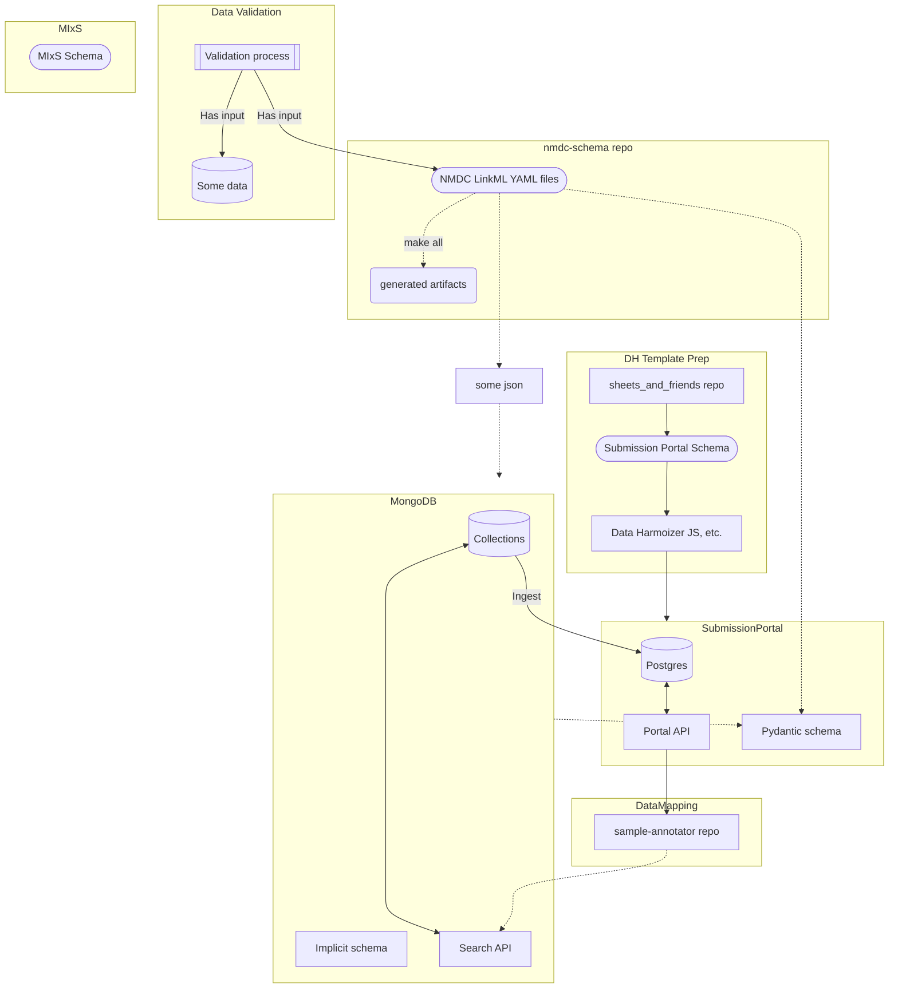

## Ecosystem Diagram

_Requires a Mermaid-aware viewer_

```mermaid
flowchart TD
    subgraph nmdc-schema repo
    ly([NMDC LinkML YAML files])
    lg(generated artifacts)
    ly-.make all.->lg
    end
    subgraph Data Validation
    click ly href "https://github.com/microbiomedata/nmdc-schema/tree/main/src/schema" _top
    d[(Some data)]
    v[[Validation process]]
    v--Has input-->d
    v--Has input-->ly
    end
    subgraph MIxS
    m([MIxS Schema])
    end
    subgraph SubmissionPortal
    sppg[(Postgres)]
    spa[Portal API]
    sppg<-->spa
    click spa href "https://data.dev.microbiomedata.org/docs" _top
    ps[Pydantic schema]
    end
    subgraph MongoDB
    mc[(Collections)]
    ms[Implicit schema]
    ma[Search API]
    mc<-->ma
    click ma href "https://api.dev.microbiomedata.org/docs" _top
    end
    mc --Ingest--> sppg
    subgraph DH Template Prep
    saf[sheets_and_friends repo]
    sps([Submission Portal Schema])
    dhjs[Data Harmoizer JS, etc.]
    saf-->sps-->dhjs
    end
    dhjs-->SubmissionPortal
    subgraph DataMapping
    sa[sample-annotator repo]
    end
    spa-->sa-..->ma
    ly-..->ps
    sj[some json]
    ly-..->sj-..->MongoDB-..->ps
```
