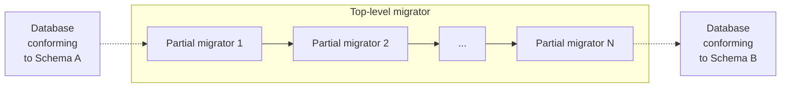

# Partials

Partials are migrators that do not fully migrate a database between two named schema versions. Instead, they only
_partially_ migrate a database between two named schema versions. You can think of them as "partial migrators."

In practice, they are imported into "top-level" migrators that use them in combination, to migrate a database between
two named schema versions.

An example of a "top level" migrator is `migrator_from_10_2_0_to_11_0_0.py`. That migrator imports the partial migrator,
`migrator_from_10_2_0_to_11_0_0_part_01.py` (among others).