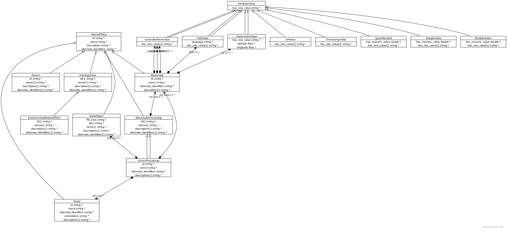

% NMDC Schema
% Chris Mungall
% 2020-05-13

# NMDC Schema

## How is it defined

 - Schema source is in a yaml file
    - schema.yaml
 - The modeling language is [LinkML](https://linkml.io/linkml/)
 - Can compile down to other forms
     - JSON-Schema
     - python dataclasses
     - Markdown/HTML + UML diagrams
     - OWL
     - ShEx
     - GraphQL

# Basic Structure

## Core Classes

 - biosample
 - study
 - omics_processing
 ...

## Fields

(called *slots* in the yaml)

:::::::::::::: {.columns}
::: {.column width="30%"}
 - generic fields
    - id
    - name
    - description
:::
::: {.column width="30%"}
 - fields describing environmental properties
    - lat_lon
    - depth
    - env_broad_scale
    - alt
:::
::: {.column width="30%"}
 - fields describing study info
    - project_name
 - other fields
    - e.g workflow/input/output fields
:::
::::::::::::::

# JSON as primary exchange format

:::::::::::::: {.columns}
::: {.column width="40%"}

Example

```json
{id: "GOLD:Gb0205609",
 name: "sample from ...",
 description: ".....",
 alternate_identifiers: ["ENA:....", ...],
 depth: {
    raw value: "32.1 cm",
    unit: "cm",
    numeric value: 32.1
 },
 lat_lon: {
    raw_value: "12.3 45.6",
    latitute: 12.3,
    longitude: 45.6,
 },

```

:::
::: {.column width="60%"}

 - can optionally be adorned as json-ld
    - provides RDF representation
 - simple key-value model
 - field names are typically objects, not atomic
    - can represent both:
        - atomic (string, unnormalized); eg. `2cm`
        - structured, normalized eg `{unit: cm, value: 2}`

:::
::::::::::::::


# UML Depiction
{ width=80% }

# Example Class Definition

```yaml
  biosample:
    is_a: named thing
    aliases: ['sample', 'material sample']
    description: >-
      A material sample. It may be environmental (encompassing many organisms) or isolate or tissue.  
      An environmental sample containing genetic material from multiple individuals is commonly referred to as a biosample.  
    slots:
      - lat_lon
      - depth
      - env_broad_scale
      - env_local_scale
      - env_medium
```

# Inheritance

```yaml
  biosample:
    is_a: named thing
    ...
```

inherits from:

```yaml
  named thing:
    description: "a databased entity or concept/class"
    slots:
      - id
      - name
      - description
      - alternate identifiers
```

# Example

:::::::::::::: {.columns}
::: {.column width="40%"}

data:

```json
{id: "GOLD:Gb0205609",
 name: "sample from ...",
 description: ".....",
 alternate_identifiers: ["ENA:....", ...],
 lat_lon: {
    ...
 },
 depth: {
    ...
 }

```

:::
::: {.column width="60%"}

schema:

```yaml
  biosample:
    is_a: named thing
    slots:
      - lat_lon
      - depth
      - ...
    
  named thing:
    description: "a databased entity or concept/class"
    slots:
      - id
      - name
      - description
      - alternate identifiers
```

:::
::::::::::::::


# MIxS Fields

:::::::::::::: {.columns}
::: {.column width="40%"}

### nmdc.yaml

```yaml
id: nmdc
imports: mixs

  ...
  
  biosample:
    is_a: named thing
    ...
    slots:
      - lat_lon
      - depth
      - env_broad_scale
      - env_local_scale
      - env_medium
```


:::
::: {.column width="60%"}

### mixs.yaml

```yaml
id: mixs

  lat_lon:
    aliases:
      - geographic location (latitude and longitude)
    description: >-
       The geographical origin of the sample as defined by latitude and longitude. The values should be reported in decimal degrees and in WGS84 system
    multivalued: false
    is_a: attribute
    range: geolocation value
    mappings:
      - MIxS:lat_lon
      
  depth:
    aliases:
      - geographic location (depth)
    description: >-
       Please refer to the definitions of depth in the environmental packages
    multivalued: false
    is_a: attribute
    range: text value
    mappings:
      - MIxS:depth
```

:::
::::::::::::::

# Example - lat_lon

:::::::::::::: {.columns}
::: {.column width="40%"}

data:

```json
{id: "GOLD:Gb0205609",
 name: "sample from ...",
 description: ".....",
 alternate_identifiers: ["ENA:....", ...],
 lat_lon: {
    raw_value: "12.3 45.6",
    latitute: 12.3,
    longitude: 45.6,
 },
 ...

```

:::
::: {.column width="60%"}

schema:

```yaml
slots:

  lat_lon:
    aliases:
      - geographic location (latitude and longitude)
    description: >-
       The geographical origin of the sample as defined by latitude and longitude. The values should be reported in decimal degrees and in WGS84 system
    multivalued: false
    is_a: attribute
    range: geolocation value
    mappings:
      - MIxS:lat_lon

classes:

  attribute value:
    description: >-
      The value for any value of a attribute for a sample. This object can hold both the un-normalized atomic
      value and the structured value
    slots:
      - has raw value

  geolocation value:
    is_a: attribute value
    description: >-
      A normalized value for a location on the earth's surface
    slots:
      - latitude
      - longitude
    slot_usage:
      has raw value:
        description: >-
          The raw value for a  geolocation should follow {lat} {long}
        # to_str: {latitude} {longitude}

```

:::
::::::::::::::

# Mandatory Fields

TBD: separate biosample classes for each package?
