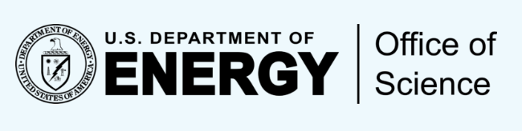

# 

The NMDC Schema is a foundational framework designed to standardize metadata for the National Microbiome Data 
Collaborative (NMDC), ensuring that microbiome data from diverse fields can be seamlessly integrated and 
utilized. By establishing a structured approach to metadata, the NMDC Schema enables researchers to organize, 
share, and interpret complex datasets with consistency and clarity. The NMDC Schema is critical substrate used to facilitate 
interoperability and collaboration, as it provide a common language for data exchange across systems and disciplines. 
In the context of the NMDC, this schema supports the integration of microbiome data from medicine, agriculture, 
bioenergy, and environmental science into a cohesive platform. 

#### Funding:
The work conducted by the National Microbiome Data Collaborative (https://ror.org/05cwx3318) is supported by the 
Genomic Science Program in the U.S. Department of Energy, Office of Science, Office of Biological and Environmental 
Research (BER) under contract numbers DE-AC02-05CH11231 (LBNL), 89233218CNA000001 (LANL), and DE-AC05-76RL01830 (PNNL).

This project was made using the [LinkML framework](https://github.com/biolink/biolinkml)

#### Citing NMDC:

###### Schema

Microbiome Data Coordination Center. (n.d.). NMDC schema. GitHub. from https://github.com/microbiomedata/nmdc-schema

###### Data Portal
Eloe-Fadrosh EA, Ahmed F, Anubhav, Babinski M, Baumes J, Borkum M, Bramer L, Canon S, Christianson DS, Corilo YE, 
Davenport KW, Davis B, Drake M, Duncan WD, Flynn MC, Hays D, Hu B, Huntemann M, Kelliher J, Lebedeva S, Li PE, 
Lipton M, Lo CC, Martin S, Millard D, Miller K, Miller MA, Piehowski P, Jackson EP, Purvine S, Reddy TBK, 
Richardson R, Rudolph M, Sarrafan S, Shakya M, Smith M, Stratton K, Sundaramurthi JC, Vangay P, Winston D, 
Wood-Charlson EM, Xu Y, Chain PSG, McCue LA, Mans D, Mungall CJ, Mouncey NJ, Fagnan K. 
The National Microbiome Data Collaborative Data Portal: an integrated multi-omics microbiome data resource.
Nucleic Acids Res. 2022 January 7;60(D1):D828–D836. doi: 10.1093/nar/gkab990.
 
###### Ambassador Program
Kelliher, JM, Rudolph M, Vangay P, Abbas A, Borton MA, Davenport ER, Davenport KW, Erazo NG, Herman C, Karstens L, 
Kocurek D, Lutz HL, Myers KS, Ockert I,  Rodriguez FE, Santistevan C, Saunders JK, Smith ML, Vogtmann E, Windsor A, 
Wood-Charlson EM, Woodley L, Eloe-Fadrosh EA. Cohort-based learning for microbiome research community standards. 
Nature Microbiology. 2023 April 17. doi:10.1038/s41564-023-01361-7.
 
###### Program Launch
E. M. Wood-Charlson, Anubhav, D. Auberry, H. Blanco, M. I. Borkum, Y. E. Corilo, K. W. Davenport, S. Deshpande, R.
Devarakonda, M. Drake, W. D. Duncan, M. C. Flynn, D. Hays, B. Hu, M. Huntemann, P.-E. Li, M. Lipton, C.-C. Lo, 
D. Millard, K. Miller, P. D. Piehowski, S. Purvine, T. B. K. Reddy, M. Shakya, J. C. Sundaramurthi, P. Vangay, 
Y. Wei, B. E. Wilson, S. Canon, P. S. G. Chain, K. Fagnan, S. Martin, L. A. McCue, C. J. Mungall, N. J. Mouncey, 
M. E. Maxon, E. A. Eloe-Fadrosh, The National Microbiome Data Collaborative: enabling microbiome science. 
Nature Reviews Microbiology 18, 313-314 (2020). doi: 10.1038/s41579-020-0377-0
