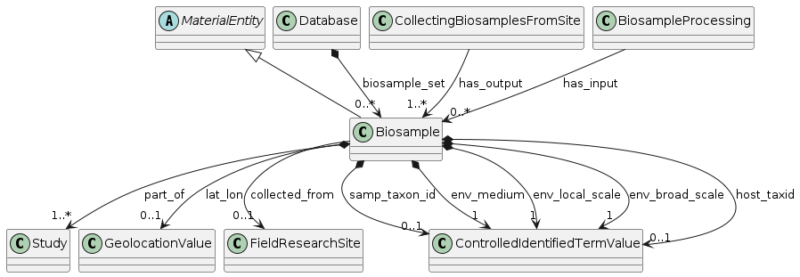

# Samples in the `nmdc-schema`

*The NMDC Schema developers reuse elements and patterns from common data models (CMDR? LinkML core?) and also hope to influence them*

## NMDC Background
- The [National Microbiome Data Collaborative](https://microbiomedata.org/) is (in this author's words) a environmentally-focused, schema-driven multi-omics project. 
- We are primarily funded by the United States Department of Energy 
- We provide tools for 
    - entering metadata about samples, following the constraints of a LinkML schema
        - interactively with [DataHarmonizer](https://github.com/cidgoh/DataHarmonizer)
        - in bulk through ETL scripts and APIs
        - in a future NMDC Field Notes mobile app
    - running standardized workflows for metagenomics, metatranscriptomics, metaproteomics, meta-metabolimics,etc.  
    - visually exploring the metadata in the NMDC Data Portal and downloading the outputs form the computational workflows
    - accessing the metadata through [APIs like this](https://api.microbiomedata.org/docs)

## Gory details about the multiple current NMDC schemas

- **The reference/production** [nmdc-schema](https://github.com/microbiomedata/nmdc-schema)
    - [documenation site](https://microbiomedata.github.io/nmdc-schema/)
- A flattened [submission-schema](https://github.com/microbiomedata/submission-schema) for DataHarmonizer, automatically derived from the `nmdc-schema`
    - we aspire to provide support for DataHarmonizer directly in the `nmdc-schema` eventually
- A bleeding-edge [berkeley-schema-fy24](https://github.com/microbiomedata/berkeley-schema-fy24) fork that came out of a hackathon
    - To be merged into the production schema ASAP
- An automatically generated [derriviative](https://github.com/microbiomedata/nmdc-schema/blob/main/nmdc_schema/nmdc_schema_accepting_legacy_ids.yaml) of the `nmdc-schema`, with weakened regular expression patterns that are tolerant of legacy identifiers.
    - Will be retried when we fininish converting the identifiers to follow the current standard.

## Noteworthy Class Hierarchies in `nmdc-schema`
- Not all of the [classes](https://microbiomedata.github.io/nmdc-schema/#classes) are rooted
- Structured [AttributeValue](https://microbiomedata.github.io/berkeley-schema-fy24/AttributeValue/)s, like a quantities paired with units (and even the string from which those were parsed)
- [OntologyClass](https://microbiomedata.github.io/berkeley-schema-fy24/OntologyClass/)es, for binding together a user-proved annotation and the corresponding ontology class identifier and label
- [PlannedProcess](https://microbiomedata.github.io/berkeley-schema-fy24/PlannedProcess/)es
- [**Biosample**](https://microbiomedata.github.io/berkeley-schema-fy24/Biosample/)s!
    - a subclass of [MaterialEntity](https://microbiomedata.github.io/berkeley-schema-fy24/MaterialEntity/)
    - [ProcessedSample](https://microbiomedata.github.io/berkeley-schema-fy24/ProcessedSample/) is a sibling of Biosample, and isn't differentiated very well yet, although we specify that most [sample-modifying processes](https://microbiomedata.github.io/berkeley-schema-fy24/MaterialProcessing/) only have `ProcessedSample`s as their output

## [Biosample](https://microbiomedata.github.io/berkeley-schema-fy24/Biosample/)s

> Biological source material which can be characterized by an experiment

- NMDC classes, including `Biosample`, have slots for associating entities in other systems
    - Hopefully NMDC Biosamples are well-aligned with [NCBI Biosamples](https://www.ncbi.nlm.nih.gov/biosample/). 
    - NMDC Biosamples are mapped to [GOLD biosamples](https://gold.jgi.doe.gov/biosamples), but those are generally scoped to solutions of nucleic acid molecules.
        - NMDC *could* align this better by instantiating the [Extraction](https://microbiomedata.github.io/nmdc-schema/Extraction/) process and some `ProcessedSample`s
- Like NCBI, we extensively use the MIxS standard to annotate Biosamples. 
    - [env_broad_scale](https://genomicsstandardsconsortium.github.io/mixs/0000012/) is one of three MIxS slots that characterize the environment that samples come from. For example, 
- Biosample data instances can be retrieved from an API endpoint
    - for example: [https://api.microbiomedata.org/nmdcschema/biosample_set?max_page_size=20](https://api.microbiomedata.org/nmdcschema/biosample_set?max_page_size=20)
    - [additional retrieval options](https://api.microbiomedata.org/docs#/metadata/list_from_collection_nmdcschema__collection_name__get) can be viewed at the API's Swagger page
    - a [list of other instance collections with statistics](https://api.microbiomedata.org/nmdcschema/collection_stats) is available from another endpoint
- Currently, NMDC Biosamples were **mostly** obtained from natural or built environments, as opposed to host-associated environments like a mouse's cecum.
- Here's an API request for [and un-aggregated report of Biosample environmental contexts](https://api.microbiomedata.org/nmdcschema/biosample_set?max_page_size=20&projection=ecosystem%2Cecosystem_category%2Cecosystem_type%2Cecosystem_subtype%2Cspecific_ecosystem), according to the GOLD Ecosystem Classification (which is an alternative to the MIxS context).

## NMDC `Biosample` is Huge

- Biosample provides lots of slots that drive a faceted search on the NMDC Data Portal
- In the current `nmdc-schema` `main` branch, `Biosample` uses 592 non-abstract/non-grouping slots
- 2 are from Dublin Core
- 101 are minted in nmdc-schema
    - some of those could be added to MIxS
    - roughly 40 are intended to capture data that we pass on to partners (like EMSL and JGI) and don't store in the NMDC database
- 489 come from MIxS
- The submission-schema generates [DataHarmonizer interfaces for several different kinds of samples](https://microbiomedata.github.io/submission-schema/DhInterface/), categorized by the environment they come from
    - these roughly correspond to [MIxS extensions](https://genomicsstandardsconsortium.github.io/mixs/#extensions)
    - we don't have Biosample sub-classes, so Biosample is bound to all slots, even those that may only apply to one kind of sample
    - nmdc-schema makes heavy use of categorizing slots, but Biosample does have one single slot/axis that reflects the subtypemixs

| Metatype | range                    | MIxS | NMDC | NMDC for partners | *Total* |
|---------------------|-------------------------------|-----:|-----:|------------------:|-------------:|
| class_definition    | ControlledIdentifiedTermValue | 5    |      |                   | 5            |
|                     | ControlledTermValue           | 9    |      |                   | 9            |
|                     | FieldResearchSite             |      | 1    |                   | 1            |
|                     | GeolocationValue              | 1    |      |                   | 1            |
|                     | QuantityValue                 | 167  | 9    |                   | 176          |
|                     | Study                         |      | 1    |                   | 1            |
|                     | TextValue                     | 177  | 1    |                   | 178          |
|                     | TimestampValue                | 5    |      |                   | 5            |
| enum_definition     | | 97   | 2    | 7                 | 106          |
| type_definition     | boolean                       |      | 1    |                   | 1            |
|                     | double                        | 3    |      |                   | 3            |
|                     | external_identifier           |      | 5    |                   | 5            |
|                     | float                         | 1    | 3    | 5                 | 9            |
|                     | integer                       | 2    |      |                   | 2            |
|                     | string                        | 22   | 37   | 28                | 87           |
|                     | uriorcurie                    |      | 3    |                   | 3            |
| **Total**        |                               | 489  | 63   | 40                | 592          |

## NMDC `Biosample` is Overloaded
- We have been including several slots about **sequences** from MIxS subsets like [NucleicAcidSequenceSource](https://genomicsstandardsconsortium.github.io/mixs/NucleicAcidSequenceSource/)
- Biosample currently uses several slots that seem to be more about 
    - [the site from which they came](https://microbiomedata.github.io/nmdc-schema/FieldResearchSite/), like [climate_environment](https://microbiomedata.github.io/nmdc-schema/climate_environment/)
    - [the process in which they were collected](https://microbiomedata.github.io/nmdc-schema/CollectingBiosamplesFromSite/), like [samp_collec_method](https://microbiomedata.github.io/nmdc-schema/samp_collec_method/)

## Selected `Biosample` Class Relations

*Diagram generated with (edited) gen-plantuml*
